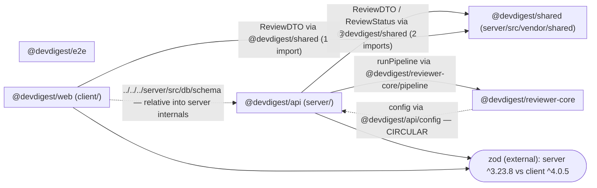

# Dependency Audit — DevDigest fixture (mini-repo)

Two-level audit: **external** npm dependencies (per `package.json`) and **internal** cross-package imports (TypeScript path aliases + relative imports crossing package boundaries). This repo is not a monorepo; internal edges are aliases defined in the root `tsconfig.json`, not `workspace:*` links.

Root `tsconfig.json` aliases:

| Alias | Resolves to |
|---|---|
| `@devdigest/api/*` | `server/src/*` |
| `@devdigest/reviewer-core/*` | `reviewer-core/src/*` |
| `@devdigest/shared` | `server/src/vendor/shared/index.ts` |

---

## 1. Scope

| Package | Path | Analyzed? | Notes |
|---|---|---|---|
| `@devdigest/api` | `server/` | Yes | — |
| `@devdigest/web` | `client/` | Yes | — |
| `@devdigest/reviewer-core` | `reviewer-core/` | Yes | Declares zero runtime deps |
| `@devdigest/e2e` | `e2e/` | Yes | No internal edges; external `playwright` only |
| `@devdigest/shared` | `server/src/vendor/shared/` | Yes | Alias only, no own `package.json` |

**Sizing skipped:** `node_modules` is **not installed** in any package (verified with `find . -name node_modules`). All installed-size cells report "not installed — run `pnpm install` to size" per the skill's guidance rather than guessing.

---

## 2. Dependency Graph

Internal (alias / relative) edges are solid; the one shared external of interest (`zod`, consumed by two packages at different majors) is drawn as a single shared node. Transitive dependencies are not drawn. devDependencies used only for tooling (vitest, typescript) are excluded for readability.

Dashed edges mark the two structural problems: the **server ↔ reviewer-core cycle** and the **client → server relative internals import**. `e2e` has no internal edges (leaf; depends only on external `playwright`).

---

## 3. Size Breakdown

`node_modules` is not installed anywhere in the fixture, so no dependency can be measured. Sizes are reported as **not installed** rather than estimated. Version and usage columns come from `package.json` + source grep.

### `@devdigest/api` (server/)

| Dependency | Version | Installed size | Used by (files) | devDependency? |
|---|---|---|---|---|
| `fastify` | ^5.2.0 | not installed | `server/src/index.ts` | no |
| `drizzle-orm` | ^0.30.10 | not installed | `server/src/db/schema.ts` (`drizzle-orm/pg-core`) | no |
| `zod` | ^3.23.8 | not installed | `server/src/config.ts` | no |
| `lodash` | ^4.17.21 | not installed | **none — no import found** | no |
| `eslint` | ^9.9.0 | not installed | none (tooling, mis-placed in `dependencies`) | no (should be dev) |
| `vitest` | ^2.0.5 | not installed | tooling | yes |
| `typescript` | ^5.5.4 | not installed | tooling | yes |

### `@devdigest/web` (client/)

| Dependency | Version | Installed size | Used by (files) | devDependency? |
|---|---|---|---|---|
| `next` | ^15.1.0 | not installed | framework (App Router; `client/src/app/page.tsx` is a route) — no explicit `import` | no |
| `react` | ^19.0.0 | not installed | JSX in `client/src/app/page.tsx` (automatic runtime, no explicit import) | no |
| `zod` | ^4.0.5 | not installed | `client/src/lib/api.ts` | no |
| `date-fns` | ^3.6.0 | not installed | `client/src/lib/dates.ts` (`format`) | no |
| `moment` | ^2.30.1 | not installed | `client/src/lib/dates.ts` (`fromNow`) | no |
| `axios` | ^1.7.2 | not installed | **none — no import found** | no |
| `vitest` | ^2.0.5 | not installed | tooling | yes |
| `typescript` | ^5.5.4 | not installed | tooling | yes |

### `@devdigest/reviewer-core`

| Dependency | Version | Installed size | Used by (files) | devDependency? |
|---|---|---|---|---|
| _(no runtime dependencies declared)_ | — | not installed | — | — |
| `vitest` | ^2.0.5 | not installed | tooling | yes |
| `typescript` | ^5.5.4 | not installed | tooling | yes |

### `@devdigest/e2e`

| Dependency | Version | Installed size | Used by (files) | devDependency? |
|---|---|---|---|---|
| `playwright` | ^1.45.3 | not installed | `e2e/src/flow.spec.ts` | no (test-only; belongs in dev) |
| `typescript` | ^5.5.4 | not installed | tooling | yes |

### Repo-wide total

| Metric | Value |
|---|---|
| `server/node_modules` | not installed |
| `client/node_modules` | not installed |
| `reviewer-core/node_modules` | not installed |
| `e2e/node_modules` | not installed |
| **Repo total** | **not installed — run `pnpm install` to size** |

**Largest offender:** cannot be measured (nothing installed). By reputation the client's `next` (~120M unpacked, typically the largest in a Next.js repo) is the most likely single largest dependency; confirm after install with `du -sh client/node_modules/next`.

---

## 4. Findings & Priorities

### P0 — Fix soon

**P0-1 — Circular dependency: `server` ↔ `reviewer-core`.**
- Files: `server/src/service.ts` imports `@devdigest/reviewer-core/pipeline` (`runPipeline`); `reviewer-core/src/pipeline.ts` imports `@devdigest/api/config` (`config`).
- Why it matters: a two-node import cycle. It breaks module initialization order, makes both packages un-buildable in isolation, and (critically) violates `reviewer-core`'s stated design constraint of being a self-contained pure-TypeScript engine with an *injected* provider — it must not reach back into the API server.
- Recommendation: stop importing `config` inside `reviewer-core`. Pass the value `runPipeline` needs (e.g. a `port`/options object) as a **parameter** from `server/src/service.ts`, so the dependency flows one way (`server → reviewer-core`) only. **Confirm with the user before editing** — this changes the `runPipeline` signature.

**P0-2 — `client` reaches into `server`'s `src/` internals via a relative path.**
- File: `client/src/lib/db.ts` → `import { reviews } from '../../../server/src/db/schema'`.
- Why it matters: the client bypasses every public alias and deep-imports another package's internal Drizzle schema by relative path. It couples the browser bundle to server internals (and transitively pulls `drizzle-orm` into the client), and any move of `server/src/db/schema.ts` silently breaks the client.
- Recommendation: remove the cross-package relative import. If the client genuinely needs the row shape, expose it as a type through the public `@devdigest/shared` alias (`server/src/vendor/shared/index.ts`) and import that instead; the client should not import the runtime Drizzle table at all. **Confirm with the user** — this deletes a cross-package import.

### P1 — Should address

**P1-1 — Version drift: `zod` major 3 vs major 4.**
- Files: `server/package.json` (`zod ^3.23.8`) and `client/package.json` (`zod ^4.0.5`).
- Why it matters: two majors of the same library across packages that exchange the same `ReviewDTO` shape. Zod 3→4 has breaking API/behavior changes; schemas authored on one side may not validate identically on the other, and it duplicates the library in the install.
- Recommendation: pick one major (align `server` up to `zod ^4` or hold `client` at `^3`) and set both `package.json` files to the same range. **Confirm with the user** — a major bump is a breaking change to validate.

**P1-2 — Unused dependency: `lodash` in `server`.**
- File: `server/package.json` (`lodash ^4.17.21`); zero imports found in `server/src`.
- Why it matters: declared but never imported — dead weight in the install and dependency surface.
- Recommendation: remove `lodash` from `server/package.json` dependencies. **Confirm with the user** (dependency removal).

**P1-3 — Unused dependency: `axios` in `client`.**
- File: `client/package.json` (`axios ^1.7.2`); zero imports found in `client/src`.
- Why it matters: declared but never imported; unnecessary bundle/install weight.
- Recommendation: remove `axios` from `client/package.json` dependencies (the client already has no HTTP call site). **Confirm with the user** (dependency removal).

### P2 — Worth considering

**P2-1 — Duplicate functionality: two date libraries in `client`.**
- File: `client/src/lib/dates.ts` imports both `date-fns` (`format`) and `moment` (`fromNow`).
- Why it matters: two libraries solving the same problem in one 8-line file. `moment` is large and in maintenance mode; shipping both bloats the bundle.
- Recommendation: standardize on `date-fns` (already used for `formatShort`) and replace `moment(date).fromNow()` with `date-fns`'s `formatDistanceToNow`, then remove `moment` from `client/package.json`. **Confirm with the user** (dependency removal + behavior change).

**P2-2 — `eslint` declared as a runtime dependency in `server`.**
- File: `server/package.json` — `eslint ^9.9.0` sits under `dependencies`, not `devDependencies`.
- Why it matters: a lint-only tool installed as a production/runtime dependency inflates the runtime install.
- Recommendation: move `eslint` from `dependencies` to `devDependencies` in `server/package.json`.

**P2-3 — `playwright` declared as a runtime dependency in `e2e`.**
- File: `e2e/package.json` — `playwright ^1.45.3` sits under `dependencies`.
- Why it matters: a test-only harness listed as a runtime dependency of the package.
- Recommendation: move `playwright` from `dependencies` to `devDependencies` in `e2e/package.json`.

### Info

- **`reviewer-core` declares zero runtime dependencies** — intentional per its "pure TypeScript, injected provider" build constraint. Note this is currently *violated in practice* by the P0-1 alias import into `server`; the `package.json` is clean but the source is not.
- **`next` / `react` have no explicit `import` statements** in `client/src`. They are not unused: `react` is required by JSX under React 19's automatic runtime, and `next` is the framework serving `src/app/page.tsx`. Not flagged as unused.
- **CVE status not checked** — `pnpm audit` cannot run without an install. No CVE claims are made in this report.

---

## 5. Summary

- **P0 — break the cycle:** `reviewer-core/src/pipeline.ts` imports `@devdigest/api/config` while `server/src/service.ts` imports `reviewer-core` — a circular dependency that also violates reviewer-core's isolation constraint. Pass config into `runPipeline` as a parameter instead.
- **P0 — stop the internals import:** `client/src/lib/db.ts` deep-imports `../../../server/src/db/schema` by relative path; route it through the `@devdigest/shared` alias as a type, and drop the runtime table import from the client.
- **P1 — align `zod`:** server is on `^3.23.8`, client on `^4.0.5`; converge on one major before the shared `ReviewDTO` contract drifts.
- **P1 — delete dead deps:** `lodash` (server) and `axios` (client) are declared but never imported — remove both.
- **P2 — tidy:** collapse the client's dual date libraries onto `date-fns` (drop `moment`), and move `eslint` (server) and `playwright` (e2e) out of `dependencies` into `devDependencies`.

All P0/P1 items and every dependency removal/version change are flagged as **recommendations to confirm with the user before executing**, not actions taken. Sizes remain unmeasured until `pnpm install` is run.
