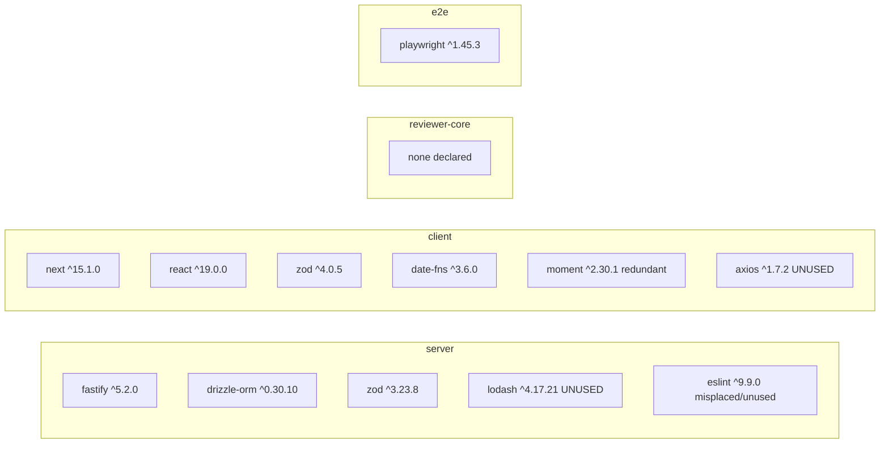

# Dependency Audit — DevDigest fixture (`mini-repo`)

Scope: the fixture repo root with four packages — `server/` (`@devdigest/api`), `client/` (`@devdigest/web`), `reviewer-core/` (`@devdigest/reviewer-core`), `e2e/` (`@devdigest/e2e`) — plus an alias-only shared module at `server/src/vendor/shared/` (`@devdigest/shared`).

Method: static analysis of every `package.json`, `tsconfig.json`, and `.ts`/`.tsx` source file. Cross-package wiring uses TypeScript path aliases (root `tsconfig.json`), not `workspace:*` — so the "who depends on whom" graph is derived from actual `import` statements resolved through those aliases, not from `package.json` declarations. `node_modules` is not installed, so size figures are approximate published-registry estimates (unpacked), not measured on disk.

Path aliases in effect (root `tsconfig.json`):

| Alias | Resolves to |
|-------|-------------|
| `@devdigest/api/*` | `server/src/*` |
| `@devdigest/reviewer-core/*` | `reviewer-core/src/*` |
| `@devdigest/shared` | `server/src/vendor/shared/index.ts` |

---

## 1. Dependency graph

### Internal (package-to-package)

```mermaid
graph TD
  client["client (@devdigest/web)"]
  server["server (@devdigest/api)"]
  reviewer["reviewer-core (@devdigest/reviewer-core)"]
  shared["shared (@devdigest/shared)<br/>server/src/vendor/shared"]
  e2e["e2e (@devdigest/e2e)"]

  server -->|service.ts imports @devdigest/reviewer-core/pipeline| reviewer
  reviewer -->|pipeline.ts imports @devdigest/api/config| server
  server -->|@devdigest/shared| shared
  client -->|@devdigest/shared| shared
  client -->|lib/db.ts: ../../../server/src/db/schema deep import| server
  e2e -. HTTP only, no code import .-> client

  linkStyle 0 stroke:#c00,stroke-width:2px
  linkStyle 1 stroke:#c00,stroke-width:2px
```

The red edges (`server -> reviewer-core` and `reviewer-core -> server`) form a **cycle**. `shared` physically lives inside `server/`, so every consumer of `@devdigest/shared` is really reaching into the server tree.

### External (npm) dependencies, by package



### Import inventory (source of truth)

| File | Imports | Kind |
|------|---------|------|
| `server/src/index.ts` | `fastify`, `./config`, `./service`, `@devdigest/shared` | ext + internal |
| `server/src/config.ts` | `zod` | ext |
| `server/src/service.ts` | `@devdigest/reviewer-core/pipeline`, `@devdigest/shared`, `./db/schema` | internal |
| `server/src/db/schema.ts` | `drizzle-orm/pg-core` | ext |
| `reviewer-core/src/pipeline.ts` | `@devdigest/api/config` | internal (→ server) |
| `reviewer-core/src/index.ts` | `./pipeline` | internal |
| `client/src/app/page.tsx` | `@devdigest/shared`, `../lib/dates`, `../lib/api` | internal |
| `client/src/lib/api.ts` | `zod` | ext |
| `client/src/lib/dates.ts` | `date-fns`, `moment` | ext |
| `client/src/lib/db.ts` | `../../../server/src/db/schema` | internal (→ server), **dead file** |
| `e2e/src/flow.spec.ts` | `playwright` | ext |

---

## 2. Size breakdown

`node_modules` is not installed; the numbers below are approximate unpacked sizes for the package plus its typical transitive tree, from the public registry. Use them for relative prioritization, not exact accounting.

| Package | Declared in | ~Unpacked | Status |
|---------|-------------|-----------|--------|
| next | client | ~110–130 MB | used (framework, incl. SWC binaries) |
| date-fns | client | ~22 MB | used — but only `format` is called; tree-shakes well |
| typescript (dev) | all four | ~22 MB each decl. | used (build) |
| playwright | e2e | ~15 MB + browser binaries (separate download) | used, but see H4 |
| eslint | server | ~12 MB | **unused + misplaced** (in `dependencies`) |
| vitest (dev) | server, client, reviewer-core | ~10 MB | declared; no test files in server/client/reviewer-core |
| react-dom (undeclared) | client (implicit) | ~6 MB | needed at runtime, not declared |
| drizzle-orm | server | ~6 MB | used |
| fastify | server | ~6 MB | used |
| moment | client | ~4.4 MB | **redundant** with date-fns |
| zod v3 | server | ~3 MB | used |
| zod v4 | client | ~3 MB | used — **but a second, divergent major** |
| axios | client | ~2 MB | **unused** |
| lodash | server | ~1.4 MB | **unused** |
| react | client | ~0.3 MB | used (JSX) |

Roughly removable footprint (no functional loss): **eslint ~12 MB + moment ~4.4 MB + axios ~2 MB + lodash ~1.4 MB ≈ ~20 MB**, plus the duplicate zod major (~3 MB) once versions are aligned.

---

## 3. Findings (prioritized by severity)

### CRITICAL

**C1 — Circular dependency between `server` and `reviewer-core`, and `reviewer-core` breaks its isolation contract.**
`server/src/service.ts` imports `@devdigest/reviewer-core/pipeline`, while `reviewer-core/src/pipeline.ts` imports `@devdigest/api/config`. That is a two-node cycle (`server ⇄ reviewer-core`). Beyond the cycle, `reviewer-core` is meant to be the pure, self-contained review engine (its `package.json` declares zero dependencies), yet it reaches into the server for `config.port`. This inverts the intended direction (the engine should be a leaf that server depends on) and breaks any attempt to build/test/publish `reviewer-core` in isolation.
- **Action:** Remove `reviewer-core`'s import of `@devdigest/api/config`. `runPipeline` should receive what it needs (e.g. the port/config object) as an injected argument from the server caller, keeping `reviewer-core` a dependency-free leaf. Then `server -> reviewer-core` is the only edge and the cycle is gone.

### HIGH

**H1 — `zod` major-version divergence across the shared contract boundary.**
`server` pins `zod ^3.23.8`; `client` pins `zod ^4.0.5`. Both validate the same `ReviewDTO` shape crossing via `@devdigest/shared`. zod 3 and zod 4 have different runtime behavior and incompatible inferred types, and you ship two copies.
- **Action:** Standardize on one major (align both to zod 4 or both to zod 3) and ideally define shared schemas once in `@devdigest/shared` instead of re-declaring them in `client/src/lib/api.ts` and `server/src/config.ts`.

**H2 — `client` deep-imports server internals, dragging a server-only DB library into the web bundle.**
`client/src/lib/db.ts` does `import { reviews } from '../../../server/src/db/schema'`, transitively pulling `drizzle-orm/pg-core` (a Node/Postgres library) into the client and bypassing the alias system with a `../../../` boundary escape. Compounded by the file being dead code (see M4).
- **Action:** Delete `client/src/lib/db.ts` (resolves this and M4). If the client needs the table shape, expose a plain type through `@devdigest/shared`; never let the client reach `server/src/**` by relative path.

**H3 — `client` depends on the server source tree through `@devdigest/shared`.**
`@devdigest/shared` resolves to `server/src/vendor/shared/index.ts`, so `client/src/app/page.tsx` and server both couple to a module physically owned by `server/`. Today it only exports erasable types/constants, but the location invites future runtime leakage into the client.
- **Action:** Keep `@devdigest/shared` strictly type-only and, ideally, relocate it out of `server/src/` to a top-level `shared/` so no package owns it.

**H4 — `e2e` imports `test`/`expect` from the wrong package.**
`e2e/src/flow.spec.ts` does `import { test, expect } from 'playwright'`. The `playwright` package exports browser handles (`chromium`, `firefox`, `webkit`, `devices`), not the `test`/`expect` runner API — those come from `@playwright/test`. As written, this import fails to resolve at runtime.
- **Action:** Add `@playwright/test` (dev) and import `{ test, expect }` from it; keep/drop `playwright` depending on whether raw browser APIs are used (they aren't here).

### MEDIUM

**M1 — Unused dependency `lodash` in `server`.** Zero imports. **Action:** remove from `server` dependencies.

**M2 — Unused dependency `axios` in `client`.** Zero imports. **Action:** remove from `client` dependencies.

**M3 — `eslint` is a misplaced (and unused) runtime dependency in `server`.** It sits in `dependencies` (should be `devDependencies`), there is no eslint config, and it is never imported. **Action:** remove entirely, or move to `devDependencies` and add a config if linting is intended.

**M4 — Dead code: `client/src/lib/db.ts`.** Nothing imports it; it only re-exports a server Drizzle table (see H2). **Action:** delete the file (also clears H2).

**M5 — Redundant date libraries in `client`: `moment` + `date-fns`.** `client/src/lib/dates.ts` uses `date-fns` (`format`) and `moment` (`fromNow`). `moment` is legacy, mutable, maintenance-only, and not tree-shakeable (~4.4 MB). **Action:** drop `moment`, reimplement `fromNow` with `date-fns` `formatDistanceToNow`.

### LOW

**L1 — `react-dom` is an undeclared runtime dependency of `client`.** React 19 + Next 15 require it at runtime; not listed in `client/package.json`. **Action:** add `react-dom ^19.0.0` (matching `react`).

**L2 — `vitest` declared but unused in `server`, `client`, `reviewer-core`.** All three declare it, but only `e2e` has a test file, and that uses Playwright. No `*.test.ts` exists in the vitest packages. **Action:** add the intended tests or drop `vitest` until tests exist.

**L3 — `reviewer-core` declares no deps yet has a cross-package import.** Its `dependencies: {}` hides the internal coupling to `server` (root of C1). **Action:** resolved by C1; no separate declaration needed once the server import is removed.

---

## 4. Suggested fix order

1. **C1** — break the `server ⇄ reviewer-core` cycle by injecting config into `runPipeline`.
2. **H2 / M4** — delete `client/src/lib/db.ts` (one deletion clears a boundary violation and dead code).
3. **H1** — pick one zod major and share schemas through `@devdigest/shared`.
4. **H4** — switch e2e to `@playwright/test`.
5. **M1, M2, M3, M5** — drop `lodash`, `axios`, `eslint`, `moment` (~20 MB, no behavior change).
6. **H3, L1, L2** — tidy the shared-module location, declare `react-dom`, reconcile vitest.
