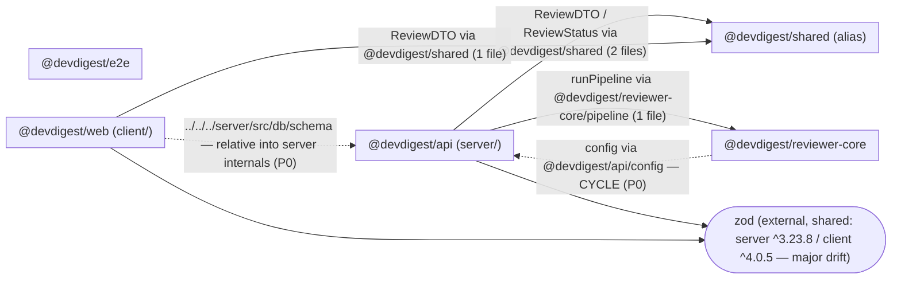

# Dependency Audit — DevDigest (mini-repo fixture)

Audit of external npm dependencies (per `package.json`) and internal cross-package/module dependencies (TypeScript path aliases + cross-boundary relative imports). This is not a monorepo — internal edges are aliases/relative imports, not `workspace:*`.

## 1. Scope

| Package | Path | package.json | Analyzed |
|---|---|---|---|
| `@devdigest/api` | `server/` | `server/package.json` | Yes |
| `@devdigest/web` | `client/` | `client/package.json` | Yes |
| `@devdigest/reviewer-core` | `reviewer-core/` | `reviewer-core/package.json` | Yes |
| `@devdigest/e2e` | `e2e/` | `e2e/package.json` | Yes |
| `@devdigest/shared` | `server/src/vendor/shared/` | alias only (`@devdigest/shared`) | Yes (as alias target) |

**Skipped / limited:** No package had `node_modules` installed (verified — zero `node_modules` directories in the tree). Installed sizes therefore could not be measured; the Size Breakdown reports every dependency as *not installed — run `pnpm install` to size* rather than guessing. `pnpm audit` could not be run for the same reason, so no CVE claims are made.

Tooling-only devDependencies (`vitest`, `typescript`) are excluded from the dependency graph per the skill, and noted in the size table only.

## 2. Dependency Graph

Internal (alias / cross-boundary) edges are solid and labeled with the import specifier; the one external dependency that is shared across ≥2 packages (`zod`) is drawn as a single shared node. Dashed red edges are architectural problems (see Findings P0).

Node count: 6 (5 packages + 1 shared external). No collapsing needed. `e2e` has no internal edges (it drives the running app over HTTP via `playwright`, no source imports of other packages).

## 3. Size Breakdown

`node_modules` is not installed for any package, so no installed sizes could be measured. Each declared **direct** dependency is listed below with its usage; sizes are marked accordingly. Run `pnpm install` in each package (or `./scripts/dev.sh`) and re-run `du -sh <package>/node_modules/<dep>` to populate the size column.

### `@devdigest/api` (server/)

| Dependency | Version | Installed size | Used by (files) | devDependency? |
|---|---|---|---|---|
| `fastify` | ^5.2.0 | not installed | `server/src/index.ts` | no |
| `drizzle-orm` | ^0.30.10 | not installed | `server/src/db/schema.ts` (`drizzle-orm/pg-core`) | no |
| `zod` | ^3.23.8 | not installed | `server/src/config.ts` | no |
| `lodash` | ^4.17.21 | not installed | **none — unused** | no |
| `eslint` | ^9.9.0 | not installed | **none — unused, and misplaced in `dependencies`** | no |
| `vitest` | ^2.0.5 | not installed | tooling only | yes |
| `typescript` | ^5.5.4 | not installed | tooling only | yes |

### `@devdigest/web` (client/)

| Dependency | Version | Installed size | Used by (files) | devDependency? |
|---|---|---|---|---|
| `next` | ^15.1.0 | not installed | framework host for `client/src/app/page.tsx` (used, no explicit import) | no |
| `react` | ^19.0.0 | not installed | JSX in `client/src/app/page.tsx` (used via automatic JSX runtime) | no |
| `zod` | ^4.0.5 | not installed | `client/src/lib/api.ts` | no |
| `date-fns` | ^3.6.0 | not installed | `client/src/lib/dates.ts` (`format`) | no |
| `moment` | ^2.30.1 | not installed | `client/src/lib/dates.ts` (`fromNow`) — **overlaps date-fns** | no |
| `axios` | ^1.7.2 | not installed | **none — unused** | no |
| `vitest` | ^2.0.5 | not installed | tooling only | yes |
| `typescript` | ^5.5.4 | not installed | tooling only | yes |

### `@devdigest/reviewer-core` (reviewer-core/)

| Dependency | Version | Installed size | Used by (files) | devDependency? |
|---|---|---|---|---|
| *(no runtime dependencies declared)* | — | — | — | — |
| `vitest` | ^2.0.5 | not installed | tooling only | yes |
| `typescript` | ^5.5.4 | not installed | tooling only | yes |

Note: reviewer-core declares zero runtime deps (matches its "no framework, injected provider" constraint) — but its source nonetheless reaches into `@devdigest/api` (see P0).

### `@devdigest/e2e` (e2e/)

| Dependency | Version | Installed size | Used by (files) | devDependency? |
|---|---|---|---|---|
| `playwright` | ^1.45.3 | not installed | `e2e/src/flow.spec.ts` | no |
| `typescript` | ^5.5.4 | not installed | tooling only | yes |

### Repo-wide total

- **Total installed size:** not measurable — no `node_modules` present in any package. Run `pnpm install` per package then `du -sh <package>/node_modules`.
- **Likely largest offender (by known typical unpacked size, not measured here):** `next` in `client/` (Next.js is by far the heaviest install in this repo, typically >100 MB unpacked). Confirm with `du -sh client/node_modules/next` after install before acting on it.

## 4. Findings & Priorities

### P0 — Fix soon

- **P0.1 — Circular internal dependency between `server/` and `reviewer-core/`.**
  `server/src/service.ts` imports `runPipeline` from `@devdigest/reviewer-core/pipeline`, while `reviewer-core/src/pipeline.ts` imports `config` from `@devdigest/api/config`. That is a cycle: `@devdigest/api → @devdigest/reviewer-core → @devdigest/api`. It also violates reviewer-core's documented isolation ("pure TypeScript, injected provider, zero runtime deps") by hard-wiring it to the server's config.
  **Recommendation (confirm before executing — refactor, not a delete):** remove the `@devdigest/api/config` import from `reviewer-core/src/pipeline.ts`; pass anything reviewer-core needs (e.g. the port) in as a parameter to `runPipeline(input, opts)` or via the injected provider, so the dependency arrow points only `server → reviewer-core`.

- **P0.2 — `client/` reaches into `server/` internals via a relative path, bypassing the alias.**
  `client/src/lib/db.ts` does `import { reviews } from '../../../server/src/db/schema'`, importing a Drizzle table straight out of the server's `src/`. This crosses a package boundary through a relative path (not even through the `@devdigest/api` alias), couples the browser client to the DB schema module, and would drag server/DB code into the client bundle.
  **Recommendation (confirm before executing):** delete this cross-boundary import. The client should not touch `drizzle-orm` schema at all — if it needs the shape, put a plain DTO/type in `@devdigest/shared` (as already done with `ReviewDTO`) and import that instead. Remove `client/src/lib/db.ts` if nothing legitimately consumes it.

### P1 — Should address

- **P1.1 — Unused dependency `lodash` in `server/package.json`.** Declared in `dependencies`, zero imports anywhere in `server/src` (verified by grep).
  **Recommendation (confirm before removing):** remove `"lodash": "^4.17.21"` from `server/package.json` `dependencies`.

- **P1.2 — Unused dependency `axios` in `client/package.json`.** Declared in `dependencies`, zero imports in `client/src` — the client's only HTTP/schema code (`lib/api.ts`) uses `zod`, not `axios`.
  **Recommendation (confirm before removing):** remove `"axios": "^1.7.2"` from `client/package.json` `dependencies`.

- **P1.3 — Unused (and misplaced) dependency `eslint` in `server/package.json`.** `eslint` is listed under `dependencies` (not `devDependencies`), and there is no ESLint config file (`.eslintrc*` / `eslint.config.*`) and no import — it is unused as a runtime dependency.
  **Recommendation (confirm before removing):** remove `"eslint": "^9.9.0"` from `server/package.json`. If linting is actually wanted, re-add it under `devDependencies` together with an `eslint.config.js`; otherwise drop it entirely.

- **P1.4 — Version drift on `zod` across packages.** `server/package.json` pins `zod ^3.23.8` (major 3); `client/package.json` pins `zod ^4.0.5` (major 4). Zod 3→4 has behavioral/API differences; sharing schemas or DTO validation logic across the boundary will diverge, and it doubles the installed footprint.
  **Recommendation (confirm before changing):** align both on one major — preferably bump `server` to `zod ^4` to match the client, then verify server schemas (`config.ts`) still parse under v4. If they must differ temporarily, document why.

### P2 — Worth considering

- **P2.1 — Duplicate/overlapping date libraries in `client/`: `moment` + `date-fns`.** `client/src/lib/dates.ts` uses `date-fns` `format` for `formatShort` and `moment().fromNow()` for `fromNow` — two libraries doing the same job in one file. `moment` is also large and in maintenance mode; `date-fns` already covers relative-time formatting (`formatDistanceToNow`).
  **Recommendation (confirm before removing):** rewrite `fromNow` using `date-fns` `formatDistanceToNow(date, { addSuffix: true })`, then remove `"moment": "^2.30.1"` from `client/package.json`. Keep `date-fns` as the single date library.

### Info

- **reviewer-core declares zero runtime dependencies**, consistent with the "no framework, injected LLM provider" constraint — good. The only issue is the source-level import into `server` (P0.1), not a declared dependency.
- **`e2e` has no internal source edges** — it exercises the app over HTTP via `playwright`, which is the intended shape for an e2e package; nothing to change.
- **`react` / `next` in `client/` show no explicit `import` statements** but are genuinely used (Next.js is the framework host; React powers the JSX automatic runtime in `page.tsx`). They are intentionally **not** flagged as unused.

## 5. Summary (act today, ordered by tier)

- **P0:** Break the `server ↔ reviewer-core` import cycle — stop `reviewer-core/src/pipeline.ts` importing `@devdigest/api/config`; inject the value instead.
- **P0:** Remove the client→server internals leak in `client/src/lib/db.ts` (`../../../server/src/db/schema`); route the shape through `@devdigest/shared` instead.
- **P1 — the "installed but never imported" packages you suspected:** remove `lodash` and `eslint` from `server/package.json`, and `axios` from `client/package.json` (all zero imports).
- **P1:** Resolve the `zod` major-version drift (server `^3` vs client `^4`) — align on one major.
- **P2 — the "two libraries doing the same job":** `moment` and `date-fns` in `client/` both format dates; port `fromNow` to `date-fns` and drop `moment` from `client/package.json`.

All dependency removals and version changes above are flagged as **recommendations to confirm before executing** — none were applied. Re-run with `node_modules` installed to fill in the Size Breakdown and to run `pnpm audit` for CVE checks.
