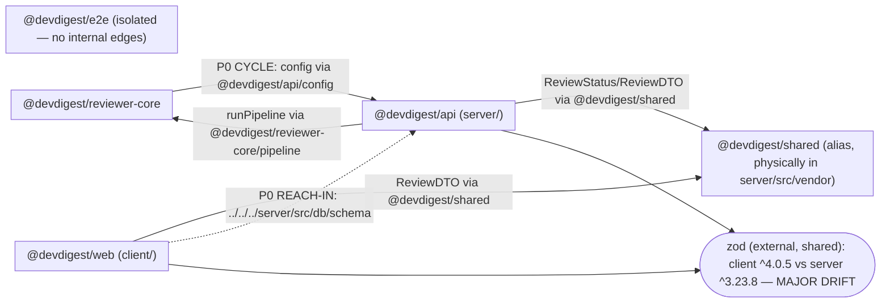

# Dependency Audit — Cross-Package Coupling & Version Drift

Repository root: `.claude/skills/dependency-checker-workspace/fixtures/mini-repo`

This audit focuses on the three concerns raised: (1) circular imports between packages, (2) one package reaching into another package's internal source files, and (3) the same dependency pinned to different major versions across packages. All four analysis levels required by the dependency-checker skill are included below.

---

## 1. Scope

| Package | Path | Analyzed? | Notes |
|---|---|---|---|
| `@devdigest/api` | `server/` | Yes | — |
| `@devdigest/web` | `client/` | Yes | — |
| `@devdigest/reviewer-core` | `reviewer-core/` | Yes | Declares zero runtime deps |
| `@devdigest/e2e` | `e2e/` | Yes | No internal cross-package imports |
| `@devdigest/shared` | `server/src/vendor/shared/` | Yes | Alias only, no own `package.json`; physically lives inside `server/src/` |

Path aliases (root `tsconfig.json`):

- `@devdigest/api/*` → `server/src/*`
- `@devdigest/reviewer-core/*` → `reviewer-core/src/*`
- `@devdigest/shared` → `server/src/vendor/shared/index.ts`

**node_modules status:** NOT installed in any package (root, `client/`, `server/`, `reviewer-core/`, `e2e/`). Per the skill, installed sizes are reported as "not installed — run install to size" rather than guessed. External dependency analysis is therefore based on `package.json` declarations and source imports only; `pnpm audit` (CVE check) could not be run, so no CVE claims are made.

---

## 2. Dependency Graph

Internal (alias / relative) edges are drawn between package subgraphs. `zod` is included as an external shared node because it is used by ≥2 packages **and** is version-drifted. Tooling-only devDependencies (vitest, typescript) are excluded from the diagram per skill guidance.

The `server → reviewer-core → server` pair forms a cycle (solid edges). The `client -.-> server` dotted edge is the deep relative import bypassing the alias system. `e2e` has no internal edges (its only dependency is `playwright`).

---

## 3. Size Breakdown

`node_modules` is not installed in any package, so no installed sizes could be measured. The tables below list declared **direct** dependencies with sizes marked "not installed".

### server/ (`@devdigest/api`)

| Dependency | Version | Installed size | Used by (files) | devDependency? |
|---|---|---|---|---|
| `fastify` | ^5.2.0 | not installed — run install to size | `server/src/index.ts` | no |
| `drizzle-orm` | ^0.30.10 | not installed — run install to size | `server/src/db/schema.ts` | no |
| `zod` | ^3.23.8 | not installed — run install to size | `server/src/config.ts` | no |
| `lodash` | ^4.17.21 | not installed — run install to size | **none (unused)** | no |
| `eslint` | ^9.9.0 | not installed — run install to size | **none (unused; tooling in `dependencies`)** | no |
| `vitest` | ^2.0.5 | not installed — run install to size | (test tooling) | yes |
| `typescript` | ^5.5.4 | not installed — run install to size | (build tooling) | yes |

### client/ (`@devdigest/web`)

| Dependency | Version | Installed size | Used by (files) | devDependency? |
|---|---|---|---|---|
| `next` | ^15.1.0 | not installed — run install to size | `client/src/app/page.tsx` (App Router) | no |
| `react` | ^19.0.0 | not installed — run install to size | `client/src/app/page.tsx` | no |
| `zod` | ^4.0.5 | not installed — run install to size | `client/src/lib/api.ts` | no |
| `date-fns` | ^3.6.0 | not installed — run install to size | `client/src/lib/dates.ts` | no |
| `moment` | ^2.30.1 | not installed — run install to size | `client/src/lib/dates.ts` | no |
| `axios` | ^1.7.2 | not installed — run install to size | **none (unused)** | no |
| `vitest` | ^2.0.5 | not installed — run install to size | (test tooling) | yes |
| `typescript` | ^5.5.4 | not installed — run install to size | (build tooling) | yes |

### reviewer-core/ (`@devdigest/reviewer-core`)

| Dependency | Version | Installed size | Used by (files) | devDependency? |
|---|---|---|---|---|
| _(none declared)_ | — | — | — | — |
| `vitest` | ^2.0.5 | not installed — run install to size | (test tooling) | yes |
| `typescript` | ^5.5.4 | not installed — run install to size | (build tooling) | yes |

Zero runtime dependencies declared — but note it imports `@devdigest/api/config` from `server/` at the source level (see Findings).

### e2e/ (`@devdigest/e2e`)

| Dependency | Version | Installed size | Used by (files) | devDependency? |
|---|---|---|---|---|
| `playwright` | ^1.45.3 | not installed — run install to size | `e2e/src/flow.spec.ts` | no |
| `typescript` | ^5.5.4 | not installed — run install to size | (build tooling) | yes |

### Repo-wide total

- Per-package `node_modules` size: not installed — run install to size (all packages).
- Largest dependency across the repo: cannot be measured without install. By typical footprint the likely largest offender is `next` (client) followed by `playwright` (e2e); this is an estimate, not a measurement.

---

## 4. Findings & Priorities

### P0 — Fix soon

**P0-1 — Circular import between `server` and `reviewer-core`.**
- Files: `server/src/service.ts:1` imports `@devdigest/reviewer-core/pipeline`; `reviewer-core/src/pipeline.ts:1` imports `@devdigest/api/config`.
- Why it matters: `server → reviewer-core → server` is a true cycle. It breaks the intended one-way flow (the app orchestrates the review engine, not vice versa), makes both packages impossible to build/test in isolation, and risks module-initialization ordering bugs (`config` may be a partially-initialized binding when `pipeline` loads). It also violates reviewer-core's design constraint of being a self-contained pure engine with an *injected* provider.
- Recommendation: Remove the `@devdigest/api/config` import from `reviewer-core/src/pipeline.ts`. Pass the needed value (e.g. `port`) into `runPipeline(input, opts)` as a parameter from `server/src/service.ts`, so the dependency points only `server → reviewer-core`. (Non-destructive refactor — confirm the exact injection shape with the user before applying.)

**P0-2 — `client` reaches into `server`'s internal source, bypassing the alias.**
- File: `client/src/lib/db.ts:1` — `import { reviews } from '../../../server/src/db/schema'`.
- Why it matters: This is a deep relative path into another package's private internals (the Drizzle schema), not a public entry point or a `paths` alias. The client is a browser bundle pulling in a server-only Drizzle table definition (which transitively imports `drizzle-orm/pg-core`), coupling the frontend to backend DB internals and likely bloating/breaking the client build. There is no alias for this file — it is a raw filesystem reach-across.
- Recommendation: Delete the server-schema import from the client. If the client only needs the row shape, consume the DTO type via the sanctioned `@devdigest/shared` alias (`ReviewDTO`) instead of the Drizzle table. Do not expose `server/src/db/schema` to the client at all. (Confirm before removing `client/src/lib/db.ts` if anything depends on `reviewTable`.)

### P1 — Should address

**P1-1 — Version drift: `zod` pinned to different majors.**
- Files: `client/package.json` → `"zod": "^4.0.5"` (major 4); `server/package.json` → `"zod": "^3.23.8"` (major 3).
- Why it matters: Two packages that both traffic in `ReviewDTO`-shaped data validate with incompatible zod majors (zod 3 → 4 has breaking API and inference changes). Schemas or `z.infer` types cannot be shared safely across the boundary, and behavior can diverge silently.
- Recommendation: Align both packages on one zod major (upgrade `server` to `zod@^4` or hold `client` at `^3`), decided by which side you want to lead. If a `@devdigest/shared` schema module is introduced later, both must import the same zod instance/major.

**P1-2 — Unused dependency: `lodash` in `server`.**
- File: `server/package.json` declares `"lodash": "^4.17.21"`; no `import`/`require` of `lodash` exists in `server/src/**`.
- Why it matters: Dead dependency — install weight and supply-chain surface with no consumer.
- Recommendation: Remove `lodash` from `server/package.json` dependencies. (Removal — confirm with the user first.)

**P1-3 — Unused dependency: `axios` in `client`.**
- File: `client/package.json` declares `"axios": "^1.7.2"`; no import of `axios` in `client/src/**`.
- Why it matters: Dead dependency shipped in the client dependency set.
- Recommendation: Remove `axios` from `client/package.json`, or wire it up if an HTTP client was intended. (Confirm before removing.)

### P2 — Worth considering

**P2-1 — Duplicate date-library functionality in `client`.**
- File: `client/src/lib/dates.ts` imports both `date-fns` (`format`) and `moment` (`fromNow`).
- Why it matters: Two date libraries solve the same problem in one file; `moment` in particular is large and in maintenance mode. Redundant footprint.
- Recommendation: Standardize on `date-fns` (already used for `formatShort`) and replace `moment().fromNow()` with `date-fns`'s `formatDistanceToNow`, then drop `moment` from `client/package.json`.

**P2-2 — `eslint` declared as a runtime `dependency` (and unused) in `server`.**
- File: `server/package.json` lists `"eslint": "^9.9.0"` under `dependencies`, not `devDependencies`; no source imports it.
- Why it matters: Lint tooling in production `dependencies` inflates the runtime install; it also appears unused at the source level.
- Recommendation: Move `eslint` to `devDependencies` (or remove it if linting is not configured for `server`). (Confirm before removing.)

**P2-3 — `@devdigest/shared` physically lives inside `server/src/vendor/shared/`.**
- Files: alias target `server/src/vendor/shared/index.ts`, consumed by `client/src/app/page.tsx` and `server/src/index.ts` / `server/src/service.ts`.
- Why it matters: The "shared" contract is reached through the sanctioned `@devdigest/shared` alias, so this is not a violation — but structurally the client resolves shared types from a path physically nested inside the server package. If the alias ever changed or a consumer used a relative path, it would become an internal reach-in (as P0-2 already is).
- Recommendation: Keep all consumers on the `@devdigest/shared` alias (never relative paths into `server/src/vendor`). Consider promoting `shared` to its own top-level directory to make the boundary explicit. Informational/low priority.

### Info

- **reviewer-core declares zero runtime dependencies** (`reviewer-core/package.json` `dependencies: {}`), consistent with its intended pure-engine/injected-provider design. However this intent is currently contradicted at the source level by the `@devdigest/api/config` import (see P0-1) — the declared-vs-actual mismatch is itself the tell.
- **`e2e` is fully isolated** — its only runtime dependency is `playwright` and it has no internal cross-package imports. No coupling concerns.
- **CVE / `pnpm audit` not run** — node_modules is not installed, so no vulnerability claims are made either way.

---

## 5. Summary

Ordered by tier, actionable today:

- **P0 — Break the `server ↔ reviewer-core` cycle:** stop `reviewer-core/src/pipeline.ts` importing `@devdigest/api/config`; inject the value via `runPipeline(...)` args from `server/src/service.ts`.
- **P0 — Cut the client's reach into server internals:** remove `client/src/lib/db.ts`'s `../../../server/src/db/schema` import; the client should never import the Drizzle schema — use the `@devdigest/shared` `ReviewDTO` type instead.
- **P1 — Resolve the `zod` major drift:** align `client` (`^4.0.5`) and `server` (`^3.23.8`) on a single zod major so shared DTO validation stays compatible.
- **P1 — Delete dead deps:** `lodash` (server) and `axios` (client) are declared but never imported.
- **P2 — Trim redundancy/misplacement:** drop `moment` in favor of `date-fns` in `client/src/lib/dates.ts`, and move `eslint` out of server's runtime `dependencies`.

_Note: all dependency removals and version bumps are potentially disruptive — confirm each with the user before executing. Installed sizes and CVE status could not be measured because no `node_modules` is installed; run an install first to complete the size/audit portions._
