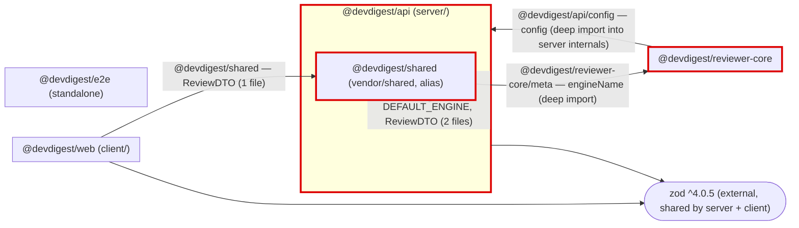

# Dependency Audit — `mini-repo-2`

Full external (npm) and internal (cross-package alias/relative) dependency audit of the four TypeScript packages plus the aliased `@devdigest/shared` module.

---

## 1. Scope

| Package | Path | package.json | Analyzed? |
|---|---|---|---|
| `@devdigest/api` | `server/` | `server/package.json` | Yes |
| `@devdigest/web` | `client/` | `client/package.json` | Yes |
| `@devdigest/reviewer-core` | `reviewer-core/` | `reviewer-core/package.json` | Yes |
| `@devdigest/e2e` | `e2e/` | `e2e/package.json` | Yes |
| `@devdigest/shared` | `server/src/vendor/shared/` | none (alias only) | Yes (as a module) |

**Path aliases** (root `tsconfig.json`, inherited by every package via `extends`):

- `@devdigest/api/*` → `server/src/*`
- `@devdigest/reviewer-core/*` → `reviewer-core/src/*`
- `@devdigest/shared` → `server/src/vendor/shared/index.ts`

**Skipped for sizing:** all four packages — **no `node_modules` are installed anywhere** (checked `server/`, `client/`, `reviewer-core/`, `e2e/`, and repo root). Installed sizes cannot be measured; run `pnpm install` per package to size. All dependency-graph and finding analysis below is derived from `package.json` + source imports and is complete; only the byte-size numbers are unavailable.

---

## 2. Dependency Graph

Internal edges are TypeScript path-alias / relative imports crossing a package boundary (this is not a monorepo — there are no `workspace:*` links). External npm packages are shown only when shared across ≥2 packages (`zod`); large single-package externals (`next`, `fastify`, `drizzle-orm`) are listed in the size table instead, to keep the diagram readable. Tooling-only devDeps (`vitest`, `typescript`) are excluded from the graph.

**Red-outlined nodes form a circular dependency:** `server` → `shared` → `reviewer-core` → `server` (`@devdigest/api/config`). See P0-1.

Nothing was collapsed; the graph is under 20 nodes. `e2e` has no internal edges (imports only `@playwright/test`).

---

## 3. Size Breakdown

`node_modules` is **not installed** for any package, so every installed-size cell reads *not installed*. Versions are the declared semver ranges. "Used by" is derived from source imports.

### `@devdigest/api` (server/)

| Dependency | Version | Installed size | Used by (files) | devDependency? |
|---|---|---|---|---|
| `fastify` | ^5.2.0 | not installed | `server/src/index.ts` | no |
| `drizzle-orm` | ^0.30.10 | not installed | `server/src/db/schema.ts` (`drizzle-orm/pg-core`) | no |
| `zod` | ^4.0.5 | not installed | `server/src/config.ts` | no |
| `date-fns` | ^3.6.0 | not installed | `server/src/format.ts` | no |
| `uuid` | ^10.0.0 | not installed | **no imports found — unused** | no |
| `typescript` | ^5.5.4 | not installed | tooling | yes |
| `vitest` | ^2.0.5 | not installed | `*.test.ts` | yes |

### `@devdigest/web` (client/)

| Dependency | Version | Installed size | Used by (files) | devDependency? |
|---|---|---|---|---|
| `next` | ^15.1.0 | not installed | `client/src/app/**` (App Router; framework, implicit) | no |
| `react` | ^19.0.0 | not installed | `client/src/app/page.tsx` (JSX, implicit via React 19 transform) | no |
| `tailwindcss` | ^3.4.0 | not installed | `client/tailwind.config.ts`, `client/postcss.config.js` | no |
| `zod` | ^4.0.5 | not installed | `client/src/lib/api.ts` | no |
| `dayjs` | ^1.11.0 | not installed | `client/src/lib/dates.ts` | no |
| `typescript` | ^5.5.4 | not installed | tooling | yes |
| `vitest` | ^1.6.0 | not installed | `*.test.ts` | yes |

### `@devdigest/reviewer-core`

| Dependency | Version | Installed size | Used by (files) | devDependency? |
|---|---|---|---|---|
| *(no runtime dependencies declared)* | — | — | — | — |
| `typescript` | ^5.5.4 | not installed | tooling | yes |
| `vitest` | ^2.0.5 | not installed | `*.test.ts` | yes |

> Declares zero runtime deps (matching its documented isolation constraint) but **transitively pulls in `server` + `zod`** via `@devdigest/api/config` — see P0-2.

### `@devdigest/e2e`

| Dependency | Version | Installed size | Used by (files) | devDependency? |
|---|---|---|---|---|
| `@playwright/test` | ^1.45.3 | not installed | `e2e/src/flow.spec.ts` | no |
| `typescript` | ^5.5.4 | not installed | tooling | yes |

### Repo-wide total

- **Total `node_modules` size: unavailable — not installed** in any package. Run `pnpm install` per package to measure.
- **Largest dependency across the repo (by well-known unpacked footprint, not measured here):** `next` in `client/` (typically ~100MB+ installed), followed by `drizzle-orm` and `fastify` in `server/`. Confirm with `du -sh client/node_modules/next` after install.

---

## 4. Findings & Priorities

### P0 — Fix soon

**P0-1 — Circular dependency across three packages.**
- Involved: `server/src/vendor/shared/index.ts` → `reviewer-core/src/meta.ts` → `server/src/config.ts`, closed by `server/src/index.ts` & `server/src/service.ts` importing `@devdigest/shared`.
- The cycle is `server` → `@devdigest/shared` → `@devdigest/reviewer-core/meta` → `@devdigest/api/config` (back into `server`).
- Why it matters: circular module graphs cause fragile initialization order, hard-to-debug `undefined` exports at load time, and block clean package extraction. Here `engineName` depends on `config.port` while `config` lives in the same package that consumes `shared`.
- Recommendation: break the cycle by removing `reviewer-core`'s dependency on `server`. Have the port/config value **passed into** `reviewer-core` (e.g. `engineName(port: number)` or an injected config object) rather than imported from `@devdigest/api/config`. This restores the intended one-way flow `server → reviewer-core`. **Confirm with the user before changing the `engineName` public signature**, as it is re-exported from `reviewer-core/src/index.ts`.

**P0-2 — `reviewer-core` imports `server`'s internal `src/config`, violating its isolation constraint.**
- Involved: `reviewer-core/src/meta.ts:1` — `import { config } from '@devdigest/api/config'`.
- Why it matters: `reviewer-core` is documented as a pure, isolated engine with **zero runtime dependencies**; its `package.json` declares `"dependencies": {}`. Importing `@devdigest/api/config` reaches into another package's `src/` internals (not a public entry point) and transitively drags in `fastify`/`zod`/`server` code, making the engine un-shippable in isolation and its declared dep list untrue.
- Recommendation: delete the `@devdigest/api/config` import from `reviewer-core/src/meta.ts`; supply the port via a function argument or a small injected config interface owned by `reviewer-core`. This is the same edge as P0-1 and fixing it resolves both.

**P0-3 — `shared` reaches into `reviewer-core`'s internal `meta.ts` instead of its public entry point.**
- Involved: `server/src/vendor/shared/index.ts:1` — `import { engineName } from '@devdigest/reviewer-core/meta'`.
- Why it matters: `reviewer-core/src/index.ts` already re-exports `engineName` as the package's public API. Importing the deep `/meta` path via the `@devdigest/reviewer-core/*` glob bypasses that public surface, coupling `shared` to reviewer-core's internal file layout.
- Recommendation: import from the package's public barrel (`reviewer-core/src/index.ts`) rather than `/meta`. Add a bare-package alias (e.g. `"@devdigest/reviewer-core": ["reviewer-core/src/index.ts"]`) to root `tsconfig.json` and change the import to `from '@devdigest/reviewer-core'`. (This edge is part of the P0-1 cycle; once P0-1/P0-2 remove the reverse edge, it becomes a clean one-way `shared → reviewer-core` import.)

### P1 — Should address

**P1-1 — Unused dependency `uuid` in `server`.**
- Involved: `server/package.json` (`"uuid": "^10.0.0"`). No `uuid` import exists anywhere in `server/src` (or any package).
- Why it matters: dead dependency inflates install size and audit surface for no benefit.
- Recommendation: remove `uuid` from `server/package.json` dependencies. **Confirm with the user** (dependency removal is hard to reverse if some dynamic use was intended); `grep -rn uuid server/src` returns nothing, supporting removal.

**P1-2 — Version drift on `vitest` between `server` and `client`.**
- Involved: `server/package.json` `vitest ^2.0.5` vs `client/package.json` `vitest ^1.6.0` — different **major** versions (2 vs 1). (`reviewer-core` also uses `^2.0.5`.)
- Why it matters: two majors of the same test runner across packages means divergent config/API behavior, harder shared tooling, and inconsistent CI. Although a devDependency, it still qualifies as cross-package version drift.
- Recommendation: align `client` to `vitest ^2.0.5` to match `server` and `reviewer-core`. **Confirm with the user** and re-run `cd client && pnpm test` after bumping, since Vitest 1→2 has config changes.

### P2 — Worth considering

**P2-1 — Two different date libraries solve the same problem across packages.**
- Involved: `server` uses `date-fns ^3.6.0` (`server/src/format.ts`); `client` uses `dayjs ^1.11.0` (`client/src/lib/dates.ts`).
- Why it matters: two date libraries duplicate functionality, split team knowledge, and add combined install weight for what is effectively one concern (formatting timestamps).
- Recommendation: standardize on one — both are used only for lightweight formatting, so consolidate on `date-fns` or `dayjs` and drop the other from that package's `package.json`. **Confirm with the user**; this touches runtime formatting in both `server/src/format.ts` and `client/src/lib/dates.ts`.

### Info — Notable, not actionable

- `reviewer-core` **declares** zero runtime dependencies, matching its documented "pure engine, no runtime deps" constraint. The declaration is currently *contradicted* in practice by P0-2; once that import is removed the package is genuinely dependency-free.
- `zod` is at the same major (`^4.0.5`) in both `server` and `client` — **no drift**, correctly shared.
- `typescript` is `^5.5.4` across all four packages — consistent, no drift.
- `e2e` is fully standalone: its only dependency is `@playwright/test`, and it participates in no internal edges.

---

## 5. Summary

- **P0 — one architectural cycle to break:** `server → shared → reviewer-core → server`. The single root cause is `reviewer-core/src/meta.ts` importing `@devdigest/api/config`; inject the port instead. Fixing this one edge resolves P0-1 and P0-2 together and restores `reviewer-core`'s declared isolation.
- **P0 — stop reaching into internals:** change `shared`'s import from `@devdigest/reviewer-core/meta` to the public `@devdigest/reviewer-core` barrel (add the bare-package alias to root `tsconfig.json`).
- **P1 — remove dead weight:** delete the unused `uuid` dependency from `server/package.json`.
- **P1 — align tooling:** bump `client` from `vitest ^1.6.0` to `^2.0.5` to match `server`/`reviewer-core` and eliminate the major-version drift.
- **P2 — de-duplicate date libs:** pick one of `date-fns` (server) / `dayjs` (client) and standardize both packages on it.

> Sizes could not be measured because no `node_modules` are installed. After the fixes, run `pnpm install` in each package and `du -sh <pkg>/node_modules` to capture the size breakdown and confirm the `uuid`/date-lib removals shrank the tree.
