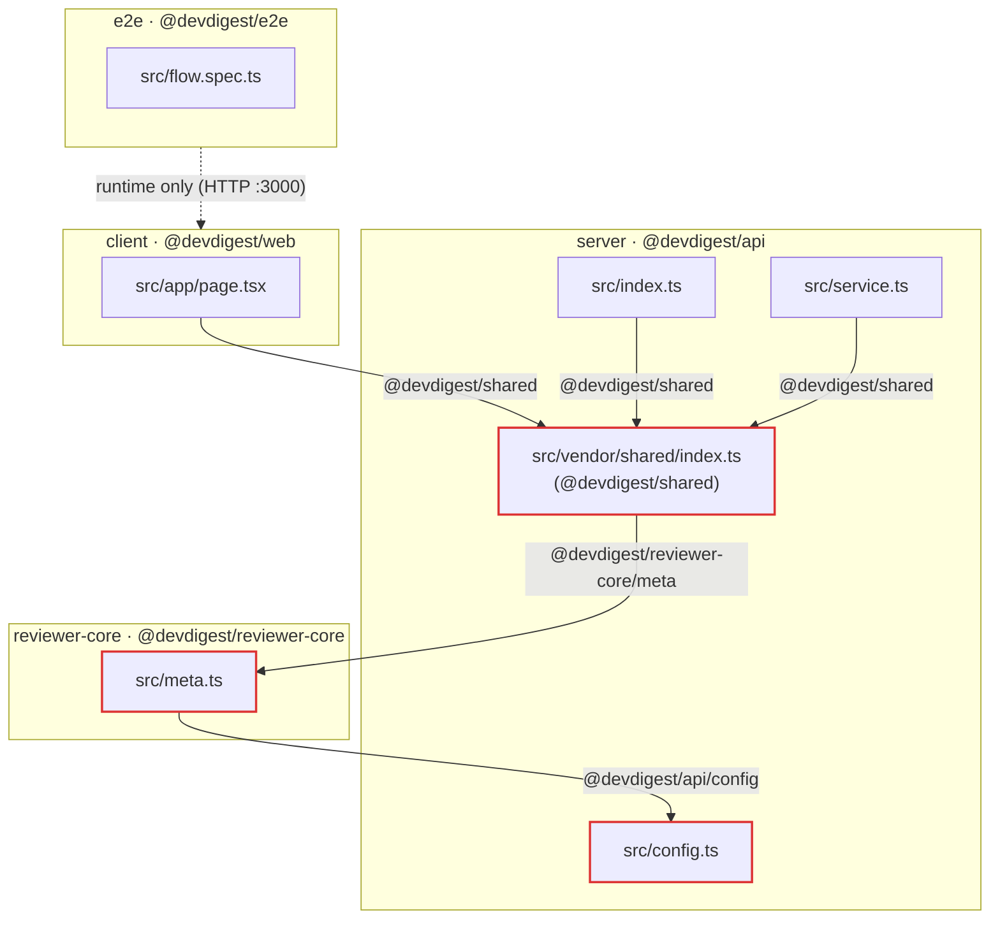

# Dependency Audit — DevDigest fixture (`mini-repo-2`)

Scope: four TypeScript packages — `server/` (`@devdigest/api`), `client/` (`@devdigest/web`), `reviewer-core/` (`@devdigest/reviewer-core`), `e2e/` (`@devdigest/e2e`) — plus a shared module at `server/src/vendor/shared/` exposed as `@devdigest/shared`.

This is **not a workspaces monorepo**. Cross-package code sharing is done purely through TypeScript path aliases declared in the root `tsconfig.json`:

```jsonc
"paths": {
  "@devdigest/api/*":           ["server/src/*"],
  "@devdigest/reviewer-core/*": ["reviewer-core/src/*"],
  "@devdigest/shared":          ["server/src/vendor/shared/index.ts"]
}
```

Because these are aliases (no `workspace:*`, no published packages), the internal edges below are **invisible to `package.json`** and to any dependency tool that only reads manifests. `node_modules` are not installed, so this audit is static (source + manifests + tsconfig).

---

## 1. What depends on what

### Internal (cross-package) dependency graph



Edge list (resolved through the aliases):

| From (file) | Import | Resolves to | Package edge |
|---|---|---|---|
| `client/src/app/page.tsx` | `@devdigest/shared` | `server/src/vendor/shared/index.ts` | **client → server** |
| `server/src/index.ts` | `@devdigest/shared` | `server/src/vendor/shared/index.ts` | server → server |
| `server/src/service.ts` | `@devdigest/shared` | `server/src/vendor/shared/index.ts` | server → server |
| `server/src/vendor/shared/index.ts` | `@devdigest/reviewer-core/meta` | `reviewer-core/src/meta.ts` | **server → reviewer-core** |
| `reviewer-core/src/meta.ts` | `@devdigest/api/config` | `server/src/config.ts` | **reviewer-core → server** |

`e2e` has **no** code-level dependency on any package; it only talks to the running app over HTTP (`page.goto('http://localhost:3000')`).

### External (npm) dependencies — declared vs. actually imported

| Package | Declared dependency | Version | Imported in code? | Verdict |
|---|---|---|---|---|
| server | `fastify` | ^5.2.0 | `src/index.ts` | used |
| server | `drizzle-orm` | ^0.30.10 | `src/db/schema.ts` (`/pg-core`) | used |
| server | `zod` | ^4.0.5 | `src/config.ts` | used |
| server | `date-fns` | ^3.6.0 | `src/format.ts` | used |
| server | `uuid` | ^10.0.0 | — none — | **UNUSED** |
| server | `vitest` (dev) | ^2.0.5 | `*.test.ts` | used |
| server | `typescript` (dev) | ^5.5.4 | build | used |
| client | `next` | ^15.1.0 | App Router runtime (`src/app/page.tsx`) | used (framework, not imported directly) |
| client | `react` | ^19.0.0 | JSX in `src/app/page.tsx` | used (implicit via JSX) |
| client | `zod` | ^4.0.5 | `src/lib/api.ts` | used |
| client | `dayjs` | ^1.11.0 | `src/lib/dates.ts` | used |
| client | `tailwindcss` | ^3.4.0 | `tailwind.config.ts`, `postcss.config.js` | used |
| client | `vitest` (dev) | ^1.6.0 | `*.test.ts` | used |
| client | `typescript` (dev) | ^5.5.4 | build | used |
| client | **`autoprefixer`** | *(not declared)* | `postcss.config.js` | **MISSING** |
| reviewer-core | *(none)* | — | — | imports `server` via alias (see findings) |
| reviewer-core | `vitest` (dev) | ^2.0.5 | `*.test.ts` | used |
| reviewer-core | `typescript` (dev) | ^5.5.4 | build | used |
| e2e | `@playwright/test` | ^1.45.3 | `src/flow.spec.ts` | used |
| e2e | `typescript` (dev) | ^5.5.4 | build | used |

---

## 2. Dependency problems worth fixing (prioritized)

### P0 — Circular dependency between `server` and `reviewer-core`

There is a true package-level cycle:

```
server/src/vendor/shared/index.ts  ──imports──▶  reviewer-core/src/meta.ts
reviewer-core/src/meta.ts          ──imports──▶  server/src/config.ts   (@devdigest/api/config)
```

- `server` (through its `vendor/shared` module) depends on `reviewer-core`.
- `reviewer-core` depends back on `server`.

Concretely, `reviewer-core/src/meta.ts` does `import { config } from '@devdigest/api/config'` and builds `engineName = ` reviewer@${config.port} ``, while `server/src/vendor/shared/index.ts` does `import { engineName } from '@devdigest/reviewer-core/meta'` to define `DEFAULT_ENGINE`. This cycle risks `undefined`-at-init-time bugs (module-eval order), makes both packages un-testable in isolation, and defeats tree-shaking.

It also **violates the reviewer-core isolation constraint** (per `CLAUDE.md`: reviewer-core is a "pure TypeScript" engine with an *injected* provider). A pure engine must not reach into the API package for a config value.

**Fix:** Invert the dependency so `reviewer-core` takes nothing from `server`.
- Remove `import { config } from '@devdigest/api/config'` from `reviewer-core/src/meta.ts`. Make `engineName` a pure constant or a function that receives the port/config as an argument (dependency injection), e.g. `export const engineName = (port: number) => ` reviewer@${port} ``, or just `export const engineName = 'reviewer'` with the port added by the caller.
- The `server` side (`vendor/shared` or the service) then supplies the port when it composes `DEFAULT_ENGINE`. Result: edges become one-directional `server → reviewer-core` only.

### P1 — `@devdigest/shared` lives *inside* `server`, so `client` depends on `server` internals

The shared contract (`ReviewDTO`, `ReviewStatus`, `DEFAULT_ENGINE`) is physically located at `server/src/vendor/shared/index.ts`. Both `client/src/app/page.tsx` and the server import it. That means:

- **`client` → `server`**: the browser bundle's type/const contract is sourced from the backend package. Any client build/typecheck now transitively pulls in `server` (and, through the P0 cycle, `reviewer-core` and `date-fns`/`zod`/etc.).
- Worse, `vendor/shared/index.ts` itself imports `reviewer-core`, so `client` transitively depends on `reviewer-core` too — just to get a DTO shape.

**Fix:** Treat `@devdigest/shared` as a genuinely standalone, dependency-free contract module.
- Move it out of `server/src/vendor/` to a top-level location (e.g. `shared/src/index.ts`) and repoint the alias `"@devdigest/shared": ["shared/src/index.ts"]`.
- Remove the `reviewer-core` import from it. `DEFAULT_ENGINE` should not be computed from the engine at all inside a pure DTO module; either inline a plain string constant or move that derived value to the server layer. This simultaneously helps resolve P0.

### P2 — Missing dependency: `autoprefixer` (client)

`client/postcss.config.js` references `autoprefixer` as a PostCSS plugin, but `autoprefixer` is **not** in `client/package.json`. On a clean install the client CSS build (and Next.js dev/build) fails with "Cannot find module 'autoprefixer'". (`postcss` and `react-dom` are likewise not declared but are normally pulled in transitively by `next`/`tailwindcss`; `autoprefixer` is the one that is directly required and unlisted.)

**Fix:** Add it as a dev dependency in `client/package.json`:
```bash
cd client && pnpm add -D autoprefixer
```
(Consider also declaring `postcss` and `react-dom` explicitly rather than relying on transitive resolution.)

### P3 — Unused dependency: `uuid` (server)

`uuid` ^10.0.0 is declared in `server/package.json` but is not imported anywhere in `server/src`. It's dead weight (and needs `@types/uuid` if ever used with these settings).

**Fix:** Remove it: `cd server && pnpm remove uuid`. (If it *is* intended for future ID generation, note that the DB schema already uses `serial('id')` autoincrement, so it's currently redundant.)

### P4 — `vitest` major-version skew across packages

`vitest` is on **^1.6.0** in `client` but **^2.0.5** in `server` and `reviewer-core`. Different majors mean divergent config/API behavior, two copies in the tree, and "works on my package" test drift.

**Fix:** Align all three on one major (v2 is the majority): bump `client` to `"vitest": "^2.0.5"`. Verify the client jsdom test config still passes after the bump.

### P5 — Cross-package edges are untracked in manifests (structural risk)

Because sharing is via tsconfig path aliases, `reviewer-core/package.json` declares `"dependencies": {}` while its code imports `@devdigest/api/config`, and `client` imports server-owned code with nothing in its manifest to show it. Manifests therefore **understate the real coupling**, and tools that read only `package.json` will miss the P0 cycle and the P1 leak entirely.

**Fix (process):** This is an accepted design in DevDigest (aliases by intent), so the mitigation is guardrails rather than adding `workspace:*` deps:
- Add an import-boundary lint (e.g. `eslint-plugin-import` `no-restricted-paths` / `import/no-cycle`, or `dependency-cruiser`) that forbids `reviewer-core → server` and `client → server` (except the shared alias), and fails CI on cycles.
- Keep the three aliases defined in exactly one place (root `tsconfig.json`, already the case) so resolution can't drift per package.

---

## Summary table

| # | Priority | Problem | Package(s) | Fix |
|---|---|---|---|---|
| 1 | P0 | Circular dep `server ↔ reviewer-core` (also breaks core isolation) | server, reviewer-core | Inject port into `reviewer-core`; drop its `@devdigest/api/config` import |
| 2 | P1 | `@devdigest/shared` sits inside `server`; `client` pulls server internals (and transitively reviewer-core) | client, server | Extract shared to standalone dep-free module; repoint alias; drop reviewer-core import |
| 3 | P2 | Missing dep `autoprefixer` used by `postcss.config.js` | client | `pnpm add -D autoprefixer` (also declare `postcss`, `react-dom`) |
| 4 | P3 | Unused dep `uuid` | server | `pnpm remove uuid` |
| 5 | P4 | `vitest` v1 (client) vs v2 (server, reviewer-core) | client | Bump client to `^2.0.5` |
| 6 | P5 | Real coupling invisible in manifests | all | Add import-boundary/cycle lint in CI |

**Consistent / healthy:** `typescript` ^5.5.4 everywhere; `zod` ^4.0.5 shared by client & server; `e2e` is correctly decoupled (HTTP-only, no code imports); every other declared runtime dependency is actually imported.
