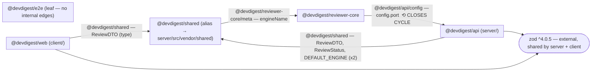

# Dependency Audit — `mini-repo-2`

Short answer: the **external** dependency setup is mostly fine, but the **internal** wiring is not healthy — there is a circular dependency between packages and `reviewer-core` reaches into the server, which breaks its isolation constraint. There are also two smaller cleanups (an unused dep and a version drift). Details, graph, and fixes below.

---

## 1. Scope

| Package | Path | Analyzed | Notes |
|---|---|---|---|
| `@devdigest/api` | `server/` | Yes | package.json + `src/` imports |
| `@devdigest/web` | `client/` | Yes | package.json + `src/` imports |
| `@devdigest/reviewer-core` | `reviewer-core/` | Yes | zero runtime deps declared |
| `@devdigest/e2e` | `e2e/` | Yes | leaf package, no internal edges |
| `@devdigest/shared` | `server/src/vendor/shared/` | Yes | alias-only (`@devdigest/shared`), physically inside `server/` |

**Skipped / limited:** No `node_modules` is installed for any package (verified via `find . -name node_modules` and `du -sh <pkg>/node_modules` — all "not installed"). Installed sizes therefore **could not be measured**; the Size Breakdown reports "not installed — run install to size" rather than guessing. `pnpm audit` could not be run for the same reason, so **no CVE claims are made** in this report.

TypeScript path aliases in effect (root `tsconfig.json`):

- `@devdigest/api/*` → `server/src/*`
- `@devdigest/reviewer-core/*` → `reviewer-core/src/*`
- `@devdigest/shared` → `server/src/vendor/shared/index.ts`

---

## 2. Dependency Graph

Internal (alias) edges are solid; the one external dependency shared by ≥2 packages (`zod`) is drawn as a single shared node. Single-package externals and tooling-only devDependencies (vitest, typescript) are excluded to keep the graph readable. `e2e` has no internal edges (it only imports `@playwright/test`) and is shown as an isolated leaf.

**Cycle highlighted:** `server` → `shared` → `reviewer-core` → `server`. Because `shared` physically lives inside the `server/` package, this is a genuine package-level `server ↔ reviewer-core` circular dependency.

Edge inventory (importer → imported, with occurrence count):

| Edge | Alias imported | Files | Count |
|---|---|---|---|
| client → shared | `@devdigest/shared` | `client/src/app/page.tsx` | 1 |
| server → shared | `@devdigest/shared` | `server/src/index.ts`, `server/src/service.ts` | 2 |
| shared → reviewer-core | `@devdigest/reviewer-core/meta` | `server/src/vendor/shared/index.ts` | 1 |
| reviewer-core → server | `@devdigest/api/config` | `reviewer-core/src/meta.ts` | 1 |

---

## 3. Size Breakdown

`node_modules` is not installed for any package, so **no installed sizes could be measured**. Run `pnpm install` (or `npm install`) per package to populate these. The tables below list each package's declared **direct** dependencies and where they are used in source.

### `@devdigest/api` (server/)

| Dependency | Version | Installed size | Used by (files) | devDependency? |
|---|---|---|---|---|
| `fastify` | ^5.2.0 | not installed | `server/src/index.ts` | no |
| `drizzle-orm` | ^0.30.10 | not installed | `server/src/db/schema.ts` (`drizzle-orm/pg-core`) | no |
| `zod` | ^4.0.5 | not installed | `server/src/config.ts` | no |
| `date-fns` | ^3.6.0 | not installed | `server/src/format.ts` | no |
| `uuid` | ^10.0.0 | not installed | **no import found (unused)** | no |
| `vitest` | ^2.0.5 | not installed | `server/src/*.test.ts` | yes |
| `typescript` | ^5.5.4 | not installed | tooling | yes |

### `@devdigest/web` (client/)

| Dependency | Version | Installed size | Used by (files) | devDependency? |
|---|---|---|---|---|
| `next` | ^15.1.0 | not installed | framework runtime (App Router — `client/src/app/page.tsx`); no direct `import` | no |
| `react` | ^19.0.0 | not installed | JSX in `client/src/app/page.tsx` (no explicit import; `jsx: preserve`) | no |
| `zod` | ^4.0.5 | not installed | `client/src/lib/api.ts` | no |
| `dayjs` | ^1.11.0 | not installed | `client/src/lib/dates.ts` | no |
| `tailwindcss` | ^3.4.0 | not installed | `client/tailwind.config.ts` | no |
| `vitest` | ^1.6.0 | not installed | `client/src/lib/dates.test.ts` | yes |
| `typescript` | ^5.5.4 | not installed | tooling | yes |

### `@devdigest/reviewer-core` (reviewer-core/)

| Dependency | Version | Installed size | Used by (files) | devDependency? |
|---|---|---|---|---|
| _(none — `dependencies: {}`)_ | — | — | intentional zero-runtime-dep engine | — |
| `vitest` | ^2.0.5 | not installed | `reviewer-core/src/meta.test.ts` | yes |
| `typescript` | ^5.5.4 | not installed | tooling | yes |

### `@devdigest/e2e` (e2e/)

| Dependency | Version | Installed size | Used by (files) | devDependency? |
|---|---|---|---|---|
| `@playwright/test` | ^1.45.3 | not installed | `e2e/src/flow.spec.ts` | **no (declared as a runtime dependency)** |
| `typescript` | ^5.5.4 | not installed | tooling | yes |

### Repo-wide total

**Cannot be computed** — no `node_modules` present in any package (`du -sh <pkg>/node_modules` returned "not installed" for all four). **Largest offender:** not measurable without an install. (Ecosystem-wise `next` in `client/` is typically the heaviest install, but this is unverified and is not asserted as a finding.)

---

## 4. Findings & Priorities

### P0 — Fix soon

**P0-1 — Circular dependency: `server ↔ reviewer-core` (via `shared`).**
- Path: `server/src/service.ts` & `server/src/index.ts` import `@devdigest/shared` → `server/src/vendor/shared/index.ts` imports `@devdigest/reviewer-core/meta` → `reviewer-core/src/meta.ts` imports `@devdigest/api/config` → back into `server`.
- Why it matters: A true package-level cycle. It makes initialization order fragile, defeats tree-shaking/isolated builds, and means `client` (which imports `@devdigest/shared`) transitively pulls in `reviewer-core` **and** `server/src/config.ts` just to get a `ReviewDTO` type.
- Recommendation: Break the cycle at the `reviewer-core → server` edge — remove the `@devdigest/api/config` import from `reviewer-core/src/meta.ts`. `engineName` should not read the server's runtime port; make it a plain constant (e.g. `export const engineName = 'reviewer'`) or accept the port via a function parameter / injected config, consistent with reviewer-core's "injected provider" design. **Destructive/behavior-changing — confirm with the user before editing.**

**P0-2 — `reviewer-core` imports server internals, breaking its isolation constraint.**
- Path: `reviewer-core/src/meta.ts` → `import { config } from '@devdigest/api/config'`.
- Why it matters: Per the project's stated constraint, `reviewer-core` is a pure, framework-free engine with an *injected* provider and `dependencies: {}`. Importing `@devdigest/api/config` (a) makes the "pure engine" depend on the Fastify server, and (b) reaches into `server/src/*` internals through the wildcard `@devdigest/api/*` alias rather than any public entry point. This is the same import that closes the P0-1 cycle, but it is independently an architectural boundary violation.
- Recommendation: Same fix as P0-1 — sever this import. reviewer-core must depend on nothing under `server/`. If it genuinely needs the port, pass it in from the caller. **Confirm with the user.**

**P0-3 — `shared` imports `reviewer-core` via an internal module path instead of its public entry point.**
- Path: `server/src/vendor/shared/index.ts` → `import { engineName } from '@devdigest/reviewer-core/meta'`.
- Why it matters: `reviewer-core/src/index.ts` is the public barrel and already re-exports `engineName`, but the import bypasses it and reaches into the internal `/meta` module. That couples `shared` to reviewer-core's internal file layout. (Note: this alone does not break the cycle — P0-1/P0-2 do — but it is a distinct internals-vs-public-entry violation.)
- Recommendation: Import from the public entry (`@devdigest/reviewer-core`) rather than `/meta`. This also requires adding a bare alias `"@devdigest/reviewer-core": ["reviewer-core/src/index.ts"]` to root `tsconfig.json`, since today only the wildcard `@devdigest/reviewer-core/*` exists and there is no non-wildcard public entry. (If P0-1/P0-2 are fixed by making `engineName` a local constant in shared, this edge disappears entirely — prefer that.)

### P1 — Should address

**P1-1 — Version drift: `vitest` major mismatch across packages.**
- `server` and `reviewer-core` declare `vitest ^2.0.5`; `client` declares `vitest ^1.6.0` (major 1 vs 2).
- Why it matters: Different major versions of the test runner across packages invites config/API incompatibilities and duplicated installs, and makes "run all tests the same way" harder.
- Recommendation: Bump `client/package.json` `vitest` to `^2.0.5` to match server/reviewer-core, then re-run the client suite. **Confirm with the user before bumping** (major upgrade can change test behavior).

**P1-2 — Unused dependency: `uuid` in `server`.**
- `server/package.json` declares `uuid ^10.0.0`, but no source file imports `uuid` (verified via grep across `server/src`).
- Why it matters: Dead dependency — install weight and supply-chain surface for nothing.
- Recommendation: Remove `uuid` from `server/package.json` `dependencies`. **Destructive — confirm with the user** (or confirm it is not needed by not-yet-written code).

### P2 — Worth considering

**P2-1 — Duplicate date libraries across packages: `date-fns` vs `dayjs`.**
- `server/src/format.ts` uses `date-fns` (`format(..., 'yyyy-MM-dd HH:mm')`); `client/src/lib/dates.ts` uses `dayjs` (`.format('YYYY-MM-DD')`). Two libraries solving the same date-formatting problem.
- Why it matters: Two mental models and two installs for the same job; drift risk in date formatting between server and client.
- Recommendation: Standardize on one library repo-wide (e.g. keep `date-fns` on the server and adopt it in the client too, or vice-versa) and drop the other. Cross-package, non-blocking — lower priority.

**P2-2 — `@playwright/test` declared as a runtime `dependency` in `e2e`.**
- `e2e/package.json` lists `@playwright/test` under `dependencies`, not `devDependencies`. It is a test-only tool.
- Why it matters: Miscategorized dependency type; would be pulled into any production install of the package.
- Recommendation: Move `@playwright/test` to `devDependencies` in `e2e/package.json`.

### Info

- **`reviewer-core` declares `dependencies: {}`** — consistent with its stated zero-runtime-dependency build constraint. Good. (Caveat: its *source* currently violates the spirit of that isolation via the P0-2 import; fixing P0-2 restores true isolation.)
- **`zod` is aligned at `^4.0.5`** across `server` and `client` — no drift. Good.
- **`typescript ^5.5.4`** is aligned across all four packages — no drift. Good.
- **`e2e` is a clean leaf** — no internal alias edges, only the external `@playwright/test`.

---

## 5. Summary (act on these today, by tier)

- **P0 — Break the `server ↔ reviewer-core` cycle** by removing the `@devdigest/api/config` import from `reviewer-core/src/meta.ts`; make `engineName` a constant or inject the port. This single change fixes the circular dependency *and* restores reviewer-core's isolation (P0-1 + P0-2).
- **P0 — Stop reaching into `reviewer-core`'s internals** from `server/src/vendor/shared/index.ts`: import from the public `@devdigest/reviewer-core` barrel (add the bare alias to `tsconfig.json`), or drop the import entirely if the constant fix above removes the need (P0-3).
- **P1 — Align `vitest`** in `client` (`^1.6.0` → `^2.0.5`) to match server/reviewer-core, and **remove the unused `uuid`** from `server/package.json`. Both are user-confirm changes.
- **P2 — Tidy up:** consolidate `date-fns`/`dayjs` onto one date library, and move `@playwright/test` to `devDependencies` in `e2e`.
- **Note on sizing:** no `node_modules` is installed, so sizes and `pnpm audit` were not run — install per package if you want measured size numbers and a CVE scan before acting on removals.
