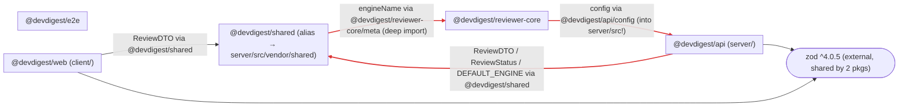

# Dependency Sanity Check — Pre-Ship Audit

Repository audited: `.claude/skills/dependency-checker-workspace/fixtures/mini-repo-2`

**Bottom line: do not ship as-is.** There is a circular dependency across three of the four packages (`server → shared → reviewer-core → server`), and the loop is caused by `reviewer-core` reaching into `server`'s internals — which also violates `reviewer-core`'s isolation constraint. Details below.

---

## 1. Scope

| Package | Path | Analyzed | node_modules |
|---|---|---|---|
| `@devdigest/api` | `server/` | Yes | Not installed |
| `@devdigest/web` | `client/` | Yes | Not installed |
| `@devdigest/reviewer-core` | `reviewer-core/` | Yes | Not installed |
| `@devdigest/e2e` | `e2e/` | Yes | Not installed |
| `@devdigest/shared` | `server/src/vendor/shared/` | Yes (alias-only, no own `package.json`) | n/a |

- All four packages plus the `shared` alias target were analyzed for both external (npm) and internal (path-alias / cross-package) dependencies.
- **No `node_modules` are installed anywhere in the fixture.** Installed sizes could not be measured; the Size Breakdown reports "not installed — run pnpm install to size" per the skill's guidance rather than guessing.
- Root `package.json` is a private stub with no dependencies (workspace root marker only); nothing to audit there.

---

## 2. Dependency Graph

Internal (path-alias) edges are solid; the one external dependency that is shared across ≥2 packages (`zod`) is drawn as a single shared node. Tooling-only devDependencies (vitest, typescript) are excluded from the graph per the skill. `e2e` has no internal edges — it only consumes `@playwright/test`.

**The red edges form a cycle:** `server → shared → reviewer-core → server`. Because `client → shared` too, the client also transitively pulls the entire loop (including `server`'s runtime `config`) into its build.

---

## 3. Size Breakdown

`node_modules` is not installed for any package, so no dependency could be sized. To populate this section, run `pnpm install` (or `./scripts/dev.sh --db-only` equivalent) and re-run `du -sh <package>/node_modules/<dep>`.

### `@devdigest/web` (client/)

| Dependency | Version | Installed size | Used by (files) | devDependency? |
|---|---|---|---|---|
| `next` | ^15.1.0 | not installed — run pnpm install to size | `client/src/app/page.tsx` (App Router page) | no |
| `react` | ^19.0.0 | not installed — run pnpm install to size | JSX in `client/src/app/page.tsx` | no |
| `tailwindcss` | ^3.4.0 | not installed — run pnpm install to size | `client/tailwind.config.ts` | no |
| `zod` | ^4.0.5 | not installed — run pnpm install to size | `client/src/lib/api.ts` | no |
| `dayjs` | ^1.11.0 | not installed — run pnpm install to size | `client/src/lib/dates.ts` | no |
| `vitest` | ^1.6.0 | not installed — run pnpm install to size | `client/src/lib/dates.test.ts` | yes |
| `typescript` | ^5.5.4 | not installed — run pnpm install to size | tooling | yes |

### `@devdigest/api` (server/)

| Dependency | Version | Installed size | Used by (files) | devDependency? |
|---|---|---|---|---|
| `fastify` | ^5.2.0 | not installed — run pnpm install to size | `server/src/index.ts` | no |
| `drizzle-orm` | ^0.30.10 | not installed — run pnpm install to size | `server/src/db/schema.ts` | no |
| `zod` | ^4.0.5 | not installed — run pnpm install to size | `server/src/config.ts` | no |
| `date-fns` | ^3.6.0 | not installed — run pnpm install to size | `server/src/format.ts` | no |
| `uuid` | ^10.0.0 | not installed — run pnpm install to size | **no matching import found (unused)** | no |
| `vitest` | ^2.0.5 | not installed — run pnpm install to size | `server/src/config.test.ts` | yes |
| `typescript` | ^5.5.4 | not installed — run pnpm install to size | tooling | yes |

### `@devdigest/reviewer-core`

| Dependency | Version | Installed size | Used by (files) | devDependency? |
|---|---|---|---|---|
| _(none — zero runtime dependencies)_ | — | — | — | — |
| `vitest` | ^2.0.5 | not installed — run pnpm install to size | `reviewer-core/src/meta.test.ts` | yes |
| `typescript` | ^5.5.4 | not installed — run pnpm install to size | tooling | yes |

### `@devdigest/e2e`

| Dependency | Version | Installed size | Used by (files) | devDependency? |
|---|---|---|---|---|
| `@playwright/test` | ^1.45.3 | not installed — run pnpm install to size | `e2e/src/flow.spec.ts` | no |
| `typescript` | ^5.5.4 | not installed — run pnpm install to size | tooling | yes |

### Repo-wide total

- **Total installed size: not measurable — no `node_modules` present in any package.** Run `pnpm install` per package, then `du -sh <package>/node_modules`.
- **Likely largest offender (by known typical footprint, not measured here):** `next` in `client/` (typically ~100M+ installed), followed by `@playwright/test` in `e2e/`. This is a heuristic note only, not a measurement — confirm after install.

---

## 4. Findings & Priorities

### P0 — Fix soon (blocks ship)

**P0-1 — Circular dependency across three packages.**
- Packages/files:
  - `server/src/index.ts` and `server/src/service.ts` import `@devdigest/shared` → **server → shared**
  - `server/src/vendor/shared/index.ts` imports `@devdigest/reviewer-core/meta` (`engineName`) → **shared → reviewer-core**
  - `reviewer-core/src/meta.ts` imports `@devdigest/api/config` (`config`) → **reviewer-core → server**
- Why it matters: `server → shared → reviewer-core → server` is a true import cycle. Cycles cause fragile module-initialization order (whichever side loads first can see `undefined` exports), break tree-shaking, and make the three packages impossible to build or reason about in isolation. Because `client` also imports `@devdigest/shared`, the client build transitively drags in `reviewer-core` **and** `server/src/config.ts` (which reads `process.env.DATABASE_URL`) — server runtime config leaking into the browser bundle.
- Recommended action: **Break the loop by cutting the `reviewer-core → server` edge.** `reviewer-core/src/meta.ts` should not depend on `server`'s `config`. Change `engineName` to a static constant (or accept the port via an injected parameter / the already-planned injected provider) so `reviewer-core` needs nothing from `server`. This single change removes the cycle. *(Editing source is out of scope for this audit — confirm the exact replacement value with the team before applying.)*

**P0-2 — `reviewer-core` imports from `server`, violating its isolation constraint.**
- Packages/files: `reviewer-core/src/meta.ts` → `import { config } from '@devdigest/api/config'`. The `@devdigest/api/*` alias resolves to `server/src/*`, so this reaches directly into server's source internals.
- Why it matters: Per the repo constraints, `reviewer-core` is "pure TypeScript, no framework, injected LLM provider" with **zero runtime dependencies** and is consumed as raw source. Reaching into `server/src` couples the review engine to the API server, defeats the injected-provider design, and is the very edge that closes the P0-1 cycle. It also imports a package's `src` internals rather than a public entry point.
- Recommended action: Remove the `@devdigest/api/config` import entirely (folded into the P0-1 fix). Longer term, forbid the `@devdigest/api/*` deep alias from being consumed outside `server` (lint rule / no-restricted-imports) so nothing else reaches into `server/src`.

**P0-3 — `shared` deep-imports `reviewer-core` internals instead of its public entry.**
- Packages/files: `server/src/vendor/shared/index.ts` → `import { engineName } from '@devdigest/reviewer-core/meta'`. `reviewer-core/src/index.ts` already publicly re-exports `engineName`, but the alias map only defines `@devdigest/reviewer-core/*` (deep) — there is no bare `@devdigest/reviewer-core` entry alias, so consumers are forced into `src/` internals.
- Why it matters: Importing `.../meta` bypasses the package's public surface (`reviewer-core/src/index.ts`), so internal file moves inside `reviewer-core` silently break `shared`. It is also the second link in the P0-1 cycle.
- Recommended action: Add a bare `"@devdigest/reviewer-core": ["reviewer-core/src/index.ts"]` entry to the root `tsconfig.json` `paths` and import `engineName` from `@devdigest/reviewer-core` (public entry) instead of `.../meta`. (Note: once P0-1 is fixed by removing `reviewer-core`'s server dependency, this edge becomes safe to keep.)

### P1 — Should address

**P1-1 — Unused dependency: `uuid` in `server/`.**
- Packages/files: declared in `server/package.json` (`"uuid": "^10.0.0"`); no `import`/`require` of `uuid` exists anywhere under `server/src`.
- Why it matters: Dead dependency — adds install weight and audit surface for no benefit, and misleads readers into thinking IDs are UUID-based.
- Recommended action: Remove `uuid` from `server/package.json`. *(Removing a dependency is hard to reverse — confirm with the team that no un-committed code needs it before deleting.)*

**P1-2 — Version drift: `vitest` majors differ across packages.**
- Packages/files: `client/package.json` `vitest ^1.6.0` vs `server/package.json` and `reviewer-core/package.json` `vitest ^2.0.5` (major 1 vs major 2).
- Why it matters: Different vitest majors across packages mean divergent config/API behavior and inconsistent test semantics; it is a maintenance and CI-reproducibility hazard even though vitest is tooling-only.
- Recommended action: Align all three on a single major — bump `client` to `vitest ^2.0.5` to match `server`/`reviewer-core`.

### P2 — Worth considering

**P2-1 — Duplicate functionality: two date libraries.**
- Packages/files: `client/` uses `dayjs ^1.11.0` (`client/src/lib/dates.ts`); `server/` uses `date-fns ^3.6.0` (`server/src/format.ts`).
- Why it matters: Two libraries solving the same date-formatting problem doubles the dependency/audit surface and splits team knowledge. Not blocking, but avoidable.
- Recommended action: Standardize on one. `date-fns` is tree-shakeable and fits the server; if the client only needs `format('YYYY-MM-DD')` and `toISOString()`, drop `dayjs` and use `date-fns` (or plain `Intl`/`Date`) in `client/src/lib/dates.ts`.

### Info

- **`reviewer-core` correctly declares zero runtime `dependencies`** — consistent with its "no framework, consumed as raw TypeScript" constraint. The *only* thing breaking that isolation is the source-level import in P0-2; the manifest itself is clean.
- **`zod` is on a consistent major** (`^4.0.5`) in both `client` and `server` — no drift there.
- **`typescript` is pinned to `^5.5.4` across all packages** — consistent.
- **`e2e` is properly standalone** — it has no internal alias edges and only depends on `@playwright/test`.

---

## 5. Summary — act on these before shipping

1. **[P0] Break the `server → shared → reviewer-core → server` cycle** by removing `reviewer-core/src/meta.ts`'s `import { config } from '@devdigest/api/config'` — make `engineName` static or inject the port. This single fix resolves both the cycle (P0-1) and the reviewer-core isolation violation (P0-2).
2. **[P0] Stop `client` from bundling server runtime config:** the cycle currently drags `server/src/config.ts` (which reads `process.env.DATABASE_URL`) into the browser build via `@devdigest/shared`. Fixing item 1 also fixes this.
3. **[P0] Import `reviewer-core` through its public entry** (`@devdigest/reviewer-core`, add the tsconfig alias) instead of the deep `@devdigest/reviewer-core/meta` path.
4. **[P1] Remove the unused `uuid` dependency from `server/`**, and **align `vitest` to `^2.x` in `client/`** to match the other packages.
5. **[P2] Pick one date library** (recommend `date-fns`) instead of running `dayjs` in the client and `date-fns` in the server.

*Note: no `node_modules` were installed, so `pnpm audit` (CVE check) and installed-size measurements could not be run. Run `pnpm install` then `pnpm audit` and re-measure sizes before the final go/no-go — this audit found no CVE claims because none were verifiable, not because the tree is proven clean.*
