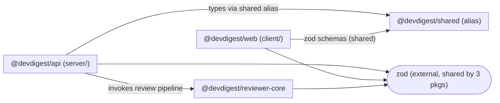

# Dependency Checker

Audit dependencies at two levels — **external** (npm packages per `package.json`) and **internal** (cross-package/module imports via TypeScript path aliases, since this repo is not a monorepo) — and report a graph, sizes, and prioritized, actionable findings.

Always run all four steps below and produce all four output sections. A dependency report with a graph but no prioritization, or findings with no severity, is incomplete.

---

## Scope

| Package | Path | package.json |
|---------|------|---------------|
| `@devdigest/api` | `server/` | `server/package.json` |
| `@devdigest/web` | `client/` | `client/package.json` |
| `@devdigest/reviewer-core` | `reviewer-core/` | `reviewer-core/package.json` |
| `@devdigest/e2e` | `e2e/` | `e2e/package.json` |
| `@devdigest/shared` | `server/src/vendor/shared/` | alias only, no own package.json |

Internal dependencies are **not** `workspace:*` entries — they are TypeScript path aliases (`tsconfig.json` `paths`) and relative imports crossing package boundaries. Treat "internal dependency" and "external npm dependency" as separate analyses; do not conflate them in the graph or the size table.

---

## Step 1 — Discover dependencies

**External, per package:** read each `package.json`'s `dependencies` and `devDependencies`. Note version, and flag if a package appears in more than one `package.json` with different major versions (version drift).

**Internal, per package:** grep each package's `tsconfig.json` for `paths`, then grep `src/` for imports matching those aliases or relative paths that cross a package boundary (e.g. `server/` importing from `reviewer-core/`). Record the direction of each edge (importer → imported) and count occurrences to gauge coupling strength.

Do not count devDependencies used only for tooling (vitest, eslint, tsc, prettier) as architectural dependencies in the graph — list them separately in the size table if relevant to size, but exclude them from the Mermaid diagram to keep it readable.

---

## Step 2 — Draw the dependency graph

Produce one Mermaid `flowchart LR` (see the `mermaid-diagram` skill for syntax if needed) with:

- One subgraph per package in scope, labeled with the package name from the table above
- Edges between packages for internal (alias) dependencies, labeled with the alias or a short description (e.g. `types via shared`)
- External dependencies only included if they are large (>5MB unpacked) or shared across ≥2 packages — draw these as a single shared node (e.g. `zod`) with edges to each consuming package, not one node per package
- Do not draw edges for transitive dependencies — only direct imports

Example shape:



If the graph would exceed ~20 nodes, collapse leaf packages with only one edge into a "misc" note rather than omitting them silently — state what was collapsed.

---

## Step 3 — Size breakdown

For each package, produce a table of its heaviest **direct** dependencies by installed size. Get sizes with:

```bash
du -sh <package>/node_modules/<dep-name> 2>/dev/null
```

or, if `node_modules` isn't installed for a package, report "not installed — run pnpm install to size" rather than guessing.

Table format, one per package, sorted descending by size:

| Dependency | Version | Installed size | Used by (files) | devDependency? |
|---|---|---|---|---|
| `next` | 15.x | 120M | client/src/app/**/*.tsx | no |

Then a **repo-wide total**: sum of `node_modules` size per package (`du -sh <package>/node_modules`), and call out the single largest dependency across the whole repo.

---

## Step 4 — Prioritize findings and give recommendations

Classify every finding into exactly one severity tier. Do not invent additional tiers.

| Tier | Criteria |
|------|----------|
| **P0 — Fix soon** | Circular internal dependency; a package importing directly from another package's `src/` internals instead of its public entry point/alias; a dependency with a known critical CVE (only claim this if you actually checked, e.g. via `pnpm audit`, don't guess) |
| **P1 — Should address** | Version drift (same package, different majors, across packages); a heavy dependency (>20MB) used for a trivial subset of its functionality; an unused dependency (declared but no matching import found) |
| **P2 — Worth considering** | A devDependency that could be a peerDependency/optional; duplicate functionality across two different packages solving the same problem (e.g. two date libraries); tooling-only package installed in a package that doesn't need it |
| **Info** | Notable but not actionable — e.g. "reviewer-core intentionally has zero runtime deps per its build constraint" |

For each finding: state the tier, the exact package(s)/file(s) involved, why it matters, and one concrete recommended action (e.g. "replace X with Y", "remove unused Z from server/package.json", "move edge behind the shared alias instead of a relative cross-package import"). Do not give vague advice like "consider optimizing dependencies" — every recommendation must name a specific dependency or file.

If a finding requires a destructive or hard-to-reverse action (removing a dependency, force-resolving a version), flag it as a **recommendation to confirm with the user**, not something to execute directly.

---

## Output Report

Structure the final output in exactly this order, with these headings:

1. **Scope** — which packages were analyzed, and any that were skipped (with reason, e.g. no node_modules installed)
2. **Dependency Graph** — the Mermaid diagram from Step 2
3. **Size Breakdown** — per-package tables from Step 3, plus the repo-wide total and largest offender
4. **Findings & Priorities** — findings grouped by tier (P0 → P1 → P2 → Info), each with package/file, reason, and one concrete recommendation
5. **Summary** — 3-5 bullet takeaways a developer can act on today, ordered by tier

Do not omit a section even if empty — state "none found" explicitly so the report reads as complete rather than partial.

<!-- Every finding must carry an explicit severity; an unprioritized finding is treated as incomplete. -->

