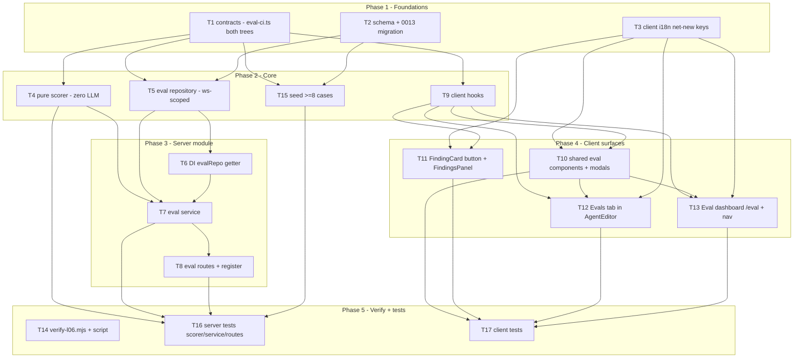

# Implementation Plan: Eval Pipeline (L06)

## Overview
Turn the reviewer's own accept/dismiss triage into reproducible, code-only regression tests for a
reviewer **agent**. A maintainer creates an eval case in one click from a real finding (accepted →
`must_find`, dismissed → `must_not_flag`), runs the agent across its whole case set on fixed inputs,
and gets **deterministic** recall / precision / citation_accuracy with **zero LLM calls in the
scoring step**. Runs pin the agent version + exact system prompt so "old prompt vs new prompt" is an
apples-to-apples compare with a prompt diff. Spans **client** + **server** + **reviewer-core**
(consumed unchanged as a library).

Source of requirements: `specs/2026-07-12-eval-pipeline.md` (Status: **approved**, 25 EARS ACs). This
plan restates its ACs for traceability and does not redefine scope.

## Execution mode
**multi-agent (parallel)** — inferred from the parent's explicit requirements (non-overlapping owned
paths per parallel task + a clear dependency DAG + a traceability matrix). The work splits cleanly
into contracts/schema/i18n foundations, a pure scorer, a server module (repo → DI → service →
routes), and four independent client surfaces, so the plan is shaped as a contracts-first DAG with
disjoint `Owned paths` for every concurrently-runnable task and explicit concurrency waves.

## Cross-model review (Gemini 2.5 Pro) — findings & dispositions
An independent cross-model review (Gemini 2.5 Pro, staff-engineer role, no authoring context) audited
this plan; verdict **ship-with-listed-fixes**. Raw output: `docs/plans/eval-pipeline.cross-model-review.md`.
Every finding and its disposition is recorded below; the tasks/acceptance were updated in place.

| # | Finding | Disposition | Task(s) touched |
|---|---------|-------------|-----------------|
| 1 | **[critical] Structural tenancy on `eval_runs`.** Transitive-only scoping (via `set_run_id`) is a footgun. | **ADOPTED.** Add `workspace_id uuid NOT NULL` (FK→workspaces, cascade) to `eval_runs`; confirm `eval_set_runs` carries it too. Repository filters **every** `eval_runs` query by `workspace_id` (defense-in-depth, not only the parent join); service copies it from the parent set-run on the per-case insert. Kept **server-only** — NOT added to the wire `EvalRunRecord` (avoids leaking tenancy ids to the client; stated in T1). | T2, T5, T7, T1 |
| 2 | **[semantics] Pin pre- vs post-grounding for the metrics.** Ambiguous which finding set feeds recall/precision/citation. | **ADOPTED.** Scorer takes **both** the pre-grounding model output `producedAll = kept ∪ dropped` and the grounded `kept` set as explicit inputs. **precision** over `producedAll`; **recall** counts a `must_find` matched only by a **kept** finding; **citation_accuracy = kept/(kept+dropped)** over `producedAll`. Pinned in T4 + the AC-6/AC-7/AC-8 notes. | T4, T7, T16 |
| 3 | **[reliability] Idempotent seed.** Select-then-insert is fragile. | **ADOPTED.** Add a UNIQUE constraint on `eval_cases (workspace_id, owner_id, name)` in the `0013_*` migration; T15 seed switches to `onConflictDoNothing` on that constraint. Makes the ≥8-case seed (AC-15/AC-16 data) reliably repeatable. | T2, T15 |
| 4 | **[security] `createFromFinding` ownership derivation.** Trusting client-supplied `agentId` is an IDOR risk. | **ADOPTED.** Derive `agentId` server-side via `finding → review → agent` (DB join). The route keeps `POST /agents/:id/eval-cases/from-finding`; `:id` is used **only** as an authorization check that the finding's review belongs to that agent + the caller's workspace — mismatch → refuse (AC-24). | T7, T8 |
| 5 | **[test] All-dropped grounding.** Missing explicit coverage. | **ADOPTED.** New T16 test: MockLLMProvider returns findings that don't overlap the diff → `reviewPullRequest` yields empty `kept` + non-empty `dropped` → `citation_accuracy == 0.0`, run still records (NOT an error). | T16 |
| 6 | **[docs] Degraded-diff behavior (AC-17).** State it precisely. | **ADOPTED.** On unparseable `input_diff` the run **skips** `reviewPullRequest`, marks `citation_accuracy = null` (degraded badge), and computes recall/precision from file+line matching of whatever expected/produced data exists (no produced findings → precision 1.0; recall 0.0 unless there are no `must_find` expectations, in which case 1.0). Pinned in T7 + Rec-D. | T7 |
| 7 | **[known limitation] Force-push diff-capture race.** | **ADOPTED (document only).** One-line note in Risks: the diff is captured at case-creation time; a force-push between finding-view and create could desync it. Accepted, no code change. | Risks |

## Requirements (verified — restated from the approved spec)
Every AC below maps to at least one task; see the **Traceability matrix**.

**Case creation from triage**
- R-AC1: "Turn into eval case" creates a case in a single action + toast; it appears in the agent's set. → T7, T11
- R-AC2: Expectation kind derived from state — `accepted_at` → `must_find`; `dismissed_at` → `must_not_flag`. → T7
- R-AC3: Capture the PR's unified diff (reloaded via the finding's PR) as fixed `input_diff` + the finding's file/line/severity/category/title into `expected_output.findings[]`. → T7
- R-AC4: Untriaged finding (neither accepted nor dismissed) → action disabled; no case created. → T11

**Scoring — pure, deterministic, zero LLM** (metric semantics pinned per cross-model finding #2)
- R-AC5: Match iff `file` equal AND line ranges overlap (`max(p.start,e.start) <= min(p.end,e.end)`). → T4
- R-AC6: recall = must_find expectations matched by a **kept** finding / total must_find; zero must_find → 1.0. → T4
- R-AC7: precision = (`producedAll` − must_not_flag matches) / `producedAll`, over the **pre-grounding** model output; zero producedAll → 1.0. → T4
- R-AC8: citation_accuracy = kept / (kept + dropped) over `producedAll`; kept+dropped == 0 → 1.0. → T4, T7
- R-AC9: Scoring makes zero LLM/provider calls — pure arithmetic. → T4
- R-AC10: Case passes iff per-case recall == 1.0 (via kept) AND no `producedAll` finding matches a must_not_flag target. → T4
- R-AC11: `POST /agents/:id/eval-runs` runs one review per case on fixed inputs + resolved config; N per-case rows + a set-level aggregate (`traces_total == N`). → T7, T8
- R-AC12: Each run records the agent version + exact system prompt used. → T1, T2, T7
- R-AC13: Run history + compare of exactly two runs — signed metric deltas (+cost) + system-prompt diff. → T7, T8, T10, T13
- R-AC14: Latest metric < previous → regression warning naming the dipped metric + magnitude. → T4, T7, T10
- R-AC15: A run set carries ≥ 8 cases; < 8 → under-minimum warning (run still permitted). → T7, T15, T12, T13
- R-AC16: Same set under two materially different prompts → visible recall/precision movement (sensitivity). → T15, T16

**Degraded fallback**
- R-AC17: Empty/unparseable `input_diff` → deterministic skeleton from file+line facts; mark citation_accuracy **degraded** (null); no blank/crash. → T7, T10
- R-AC18: A single case's review error → mark that case failed with reason, continue the rest. → T7

**Surfaces (UI)**
- R-AC19: Agent-editor **Evals** tab: EVAL METRICS row (metrics + deltas + traces X/Y) + "Eval cases (M/N passing)" list with per-row controls; Run all / New case / View full dashboard. → T12
- R-AC20: Sidebar "Eval Dashboard" under SKILLS LAB → `/eval`; per-agent cards + "Recent eval runs · all agents" table + "Run all agents". → T13
- R-AC21: Single-agent detail: 3 metric cards w/ deltas, metric-trend line chart, selectable Recent-runs table + Compare, Run eval. → T13, T10
- R-AC22: Eval case editor modal: Name, Input (Diff/Files/PR-meta tabs), Expected-output validated as valid JSON against the expectation schema + "+ Finding skeleton", "Run on save", Cancel/Run/Save, last-run badge. → T10
- R-AC23: Metric direction + regression conveyed by icon/arrow + text, not colour alone. → T10

**Access control & verification**
- R-AC24: Every eval case/run resolved within the caller's workspace; cross-workspace target refused (not-found). → T5, T7, T8
- R-AC25: `pnpm verify:l06` exits 0 when deliverables present, 1 otherwise (file-existence/string-contains, same shape as verify-l03). → T14

## Open questions & recommendations
All spec forks were already RESOLVED by the maintainer (2026-07-12). Planning notes below are design
choices confirmed/updated by the cross-model review — none re-open the spec.

- **Rec-A (GAP-3 — how the run gets kept + dropped): read them off the review outcome; do NOT
  re-call `groundFindings`.** Confirmed by reading `reviewer-core/src/review/run.ts:100-225`:
  `reviewPullRequest(input)` returns `ReviewOutcome = { review, grounding, dropped: {finding,reason}[], … }`
  where `review.findings` is exactly the **kept** (post-grounding) set and `dropped` is the dropped
  set (`run.ts:203-224`). So `kept = outcome.review.findings`, `dropped = outcome.dropped.map(d => d.finding)`,
  `producedAll = kept ∪ dropped`, `citation_accuracy = kept.length / (kept.length + dropped.length)`
  (AC-8). This reuses the exact mandated gate with **no reviewer-core change**. An all-dropped result
  (empty `kept`, non-empty `dropped`) is valid → citation < 1.0, not an error (finding #5). → T4, T7.
- **Rec-B (GAP-1 + GAP-2 resolved by ONE new table).** Introduce **`eval_set_runs`** — a persisted
  set-level aggregate row (one row per `POST …/eval-runs`) that also carries the reproducibility
  snapshot (`agent_version`, `system_prompt`, `model`). Resolves **GAP-2** (dashboard "Recent runs"
  renders one row per set run) and **GAP-1** (version + exact prompt pinned per run) at the natural
  grain. Per-case `eval_runs` gain a `set_run_id` FK + a denormalized `agent_version` int (so
  `EvalRunRecord.version` is populated, AC-12) + a **`workspace_id` FK** (structural tenancy, finding #1).
  Compare (AC-13) reads two `eval_set_runs` rows for the prompt diff. → T1, T2.
- **Rec-C (GAP-4 — validate on write, don't tighten the big shared file).** Add `EvalExpectation` to
  `eval-ci.ts` and tighten `EvalCaseInput.expected_output` from `z.unknown()` to `EvalExpectation`;
  the service validates it on both create-from-finding and manual Save. **Do not** tighten
  `EvalCase.expected_output` in `knowledge.ts`. → T1, T7, T10.
- **Rec-D (degraded-diff semantics, AC-17 — pinned per finding #6).** When `input_diff` cannot be
  parsed into a `UnifiedDiff`, the run **skips `reviewPullRequest`**, marks that case **degraded**
  (`citation_accuracy = null` + a `degraded: true` marker in the per-case `actual_output`), and still
  computes recall/precision from file+line matching over whatever expected/produced data exists — with
  no produced findings, precision = 1.0 and recall = 0.0 (or 1.0 if the case has no `must_find`). Never
  crashes. → T7, T10.
- **Rec-E (owner scope).** Agents only (`owner_kind = 'agent'`) per the RESOLVED spec; the DB keeps
  the `'skill'` enum value but no skill path is built. `owner_id` is an **agent UUID**.

## Affected modules & contracts
- **server** — NEW `modules/eval/` (`scorer.ts`, `repository.ts`, `service.ts`, `routes.ts`);
  registered in `modules/index.ts`; a lazy `evalRepo` getter added to `platform/container.ts`. NEW
  `eval_set_runs` table + columns on `eval_runs` (`set_run_id`, `agent_version`, **`workspace_id`**) +
  a UNIQUE `eval_cases (workspace_id, owner_id, name)` constraint in `db/schema/eval.ts` (migration
  `0013_*`). Seed ≥ 8 cases in `db/seed.ts`. Reuses `container.reviewRepo` (finding→review→agent + PR
  chain + `loadDiff`), `container.agentsRepo` (agent row: provider/model/systemPrompt/version),
  `container.llm(provider)`, `getContext` (`modules/_shared/context.ts`), `parseUnifiedDiff`
  (`adapters/git/diff-parser.ts`), and reviewer-core `reviewPullRequest`.
- **client** — NEW `lib/hooks/eval.ts`; NEW shared `components/eval/**` (modals, trend chart,
  regression banner, delta badge); NEW `app/eval/**` dashboard; a "Turn into eval case" button on
  `FindingCard` (threaded via `FindingsPanel`); an **Evals** tab in the Agent editor; a `/eval` nav
  item in `vendor/ui/nav.ts`. All i18n strings already exist in `messages/en/eval.json` +
  `messages/en/shell.json` (`nav.eval`) — only a handful of net-new keys are added (T3).
- **reviewer-core** — **no changes**; consumed as a library (`reviewPullRequest`, its built-in
  `groundFindings` gate). `groundFindings` is applied, never bypassed.
- **Contracts** (all in `vendor/shared/contracts/eval-ci.ts`, **mirrored in BOTH the server and
  client trees** — two synced copies):
  - **ADD:** `EvalExpectation`, `EvalSetRunRecord`, `EvalCompare`, `EvalSetRunResult`.
  - **EDIT (explicit callout — greenfield, no runtime consumers yet):** `EvalCaseInput.expected_output`
    (`z.unknown()` → `EvalExpectation`); `EvalRunRecord` (+`set_run_id`, +`version`; `workspace_id`
    intentionally **not** exposed on the wire — server-only, finding #1); `EvalDashboard`
    (`recent_runs` → `EvalSetRunRecord[]`; `trend` stays `EvalTrendPoint[]`). These L06 eval contracts
    are **unconsumed today**, so tightening them is safe; flagged in the Red-flags check.
  - **REUSE unchanged:** `EvalRun` (aggregate return of a set run), `EvalTrendPoint`, `EvalOwnerKind`,
    `EvalPerTrace`, `EvalCase` (read model in `knowledge.ts` — untouched), `Finding`, `Severity`,
    `FindingCategory`.

## Architecture changes (exact files + onion layer / RSC boundary)
- **Domain (contracts):** `EvalExpectation = { kind: 'must_find'|'must_not_flag', findings:
  Array<{ file, start_line, end_line, severity: Severity, category: FindingCategory, title }> }`;
  `EvalSetRunRecord = { id, owner_kind, owner_id, ran_at, version, system_prompt, model, recall,
  precision, citation_accuracy, traces_passed, traces_total, duration_ms, cost_usd, under_min }`;
  `EvalCompare = { base, head: EvalSetRunRecord, delta: {recall,precision,citation_accuracy,cost_usd},
  prompt_diff: {base_prompt, head_prompt} }`; `EvalSetRunResult = { set_run_id, result: EvalRun }`. In
  both `eval-ci.ts` trees. — T1
- **Infrastructure (schema/migration):** `eval_set_runs` (uuid PK, `workspace_id` FK→workspaces
  cascade, `owner_kind` text enum, `owner_id` uuid, `agent_version` int, `system_prompt` text, `model`
  text, `ran_at` timestamptz `now()`, metrics doublePrecision, `traces_passed`/`traces_total` int,
  `duration_ms` int, `cost_usd` doublePrecision, `under_min` boolean); `eval_runs` += `set_run_id`
  uuid FK→eval_set_runs cascade, `agent_version` int, **`workspace_id` uuid NOT NULL FK→workspaces
  cascade**; UNIQUE `eval_cases (workspace_id, owner_id, name)`. Manual indexes on all new FK columns.
  Registered in `db/schema.ts` (BOTH the `export *` line and the `schema` object literal). `0013_*`
  generated + migrated. — T2
- **Infrastructure/pure (scorer):** `modules/eval/scorer.ts` — exported pure functions, **no imports
  of `Container`/`db`/`llm`**; only `@devdigest/shared` types. The core the tests derive from. — T4
- **Infrastructure (repository):** `modules/eval/repository.ts` — all Drizzle queries; every method
  takes `workspaceId` and filters by it, including **every `eval_runs` query** (AC-24, finding #1). — T5
- **DI:** `platform/container.ts` lazy `get evalRepo()` (mirror `agentsRepo`, `:109`). — T6
- **Application (service):** `modules/eval/service.ts` — orchestration only, no SQL; pulls repo +
  reused services + injected `llm`; calls reviewer-core; calls the pure scorer. — T7
- **Presentation (routes):** `modules/eval/routes.ts` — thin Fastify plugin, `withTypeProvider<ZodTypeProvider>()`,
  Zod params/body/response, `getContext` first, rate-limit on the run endpoint; registered in
  `modules/index.ts`. — T8
- **Client (RSC boundary):** `app/eval/page.tsx` is a thin RSC rendering a colocated `"use client"`
  view in `AppShell`; hooks + all eval components are `"use client"`. — T9–T13



**Concurrency waves (multi-agent):**
- Wave A = **T1, T2, T3** (parallel; no deps). T14 may also start any time (green only at the end).
- Wave B = **T4, T5, T9, T15** (T4←T1; T5←T1,T2; T9←T1; T15←T1,T2).
- Wave C = **T6** (←T5), **T10, T11** (←T9,T3).
- Wave D = **T7** (←T4,T5,T6), **T12, T13** (←T9,T10,T3).
- Wave E = **T8** (←T7), **T17** (←T10–T13).
- Wave F = **T16** (←T4,T7,T8,T15).
- **Critical path:** T1 → T5 → T6 → T7 → T8 → T16 (6 tasks).

## Phased tasks

### Phase 1 — Foundations

- **T1**
  - **Action:** In `server/src/vendor/shared/contracts/eval-ci.ts` **and** `client/src/vendor/shared/contracts/eval-ci.ts` (edit both, byte-identical):
    - ADD `EvalExpectation` importing `Severity`, `FindingCategory` from `./findings.js`:
      `z.object({ kind: z.enum(['must_find','must_not_flag']), findings: z.array(z.object({ file: z.string(), start_line: z.number().int(), end_line: z.number().int(), severity: Severity, category: FindingCategory, title: z.string() })) })`.
    - EDIT `EvalCaseInput.expected_output`: `z.unknown()` → `EvalExpectation`.
    - EDIT `EvalRunRecord`: add `set_run_id: z.string().nullable()` and `version: z.number().int().nullable()`. **Do NOT** add `workspace_id` to `EvalRunRecord` — tenancy stays server-only (finding #1).
    - ADD `EvalSetRunRecord`, `EvalCompare`, `EvalSetRunResult` (see Architecture changes).
    - EDIT `EvalDashboard.recent_runs`: `z.array(EvalRunRecord)` → `z.array(EvalSetRunRecord)`.
    - Export both schema + inferred type for each (`export type X = z.infer<typeof X>`).
  - **Module:** server (+ client mirror)
  - **Type:** backend (contract)
  - **Skills to use:** zod, onion-architecture (contract-as-domain), typescript-expert
  - **Owned paths:** `server/src/vendor/shared/contracts/eval-ci.ts`, `client/src/vendor/shared/contracts/eval-ci.ts`
  - **Depends-on:** none
  - **Risk:** low
  - **Known gotchas:** `vendor/shared` is a **two-synced-tree** setup — the server and client copies of `eval-ci.ts` must be identical. The barrel already re-exports `./contracts/eval-ci.js` in both trees, so **no barrel edit** is needed. Keep `workspace_id` OFF the wire contract (server-only). Do NOT touch `knowledge.ts` `EvalCase`.
  - **Acceptance:** `cd server && pnpm typecheck` and `cd client && pnpm typecheck` pass; both `eval-ci.ts` export identical `EvalExpectation`/`EvalSetRunRecord`/`EvalCompare`; `EvalExpectation.safeParse({ kind:'must_find', findings:[{file:'a.ts',start_line:1,end_line:2,severity:'WARNING',category:'bug',title:'x'}] })` succeeds and `.safeParse({ kind:'nope' })` fails; `EvalRunRecord` has no `workspace_id` field. (→ AC-2, AC-3, AC-12, AC-13, AC-22)

- **T2**
  - **Action:** In `server/src/db/schema/eval.ts`:
    - Add the `evalSetRuns` table (columns per Architecture changes) using the file's conventions (`uuid().primaryKey().defaultRandom()`, `timestamp(..,{withTimezone:true}).defaultNow().notNull()`, `text('col',{enum:[...]})`, `doublePrecision`, FK `.references(()=>x.id,{onDelete:'cascade'})`).
    - Extend `evalRuns`: add `setRunId` (`uuid('set_run_id').references(()=>evalSetRuns.id,{onDelete:'cascade'})`), `agentVersion` (`integer('agent_version')`), and **`workspaceId` (`uuid('workspace_id').notNull().references(()=>workspaces.id,{onDelete:'cascade'})`)** (finding #1).
    - Add a UNIQUE constraint on `eval_cases (workspace_id, owner_id, name)` (finding #3) via a `uniqueIndex('eval_cases_owner_name_uq').on(t.workspaceId, t.ownerId, t.name)` in the table's index callback.
    - Add manual indexes on `eval_runs.set_run_id`, `eval_runs.workspace_id`, and `eval_set_runs.workspace_id`.
    Register `evalSetRuns` in `server/src/db/schema.ts` in **both** spots (the destructured `import { … } from './schema/eval'` at ~line 38 **and** the `schema` object literal at ~line 75). Then `cd server && pnpm db:generate` (produces `0013_*`) and `cd server && pnpm db:migrate`.
  - **Module:** server
  - **Type:** backend (schema/migration)
  - **Skills to use:** drizzle-orm-patterns, postgresql-table-design (FK indexes, UNIQUE constraint for upsert, workspace_id on every row), onion-architecture
  - **Owned paths:** `server/src/db/schema/eval.ts`, `server/src/db/schema.ts`, `server/src/db/migrations/0013_*` (generated), `server/src/db/migrations/meta/*` (generated)
  - **Depends-on:** none
  - **Risk:** medium
  - **Known gotchas:** Newest migration is `0012_funny_unicorn.sql`; generate `0013` — **never edit an existing migration**. `eval_runs` currently has **zero rows**, so adding `workspace_id NOT NULL` needs no backfill and won't force a rewrite/prompt. The UNIQUE constraint is required for the seed's `onConflictDoNothing` (partial indexes don't work for `ON CONFLICT` — use a plain UNIQUE). Additive table + columns won't trigger drizzle-kit's "created or renamed?" prompt (server INSIGHTS). Migrations never auto-run on boot — `db:migrate` is `tsx src/db/migrate.ts`. Postgres does not auto-index FK columns — add them.
  - **Acceptance:** `cd server && pnpm typecheck` passes; a single new `0013_*.sql` creates `eval_set_runs`, alters `eval_runs` (`set_run_id`, `agent_version`, `workspace_id NOT NULL`), and adds the UNIQUE `eval_cases (workspace_id, owner_id, name)` (no stray ALTERs against unrelated tables); `cd server && pnpm db:migrate` applies cleanly; `evalSetRuns` appears in the `schema` object literal. (→ AC-11, AC-12, AC-13, AC-15, AC-24)

- **T3**
  - **Action:** Add the net-new i18n keys the new surfaces need to `client/messages/en/eval.json` (the file already has `dashboard`, `caseEditor`, `evalsTab`, `page` blocks — extend, do not replace). Add: a `finding` block (`turnIntoCase`, `turnIntoCaseAria`, `createdToast`, `mustFindHint`, `mustNotFlagHint`, `untriagedDisabledAria`); `dashboard.regression` (`banner`, `dipped`), `dashboard.degraded` (`badge`, `tooltip`), `dashboard.underMin` (warn text), `dashboard.compare` (`title`, `promptDiff`, `noSecondRun`); arrow aria labels `common.up`/`common.down`/`common.flat`. Reuse existing keys where present (`nav.eval` is in `shell.json`; `evalsTab.*`, `caseEditor.*`, `dashboard.*` already present).
  - **Module:** client
  - **Type:** ui (i18n)
  - **Skills to use:** next-best-practices (i18n via next-intl), frontend-architecture
  - **Owned paths:** `client/messages/en/eval.json`
  - **Depends-on:** none
  - **Risk:** low
  - **Known gotchas:** The `eval` namespace auto-loads (no config change). `nav.eval` lives in `shell.json` — do NOT duplicate it here. This single task owns `eval.json` so the parallel client UI tasks (T10–T13) never collide on it; they consume keys read-only via `useTranslations('eval')`.
  - **Acceptance:** `cd client && pnpm typecheck` passes; `eval.json` is valid JSON containing the new `finding.turnIntoCase`, `dashboard.regression.banner`, `dashboard.degraded.badge`, `dashboard.underMin`, `dashboard.compare.promptDiff` keys; existing keys unchanged. (→ AC-1, AC-14, AC-15, AC-17, AC-23)

### Phase 2 — Core (scorer, repository, hooks, seed)

- **T4**
  - **Action:** Create `server/src/modules/eval/scorer.ts` — pure, deterministic, **zero I/O / zero LLM**. Metric semantics are **pinned** (cross-model finding #2): the scorer takes both the pre-grounding model output `producedAll` and the grounded `kept` set as explicit inputs. Export:
    - `matches(a, b): boolean` — AC-5: `a.file === b.file && Math.max(a.start_line, b.start_line) <= Math.min(a.end_line, b.end_line)`.
    - `computeRecall(kept: Finding[], expectations: EvalExpectation[]): number` — AC-6: over all `must_find` expected findings across the set, fraction matched by ≥1 **kept** finding; zero must_find → 1.0.
    - `computePrecision(producedAll: Finding[], expectations: EvalExpectation[]): number` — AC-7: `(producedAll.length − #producedAll matching any must_not_flag target) / producedAll.length`; zero producedAll → 1.0.
    - `computeCitationAccuracy(keptCount, droppedCount, opts?: { diffAvailable?: boolean }): number | null` — AC-8: `kept+dropped===0 ? 1.0 : kept/(kept+dropped)`; return `null` (degraded) when `opts.diffAvailable === false` (Rec-D).
    - `scoreCase(input: { producedAll: Finding[]; kept: Finding[]; expectation: EvalExpectation; droppedCount: number; diffAvailable: boolean }): { recall, precision, citation_accuracy, pass }` — AC-10 `pass = recall===1.0 (via kept) && no producedAll finding matches a must_not_flag target`.
    - `poolSetMetrics(perCase[]): { recall, precision, citation_accuracy, traces_passed, traces_total }` — AC-11 pooled aggregate across cases (degraded/null citations excluded from the pooled citation mean).
    - `metricDelta(curr, prev)` and `regressionOf(delta)` returning the dipped metric(s) + magnitude — AC-14.
    Operates only on `Finding[]` / `EvalExpectation` from `@devdigest/shared`. No `Container`, `db`, or `llm` import.
  - **Module:** server
  - **Type:** core (pure)
  - **Skills to use:** onion-architecture (pure infrastructure helper, no adapters), typescript-expert, zod (types only)
  - **Owned paths:** `server/src/modules/eval/scorer.ts`
  - **Depends-on:** T1
  - **Risk:** low
  - **Known gotchas:** The matcher is **range-overlap on `[start_line,end_line]`**, distinct from reviewer-core grounding (which intersects diff hunks). **Precision denominator is `producedAll` (kept ∪ dropped)**, not just kept — a hallucinated finding on a must_not_flag target still counts as a false positive even if grounding would drop it. Keep this file free of any provider/db import so AC-9 is structurally guaranteed. Empty-set rules return finite numbers (never null) except the AC-17 degraded citation (`null`).
  - **Acceptance:** `cd server && pnpm exec vitest run --exclude '**/*.it.test.ts'` (T16 `scorer.test.ts`) proves: 4 must_find / 3 kept-matched → recall 0.75; zero must_find → 1.0; 10 producedAll / 1 on must_not_flag → precision 0.9; zero producedAll → precision 1.0 & citation 1.0; 8 producedAll / 6 kept → citation 0.75; `scoreCase` pass/fail per AC-10; `diffAvailable:false` → citation `null`; no function references any provider. (→ AC-5, AC-6, AC-7, AC-8, AC-9, AC-10, AC-14)

- **T5**
  - **Action:** Create `server/src/modules/eval/repository.ts` — `class EvalRepository { constructor(private db: Db) {} }`, all methods `workspaceId`-scoped (AC-24), `toDomain`/`toDb` mappers keeping `$infer*` inside the file. Methods:
    - Case CRUD: `listCasesByOwner`, `getCase`, `createCase` (respects the UNIQUE constraint), `updateCase`, `deleteCase`.
    - Runs: `insertSetRun(workspaceId, row): id`, `insertCaseRun(row)` (per-case; carries `set_run_id`, `agent_version`, and **`workspace_id`**), `listSetRuns` (history, newest-first), `getSetRun`, `getTwoSetRuns` (compare), `listCaseRunsForSet`.
    - Dashboard: `dashboardForOwner`, `dashboardAllAgents` — aggregate current/delta/trend/recent_runs/alert from `eval_set_runs`.
    **Every `eval_runs` query filters by `eq(t.evalRuns.workspaceId, workspaceId)` directly** (defense-in-depth), in addition to any `set_run_id` join (finding #1). Case + set-run queries filter their own `workspace_id`.
  - **Module:** server
  - **Type:** backend
  - **Skills to use:** drizzle-orm-patterns (query builder, joins, `onConflict`), onion-architecture (DB stays in the repository; DTOs out), postgresql-table-design (index-aware queries), zod
  - **Owned paths:** `server/src/modules/eval/repository.ts`
  - **Depends-on:** T1, T2
  - **Risk:** medium
  - **Known gotchas:** `eval_runs` now carries its own `workspace_id` — filter by it on **every** read/write, not only via the parent set-run (structural tenancy, finding #1). `jsonb().$type<…>()` round-trips array order transparently — safe for `input_files`/`input_meta`/`expected_output`/`actual_output`. Keep Drizzle `$infer*` types out of method signatures — return the shared DTO types from T1.
  - **Acceptance:** `cd server && pnpm typecheck` passes; a `.it.test.ts` (T16) asserts a case/set-run/per-case-run created under workspace A is never returned to workspace B (including a direct `listCaseRunsForSet` probe — AC-24) and `listSetRuns` returns newest-first with `traces_total`. (→ AC-11, AC-13, AC-24)

- **T9**
  - **Action:** Create `client/src/lib/hooks/eval.ts` (`"use client"`), mirroring `client/src/lib/hooks/reviews.ts`: `useEvalCases(ownerKind, ownerId)`, `useCreateCaseFromFinding()` (POST `/agents/:id/eval-cases/from-finding`), `useCreateEvalCase()` / `useUpdateEvalCase()` / `useDeleteEvalCase()`, `useRunEvalSet(agentId)` (POST `/agents/:id/eval-runs`), `useRunHistory(...)`, `useCompareRuns(baseId, headId)`, `useEvalDashboard(...)`, `useEvalDashboardAll()`, and a run-all mutation. Use `api.get/post/del` from `../api`; inline literal query keys (`['eval-cases', ownerId]`, `['eval-dashboard', ownerKind, ownerId]`, `['eval-runs', ownerId]`); `notify` from `../contexts/toast` for the create toast; import types from `@devdigest/shared`.
  - **Module:** client
  - **Type:** ui
  - **Skills to use:** react-best-practices (data fetching in hooks only), frontend-architecture (hooks in `lib/hooks/`), next-best-practices, typescript-expert
  - **Owned paths:** `client/src/lib/hooks/eval.ts`
  - **Depends-on:** T1
  - **Risk:** low
  - **Known gotchas:** Use `api.*`, never raw `fetch`. `@devdigest/shared` resolves to the client's `vendor/shared` tree — import only TYPES. No central query-key registry; use inline arrays consistently so `invalidateQueries`/`setQueryData` line up. `notify` lives at `lib/contexts/toast`, NOT `@devdigest/ui`. The from-finding call sends only `{ finding_id }` — the server derives the agent (finding #4).
  - **Acceptance:** `cd client && pnpm typecheck` passes; `useRunEvalSet` POSTs to `/agents/${id}/eval-runs` and invalidates `['eval-dashboard', …]` + `['eval-runs', …]`; `useCreateCaseFromFinding` fires a success `notify`. (→ AC-1, AC-11, AC-13, AC-15)

- **T15**
  - **Action:** Extend `server/src/db/seed.ts` to seed **≥ 8 eval cases** for one agent (AC-15 + AC-16 data). Resolve the target agent UUID by selecting on `(workspaceId, name)` — use **"General Reviewer"** (`seed.ts:330`). Build ≥ 8 `eval_cases` mixing `must_find` and `must_not_flag`, each with a real `input_diff` (reuse a seeded PR's reconstructed diff or a small handcrafted unified diff) and an `EvalExpectation` whose `findings[]` line ranges **land inside a real hunk** of that diff. **Idempotency (finding #3): use `.onConflictDoNothing({ target: [evalCases.workspaceId, evalCases.ownerId, evalCases.name] })`** against the new UNIQUE constraint — drop the fragile select-then-insert. Optionally seed a second agent prompt variant (or document the two prompts) for the sensitivity experiment.
  - **Module:** server
  - **Type:** backend (seed)
  - **Skills to use:** drizzle-orm-patterns (idempotent upsert on the UNIQUE constraint), postgresql-table-design, zod (validate each `expected_output` against `EvalExpectation`)
  - **Owned paths:** `server/src/db/seed.ts`
  - **Depends-on:** T1, T2
  - **Risk:** low
  - **Known gotchas:** `.onConflictDoNothing` now works because T2 added the UNIQUE `(workspace_id, owner_id, name)` — the target list must match that constraint exactly. Resolve `ownerId` by selecting the agent (IDs aren't deterministic). For citation to score > 0, expectation `findings[]` must intersect real hunk `newLineNumbers` (reviewer-core INSIGHTS). Seeding must survive re-running `pnpm db:seed`.
  - **Acceptance:** `cd server && pnpm db:seed` (idempotent — safe to run twice) inserts ≥ 8 `eval_cases` for "General Reviewer"; a `count >= 8` query passes; each `expected_output` validates against `EvalExpectation`; re-running seed does not duplicate them (UNIQUE conflict → no-op). (→ AC-15, AC-16)

### Phase 3 — Server eval module (DI → service → routes)

- **T6**
  - **Action:** Add a lazy `evalRepo` getter to `server/src/platform/container.ts`, mirroring `agentsRepo` (`:78` field + `:109` getter): `private _evalRepo?: EvalRepository;` and `get evalRepo(): EvalRepository { return (this._evalRepo ??= new EvalRepository(this.db)); }`; `import { EvalRepository } from '../modules/eval/repository.js';`.
  - **Module:** server
  - **Type:** backend (DI)
  - **Skills to use:** onion-architecture (composition root — the only place repos are `new`'d), typescript-expert
  - **Owned paths:** `server/src/platform/container.ts`
  - **Depends-on:** T5
  - **Risk:** low
  - **Known gotchas:** `container.ts` is a "read architecture.md first" file — make the minimal addition (one field + one getter + one import), touch nothing else. Repos take `this.db` only. Single owner of `container.ts` in this plan.
  - **Acceptance:** `cd server && pnpm typecheck` passes; `container.evalRepo` returns a memoized `EvalRepository`. (→ AC-24 enabler)

- **T7**
  - **Action:** Create `server/src/modules/eval/service.ts` — `class EvalService { constructor(private container: Container, private logger?: Logger) }`, using `container.evalRepo`, `container.reviewRepo`, `container.agentsRepo`, `container.llm(provider)`; imports the pure scorer (T4), `parseUnifiedDiff` (`../../adapters/git/diff-parser.js`), `loadDiff` (`../reviews/diff-loader.js`), reviewer-core `reviewPullRequest`.
    - `createFromFinding(workspaceId, routeAgentId, findingId)` — AC-1/2/3, ownership derived server-side (finding #4): read the finding via `container.reviewRepo` → its `reviewId` → `review` (with `prId`, `workspaceId`, **`agentId`**). **Derive the owner agent from `review.agentId`, not the route param.** Verify `review.agentId === routeAgentId` and both resolve in `workspaceId` — mismatch → NotFound (AC-24). Then `getPull(workspaceId, prId)` → `getRepo(pull.repoId)` (tenancy-first, NotFound on any miss). Derive `kind`: `accepted_at` → `must_find`, `dismissed_at` → `must_not_flag`, else throw (AC-4). Reload the PR diff via `loadDiff(container, reviewRepo, workspaceId, pull, repoRow)` → store `.raw` as `input_diff`. Build `EvalExpectation` from the finding, **validate with `EvalExpectation.parse`** (GAP-4), `evalRepo.createCase(...)` with `owner_id = review.agentId`.
    - Manual CRUD: validate `expected_output` against `EvalExpectation` on write (GAP-4/AC-22).
    - `runSet(workspaceId, agentId)` — AC-11: resolve the **live agent row** (`agentsRepo.getById(workspaceId, agentId)`, NotFound → AC-24) for `provider/model/systemPrompt/version`; `insertSetRun` snapshotting `agent_version` + `system_prompt` + `model` (GAP-1/AC-12). For each case:
      - `try { diff = parseUnifiedDiff(input_diff) } catch → **degraded** (Rec-D/finding #6):` **skip `reviewPullRequest`**; producedAll = kept = [], droppedCount = 0, `diffAvailable=false`; `scoreCase` → citation `null`, precision 1.0, recall 0/1 by must_find presence; mark `actual_output.degraded=true`.
      - else `outcome = await reviewPullRequest({ systemPrompt, model, diff, llm, strategy })`; `kept = outcome.review.findings`, `dropped = outcome.dropped.map(d=>d.finding)`, `producedAll = [...kept, ...dropped]` (Rec-A/GAP-3); `scoreCase({ producedAll, kept, expectation, droppedCount: dropped.length, diffAvailable: true })`.
      - persist a per-case `eval_runs` row (**`workspace_id`** copied from the set-run, `set_run_id`, `agent_version`, `actual_output`, metrics, `pass`, `cost_usd`, `duration_ms`). Per-case `try/catch` — a provider error marks that case failed with the reason and continues (AC-18).
      Pool via `scorer.poolSetMetrics` (+ `under_min = cases.length < 8`, AC-15); update the set-run aggregate; return `EvalRun`.
    - `history`, `compare` (deltas + `prompt_diff` from the two set-run snapshots, AC-13), `dashboard`/`dashboardAll` with the regression `alert` (AC-14) via `scorer.regressionOf`.
  - **Module:** server
  - **Type:** backend
  - **Skills to use:** onion-architecture (service orchestrates repo + reused services + injected `llm`; NO SQL, no `new` provider), fastify-best-practices (error types → route), zod (validate `EvalExpectation`), security (IDOR — derive owner server-side; the review inherits reviewer-core's `wrapUntrusted`; scoring consumes no model), typescript-expert
  - **Owned paths:** `server/src/modules/eval/service.ts`
  - **Depends-on:** T4, T5, T6
  - **Risk:** high
  - **Known gotchas:** `container.llm(provider)` is **async** and takes a provider **id string** (`agent.provider`) — always `await`. Provider/model come straight from the agent row (no `resolveFeatureModel`). `loadDiff` takes the **pull row + repo row** (not `prId`). `findings` has **no `prId`** and no `agentId` — go via `reviewId → reviews.{prId,agentId}`; **never trust a client-supplied agent id** for create-from-finding (finding #4). `reviewPullRequest` already grounds and returns **kept** in `review.findings` + `dropped` separately — do NOT re-run `groundFindings`; **precision still uses `producedAll = kept ∪ dropped`** (finding #2). An all-dropped result is valid, not an error. On unparseable diff, **skip the review entirely** (finding #6). Copy `workspace_id` onto every per-case insert (finding #1). Do NOT persist a real review (no `insertReview`/`insertFindings`). Never read `process.env`.
  - **Acceptance:** `cd server && pnpm typecheck` passes; T16 `service.test.ts` (LLM stubbed) asserts: create-from-accepted → `must_find`, from-dismissed → `must_not_flag`, non-empty `input_diff`, `owner_id` taken from the review's agent (AC-1/2/3); a `from-finding` whose route `:id` ≠ the review's agent → NotFound (finding #4/AC-24); `runSet` writes N per-case rows (each with `workspace_id`) + one set-run with `traces_total==N` and pinned `agent_version`+`system_prompt` (AC-11/12); precision uses `producedAll` (AC-7); citation uses `kept/(kept+dropped)` (AC-8); one case's provider error marks it failed and the set still aggregates (AC-18); an unparseable `input_diff` **skips the review**, yields citation `null` + precision 1.0 without crashing (AC-17). (→ AC-1, AC-2, AC-3, AC-7, AC-8, AC-11, AC-12, AC-13, AC-14, AC-15, AC-17, AC-18, AC-24)

- **T8**
  - **Action:** Create `server/src/modules/eval/routes.ts` (default Fastify plugin; `const app = appBase.withTypeProvider<ZodTypeProvider>()`), `getContext(app.container, req)` first in every handler (tenancy, AC-24):
    - `GET /agents/:id/eval-cases` → list; `POST /agents/:id/eval-cases` → manual create; **`POST /agents/:id/eval-cases/from-finding`** (body `{ finding_id }`) → `createFromFinding(workspaceId, req.params.id, finding_id)` — `:id` is used **only** as an authorization check that the finding's review agent matches (finding #4); `PATCH /eval-cases/:caseId`; `DELETE /eval-cases/:caseId`.
    - `POST /agents/:id/eval-runs` → `runSet`; response `EvalRun` (or `EvalSetRunResult`); `config: { rateLimit: { max: 10, timeWindow: '1 minute' } }`.
    - `GET /agents/:id/eval-runs` → history; `GET /agents/:id/eval-compare?base=&head=` → `EvalCompare`; `GET /agents/:id/eval-dashboard` → `EvalDashboard`; `GET /eval/dashboard` → all-agents dashboard.
    Declare Zod `params`/`body`/`response` on each. Register: add `import evalModule from './eval/routes.js'` and an `eval: evalModule,` entry to the `modules` record in `server/src/modules/index.ts`.
  - **Module:** server
  - **Type:** backend
  - **Skills to use:** fastify-best-practices (thin routes, `withTypeProvider`, declared params/body/response, per-route rate-limit config), onion-architecture (route → one service call → reply), zod, security (the route passes `:id` to the service as an authz constraint, never as the trusted owner)
  - **Owned paths:** `server/src/modules/eval/routes.ts`, `server/src/modules/index.ts`
  - **Depends-on:** T7
  - **Risk:** medium
  - **Known gotchas:** `modules/index.ts` is the single registration point — add one import + one key. `getContext` must run **first** in every handler (workspace resolution, AC-24). The from-finding route body carries only `finding_id`; the agent owner is derived server-side and cross-checked against `:id` (finding #4). Override the run endpoint's rate-limit to 10/min. `response: { 200: … }` serializes/validates against the contract.
  - **Acceptance:** `cd server && pnpm typecheck` passes; the module appears in `modules/index.ts`; a `.it.test.ts` (T16) hits `POST /agents/:id/eval-runs` (200, `traces_total == N`), rejects an out-of-workspace agent as 404 (AC-24), rejects a `from-finding` whose `:id` ≠ the finding's review agent (finding #4), and returns 429 on the 11th run in 60s. (→ AC-11, AC-13, AC-24)

### Phase 4 — Client surfaces

- **T10**
  - **Action:** Create shared eval components under `client/src/components/eval/` (`"use client"`), reused by the Evals tab and the dashboard:
    - `EvalCaseEditorModal.tsx` — mirror `CreateAgentModal` (`Modal` from `@devdigest/ui`): Name field; Input with Diff / Files / PR-meta tabs (`Tabs`) showing the stored diff; an Expected-output `Textarea` **validated as valid JSON against `EvalExpectation`** (parse on change; block Save + show message on invalid — AC-22, GAP-4) with a "+ Finding skeleton" helper; a "Run on save" toggle; Cancel / Run case / Save; a last-run badge (expected/got, duration, cost).
    - `CompareRunsModal.tsx` — two selected `EvalSetRunRecord`s → signed metric deltas + a system-prompt diff view (AC-13); display-only, **no Promote action** (RESOLVED).
    - `MetricTrendChart.tsx` — wraps `LineChart` (`@devdigest/ui`, recharts) mapping `EvalTrendPoint[]` → three `ChartSeries` (recall/precision/citation); include an accessible text alternative.
    - `RegressionBanner.tsx` — AC-14: dipped metric + magnitude with an **arrow glyph + text** (AC-23).
    - `MetricDeltaBadge.tsx` — signed delta with up/down/flat **arrow + text** (never colour alone, AC-23).
    - `DegradedBadge.tsx` + `CasePassIcon.tsx` — AC-17 degraded badge; ✓/✗/never-run icon+text.
    All strings via `useTranslations('eval')`.
  - **Module:** client
  - **Type:** ui
  - **Skills to use:** react-best-practices (presentational, derive-don't-store, icon-only buttons need `aria-label`), frontend-architecture (shared components in `components/`), react-testing-library (for T17), next-best-practices
  - **Owned paths:** `client/src/components/eval/EvalCaseEditorModal.tsx`, `client/src/components/eval/CompareRunsModal.tsx`, `client/src/components/eval/MetricTrendChart.tsx`, `client/src/components/eval/RegressionBanner.tsx`, `client/src/components/eval/MetricDeltaBadge.tsx`, `client/src/components/eval/DegradedBadge.tsx`, `client/src/components/eval/CasePassIcon.tsx`, `client/src/components/eval/index.ts`
  - **Depends-on:** T3, T9
  - **Risk:** medium
  - **Known gotchas:** `Modal`, `Tabs`, `LineChart`, `MetricCard`, `Badge`, `Button`, `Icon` come from `@devdigest/ui`; `notify` from `lib/contexts/toast`. `LineChart` expects `ChartSeries = { name, color, data: number[] }` with `yMin`/`yMax` (defaults 0.6–1.0). Convey direction by **arrow + text**, not colour; icon-only buttons need `aria-label` (AC-23). Validate Expected-output with the shared `EvalExpectation` schema — don't hand-roll.
  - **Acceptance:** `cd client && pnpm typecheck` passes; T17 asserts the editor blocks Save on invalid Expected-output JSON and persists a valid one (AC-22); the delta badge + regression banner remain distinguishable with colour removed (AC-23); the trend chart renders three series. (→ AC-13, AC-14, AC-17, AC-21, AC-22, AC-23)

- **T11**
  - **Action:** Add the one-click "Turn into eval case" action:
    - `client/src/app/repos/[repoId]/pulls/[number]/_components/FindingCard/FindingCard.tsx`: add a `Button` in the actions row; **disabled when untriaged** (`!f.accepted_at && !f.dismissed_at`, AC-4) with `aria-label`; on click call a new presentational prop `onCreateEvalCase?()`. Keep the card presentational — no hook inside it.
    - `client/src/app/repos/[repoId]/pulls/[number]/_components/FindingsPanel/FindingsPanel.tsx`: wire `onCreateEvalCase` using `useCreateCaseFromFinding()` (T9) — one-click silent create + success toast, no confirmation step (AC-1). The panel sends only `{ finding_id }`; the server derives the owner agent (finding #4).
    Strings via `useTranslations('eval')` (`finding.*` from T3).
  - **Module:** client
  - **Type:** ui
  - **Skills to use:** react-best-practices (presentational card + container panel), frontend-architecture (prop threading, no hook in a presentational card), react-testing-library, next-best-practices
  - **Owned paths:** `client/src/app/repos/[repoId]/pulls/[number]/_components/FindingCard/FindingCard.tsx`, `client/src/app/repos/[repoId]/pulls/[number]/_components/FindingsPanel/FindingsPanel.tsx`
  - **Depends-on:** T3, T9
  - **Risk:** medium
  - **Known gotchas:** `FindingCard` is intentionally presentational — thread a callback from `FindingsPanel` (same pattern as `onAction`). Triage state is `!!f.accepted_at` / `!!f.dismissed_at`. One-click = no confirmation modal. The client does NOT choose the agent — it sends `finding_id` and the server derives it (finding #4).
  - **Acceptance:** `cd client && pnpm test` (T17) proves: an accepted finding's button creates a case + fires a success toast in one click (AC-1); an untriaged finding renders the action disabled with an accessible name and creates nothing (AC-4). (→ AC-1, AC-4)

- **T12**
  - **Action:** Add the **Evals** tab to the Agent editor:
    - `.../AgentEditor/constants.ts`: add `{ key: 'evals', labelKey: 'editor.tabs.evals', icon: 'FlaskConical' }` to `TABS`.
    - `client/src/app/agents/[id]/page.tsx`: add `'evals'` to `VALID_TABS` (line ~22).
    - `.../AgentEditor/AgentEditor.tsx`: add `{tab === 'evals' && <EvalsTab agentId={agent.id} />}` to the body switch.
    - NEW `.../AgentEditor/_components/EvalsTab/EvalsTab.tsx` (`"use client"`): EVAL METRICS row (recall/precision/citation with `MetricDeltaBadge` deltas + traces X/Y), "Eval cases (M/N passing)" list (name, "expected N, got M", severity·category badge or "empty []", `CasePassIcon`, run/edit/delete controls), "Run all evals" / "New eval case" / "View full dashboard" (→ `/eval`). Under-min warning when < 8 cases. Uses T9 hooks + T10 (`EvalCaseEditorModal`). Strings via `useTranslations('eval')` (`evalsTab.*`).
  - **Module:** client
  - **Type:** ui
  - **Skills to use:** react-best-practices, frontend-architecture (colocated tab component), react-testing-library, next-best-practices
  - **Owned paths:** `client/src/app/agents/[id]/_components/AgentEditor/constants.ts`, `client/src/app/agents/[id]/page.tsx`, `client/src/app/agents/[id]/_components/AgentEditor/AgentEditor.tsx`, `client/src/app/agents/[id]/_components/AgentEditor/_components/EvalsTab/EvalsTab.tsx`
  - **Depends-on:** T3, T9, T10
  - **Risk:** medium
  - **Known gotchas:** Tab state is validated in the **page** (`VALID_TABS`) and passed to the editor — all four edits required or the tab won't route. `TABS` entries are `{ key, labelKey, icon }`; `labelKey` resolves under the **`agents`** namespace, so add `editor.tabs.evals` there. `FlaskConical` is available.
  - **Acceptance:** `cd client && pnpm typecheck` + `cd client && pnpm test` (T17) pass; `?tab=evals` renders the metrics row + one row per case + Run all / New case / dashboard link; a < 8-case set shows the under-min warning. (→ AC-15, AC-19)

- **T13**
  - **Action:** Build the **Eval Dashboard** and nav item:
    - `client/src/vendor/ui/nav.ts`: push `{ key: 'eval', label: 'Eval Dashboard', icon: 'FlaskConical', href: '/eval', gKey: 'e' }` into the **SKILLS LAB** group's `items` (i18n label from `nav.eval` in `shell.json`).
    - `client/src/app/eval/page.tsx` — thin RSC rendering a colocated `"use client"` view in `AppShell`.
    - `client/src/app/eval/_components/EvalDashboardView.tsx` (`"use client"`) — all-agents dashboard (AC-20): per-agent cards (name, model, last run vN, pass count, recall/precision/citation + `Sparkline`), "Run all agents", "Recent eval runs · all agents" table (one row per **set run**).
    - `client/src/app/eval/_components/AgentEvalDetail.tsx` (`"use client"`) — single-agent detail (AC-21): 3 `MetricCard`s with `MetricDeltaBadge` deltas, `MetricTrendChart` (T10), selectable Recent-runs table with a **Compare** control → `CompareRunsModal` (T10), a `RegressionBanner` (T10, AC-14), "Run eval".
    Uses T9 hooks; strings via `useTranslations('eval')`.
  - **Module:** client
  - **Type:** ui
  - **Skills to use:** react-best-practices, frontend-architecture (thin RSC page → colocated client view), next-best-practices (RSC/`"use client"` boundary, `AppShell`), react-testing-library
  - **Owned paths:** `client/src/vendor/ui/nav.ts`, `client/src/app/eval/page.tsx`, `client/src/app/eval/_components/EvalDashboardView.tsx`, `client/src/app/eval/_components/AgentEvalDetail.tsx`
  - **Depends-on:** T3, T9, T10
  - **Risk:** medium
  - **Known gotchas:** `/eval` does not exist yet. Mirror the thin `page.tsx` → `"use client"` view in `AppShell`. "Recent runs" rows are **set runs** (`EvalSetRunRecord`), not per-case (GAP-2). Compare/regression are unavailable until a second run exists — render an empty/omitted state, not a crash. Charts from `@devdigest/ui`.
  - **Acceptance:** `cd client && pnpm typecheck` + `cd client && pnpm test` (T17) pass; the nav item routes to `/eval`; the dashboard renders agent cards + the recent-runs table; the detail renders 3 metric cards, the trend chart, and a selectable runs table with Compare; a single-run agent omits compare/regression without error. (→ AC-20, AC-21, AC-13, AC-14)

### Phase 5 — Verify, tests

- **T14**
  - **Action:** Create `scripts/verify-l06.mjs` mirroring `scripts/verify-l03.mjs` (same `exists()`/`contains()` helpers, ✓/✗ lines, `process.exit(0|1)`). Check L06 deliverables: `server/src/modules/eval/{scorer,repository,service,routes}.ts`; `eval` registered in `server/src/modules/index.ts`; `evalSetRuns` in `db/schema/eval.ts` + `schema.ts`; `workspace_id` on `eval_runs` (`contains('server/src/db/schema/eval.ts', 'workspace_id')` in the eval-runs region); a `0013_*` migration; `EvalExpectation`/`EvalSetRunRecord` in both `eval-ci.ts` trees; `client/src/lib/hooks/eval.ts`; `client/src/components/eval/EvalCaseEditorModal.tsx`; `client/src/app/eval/page.tsx`; the `evals` tab in `constants.ts`; the `eval` nav item in `nav.ts`; the from-finding wiring in `FindingsPanel.tsx`; the ≥8-case seed marker in `seed.ts`. Add `"verify:l06": "node scripts/verify-l06.mjs"` to root `package.json` scripts (next to `verify:l03`).
  - **Module:** root
  - **Type:** core (tooling)
  - **Skills to use:** typescript-expert (node ESM script), engineering-insights
  - **Owned paths:** `scripts/verify-l06.mjs`, `package.json`
  - **Depends-on:** none (authored independently; passes green only once the deliverables land)
  - **Risk:** low
  - **Known gotchas:** Mirror the **root** `.mjs` runner convention. Use `contains()` string checks resilient to formatting (`"export function matches"`, `"evalSetRuns"`, `"from-finding"`, `"workspace_id"`).
  - **Acceptance:** `pnpm verify:l06` prints ✓ lines and exits 0 on the complete tree; removing any one deliverable exits 1. (→ AC-25)

- **T16**
  - **Action:** Add server tests:
    - `server/src/modules/eval/scorer.test.ts` (hermetic — **the math from the spec**): AC-5 match; AC-6 recall over **kept** incl. vacuous 1.0; AC-7 precision over **producedAll** incl. zero → 1.0; AC-8 citation `kept/(kept+dropped)` incl. zero → 1.0; AC-9 no provider referenced; AC-10 `scoreCase` pass/fail; AC-14 delta/regression; `diffAvailable:false` → citation `null`.
    - `server/src/modules/eval/service.test.ts` (hermetic; LLM stubbed via `MockLLMProvider` / a prompt-dependent double from `src/adapters/mocks.ts`; fake `Container`/repos): create-from-accepted/dismissed with **server-derived owner** + route-`:id` mismatch → NotFound (AC-1/2/3, finding #4); `runSet` N rows (each with `workspace_id`) + aggregate + pinned version/prompt (AC-11/12); precision over `producedAll` + citation from `outcome` kept/dropped (AC-7/8); per-case error continues (AC-18); unparseable diff → review **skipped** + degraded null citation (AC-17); out-of-workspace → NotFound (AC-24). **All-dropped grounding (finding #5):** MockLLMProvider returns findings that don't overlap the diff → empty `kept` + non-empty `dropped` → `citation_accuracy == 0.0`, run still records (not an error). **AC-16 sensitivity (explicit):** run the set twice with a prompt-dependent `MockLLMProvider` — an "old" vs "new" prompt yields a non-zero recall/precision delta, and a deliberately-broken prompt (produces a finding on a `must_not_flag` target) **drops precision**.
    - `server/src/modules/eval/routes.it.test.ts` (integration, testcontainers): AC-11 aggregate + N rows; AC-24 cross-workspace agent → 404 and a **direct per-case-run read cross-workspace → refused** (finding #1); from-finding `:id` mismatch → refused (finding #4); rate-limit 11th → 429.
  - **Module:** server
  - **Type:** backend (tests)
  - **Skills to use:** onion-architecture (port-level test doubles), zod, security (assert grounding kept/dropped drives citation; scoring calls no model; owner derived server-side)
  - **Owned paths:** `server/src/modules/eval/scorer.test.ts`, `server/src/modules/eval/service.test.ts`, `server/src/modules/eval/routes.it.test.ts`
  - **Depends-on:** T4, T7, T8, T15
  - **Risk:** medium
  - **Known gotchas:** Hermetic tests must NOT use `.it.test.ts` (real Postgres) — only `routes.it.test.ts` is integration. `MockLLMProvider.completeStructured` schema-validates its fixture and throws on mismatch — build `Finding` fixtures whose lines land inside a real parsed hunk for the kept cases and **outside** it for the all-dropped case (reviewer-core INSIGHTS). Use a custom prompt-dependent provider double for the sensitivity/broken-prompt cases. Mock at the port level.
  - **Acceptance:** `cd server && pnpm exec vitest run --exclude '**/*.it.test.ts'` passes (scorer + service, incl. all-dropped + sensitivity), and `cd server && pnpm exec vitest run .it.test` passes (routes). (→ AC-5–AC-12, AC-16, AC-17, AC-18, AC-24)

- **T17**
  - **Action:** Add client tests (vitest + jsdom + RTL, `api` mocked at the module/boundary level):
    - FindingCard/FindingsPanel: accepted → one-click create + toast (AC-1); untriaged → disabled action, no create (AC-4).
    - `EvalsTab`: metrics row + per-case rows + under-min warning for < 8 cases (AC-19, AC-15).
    - Eval dashboard + `AgentEvalDetail`: agent cards + recent-runs table (AC-20); 3 metric cards + trend chart + selectable runs table + Compare (AC-21); single-run agent omits compare/regression.
    - `EvalCaseEditorModal`: invalid Expected-output JSON blocks Save with a message; valid persists (AC-22).
    - `MetricDeltaBadge`/`RegressionBanner`: direction distinguishable with colour removed — arrow glyph + text present (AC-23).
  - **Module:** client
  - **Type:** ui (tests)
  - **Skills to use:** react-testing-library (query by role/text, `userEvent`), react-best-practices
  - **Owned paths:** `client/src/app/repos/[repoId]/pulls/[number]/_components/FindingsPanel/FindingsPanel.test.tsx`, `client/src/app/agents/[id]/_components/AgentEditor/_components/EvalsTab/EvalsTab.test.tsx`, `client/src/app/eval/_components/EvalDashboardView.test.tsx`, `client/src/components/eval/EvalCaseEditorModal.test.tsx`, `client/src/components/eval/MetricDeltaBadge.test.tsx`
  - **Depends-on:** T10, T11, T12, T13
  - **Risk:** low
  - **Known gotchas:** Mock at the `api`/hook boundary, not the network. Assert accessible names on icon-only buttons and direction via icon + text (not colour). Fewer, flow-shaped tests.
  - **Acceptance:** `cd client && pnpm test` passes including the new files. (→ AC-1, AC-4, AC-19, AC-20, AC-21, AC-22, AC-23)

## Testing strategy
- **server unit (hermetic, LLM stubbed):** `cd server && pnpm exec vitest run --exclude '**/*.it.test.ts'` — `scorer.test.ts` (deterministic math, pinned pre/post-grounding semantics) + `service.test.ts` (create-from-finding server-derived owner, runSet, degraded skip, per-case error, all-dropped citation 0.0, AC-16 sensitivity).
- **server integration (testcontainers):** `cd server && pnpm exec vitest run .it.test` — `routes.it.test.ts` (run aggregate, cross-workspace refusal incl. direct per-case-run probe, from-finding authz, rate-limit) + repository workspace-scoping.
- **client:** `cd client && pnpm test` (FindingCard button, Evals tab, dashboard, modals) and `cd client && pnpm typecheck`.
- **reviewer-core guard:** `cd reviewer-core && npm run typecheck` — confirms nothing leaked into the unchanged engine.
- **verify:** `pnpm verify:l06` exits 0.
- **AC-16 sensitivity experiment (explicit acceptance step):** in `service.test.ts`, run the seeded ≥8-case set twice through `runSet` with a prompt-dependent `MockLLMProvider`: (a) "old" vs "new" prompt → a **non-zero delta** in recall and/or precision; (b) a deliberately-broken prompt that reproduces a `must_not_flag` target → **precision drops**. Deterministic, no live model.

## Risks / open for review
- **[GAP-3 — kept + dropped source] (Rec-A).** The run reads `kept = outcome.review.findings` and
  `dropped = outcome.dropped` off `reviewPullRequest` (`reviewer-core/src/review/run.ts:203-224`) and
  forms `producedAll = kept ∪ dropped`; no reviewer-core change. An all-dropped result → citation 0.0
  (explicitly tested, finding #5), not an error.
- **[Metric semantics] (finding #2).** precision over `producedAll`; recall over `kept`; citation
  `kept/(kept+dropped)`. Pinned in T4 + AC notes and asserted in `scorer.test.ts`.
- **[Structural tenancy on `eval_runs`] (finding #1).** `eval_runs.workspace_id NOT NULL` is filtered
  on every query (not only via the parent), copied from the set-run on insert, and kept off the wire
  contract. A direct cross-workspace per-case-run read is covered by a `routes.it.test.ts` probe.
- **[IDOR on create-from-finding] (finding #4).** Owner agent is derived from `review.agentId`
  server-side; the route `:id` is an authz cross-check only. Mismatch → NotFound.
- **[Degraded-diff] (Rec-D / finding #6).** Unparseable `input_diff` → **skip the review**, citation
  `null`, recall/precision from file+line (no produced → precision 1.0, recall 0/1 by must_find).
- **[Shared-contract edits] (Rec-C).** `EvalCaseInput.expected_output`, `EvalRunRecord`,
  `EvalDashboard.recent_runs` edited on unconsumed L06 contracts across both `vendor/shared` trees.
- **[Force-push diff-capture race] (finding #7 — accepted limitation, no code change).** The case diff
  is captured at creation time; a force-push between finding-view and case creation could desync the
  stored diff from the finding's original context. Accepted as a known limitation for L06.
- **[AC-16 hermetic testability].** Prompt→findings sensitivity is simulated with a prompt-dependent
  provider double (a real end-to-end model run is out of scope for CI).
- **[Seed idempotency] (finding #3).** Now backed by the UNIQUE `(workspace_id, owner_id, name)`
  constraint + `onConflictDoNothing`; repeatable seeding of the ≥8-case data.

## Red-flags check
- [x] Every requirement maps to a task — see Traceability matrix (AC-1…AC-25 all covered).
- [x] No specification was authored or edited — `specs/2026-07-12-eval-pipeline.md` was taken as input; only this plan file was written.
- [x] Execution mode recorded (multi-agent, parallel) and the plan is shaped for it — contracts-first DAG, concurrency waves, non-overlapping owned paths.
- [x] Dependencies form a DAG (no cycles) — see the Mermaid graph + waves.
- [x] Concurrent tasks have non-overlapping Owned paths — `container.ts`→T6 only; `modules/index.ts`→T8 only; `db/schema*`→T2 only; both `eval-ci.ts`→T1 only; `eval.json`→T3 only; `seed.ts`→T15 only; `nav.ts`+`app/eval/**`→T13 only; `components/eval/**`→T10 only; `FindingCard`/`FindingsPanel`→T11 only; AgentEditor files+`agents/[id]/page.tsx`→T12 only; `scripts/verify-l06.mjs`+root `package.json`→T14 only.
- [x] Every Acceptance is measurable — named test files/assertions, typecheck/vitest commands, observable HTTP/render behaviour tied to AC ids.
- [x] Shared-contract edits explicitly called out — `EvalCaseInput.expected_output`, `EvalRunRecord`, `EvalDashboard.recent_runs` (unconsumed L06 contracts, both trees); reviewer-core unchanged; migration `0013` is additive (new table + nullable columns + `eval_runs.workspace_id NOT NULL` on an empty table + a UNIQUE constraint).
- [x] Cross-model review folded in — all 7 Gemini 2.5 Pro findings ADOPTED (see the dispositions section); tasks + acceptance + matrix updated in place.

## Migration `0013_*` — new/changed columns (summary)
- **`eval_set_runs`** (NEW): `id` uuid PK, `workspace_id` uuid NOT NULL FK→workspaces, `owner_kind` text enum, `owner_id` uuid, `agent_version` int, `system_prompt` text, `model` text, `ran_at` timestamptz, `recall`/`precision`/`citation_accuracy` doublePrecision, `traces_passed`/`traces_total` int, `duration_ms` int, `cost_usd` doublePrecision, `under_min` boolean. Index on `workspace_id`.
- **`eval_runs`** (ALTER): + `set_run_id` uuid FK→eval_set_runs, + `agent_version` int, + `workspace_id` uuid NOT NULL FK→workspaces. Indexes on `set_run_id`, `workspace_id`.
- **`eval_cases`** (ALTER): + UNIQUE `(workspace_id, owner_id, name)`.

## Final scorer input signature (pinned)
```ts
// modules/eval/scorer.ts — pure, zero LLM
matches(a: Finding | ExpectedFinding, b: Finding | ExpectedFinding): boolean
computeRecall(kept: Finding[], expectations: EvalExpectation[]): number             // over kept
computePrecision(producedAll: Finding[], expectations: EvalExpectation[]): number   // over kept ∪ dropped
computeCitationAccuracy(keptCount: number, droppedCount: number, opts?: { diffAvailable?: boolean }): number | null
scoreCase(input: {
  producedAll: Finding[];   // kept ∪ dropped (pre-grounding model output)
  kept: Finding[];          // grounding survivors
  expectation: EvalExpectation;
  droppedCount: number;
  diffAvailable: boolean;   // false → citation null (degraded)
}): { recall: number; precision: number; citation_accuracy: number | null; pass: boolean }
poolSetMetrics(perCase: Array<{ recall: number; precision: number; citation_accuracy: number | null; pass: boolean }>):
  { recall: number; precision: number; citation_accuracy: number; traces_passed: number; traces_total: number }
```

## Traceability matrix
AC → Task(s) → owned test file → commit (blank for now).

| AC | Task(s) | Owned test file | Commit |
|----|---------|-----------------|--------|
| AC-1 (one-click create + toast) | T7, T11 | `server/src/modules/eval/service.test.ts`; `client/.../FindingsPanel/FindingsPanel.test.tsx` |  |
| AC-2 (kind derived from state) | T7 | `server/src/modules/eval/service.test.ts` |  |
| AC-3 (capture diff + expected finding) | T7 | `server/src/modules/eval/service.test.ts` |  |
| AC-4 (untriaged → disabled) | T11 | `client/.../FindingsPanel/FindingsPanel.test.tsx` |  |
| AC-5 (match iff file eq + range overlap) | T4 | `server/src/modules/eval/scorer.test.ts` |  |
| AC-6 (recall over kept + vacuous 1.0) | T4 | `server/src/modules/eval/scorer.test.ts` |  |
| AC-7 (precision over producedAll + zero → 1.0) | T4 | `server/src/modules/eval/scorer.test.ts` |  |
| AC-8 (citation kept/(kept+dropped); all-dropped → 0.0) | T4, T7 | `server/src/modules/eval/scorer.test.ts`; `service.test.ts` (all-dropped) |  |
| AC-9 (zero LLM in scoring) | T4 | `server/src/modules/eval/scorer.test.ts` |  |
| AC-10 (case pass rule) | T4 | `server/src/modules/eval/scorer.test.ts` |  |
| AC-11 (run set: N rows + aggregate) | T7, T8 | `server/src/modules/eval/routes.it.test.ts` |  |
| AC-12 (record version + prompt) | T1, T2, T7 | `server/src/modules/eval/service.test.ts` |  |
| AC-13 (history + compare deltas + prompt diff) | T7, T8, T10, T13 | `server/src/modules/eval/service.test.ts`; `client/src/app/eval/_components/EvalDashboardView.test.tsx` |  |
| AC-14 (regression warning) | T4, T7, T10 | `server/src/modules/eval/scorer.test.ts`; `client/src/components/eval/MetricDeltaBadge.test.tsx` |  |
| AC-15 (≥8 cases; under-min warning) | T7, T15, T12, T13 | `server/src/modules/eval/service.test.ts`; `client/.../EvalsTab/EvalsTab.test.tsx` |  |
| AC-16 (prompt sensitivity) | T15, T16 | `server/src/modules/eval/service.test.ts` (sensitivity) |  |
| AC-17 (degraded fallback — review skipped) | T7, T10 | `server/src/modules/eval/service.test.ts`; `client/src/components/eval/EvalCaseEditorModal.test.tsx` |  |
| AC-18 (per-case error continues) | T7 | `server/src/modules/eval/service.test.ts` |  |
| AC-19 (Evals tab) | T12 | `client/.../EvalsTab/EvalsTab.test.tsx` |  |
| AC-20 (dashboard + nav + recent runs) | T13 | `client/src/app/eval/_components/EvalDashboardView.test.tsx` |  |
| AC-21 (single-agent detail: cards+trend+compare) | T13, T10 | `client/src/app/eval/_components/EvalDashboardView.test.tsx` |  |
| AC-22 (case editor JSON validation) | T10 | `client/src/components/eval/EvalCaseEditorModal.test.tsx` |  |
| AC-23 (arrow+text, not colour) | T10 | `client/src/components/eval/MetricDeltaBadge.test.tsx` |  |
| AC-24 (workspace scoping — incl. direct eval_runs probe + from-finding authz) | T5, T7, T8 | `server/src/modules/eval/routes.it.test.ts` |  |
| AC-25 (`pnpm verify:l06`) | T14 | `scripts/verify-l06.mjs` (self-check; exits 0) |  |
