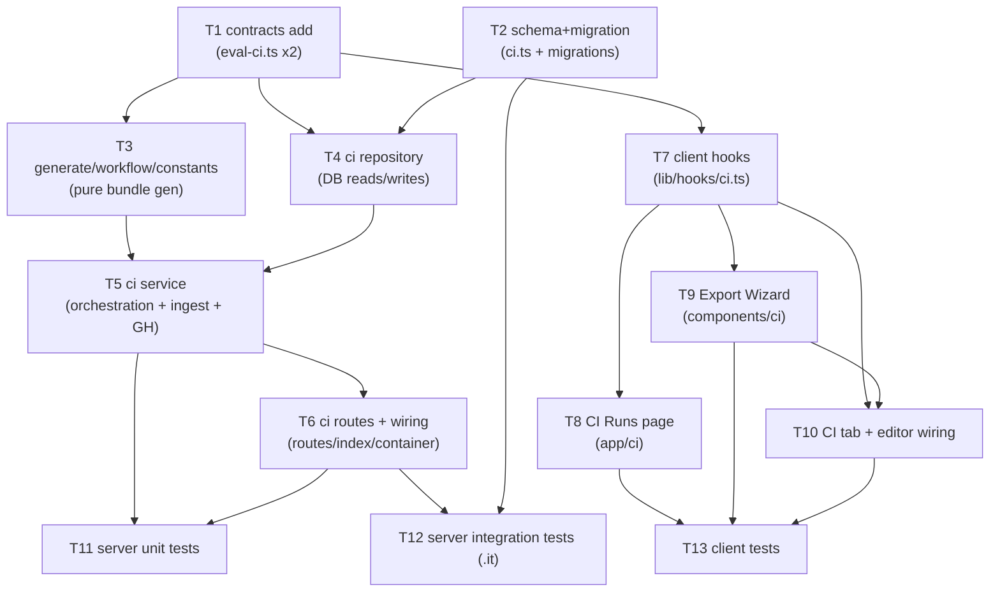

# Implementation Plan: Export to CI

## Overview
Ship "Export to CI": a 4-step Export Wizard, a CI Runs page, and a CI tab on the agent page
that let an agent author publish a configured review agent into a target repository's GitHub
Actions (via a real PR into `devdigest/ci`, with a zip fallback), plus an ingest endpoint that
feeds automatic-review results back into `agent_runs (source='ci')` + `ci_runs`. The exported
bundle (manifest YAML, skill `*.md`, empty `memory.jsonl`, editable workflow yml, bundled
`.devdigest/runner/index.js`) is exactly what the existing `@devdigest/agent-runner` consumes;
both ends share the `AgentManifest` Zod contract. Sourced from `specs/2026-07-14-export-to-ci.md`.

## Execution mode
multi-agent (parallel) — the coordinator explicitly wants a dependency DAG with non-overlapping
`Owned paths` so `run-plan` can dispatch implementers concurrently (server `ci` module vs client
wizard vs client CI-runs page vs tests). The plan front-loads contracts + schema so parallel work
can begin, and keeps concurrent tasks on disjoint files.

## Requirements (verified)
Restated from `specs/2026-07-14-export-to-ci.md` (AC-1..AC-29). Each maps to ≥1 task (traceability
table below).

- R1 (AC-1): "Add to CI" on the agent CI tab opens a 4-step wizard (Target → Preview → Configure →
  Install) initialized with `CiExportInput` defaults (`target=gha`, `action=open_pr`,
  `post_as=github_review`, `triggers=[opened,synchronize,reopened]`, `base=main`).
- R2 (AC-2): Target step shows exactly four `CiTarget` options; `gha` marked recommended.
- R3 (AC-3): Non-`gha` target → read-only workflow placeholder, Install restricted to zip only.
- R4 (AC-4): Preview shows the full bundle: manifest YAML, one `*.md` per linked skill, empty
  `.devdigest/memory.jsonl`, editable `.github/workflows/devdigest-review.yml`.
- R5 (AC-5): The generated manifest validates against the shared `AgentManifest` before render/ship.
- R6 (AC-6): Workflow invokes bundled runner at `.devdigest/runner/index.js` directly, no required
  marketplace `uses:`; any `uses:` shown is an editable placeholder.
- R7 (AC-7): Shipped artifacts are byte-for-byte the previewed artifacts (`CiExport.files`).
- R8 (AC-8): Triggers are a subset of `opened|synchronize|reopened` (`reopened` optional), persisted
  into `CiExportInput.triggers` and reflected in the workflow `pull_request:` types.
- R9 (AC-9): "Post results as" offers `github_review`(recommended)/`pr_comment`/`none` → `post_as`,
  with a hint that only `github_review` yields a merge-blocking verdict.
- R10 (AC-10): "Open a PR" + `target=gha` commits every bundle file atomically to `devdigest/ci`,
  opens a PR against `base`, writes nothing to base, returns `pr_url`.
- R11 (AC-11): A successful export persists a `ci_installations` row and echoes it in `CiExport`.
- R12 (AC-12): Install always offers "Copy files as a zip" from `CiExport.files` (works when
  `pr_url` is null).
- R13 (AC-13): File slug = `slugify(name)` for `.devdigest/agents/<slug>.yaml` and
  `.devdigest/skills/<slug>.md`.
- R14 (AC-14): Slug collisions within one bundle get a short deterministic disambiguator (no
  overwrite).
- R15 (AC-15): CI Runs page lists CI-sourced runs surfaced as `CiRun`, each showing PR number, repo,
  agent, verdict/status, findings count, cost, duration, GitHub Actions link.
- R16 (AC-16): Empty CI-runs state renders explicit empty copy, not an error/blank table.
- R17 (AC-17): Zero grounded findings → `no_findings` status (passing outcome), not failure.
- R18 (AC-18): Agent CI tab lists installations per repo with status + workflow version, where
  "workflow version" = `agents.version` snapshotted onto `ci_installations` at export (D5).
- R19 (AC-19): Agent CI tab shows the agent's CI run history.
- R20 (AC-20): Agent CI tab exposes a "Fail CI on" selector bound to `agents.ci_fail_on`.
- R21 (AC-21): Ingest of valid `CiResultArtifact[]` + context writes one `agent_runs (source='ci')`
  row per artifact and upserts the corresponding `ci_runs` row.
- R22 (AC-22): Invalid ingest payload → 4xx, no write.
- R23 (AC-23): Duplicate ingest (same installation + `pr_number` + agent + `ran_at`) → no duplicate
  run.
- R24 (AC-24): GitHub token obtained via injected `SecretsProvider`; never in a file, response, log,
  or zip.
- R25 (AC-25): Ingest authenticated by the per-installation shared secret issued at export (D4);
  missing/wrong secret → 401/403, no write; writes scoped to the matching installation.
- R26 (AC-26): PR open failure (missing token / API error) → degrade to `files` + `pr_url=null` +
  machine-readable reason, not a 500.
- R27 (AC-27): Skill-less agent → no skill files, manifest `skills` parses to `[]`.
- R28 (AC-28): `repo` not in `owner/name` form → 4xx before any generation.
- R29 (AC-29): Manifest/workflow serialization safely YAML-encodes name/system prompt/skill slugs so
  no field breaks its value context.

Resolved decisions D1–D5 are treated as fixed scope (spec §Resolved design decisions).

## Open questions & recommendations

Carried from the spec's two remaining `[NEEDS CLARIFICATION]` items — **decide during
implementation or defer; do NOT block the plan**:

- Q (installation lifecycle on agent delete): spec assumes the `ci_installations` row is retained.
  → **default: defer** — keep the current DB behavior for this iteration and surface no "stale"
    status. **Plan-time finding (see below):** the actual FK is `ON DELETE cascade`, so deleting an
    agent today *deletes* its installations, contradicting "retained". Recommendation: leave the
    cascade as-is for this iteration (simplest, matches the FK) and note the spec's "retained"
    wording is inaccurate; revisit if product wants a "stale" status (would need `ON DELETE set
    null` + a lifecycle column — a follow-up migration, out of scope now).
- Q (AC-20 `ci_fail_on` drift): does editing `ci_fail_on` in the studio require re-export to take
  effect in CI (manifest is checked-in), and should the tab warn?
  → **default: defer detection** — the selector reads/writes `agents.ci_fail_on` via the existing
    agent-update surface; the CI tab shows a static hint ("changes take effect after re-export").
    No drift computation this iteration.

- Rec (contracts): D4 (return the ingest secret once) has no home in the current `CiExport` shape,
  and there is no ingest request-body schema. This plan **adds** `CiExport.ingest_secret` (nullable)
  and a new `CiIngestInput` schema to `eval-ci.ts` (T1) — an explicit, additive change to the shared
  contract, justified because D3/D4 strictly require them. No existing field is edited.
- Rec (read model): AC-15 says "surfaced as `CiRun`", but `CiRun`'s `repo/pr_number/github_url`
  fields live on `ci_runs`, not `agent_runs`. Recommend the CI-runs read surface be built from
  `ci_runs` (joined to `ci_installations` for repo/target and `agents` for name + workspace scope),
  while ingest still dual-writes `agent_runs (source='ci')` per D3. See Plan-time findings.
- Rec (idempotency + duration): the `ci_runs` table lacks a uniqueness constraint for the AC-23 key
  and lacks a `duration` column for AC-15. Recommend the T2 migration also add a `duration_ms`
  column and a unique index on `ci_runs (ci_installation_id, pr_number, ran_at)` — within worktree B
  scope (only `ci.ts`), not touching `agents`/`skills`. See Plan-time findings.

## Affected modules & contracts
- **`@devdigest/shared` (`server/src/vendor/shared/contracts/eval-ci.ts` + client mirror
  `client/src/vendor/shared/contracts/eval-ci.ts`)** — ADD `CiExport.ingest_secret` (nullable) and a
  new `CiIngestInput` schema (built from the existing `CiResultArtifact`). No existing field edited.
  Both mirror files change together. Called out explicitly (shared-contract change).
- **server** — new module `server/src/modules/ci/` (routes/service/repository/workflow/generate/
  constants/runner-bundle); register in `server/src/modules/index.ts`; add `ciRepo` getter in
  `server/src/platform/container.ts`; schema change + migration in `server/src/db/schema/ci.ts`.
  Reuses the GitHub port (`commitFiles`/`openPullRequest` on the injected `GitHubClient`) and the
  injected `SecretsProvider`. No change to `agents`/`skills` tables, `agent-runner` invariants, or
  reviewer-core.
- **client** — CI tab in the agent editor; Export Wizard modal; CI Runs page; api hooks. Contracts
  imported from the client mirror. i18n via `next-intl`; `client/messages/en/ci.json` already exists
  and is treated as consumed-only (see i18n note under Risks).
- **agent-runner** — **reused, not modified.** Its ncc bundle (`agent-runner/dist/index.js`) is the
  `.devdigest/runner/index.js` payload embedded by the ci service (see Plan-time findings).

## Architecture changes
- New onion module `server/src/modules/ci/` (Presentation → Application → Infrastructure):
  - `routes.ts` (presentation) — Fastify plugin; thin handlers: `getContext` → one service call →
    reply. Zod HTTP shapes via `fastify-type-provider-zod`.
  - `service.ts` (application) — orchestration: build bundle, validate manifest, GitHub PR +
    degradation, persist installation + secret, ingest logic. No SQL, no `new Adapter()`.
  - `repository.ts` (infrastructure) — Drizzle queries + `toDomain` mappers; the only file importing
    `db/schema`.
  - `generate.ts`, `workflow.ts`, `constants.ts`, `runner-bundle.ts` (helpers/infra) — pure bundle
    generation + an injectable runner-bundle locator.
- `container.ts` composition root gains `get ciRepo()` (lazy, mirrors `evalRepo`).
- `modules/index.ts` registry gains `ci: ciModule` (one import + one entry).
- DB: `ci_installations` gains `ingest_secret_hash` + `version`; `ci_runs` gains `duration_ms` + a
  unique index for idempotency. Explicit `db:generate` → `db:migrate` (never auto-run).

## Phased tasks

**Parallelism map (concurrent, non-overlapping owned paths):**
- Wave A: **T1 ∥ T2** (different files entirely).
- Wave B: **T3 ∥ T4** (T3 no DB, T4 DB; disjoint files) — both after their deps.
- Wave C: **T7** (client hooks) can also start as soon as T1 lands, in parallel with server T3–T6.
- Wave D: **T8 ∥ T9** (app/ci vs components/ci) after T7.
- Wave E: **T11 ∥ T12 ∥ T13** (each owns only its test files) after their impl deps.
- T5 (server service), T6 (routes/wiring), and T10 (CI tab, depends on T9) are the serial spine.

---

### Phase 1 — Contracts & schema (foundational; unblock parallel work)

- **T1 — Shared contract additions (CiExport.ingest_secret + CiIngestInput)**
  - **Action:** In `server/src/vendor/shared/contracts/eval-ci.ts` ADD a nullable
    `ingest_secret: z.string().nullable()` field to `CiExport` (returned once at export; null on
    read surfaces). ADD a new `CiIngestInput` schema built FROM the existing `CiResultArtifact` —
    e.g. `{ installation_id: z.string(), pr_number: z.number().int().nullish(), results:
    z.array(CiResultArtifact).min(1) }` — plus `export type`s. Do NOT redefine `CiResultArtifact`.
    Apply the identical change to the client mirror `client/src/vendor/shared/contracts/eval-ci.ts`
    so both stay byte-parallel. The per-installation secret travels in a request header, not the
    body, so `CiIngestInput` carries no secret field.
  - **Module:** server (shared contracts, consumed by client)
  - **Type:** core
  - **Skills to use:** zod
  - **Owned paths:** `server/src/vendor/shared/contracts/eval-ci.ts`,
    `client/src/vendor/shared/contracts/eval-ci.ts`
  - **Depends-on:** none
  - **Risk:** medium (edits an existing shared contract — additive only; both mirrors must match)
  - **Known gotchas:** these two files are hand-mirrored, not generated — they must be edited
    together or the client build drifts. Keep `.default()`/`.nullable()` styling consistent with the
    surrounding file. Export both the schema and the inferred type (project convention).
  - **Acceptance:** `cd server && pnpm typecheck` and `cd client && pnpm typecheck` both pass;
    `CiExport.parse({...withoutIngestSecret})` fails and with `ingest_secret: null` succeeds;
    `CiIngestInput.parse({installation_id, results:[validArtifact]})` succeeds and `results:[]`
    fails. Traces R21, R25.

- **T2 — ci schema columns + migration (ci_installations + ci_runs)**
  - **Action:** In `server/src/db/schema/ci.ts` add to `ci_installations`:
    `ingestSecretHash: text('ingest_secret_hash')` (nullable) and `version: integer('version')`
    (nullable). Add to `ci_runs`: `durationMs: integer('duration_ms')`. Add a unique index on
    `ci_runs (ci_installation_id, pr_number, ran_at)` using `NULLS NOT DISTINCT` (PG15+) so replayed
    ingests collide even when nullable columns are set. Then `cd server && pnpm db:generate` and
    `pnpm db:migrate` to produce the new `src/db/migrations/00XX_*.sql`. Do NOT touch
    `agents`/`skills` tables (D2).
  - **Module:** server
  - **Type:** backend
  - **Skills to use:** drizzle-orm-patterns, postgresql-table-design
  - **Owned paths:** `server/src/db/schema/ci.ts`, `server/src/db/migrations/**` (new files only)
  - **Depends-on:** none
  - **Risk:** medium (migration; requires local Postgres for `db:migrate`)
  - **Known gotchas:** migrations are explicit — never auto-run on boot; always `db:generate` then
    `db:migrate`. Postgres does NOT auto-index the new columns; the unique index doubles as the FK/
    lookup index. `NULLS NOT DISTINCT` is required or nullable `pr_number`/`ran_at` defeat the
    idempotency constraint (each NULL counts distinct). New columns are nullable → no table rewrite.
  - **Acceptance:** `pnpm db:generate` emits one migration adding exactly those columns + index;
    `pnpm db:migrate` applies cleanly; `pnpm typecheck` passes; a second insert of the same
    `(ci_installation_id, pr_number, ran_at)` triple is rejected by the unique index (verified in
    T12). Traces R18, R23, R25, and R15 (duration).

---

### Phase 2 — Server `ci` module

- **T3 — Bundle generation: constants, slugify+manifest, workflow yml**
  - **Action:** Create `server/src/modules/ci/constants.ts` (branch name `devdigest/ci`, bundle
    paths, default commit message/PR title/body, target enum helpers). Create
    `server/src/modules/ci/generate.ts`: `slugify(name)` (deterministic, lowercase, hyphenated →
    AC-13); an in-bundle disambiguator that appends a short deterministic suffix on slug collision
    (AC-14, no overwrite); a manifest builder that maps agent+skills → `AgentManifestInput`, YAML-
    serializes it with the `yaml` package (safe value encoding for `:`, `#`, `-`, newlines → AC-29),
    and validates the emitted YAML by re-parsing with `AgentManifest.parse()` before returning
    (AC-5); assembly of the full `CiFile[]` — `.devdigest/agents/<slug>.yaml`,
    `.devdigest/skills/<slug>.md` per linked skill (omitted when none, `skills: []` → AC-27), empty
    `.devdigest/memory.jsonl` (AC-4). Create `server/src/modules/ci/workflow.ts`: generate an
    editable `.github/workflows/devdigest-review.yml` that runs `node .devdigest/runner/index.js`
    directly (NO required marketplace `uses:`; any `uses:` line is an editable placeholder → AC-6),
    with `pull_request:` types derived from `triggers` (AC-8) and the post mode wired from `post_as`
    (AC-9). All pure functions — no DB, no I/O, no adapter instantiation.
  - **Module:** server
  - **Type:** core
  - **Skills to use:** onion-architecture (helpers/infra placement), zod, security (YAML-injection
    safety)
  - **Owned paths:** `server/src/modules/ci/constants.ts`, `server/src/modules/ci/generate.ts`,
    `server/src/modules/ci/workflow.ts`
  - **Depends-on:** T1
  - **Risk:** medium (YAML safety + manifest parity are correctness-critical)
  - **Known gotchas:** `AgentManifest.skills` normalizes `null`/missing → `[]` — a YAML `skills:`
    with no value parses to `null`, so a skill-less agent must still round-trip to `[]`. Use the
    `yaml` library's default string quoting (already a dependency in agent-runner) rather than manual
    string concatenation, or metacharacters in the system prompt break out of the value (AC-29). The
    runner globs `.devdigest/agents/*.yaml`, so uniqueness of filenames within the bundle is what
    matters (AC-14).
  - **Acceptance:** `cd server && pnpm exec vitest run --exclude '**/*.it.test.ts' ci/` (once T11
    exists) green; unit-level: `AgentManifest.parse(parseYaml(manifestFile.contents))` succeeds for a
    normal agent, a skill-less agent (`skills` → `[]`), and an agent whose name/prompt contain
    `:`/`#`/`-`/newlines (round-trips unchanged); `slugify('Security Reviewer') === 'security-
    reviewer'`; two skills "Auth" and "auth!" produce two distinct filenames; the workflow contains
    `node .devdigest/runner/index.js` and no required `uses:` step. Traces R4, R5, R6, R8, R9, R13,
    R14, R27, R29.

- **T4 — ci repository (Drizzle: installations, runs, ingest writes, reads)**
  - **Action:** Create `server/src/modules/ci/repository.ts` (class `CiRepository` taking `Db`,
    mirroring `EvalRepository`). Methods: `insertInstallation({agentId, repo, targetType,
    ingestSecretHash, version})` → returns `CiInstallation` (AC-11, snapshots agent version → AC-18);
    `getInstallation(id)` (for ingest auth + scoping); `listWorkspaceCiRuns(workspaceId)` → `CiRun[]`
    read from `ci_runs` joined to `ci_installations` (repo/target) + `agents` (name), scoped via
    `agents.workspace_id`, mapping `findings_count===0` → `no_findings` (AC-15, AC-17); with a
    `duration_s` derived from `duration_ms`; `listAgentInstallations(agentId)` → `CiInstallation[]`
    with version snapshot (AC-18); `listAgentCiRuns(agentId)` → `CiRun[]` (AC-19); an ingest writer
    `ingestResults(installation, prNumber, artifacts, workspaceId)` that, per artifact, inserts one
    `agent_runs (source='ci')` row and upserts the `ci_runs` row `ON CONFLICT
    (ci_installation_id, pr_number, ran_at) DO NOTHING/UPDATE` (idempotent → AC-21, AC-23), all in a
    transaction; keep `$inferSelect`/`$inferInsert` inside this file only.
  - **Module:** server
  - **Type:** backend
  - **Skills to use:** drizzle-orm-patterns, onion-architecture (infrastructure), zod (DTO mapping)
  - **Owned paths:** `server/src/modules/ci/repository.ts`
  - **Depends-on:** T1, T2
  - **Risk:** medium
  - **Known gotchas:** neither `ci_installations` nor `ci_runs` has a `workspace_id` — every read
    must scope through `ci_installations.agent_id → agents.workspace_id` (never trust a client
    workspace id). `agent_runs.ran_at` and `ci_runs.ran_at` default `now()`/are nullable; ingest
    must set `ran_at` explicitly from the artifact so the idempotency key is stable across replays.
    `ci_runs` has no `agent` column — derive `CiRun.agent` from the installation's agent name via
    join. Use the DB `no_findings` mapping at read time; do not store a computed status only.
  - **Acceptance:** covered by T12 integration tests — inserting an installation returns a row with
    the version snapshot; `ingestResults` twice for the same triple yields exactly one `ci_runs` row
    and the right count of `agent_runs (source='ci')` rows; `listWorkspaceCiRuns` returns rows scoped
    to the workspace with `no_findings` when `findings_count=0`. `pnpm typecheck` passes. Traces R11,
    R15, R17, R18, R19, R21, R23.

- **T5 — ci service (orchestration, GitHub PR + degradation, ingest, runner bundle)**
  - **Action:** Create `server/src/modules/ci/service.ts` (class `CiService` taking `Container`) and
    `server/src/modules/ci/runner-bundle.ts` (an injectable loader that reads the ncc-built
    `agent-runner/dist/index.js` and returns it as the `.devdigest/runner/index.js` `CiFile`
    (`editable: false`); on absence, throw a clear typed error — tests inject a small placeholder).
    Service methods:
    - `export(agentId, input, ctx)`: validate `repo` is `owner/name` else throw a 4xx-mapped domain
      error BEFORE generating anything (AC-28); load agent + linked skills via `container.agentsRepo`
      / `container.skillsRepo`; call T3 `generate`/`workflow` + the runner-bundle loader to build one
      `CiFile[]` (AC-4, AC-7 — the SAME array is committed/returned); generate a high-entropy ingest
      secret (`crypto.randomBytes`), store only its SHA-256 hash on the installation and return the
      plaintext once in `CiExport.ingest_secret` (D4, AC-25) — never log it (AC-24); when
      `target=gha && action=open_pr`: obtain the GitHub client via `await container.github()`
      (throws `ConfigError` when no token → catch), `commitFiles(repo, {branch:'devdigest/ci', base,
      message, files})` then `openPullRequest(repo, {title, head:'devdigest/ci', base, body})`,
      populate `pr_url` (AC-10); on missing token / API error, DEGRADE: `pr_url=null` + a machine-
      readable reason, never a 500 (AC-26); persist the installation via `container.ciRepo`
      (AC-11, AC-18) and return `CiExport`.
    - `ingest(installationId, prNumber, artifacts, providedSecret, ctx)`: look up the installation,
      constant-time compare SHA-256(providedSecret) to `ingest_secret_hash`; mismatch/missing →
      typed auth error (401/403, no write, AC-25); Zod-validated `CiIngestInput` already guarantees
      the array shape (AC-22); scope + delegate to `repository.ingestResults` (AC-21, AC-23).
    Never read `process.env` here — secrets only via the injected providers.
  - **Module:** server
  - **Type:** backend
  - **Skills to use:** onion-architecture (application layer), security (secret handling, no leak),
    zod
  - **Owned paths:** `server/src/modules/ci/service.ts`, `server/src/modules/ci/runner-bundle.ts`
  - **Depends-on:** T3, T4 (and T1)
  - **Risk:** high (secrets, GitHub side-effects, degradation, external bundle dependency)
  - **Known gotchas:** `container.github()` throws `ConfigError` when `GITHUB_TOKEN` is unset — the
    degradation path (AC-26) must catch that specific throw AND generic API errors. The generated
    ingest secret is high-entropy random, so SHA-256 (node `crypto`) is acceptable and fast; do NOT
    route it through `SecretsProvider` (that's for external API keys) and do NOT log it (redact).
    Preview==ship parity (AC-7) is guaranteed only if the exact `CiFile[]` used for `commitFiles` is
    the same array returned in the response — build once, reuse. The runner bundle is multi-MB and
    gitignored; the loader must be injectable so hermetic unit tests use a stub, not a real build.
  - **Acceptance:** covered by T11 (hermetic, `MockGitHubClient`) + T12 (integration). Hermetic:
    export with an injected `MockGitHubClient` records exactly one `commitFiles` to `devdigest/ci`
    and one `openPullRequest`, base untouched, `pr_url` populated (AC-10); export with no GitHub
    override + no token returns `files` + `pr_url=null` + reason (AC-26); no token substring appears
    in `files`/response (AC-24); `repo="foo"` throws before generation (AC-28). `pnpm typecheck`
    passes. Traces R5, R7, R10, R11, R12(zip data), R22, R24, R25, R26, R28.

- **T6 — ci routes + module registration + container wiring**
  - **Action:** Create `server/src/modules/ci/routes.ts` (default Fastify plugin, `ZodTypeProvider`)
    exposing: `POST /agents/:id/export-ci` (body `CiExportInputBody` → `CiExport`); a workspace CI
    runs read surface `GET /ci/runs` → `CiRun[]` (feeds CI Runs page, AC-15); agent CI-tab reads
    `GET /agents/:id/ci/installations` → `CiInstallation[]` (AC-18) and `GET /agents/:id/ci/runs` →
    `CiRun[]` (AC-19); the ingest write surface `POST /ci/ingest` (body `CiIngestInput`, the per-
    installation secret read from a request header, e.g. `x-devdigest-ingest-secret`) → echoes
    created/matched run(s) (AC-21/22/23/25). Every handler resolves tenancy via `getContext` FIRST,
    then makes exactly one `CiService` call, then replies (thin routes). Register the module: add one
    import + `ci: ciModule` entry in `server/src/modules/index.ts`. Add `get ciRepo(): CiRepository`
    (lazy, mirroring `evalRepo`) in `server/src/platform/container.ts`. Note: AC-20 "Fail CI on"
    reuses the EXISTING agent update surface (`agents.ci_fail_on`) — no new route here; verify the
    agents PATCH accepts `ci_fail_on` and flag if not (see Risks).
  - **Module:** server
  - **Type:** backend
  - **Skills to use:** fastify-best-practices, onion-architecture (presentation), zod, security
    (ingest auth at the boundary)
  - **Owned paths:** `server/src/modules/ci/routes.ts`, `server/src/modules/index.ts`,
    `server/src/platform/container.ts`
  - **Depends-on:** T5 (and T4 via container)
  - **Risk:** medium
  - **Known gotchas:** `modules/index.ts` and `container.ts` are shared files — only T6 touches them,
    so no concurrent overlap. Ingest is the one endpoint whose auth is NOT `getContext` (CI runner
    has no session) — it authenticates by the per-installation header secret and derives the
    workspace from the installation server-side. Keep the secret out of route logs. Return typed
    errors so the global error handler maps 4xx/401/403 correctly.
  - **Acceptance:** `cd server && pnpm typecheck` passes; `pnpm exec vitest run --exclude
    '**/*.it.test.ts'` (T11) exercises the routes via Fastify `inject`; ingest with wrong/absent
    header → 401/403 no write; malformed body → 4xx. Traces R1(surface), R15, R18, R19, R21, R22,
    R25, R28.

---

### Phase 3 — Client (CI tab, Wizard, CI Runs page)

- **T7 — Client api hooks for CI**
  - **Action:** Create `client/src/lib/hooks/ci.ts` with TanStack Query hooks over `apiFetch`
    (`client/src/lib/api.ts`, unchanged): `useCiRuns()` (`GET /ci/runs`), `useAgentInstallations(agentId)`
    (`GET /agents/:id/ci/installations`), `useAgentCiRuns(agentId)` (`GET /agents/:id/ci/runs`), and
    `useExportCi(agentId)` mutation (`POST /agents/:id/export-ci`, body `CiExportInputBody`, returns
    `CiExport`). Follow the query-key pattern used by `client/src/lib/hooks/eval.ts`; import types
    from the client mirror `@/vendor/shared/contracts/eval-ci`. Invalidate the runs/installations
    keys on successful export. (No ingest hook — ingest is CI-runner-facing, out of the web app.)
  - **Module:** client
  - **Type:** ui
  - **Skills to use:** react-best-practices (data fetching in hooks), frontend-architecture
    (business-logic layer)
  - **Owned paths:** `client/src/lib/hooks/ci.ts`
  - **Depends-on:** T1
  - **Risk:** low
  - **Known gotchas:** `apiFetch` only sets `content-type: application/json` when a body is present;
    the export POST always sends a JSON body so that's fine. Mirror the existing hooks' query-key
    shape so cache invalidation composes with the rest of the app. `eval`/`trace` hooks are imported
    directly (not via a barrel) — do the same; do not edit `client/src/lib/hooks/index.ts` unless the
    existing convention requires it (avoids a shared-file edit).
  - **Acceptance:** `cd client && pnpm typecheck` passes; hooks return typed `CiRun[]` /
    `CiInstallation[]` / `CiExport`; consumed by T8/T9/T10. Traces R1, R15, R18, R19.

- **T8 — CI Runs page**
  - **Action:** Create `client/src/app/ci/page.tsx` (thin route entry, mirroring
    `client/src/app/eval/page.tsx`) rendering `client/src/app/ci/_components/CiRunsView.tsx`. The
    view uses `useCiRuns()` and renders a table with the eight fields per row — PR number, repo,
    agent, verdict/status, findings count, cost, duration, and a link to `github_url` (AC-15); a
    non-color status indicator (icon/label, WCAG) for `no_findings` vs failed/succeeded/running
    (AC-17); an explicit empty state on `[]` (AC-16); and an error state on query failure. Strings
    via `useTranslations("ci")` (consume existing keys in `client/messages/en/ci.json`).
  - **Module:** client
  - **Type:** ui
  - **Skills to use:** next-best-practices (RSC/`"use client"` boundary), react-best-practices
    (list states, keys, conditional rendering), frontend-architecture
  - **Owned paths:** `client/src/app/ci/page.tsx`, `client/src/app/ci/_components/CiRunsView.tsx`
  - **Depends-on:** T7
  - **Risk:** low
  - **Known gotchas:** the view is a data-fetching client component → `"use client"`; keep the route
    `page.tsx` thin (server component) and push `"use client"` into the view. Use a stable row key
    (`CiRun.id`), never the array index. Guard `cost`/`duration` nulls (render "—"). Non-color status
    per the a11y non-functional requirement.
  - **Acceptance:** `cd client && pnpm test` (T13) green for list/empty/error; `pnpm typecheck`
    passes. Traces R15, R16, R17.

- **T9 — Export Wizard modal (4 steps)**
  - **Action:** Create `client/src/components/ci/ExportWizard/` (index + `ExportWizard.tsx` + step
    components), composing the shared `Modal` from `@devdigest/ui` (as `client/src/components/eval/
    CompareRunsModal.tsx` does). Four ordered steps with focus moved on transition + keyboard-
    navigable controls (a11y):
    - Target: exactly four `CiTarget` options, `gha` marked recommended (AC-2); selecting non-`gha`
      flips Preview to read-only and Install to zip-only (AC-3).
    - Preview: render the bundle (manifest YAML, one body per skill, empty `memory.jsonl`, editable
      workflow) from a preview computed client-side or returned by the export dry path (AC-4); the
      workflow editor is editable for `gha`, read-only otherwise (AC-3, AC-6 placeholder note).
    - Configure: trigger toggles (`opened`/`synchronize`/`reopened`, `reopened` optional) → `triggers`
      (AC-8); "Post results as" selector (`github_review` recommended / `pr_comment` / `none`) →
      `post_as` with the merge-blocking hint text (AC-9).
    - Install: "Open a PR" (calls `useExportCi`, shows resulting `pr_url`; surfaces the one-time
      `ingest_secret` to copy) for `gha`; "Copy files as a zip" always available, assembled from
      `CiExport.files` (works when `pr_url` null) (AC-10 trigger, AC-12). Initialize wizard state
      with the `CiExportInput` defaults (AC-1). Strings via `useTranslations("ci")`.
  - **Module:** client
  - **Type:** ui
  - **Skills to use:** next-best-practices, react-best-practices (component splitting, state
    colocation, a11y/focus, no render factories), frontend-architecture
  - **Owned paths:** `client/src/components/ci/**`
  - **Depends-on:** T7
  - **Risk:** medium (multi-step state + a11y)
  - **Known gotchas:** keep each step a real PascalCase component (`<TargetStep/>`), never a
    `renderStep()` factory (breaks reconciliation/focus). Wizard step state is local UI state
    (`useReducer` for the multi-field form), not URL/global. Zip assembly is client-side from
    `CiExport.files`; the one-time `ingest_secret` must be shown once and never persisted. Reuse
    `@devdigest/ui` `Modal`/`Button` rather than rebuilding.
  - **Acceptance:** T13 tests cover: four targets with `gha` recommended (AC-2); non-`gha` → workflow
    read-only + no open-PR (AC-3); toggling `reopened` changes the generated workflow types (AC-8);
    three post-as options + merge-blocking hint (AC-9); zip present even with null `pr_url` (AC-12);
    wizard opens with defaults (AC-1). `pnpm typecheck` passes. Traces R1, R2, R3, R4, R6, R8, R9,
    R10, R12.

- **T10 — CI tab + agent-editor wiring**
  - **Action:** Create `client/src/app/agents/[id]/_components/AgentEditor/_components/CiTab/CiTab.tsx`
    (+ folder index) that: lists installations per repo with status + snapshotted version via
    `useAgentInstallations` (AC-18); shows the agent's CI run history via `useAgentCiRuns` (AC-19);
    renders a "Fail CI on" selector bound to `agents.ci_fail_on` using the EXISTING agent-update hook
    (as `ConfigTab` does) with a static "changes take effect after re-export" hint (AC-20); and an
    "Add to CI" button that opens the T9 `ExportWizard` (AC-1). Wire the tab in: add
    `{ key: "ci", labelKey: "editor.tabs.ci", icon: <IconName> }` to
    `client/src/app/agents/[id]/_components/AgentEditor/constants.ts` TABS; add `"ci"` to
    `VALID_TABS` in `client/src/app/agents/[id]/page.tsx`; add the import + `{tab === "ci" && <CiTab
    agentId={agent.id} agentName={agent.name} />}` branch in
    `client/src/app/agents/[id]/_components/AgentEditor/AgentEditor.tsx`. Add the one new i18n key
    `editor.tabs.ci` to `client/messages/en/agents.json`.
  - **Module:** client
  - **Type:** ui
  - **Skills to use:** next-best-practices, react-best-practices, frontend-architecture
  - **Owned paths:** `client/src/app/agents/[id]/_components/AgentEditor/_components/CiTab/**`,
    `client/src/app/agents/[id]/_components/AgentEditor/constants.ts`,
    `client/src/app/agents/[id]/_components/AgentEditor/AgentEditor.tsx`,
    `client/src/app/agents/[id]/page.tsx`, `client/messages/en/agents.json`
  - **Depends-on:** T7, T9
  - **Risk:** medium (touches shared editor files — but no other task owns them, so no concurrency
    conflict)
  - **Known gotchas:** `labelKey` resolves under the `agents` namespace (`editor.tabs.*`) — the new
    key goes in `agents.json`, not `ci.json`. Pick a valid `IconName` from `@devdigest/ui`. AC-20
    depends on the existing agent-update surface accepting `ci_fail_on`; if it does not, that is a
    server gap outside this module (see Risks) — flag rather than editing the agents module.
  - **Acceptance:** T13 tests: installations render one row each with repo+status+version (AC-18); CI
    runs render (AC-19); the selector reflects/updates `ci_fail_on` (AC-20); "Add to CI" opens the
    wizard (AC-1). `pnpm typecheck` passes; the `ci` tab is reachable at `/agents/:id?tab=ci`. Traces
    R1, R18, R19, R20.

---

### Phase 4 — Tests

- **T11 — Server hermetic unit tests (ci module)**
  - **Action:** Create colocated `*.test.ts` under `server/src/modules/ci/` covering generation +
    export via injected `MockGitHubClient` and a stub runner-bundle loader: manifest validates
    against `AgentManifest` (AC-5); preview==ship byte parity (AC-7); slug (AC-13) + disambiguator
    (AC-14); YAML metacharacter round-trip (AC-29); skill-less bundle → `skills:[]`, no skill files
    (AC-27); workflow runs the bundled runner, no required `uses:` (AC-6); triggers → workflow types
    (AC-8); post_as mapping (AC-9); open-PR records one `commitFiles(devdigest/ci)` + one
    `openPullRequest`, base untouched, `pr_url` set (AC-10); degradation with no token → files +
    `pr_url=null` + reason (AC-26); no token substring in files/response (AC-24); `repo="foo"` → 4xx
    before generation (AC-28); malformed ingest body → 4xx no write (AC-22); ingest wrong/absent
    secret → 401/403 no write (AC-25, via route `inject`).
  - **Module:** server
  - **Type:** backend (test)
  - **Skills to use:** test-writer, fastify-best-practices (inject), zod
  - **Owned paths:** `server/src/modules/ci/*.test.ts`
  - **Depends-on:** T5, T6
  - **Known gotchas:** these must stay hermetic — inject `MockGitHubClient` via `ContainerOverrides.
    github` and a placeholder runner bundle; never hit the network or require a real ncc build.
    Filenames must NOT collide with the `.it.test.ts` suffix or they'd run in the integration lane.
  - **Acceptance:** `cd server && pnpm exec vitest run --exclude '**/*.it.test.ts' ci/` all green.
    Traces R5, R6, R7, R8, R9, R10, R13, R14, R22, R24, R25, R26, R27, R28, R29.

- **T12 — Server integration tests (ci module, real Postgres)**
  - **Action:** Create `server/src/modules/ci/*.it.test.ts` (testcontainers Postgres): ingest writes
    one `agent_runs (source='ci')` per artifact + upserts `ci_runs`, both visible via the read
    surfaces (AC-21); duplicate ingest of the same `(installation, pr_number, ran_at)` → exactly one
    `ci_runs` row (AC-23); ingest auth accepts only the matching per-installation secret and scopes
    the write (AC-25); export persists a `ci_installations` row with the version snapshot, echoed in
    `CiExport` (AC-11, AC-18); CI-runs read surface returns workspace-scoped rows with `no_findings`
    when `findings_count=0` and an empty list for a fresh workspace (AC-15, AC-16, AC-17).
  - **Module:** server
  - **Type:** backend (integration test)
  - **Skills to use:** test-writer, drizzle-orm-patterns
  - **Owned paths:** `server/src/modules/ci/*.it.test.ts`
  - **Depends-on:** T6, T2
  - **Known gotchas:** `.it.test.ts` suffix routes these to the integration lane (real Postgres);
    apply migrations first. The idempotency assertion depends on the T2 `NULLS NOT DISTINCT` unique
    index — set `ran_at`/`pr_number` explicitly. Scope every assertion by workspace to prove tenancy.
  - **Acceptance:** `cd server && pnpm exec vitest run .it.test` (ci suites) all green. Traces R11,
    R15, R16, R17, R18, R21, R23, R25.

- **T13 — Client tests (CI Runs view, Wizard, CI tab)**
  - **Action:** Colocated `*.test.tsx` for `CiRunsView` (list/empty/error → AC-15/16/17),
    `ExportWizard` (targets + recommended, non-`gha` read-only + zip-only, triggers, post_as + hint,
    zip with null pr_url, defaults → AC-1/2/3/8/9/12), and `CiTab` (installations, runs, Fail-CI-on
    selector, opens wizard → AC-1/18/19/20). Mock at the hook/api boundary per the project's client
    test convention (vitest + jsdom).
  - **Module:** client
  - **Type:** ui (test)
  - **Skills to use:** react-testing-library, test-writer
  - **Owned paths:** `client/src/app/ci/_components/CiRunsView.test.tsx`,
    `client/src/components/ci/ExportWizard/*.test.tsx`,
    `client/src/app/agents/[id]/_components/AgentEditor/_components/CiTab/CiTab.test.tsx`
  - **Depends-on:** T8, T9, T10
  - **Known gotchas:** query by role/label/text, not testid; use `userEvent`; wrap in the app's
    QueryClient/i18n providers as the existing eval component tests do. Do not assert on internal
    state — assert on what the user sees (empty copy, read-only workflow, hint text).
  - **Acceptance:** `cd client && pnpm test` green for all three suites. Traces R1, R2, R3, R8, R9,
    R12, R15, R16, R17, R18, R19, R20.

---

## AC → task traceability

| AC | Requirement (short) | Tasks | Covered |
|----|---------------------|-------|---------|
| AC-1 | Wizard opens with defaults | T9, T10 | ✅ |
| AC-2 | Four targets, gha recommended | T9, T13 | ✅ |
| AC-3 | Non-gha read-only + zip only | T9, T13 | ✅ |
| AC-4 | Preview shows full bundle | T3, T9 | ✅ |
| AC-5 | Manifest validates AgentManifest | T3, T11 | ✅ |
| AC-6 | Workflow runs bundled runner, uses editable | T3, T11 | ✅ |
| AC-7 | Byte parity preview==ship | T5, T11 | ✅ |
| AC-8 | Triggers subset → workflow types | T3, T9, T13 | ✅ |
| AC-9 | Post-as selector + hint | T3, T9, T13 | ✅ |
| AC-10 | Open PR to devdigest/ci, base untouched, pr_url | T5, T11 | ✅ |
| AC-11 | Persist ci_installations, echo | T4, T5, T12 | ✅ |
| AC-12 | Zip always available | T9, T13 | ✅ |
| AC-13 | Slug = slugify(name) | T3, T11 | ✅ |
| AC-14 | Collision disambiguator | T3, T11 | ✅ |
| AC-15 | CI Runs list (8 fields + link) | T4, T6, T8, T12, T13 | ✅ |
| AC-16 | Empty state | T8, T12, T13 | ✅ |
| AC-17 | no_findings status | T4, T8, T12, T13 | ✅ |
| AC-18 | Installations + version snapshot | T2, T4, T10, T12 | ✅ |
| AC-19 | Agent CI run history | T4, T6, T10, T13 | ✅ |
| AC-20 | Fail-CI-on selector (existing agent update) | T10, T13 | ✅ (see risk) |
| AC-21 | Ingest writes agent_runs(ci) + upsert ci_runs | T4, T5, T6, T12 | ✅ |
| AC-22 | Invalid ingest → 4xx, no write | T5, T6, T11 | ✅ |
| AC-23 | Idempotent ingest | T2, T4, T12 | ✅ |
| AC-24 | Token via SecretsProvider, never emitted | T5, T11 | ✅ |
| AC-25 | Per-installation secret auth | T1, T2, T5, T6, T12 | ✅ |
| AC-26 | Degrade on PR failure | T5, T11 | ✅ |
| AC-27 | No skills → skills=[], no files | T3, T11 | ✅ |
| AC-28 | repo not owner/name → 4xx pre-gen | T5, T6, T11 | ✅ |
| AC-29 | YAML-safe encode | T3, T11 | ✅ |

All 29 ACs map to ≥1 task. **No AC is left uncovered.** AC-20 is covered on the client but assumes
the existing agents PATCH accepts `ci_fail_on` (flagged in Risks).

## Testing strategy
- **Hermetic unit (server):** `cd server && pnpm exec vitest run --exclude '**/*.it.test.ts'` — T11:
  bundle generation, manifest parity, slug/disambiguator, YAML safety, export/PR via
  `MockGitHubClient`, degradation, secret non-leak, repo validation, ingest validation/auth via
  Fastify `inject`. ACs 5,6,7,8,9,10,13,14,22,24,25,26,27,28,29.
- **Integration (server, real Postgres):** `cd server && pnpm exec vitest run .it.test` — T12: ingest
  dual-write, idempotency, auth scoping, installation persistence + version snapshot, workspace-
  scoped reads, empty state, no_findings. ACs 11,15,16,17,18,21,23,25.
- **Client (vitest + jsdom):** `cd client && pnpm test` — T13: CI Runs view, Export Wizard, CI tab.
  ACs 1,2,3,8,9,12,15,16,17,18,19,20.
- **Typecheck gates:** `cd server && pnpm typecheck`, `cd client && pnpm typecheck` on every task.
- **e2e (agent-browser):** none required this iteration. Per D1, PR creation is tested at the port
  (`MockGitHubClient`), not the network, and the wizard/pages are hermetically testable via RTL. An
  optional smoke flow for the wizard is **deferred** (note: agent-browser `wait --text` fails on
  literal backticks — avoid backtick assertions if one is added later).

## Risks & mitigations
- **Runner bundle is gitignored + must be built.** `agent-runner/dist/index.js` (ncc build) is the
  `.devdigest/runner/index.js` payload. → T5's `runner-bundle.ts` is an injectable loader; hermetic
  tests inject a placeholder; real export requires `cd agent-runner && pnpm build` first (or via
  `scripts/dev.sh`). Add a clear typed error when the bundle is absent. Document this dev prerequisite.
- **Shared-contract edit (T1) ripples to client.** → additive only (`ingest_secret` nullable, new
  `CiIngestInput`); both mirror files edited in the same task; typecheck both packages.
- **`ci_installations` FK is `ON DELETE cascade`, contradicting the spec's "installation retained".**
  → default: keep cascade this iteration; documented as an open question. Any change to retention is
  a separate migration (out of scope).
- **AC-20 depends on the existing agents update surface accepting `ci_fail_on`.** → T10 verifies;
  if the agents PATCH does not accept `ci_fail_on`, that is a small server gap in the `agents`
  module (outside worktree B's `ci` scope) — flag to the coordinator rather than editing agents.
- **i18n `ci.json` concurrency.** `client/messages/en/ci.json` already exists and is pre-populated;
  T8/T9 consume it read-only. If a task finds a missing key, it must raise a blocker rather than
  have two concurrent tasks edit the shared JSON. The only new key (`editor.tabs.ci`) lives in
  `agents.json` and is owned solely by T10.
- **AC-15 read-model wording ("agent_runs.source='ci' surfaced as CiRun").** Implemented by reading
  `ci_runs` (which carries repo/pr/github_url) with the dual-write to `agent_runs` per D3; called out
  in Plan-time findings so an implementer doesn't try to reconstruct `CiRun` from `agent_runs` alone.

## Plan-time findings
1. **Contract gap for D4:** `CiExport` has no field for the one-time ingest secret and there is no
   ingest request-body schema. Resolved by T1 adding `CiExport.ingest_secret` (nullable) + a new
   `CiIngestInput` (additive, explicitly called out).
2. **`ci_runs` lacks a duration column and an idempotency constraint:** AC-15 needs a duration and
   AC-23 needs a stable conflict target. Resolved by T2 adding `duration_ms` + a unique index on
   `(ci_installation_id, pr_number, ran_at)` with `NULLS NOT DISTINCT` — within `ci.ts` (worktree B),
   not touching `agents`/`skills`.
3. **No `workspace_id` on `ci_installations`/`ci_runs`:** all CI reads must scope through
   `agent_id → agents.workspace_id`. Baked into T4.
4. **`ci_installations.agent_id` FK is `ON DELETE cascade`** — contradicts the spec's "installation
   retained" assumption for agent deletion. Left as-is this iteration; recorded as an open question.
5. **Read-model tension in AC-15** (agent_runs vs ci_runs): the plan reads from `ci_runs` and
   dual-writes `agent_runs (source='ci')` on ingest (D3), reconciling AC-15 with the `CiRun` shape.
6. **Runner bundle dependency:** the export embeds the ncc-built, gitignored `agent-runner/dist/
   index.js`; T5 uses an injectable loader so unit tests stay hermetic and real export documents the
   `agent-runner` build prerequisite.

## Red-flags check
- [x] Every requirement maps to a task (all 29 ACs; none uncovered)
- [x] No specification was authored or edited — the spec is input; this plan restates & verifies it
- [x] Execution mode recorded (multi-agent) and the plan is shaped for it (phases, DAG, waves)
- [x] Dependencies form a DAG (no cycles) — see the flowchart
- [x] (multi-agent) Concurrent tasks have non-overlapping Owned paths (T1∥T2, T3∥T4, T8∥T9,
      T11∥T12∥T13; shared files `modules/index.ts`/`container.ts` only in T6; editor files only in T10)
- [x] Every Acceptance is measurable (named commands, test assertions, observable behaviors)
- [x] No edits to existing shared contracts without an explicit callout (T1 is additive + flagged)
