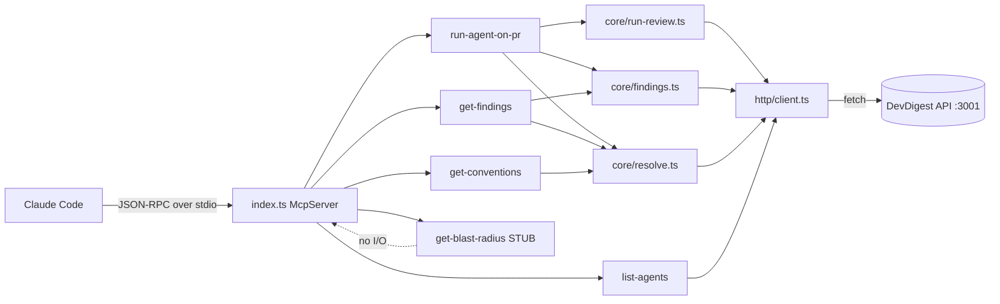

# Development Plan: Local stdio MCP Server (`mcp-server/`)

## Overview

Build a NEW top-level package `mcp-server/` — a local **stdio** MCP server that exposes
exactly **5 tools** to Claude Code. The server is a **thin HTTP client** over the existing
DevDigest API at `http://localhost:3001` (started via `./scripts/dev.sh`); it holds no business
logic of its own. It uses the official `@modelcontextprotocol/sdk` (v1.x stable) + Zod, runs on
`tsx`, and reuses the project's Zod contracts via the `@devdigest/shared` path alias. This is a
teaching-lab deliverable (branch `lesson-4-lab/mcp-start`).

### Locked architectural decisions (do NOT re-open)

- **HTTP-wrap**, NOT in-process `Container` import. The MCP server talks to `localhost:3001` over
  HTTP; it never imports `server/src/platform/container.ts` or touches the DB.
- **New top-level package** `mcp-server/` (not a workspace; TypeScript path alias only, matching the
  repo's non-monorepo convention).
- **stdio transport**; logs go to **stderr only** (stdout is the JSON-RPC channel — writing to it
  corrupts the protocol).
- `run_agent_on_pr` **blocks** with a ~120s limit and ~2s poll interval, returning a
  `{ status: "running", run_id }` fallback on timeout.
- The MCP client passes **no auth and no workspace** — `LocalNoAuthProvider` resolves the default
  workspace server-side.

## Requirements

- R1: A runnable stdio MCP server under `mcp-server/` using `@modelcontextprotocol/sdk` v1.x + Zod,
  launched with `tsx`, that registers exactly 5 tools and writes nothing to stdout.
- R2: Tools are namespaced `devdigest_*`, snake_case, each with a per-field `.describe()` Zod input
  schema and explicit `annotations`.
- R3: `devdigest_list_agents` — lists configured reviewer agents (id, name, enabled, model) from
  `GET /agents`.
- R4: `devdigest_run_agent_on_pr` — "result, not operation": flat args `repo, pr, agent`; internally
  resolves ids, triggers `POST /pulls/:id/review`, blocks while polling run status (~2s, ≤120s),
  and returns concise `{ verdict, findings[] }`; on timeout returns `{ status: "running", run_id }`.
- R5: `devdigest_get_findings` — concise verdict + findings for a completed run, with
  `response_format: "concise" | "detailed"` and summary-first pagination for large finding sets.
- R6: `devdigest_get_conventions` — repo conventions via `GET /repos/:repoId/conventions` from a flat
  `repo` arg (name resolved to repoId).
- R7: `devdigest_get_blast_radius` — STUB that NEVER throws; returns a well-formed
  `{ status: "not_implemented", message: "…" }` and a description telling the agent not to rely on it.
- R8: A concrete **id-resolution strategy** (repo name → repoId, (repo, pr#) → pull id) using only
  existing list endpoints, since no direct lookup exists.
- R9: Two-tier error handling — Zod for protocol-level arg validation; business failures returned as
  tool results with `isError: true` + forward-leading recovery guidance. Empty result is NOT an error.
- R10: Project-scoped registration via root `.mcp.json` (command `npx tsx mcp-server/src/index.ts`),
  including `MCP_TOOL_TIMEOUT` so the blocking tool doesn't hit the client tool timeout.
  Config/base URL via env, never hardcoded secrets.
- R11: A `mcp-server/README.md` documenting setup, the 5 tools, and verification with MCP Inspector
  and inside Claude Code.

## Affected modules & contracts

- **`mcp-server/` (NEW package)** — all new code. The single package this plan creates.
- **Root `.mcp.json` (NEW)** — project-scoped MCP registration.
- **Contracts:** **none added, none edited.** The MCP server **consumes** existing
  `@devdigest/shared` Zod contracts read-only: `Agent`, `ConventionCandidate` (knowledge.ts);
  `ReviewRecord`, `FindingRecord` (review-api.ts); `RunSummary`, `RunTrace` (trace.ts);
  `Severity`, `Verdict`, `Finding` (findings.ts); `Repo` (platform.ts). Reuse these via the alias
  rather than redefining shapes. No server, client, reviewer-core, or shared files are modified.

## Architecture changes

This package follows a thin onion-aligned split (transport → application/orchestration → infrastructure/I/O),
matching the project's onion discipline, but it is its own package with no Fastify/Drizzle.
**Validated against the `onion-architecture` skill:** dependencies point inward only
(`index → tools → core → http/client`), the tool handlers stay thin (presentation), all multi-step
workflows live in the application layer (`src/core/`), all I/O lives at the edge (`src/http/client.ts`),
and there is one composition root (`index.ts`). The domain is borrowed read-only from
`@devdigest/shared` and knows nothing about MCP.

**Layer map:**

- **Presentation / transport** — `mcp-server/src/index.ts` (entrypoint: build `McpServer`, register all 5
  tools, connect `StdioServerTransport`; composition root) + `mcp-server/src/tools/*.ts` (one file per
  tool: `list-agents.ts`, `run-agent-on-pr.ts`, `get-findings.ts`, `get-conventions.ts`,
  `get-blast-radius.ts`). Each tool is **thin** — Zod-validate → call ONE application/core function (or
  `client` for trivial reads) → shape the reply via `format`. Each exports a registration function
  `(server, deps) => void`.
- **Application / orchestration** — `mcp-server/src/core/`:
  - `run-review.ts` — `runReviewAndWait(client, { pullId, agentId }, opts)`: triggers the review, runs the
    polling loop (~2s, ≤120s), returns `{ verdict, score, findings } | { status: "running", run_id }`.
  - `findings.ts` — `pickReview(reviews, { runId? })` + `shapeFindings(...)`: the shared ReviewRecord
    selection + concise/detailed/pagination logic, reused by BOTH `get_findings` and `run_agent_on_pr`.
  - `resolve.ts` — id-resolution helpers (repo name → repoId, (repo,pr#) → pull id), built on `client`.
  These functions take `client` as a parameter (dependency injection) and contain NO MCP/transport code.
- **Infrastructure / I/O** — `mcp-server/src/http/client.ts` — the thin HTTP client over `localhost:3001`.
  The ONLY place that performs `fetch`.
- **Shared / cross-cutting** (pure, no I/O) — `mcp-server/src/format.ts` (`toolOk`/`toolError`
  + `compact*` shapers enforcing concise-response + `isError` conventions), `mcp-server/src/config.ts`
  (env: `DEVDIGEST_API_URL`, timeouts; no secrets), `mcp-server/src/log.ts` (stderr-only logger).

## Id-resolution strategy (the OPEN ISSUE — spelled out)

**Problem:** flat args are `repo` (name/slug) and `pr` (PR number), but the review/conventions
endpoints take internal ids (`/pulls/:id`, `/repos/:repoId`). **No direct lookup-by-name or
lookup-by-number endpoint exists** (verified: `repos/routes.ts` only has `GET /repos` list +
`/repos/:id`; `pulls/routes.ts` only has `GET /repos/:id/pulls` list + `GET /pulls/:id`).

**Resolution path (list-then-match), implemented in `src/core/resolve.ts`:**

1. **repo name → repoId** — `GET /repos` returns `Repo[]` (fields `id`, `owner`, `name`,
   `full_name`). Match the flat `repo` arg case-insensitively against, in order:
   `full_name` (`owner/name`), then `name`, then `${owner}/${name}`. If exactly one matches → use
   its `id`. If none match → business error listing available repo `full_name`s. If multiple match
   (ambiguous bare name across owners) → business error asking the agent to pass `owner/name`.
2. **(repo, pr#) → pull id** — with the resolved `repoId`, `GET /repos/:repoId/pulls` returns
   `PrMeta[]` (each has `id` and `number`). Match `number === pr`. If found → use `id`. If not
   found → business error listing a few open PR numbers from that repo (forward-leading).

These two helpers (in the application layer, `src/core/resolve.ts`) are shared by `run_agent_on_pr`,
`get_findings` (when called with `repo`+`pr`), and `get_conventions`. **Risk:** two list calls per tool
invocation (acceptable for a local dev tool; lists are small). Flagged under Risks.

No auth/workspace headers are sent — `LocalNoAuthProvider` resolves the default workspace server-side.

## Tools reference table

| Tool (namespaced) | Flat args | Returns (concise shape) | Annotations | Backing endpoint(s) |
|---|---|---|---|---|
| `devdigest_list_agents` | _(none)_ | `{ agents: [{ id, name, enabled, model }] }` | readOnly ✔, destructive ✘, idempotent ✔, openWorld ✔ | `GET /agents` |
| `devdigest_run_agent_on_pr` | `repo: string`, `pr: number`, `agent: string` | completed: `{ verdict, score, findings: [{ severity, title, file, line, rationale }] }`; timeout: `{ status: "running", run_id, message }` | readOnly ✘, destructive ✘, idempotent ✘, openWorld ✔ | `GET /repos`, `GET /repos/:id/pulls`, `GET /agents`, `POST /pulls/:id/review`, `GET /pulls/:id/runs` (poll), `GET /pulls/:id/reviews` |
| `devdigest_get_findings` | `repo: string`, `pr: number`, `run_id?: string`, `response_format?: "concise"\|"detailed"`, `offset?: number`, `limit?: number` | `{ verdict, score, total, returned, offset, findings: [...] }` (concise = top-N + counts; detailed = full fields) | readOnly ✔, destructive ✘, idempotent ✔, openWorld ✔ | `GET /repos`, `GET /repos/:id/pulls`, `GET /pulls/:id/reviews` |
| `devdigest_get_conventions` | `repo: string` | `{ repo, conventions: [{ rule, file, confidence, accepted }] }` | readOnly ✔, destructive ✘, idempotent ✔, openWorld ✔ | `GET /repos`, `GET /repos/:repoId/conventions` |
| `devdigest_get_blast_radius` | `repo?: string`, `pr?: number` | `{ status: "not_implemented", message }` | readOnly ✔, destructive ✘, idempotent ✔, openWorld ✔ | _none (stub)_ |

Annotation mapping to SDK: `readOnlyHint`, `destructiveHint`, `idempotentHint`, `openWorldHint`.
For `run_agent_on_pr` set `readOnlyHint: false, destructiveHint: false, openWorldHint: true`
(per the agreed spec); the rest are `readOnlyHint: true`.

> The exact `description` and per-field `.describe()` copy for every tool lives in
> **Tool descriptions & input-field copy (verbatim)** below — tasks T4-T9 use it verbatim.

### Verified backing-contract facts (use, don't re-derive)

- `GET /agents` → `Agent[]` (`id, name, provider, model, system_prompt, enabled, version, skill_count?`).
- `GET /repos` → `Repo[]` (`id, owner, name, full_name, …`).
- `GET /repos/:id/pulls` → `PrMeta[]` (`id, number, title, …`).
- `POST /pulls/:id/review` body `{ agentId }` → `{ pr_id, runs: [{ run_id, agent_id, agent_name }], reviews: [] }`. Background/fire-and-forget; rate-limited 10/min.
- `GET /pulls/:id/runs` → `RunSummary[]`; **status field is `status: string` = `running | done | failed | cancelled`**; also carries `score`, `findings_count`, `findings_critical/warning/suggestion`, `error`.
- `GET /pulls/:id/reviews` → `ReviewRecord[]` (`id, pr_id, agent_id, run_id, verdict, score, summary, findings: FindingRecord[]`). `FindingRecord` = `Finding` + `review_id, accepted_at, dismissed_at`. `Finding` fields: `severity (CRITICAL|WARNING|SUGGESTION), category, title, file, start_line, end_line, rationale, suggestion?, confidence`.
- `GET /runs/:id/trace` → single `RunTrace`.
- `GET /repos/:repoId/conventions` → `ConventionCandidate[]` (`id, rule, evidence_path, evidence_snippet, confidence, accepted`).
- `Verdict` = `request_changes | approve | comment`.

## Tool descriptions & input-field copy (verbatim — use exactly)

This is the **single source of truth** for every tool's `description` and per-field `.describe()` text.
Tasks T4-T9 must use this copy verbatim. Descriptions are written in English (what the model reads;
token-efficient) and encode tool ordering, the "result-not-operation" and "errors-lead-forward"
principles, and concise-output guidance. Each line below maps to a best-practice we agreed on.

### `devdigest_list_agents`
- **description:** `List the reviewer agents configured in DevDigest (id, name, model, enabled). Call this first to get a valid 'agent' id for devdigest_run_agent_on_pr — do not guess or invent agent ids.`
- **fields:** _(none — empty input schema)_
- **Principles:** call-ordering steer ("Call this first… for run_agent_on_pr"); errors-lead-forward, preventive ("do not guess"); concise (one sentence, returned fields in parentheses); high-signal (id/name/model, not just UUIDs).

### `devdigest_run_agent_on_pr`
- **description:** `Run one reviewer agent on a pull request and return the result. This is a single call that triggers the review, waits for it to finish, and returns the verdict and findings — you do not need to poll. Requires a valid 'agent' id from devdigest_list_agents — do not guess it. If the review takes longer than ~2 min it returns {status:'running', run_id, repo, pr}; call devdigest_get_findings with the same repo and pr later.`
- **fields:**
  - `repo`: `Repository as 'owner/name' (e.g. 'octocat/hello'), or just the name if unambiguous.`
  - `pr`: `Pull request number (e.g. 42), not an internal id.`
  - `agent`: `Agent id from devdigest_list_agents. Do not guess — list agents first.`
- **Principles:** result-not-operation ("single call… waits… returns… no poll"); flat args (3 primitives); dependency steer ("Requires a valid agent id…", repeated on the field); timeout behavior disclosed (`{status:'running', run_id}` + what to do next); typo-guard ("pr number, not an internal id").

### `devdigest_get_findings`
- **description:** `Get the verdict and findings of a completed review for a pull request. Identify the PR with repo + pr; optionally pass run_id to select a specific run (otherwise the latest review is returned). Defaults to a concise summary (top findings + counts by severity); pass response_format:'detailed' for full fields, and use offset/limit to page through large result sets.`
- **fields:**
  - `repo`: `Repository as 'owner/name' (e.g. 'octocat/hello'), or just the name if unambiguous.`
  - `pr`: `Pull request number (e.g. 42).`
  - `run_id`: `Optional: select a specific run (e.g. the run_id returned by devdigest_run_agent_on_pr); omit to get the latest review.`
  - `response_format`: `'concise' (default): severity, title, file:line, rationale. 'detailed': also suggestion, confidence, ids, line range.`
  - `offset`: `Pagination offset over findings (default 0).`
  - `limit`: `Max findings to return (default 10 concise / 20 detailed); keeps the response small.`
- **Principles:** concise structured response + token control (concise default, detailed opt-in); summary-first + pagination; high-signal (`file:line`, ids only in detailed); locate by `repo`+`pr` (no run→pull endpoint exists), `run_id` as an optional disambiguator.

### `devdigest_get_conventions`
- **description:** `Get the coding conventions extracted for a repository (rule, file, confidence, accepted). Use this to justify or check a finding against the repository's house rules.`
- **fields:**
  - `repo`: `Repository as 'owner/name', or just the name if unambiguous.`
- **Principles:** "when to choose" trigger ("Use this to justify or check a finding…"); concise + high-signal (drops evidence_snippet in concise); flat single arg.

### `devdigest_get_blast_radius` (STUB)
- **description:** `STUB — not yet implemented. Intended to map which files and symbols a PR's changes affect. Returns a placeholder, not real data. Do not rely on its output and do not block your report on it — note the limitation and continue.`
- **fields:**
  - `repo`: `(Accepted but ignored — stub.) Repository as 'owner/name'.`
  - `pr`: `(Accepted but ignored — stub.) Pull request number.`
- **Principles:** honest stub ("not yet implemented", "placeholder, not real data"); errors-lead-forward ("note the limitation and continue") and returns a non-error `{status:'not_implemented'}`; kept in the toolset (don't break workflows) but described to suppress over-reliance.

### Principle → where applied
| Rule | Where in the copy above |
|---|---|
| snake_case + `devdigest_*` namespace | all 5 names |
| Concise (1-2 sentences, fields in parentheses) | all descriptions |
| "When to choose", not only "what it does" | list_agents, get_conventions, run_agent_on_pr |
| Call-ordering / dependency steer | list_agents → run_agent_on_pr; `agent` from list_agents |
| Result, not operation | run_agent_on_pr |
| Flat arguments | run_agent_on_pr, every `repo` |
| Concise response / token control (concise default, pagination) | get_findings, get_conventions |
| High signal (`file:line`, not UUID) | run_agent_on_pr, get_findings |
| Errors lead forward | "do not guess", "not an internal id", stub "note and continue" |
| Honest stub | get_blast_radius |

> Annotations (`readOnlyHint`/`destructiveHint`/`idempotentHint`/`openWorldHint`) are metadata, separate
> from the description text — see the **Tools reference table** for per-tool values.

## Phased tasks

### Phase 0 — Scaffold, config, HTTP client, shared format

- **T0**
  - **Action:** Create the package skeleton. `mcp-server/package.json` (`"type": "module"`, deps
    `@modelcontextprotocol/sdk@^1`, `zod`; devDeps `tsx`, `typescript`, `@types/node`; scripts:
    `"start": "tsx src/index.ts"`, `"typecheck": "tsc --noEmit"`, `"inspect": "npx @modelcontextprotocol/inspector tsx src/index.ts"`).
    `mcp-server/tsconfig.json` mirroring `server/tsconfig.json` compiler options
    (`module: ESNext`, `moduleResolution: Bundler`, `strict`, `noUncheckedIndexedAccess`,
    `verbatimModuleSyntax: false`, `types: ["node"]`) and the **path alias**
    `"@devdigest/shared": ["../server/src/vendor/shared/index.ts"]` +
    `"@devdigest/shared/*": ["../server/src/vendor/shared/*"]`. Add `mcp-server/.env.example`
    with `DEVDIGEST_API_URL=http://localhost:3001`.
  - **Module:** mcp-server | **Type:** backend
  - **Skills to use:** `typescript-expert`, `nodejs-best-practices`
  - **Owned paths:** `mcp-server/package.json`, `mcp-server/tsconfig.json`, `mcp-server/.env.example`, `mcp-server/.gitignore`
  - **Depends-on:** none
  - **Risk:** low
  - **Known gotchas:** Path alias resolves at compile time only; `tsx` honors `tsconfig` `paths` at
    runtime, so no runtime path remapping is needed — verified the server uses the same alias+`tsx`.
  - **Acceptance:** `cd mcp-server && pnpm install && pnpm typecheck` exits 0 with no files in `src/` yet
    failing (empty `src/index.ts` placeholder allowed); `node -e "require('./package.json')"` parses.

- **T1**
  - **Action:** `src/config.ts` (export `config = { apiUrl, pollIntervalMs: 2000, runTimeoutMs: 120000 }`
    reading `DEVDIGEST_API_URL` with default `http://localhost:3001`; never reads secrets) and
    `src/log.ts` (stderr-only `log.info/warn/error` wrapping `console.error`; export a guard note —
    no `console.log`).
  - **Module:** mcp-server | **Type:** backend
  - **Skills to use:** `typescript-expert`, `nodejs-best-practices`, `security`
  - **Owned paths:** `mcp-server/src/config.ts`, `mcp-server/src/log.ts`
  - **Depends-on:** T0
  - **Risk:** low
  - **Known gotchas:** stdout is the JSON-RPC channel — any stray `console.log` corrupts the
    transport; the logger MUST route everything to stderr.
  - **Acceptance:** `pnpm typecheck` passes; grep shows zero `console.log(` under `src/`
    (`! grep -rn "console.log(" mcp-server/src`).

- **T2**
  - **Action:** `src/http/client.ts` — the single `fetch` wrapper. Export typed methods used by tools:
    `listAgents(): Promise<Agent[]>`, `listRepos(): Promise<Repo[]>`,
    `listPulls(repoId): Promise<PrMeta[]>`, `triggerReview(pullId, agentId): Promise<ReviewRunResponse>`,
    `listRuns(pullId): Promise<RunSummary[]>`, `listReviews(pullId): Promise<ReviewRecord[]>`,
    `getTrace(runId): Promise<RunTrace>`, `listConventions(repoId): Promise<ConventionCandidate[]>`.
    Import these types from `@devdigest/shared`. Distinguish transport/HTTP errors (throw a typed
    `ApiError` carrying status + url) from successful empty arrays. No auth/workspace headers.
  - **Module:** mcp-server | **Type:** backend
  - **Skills to use:** `typescript-expert`, `nodejs-best-practices`, `zod`
  - **Owned paths:** `mcp-server/src/http/client.ts`
  - **Depends-on:** T1
  - **Risk:** medium
  - **Known gotchas:** Endpoints return the documented shapes WITHOUT a wrapper envelope — `GET /agents`
    returns the bare array. `POST /pulls/:id/review` returns `{ pr_id, runs, reviews }`. Don't assume
    `{ data: ... }`. Use `@devdigest/shared` types for the return signatures; optionally `safeParse`
    at the boundary but do not redefine shapes.
  - **Acceptance:** `pnpm typecheck` passes; the file imports types only from `@devdigest/shared`
    (no local re-declaration of `Agent`/`Repo`/etc. — `! grep -n "const Agent =" src/http/client.ts`).

- **T3**
  - **Action:** `src/format.ts` — shared helpers: `toolOk(data)` → `{ content: [{ type: "text",
    text: JSON.stringify(data) }] }`; `toolError(message)` → same shape with `isError: true`;
    `compactFinding(f)` → `{ severity, title, file, line: f.start_line, rationale }` (drops UUIDs,
    confidence, suggestion in concise mode); `compactAgent`, `compactConvention` shapers. Centralizes
    the concise-response and `isError` conventions.
  - **Module:** mcp-server | **Type:** backend
  - **Skills to use:** `typescript-expert`, `zod`
  - **Owned paths:** `mcp-server/src/format.ts`
  - **Depends-on:** T1
  - **Risk:** low
  - **Known gotchas:** `Finding` uses `start_line`/`end_line` (not `line`); concise shape surfaces
    `start_line` as `line` and file:line as the primary signal, id only when `detailed`.
  - **Acceptance:** `pnpm typecheck` passes; unit-callable pure functions (no I/O).

### Phase 1 — Read-only tools (parallelizable after Phase 0)

- **T4** — `devdigest_list_agents`
  - **Action:** `src/tools/list-agents.ts` exporting `registerListAgents(server, client)`. No input
    schema (empty object). Calls `client.listAgents()`, returns
    `{ agents: agents.map(a => ({ id: a.id, name: a.name, enabled: a.enabled, model: a.model })) }`
    via `toolOk`. Annotations: `readOnlyHint: true, openWorldHint: true`. **Description + field copy:
    verbatim from "Tool descriptions & input-field copy" (`devdigest_list_agents`).** Empty list returns
    `{ agents: [] }` (NOT an error). HTTP failure → `toolError` with guidance ("DevDigest API unreachable
    at <url> — start it with ./scripts/dev.sh.").
  - **Module:** mcp-server | **Type:** backend
  - **Skills to use:** `zod`, `typescript-expert`
  - **Owned paths:** `mcp-server/src/tools/list-agents.ts`
  - **Depends-on:** T2, T3
  - **Risk:** low
  - **Known gotchas:** Empty array is a valid result, not an error (R9).
  - **Acceptance:** With the API up, MCP Inspector shows the tool; calling it returns a JSON array of
    `{id,name,enabled,model}` matching `GET /agents`. `pnpm typecheck` passes.

- **T5** — `devdigest_get_conventions`
  - **Action:** `src/tools/get-conventions.ts` exporting `registerGetConventions(server, client, resolve)`.
    Input Zod: `{ repo: z.string().describe(<verbatim `repo` field copy>) }`. Resolve `repo → repoId`
    (T6 helper), call `client.listConventions(repoId)`, return
    `{ repo, conventions: c.map(x => ({ rule: x.rule, file: x.evidence_path, confidence: x.confidence,
    accepted: x.accepted })) }`. Annotations: `readOnlyHint: true, openWorldHint: true`. **Description +
    field copy: verbatim from "Tool descriptions & input-field copy" (`devdigest_get_conventions`).**
    Resolution failure → `toolError` with the repo list (forward-leading). Empty conventions →
    `{ conventions: [] }`.
  - **Module:** mcp-server | **Type:** backend
  - **Skills to use:** `zod`, `typescript-expert`
  - **Owned paths:** `mcp-server/src/tools/get-conventions.ts`
  - **Depends-on:** T6 (resolver), T2, T3
  - **Risk:** low
  - **Known gotchas:** `/repos/:repoId/conventions` requires a uuid `repoId` (route validates
    `z.string().uuid()`) — passing a name will 400; must resolve first.
  - **Acceptance:** With the API up + a repo that has conventions, the tool returns
    `rule/file/confidence/accepted` rows; passing an unknown repo returns `isError: true` with the
    available repo names. `pnpm typecheck` passes.

- **T6** — id-resolution helpers (application layer; dependency of T5, T7, T8)
  - **Action:** `src/core/resolve.ts` exporting `resolveRepoId(client, repo): Promise<{ repoId } | {
    error }>` and `resolvePullId(client, repo, pr): Promise<{ repoId, pullId } | { error }>`
    implementing the matching rules in **Id-resolution strategy** above. Pure orchestration over
    `client` (no MCP/transport code). Errors are returned as structured values (forward-leading
    messages), not thrown.
  - **Module:** mcp-server | **Type:** backend
  - **Skills to use:** `typescript-expert`, `nodejs-best-practices`
  - **Owned paths:** `mcp-server/src/core/resolve.ts`
  - **Depends-on:** T2
  - **Risk:** medium
  - **Known gotchas:** Bare `name` can be ambiguous across owners — return an actionable error asking
    for `owner/name`. `full_name` is the reliable key. **`PrMeta.id` is `.nullish()`** — guard it before
    using as `pullId` (skip or error on rows with no id). Onion: this is application-layer orchestration —
    it imports `client` (infrastructure) and `@devdigest/shared` types only, never any `tools/*` file.
  - **Acceptance:** `pnpm typecheck` passes; matching is case-insensitive and tolerant of `owner/name`,
    `name`. (Behaviorally verified through T5/T8/T9 in Phase 4.)

- **T6b** — `src/core/findings.ts` (application layer; shared by T7 and T8)
  - **Action:** `src/core/findings.ts` exporting the ReviewRecord selection + shaping logic reused by
    BOTH `get_findings` and `run_agent_on_pr`:
    `pickReview(reviews: ReviewRecord[], opts: { runId?: string }): ReviewRecord | undefined`
    (filter `kind === "review"`, prefer the one matching `runId`, else newest `created_at`) and
    `shapeFindings(review, { format, offset, limit }): { verdict, score, total, returned, offset,
    counts, findings }` (concise = `compactFinding` top-N sorted CRITICAL→WARNING→SUGGESTION +
    `counts {critical,warning,suggestion}`; detailed = full `FindingRecord` fields). Pure functions over
    `@devdigest/shared` types + `format` helpers; no I/O, no MCP code.
  - **Module:** mcp-server | **Type:** backend
  - **Skills to use:** `typescript-expert`, `zod`
  - **Owned paths:** `mcp-server/src/core/findings.ts`
  - **Depends-on:** T3
  - **Risk:** medium
  - **Known gotchas:** A PR may have multiple `ReviewRecord`s (one per agent run + a `summary` kind);
    filter `kind === "review"` and prefer the one matching `run_id`/newest `created_at`. `verdict` can be
    `null` for summary rows — guard it. Onion: application layer — no `tools/*` import, no `fetch`.
  - **Acceptance:** `pnpm typecheck` passes; pure/unit-callable (no I/O). Sorting + pagination + counts
    behave as specified (verified via T7 in Phase 4, optionally a small unit test).

- **T7** — `devdigest_get_findings` (thin presentation)
  - **Action:** `src/tools/get-findings.ts` exporting `registerGetFindings(server, client, deps)` where
    `deps = { resolvePullId, pickReview, shapeFindings }`. Input Zod (all `.describe()`d): `repo`
    (required), `pr` (required), `run_id?` (optional disambiguator), `response_format?` (enum
    `["concise","detailed"]`, default `concise`), `offset?` (default 0), `limit?` (default 20, concise
    default 10). The handler is THIN: validate → `resolvePullId(client, repo, pr)` → `client.listReviews(pullId)`
    → `pickReview(reviews, { runId })` (pick by `run_id` if given, else newest `kind:"review"`) →
    `shapeFindings` → `toolOk`. No completed review →
    `toolError("No completed review yet — run devdigest_run_agent_on_pr first or wait for it to finish.")`.
    **Description + per-field `.describe()` copy: verbatim from "Tool descriptions & input-field copy"
    (`devdigest_get_findings`).** Annotations: `readOnlyHint: true, openWorldHint: true`.
  - **Module:** mcp-server | **Type:** backend
  - **Skills to use:** `zod`, `typescript-expert`
  - **Owned paths:** `mcp-server/src/tools/get-findings.ts`
  - **Depends-on:** T6, T6b, T2, T3
  - **Risk:** low
  - **Known gotchas:** Keep the handler thin — all selection/shaping lives in `core/findings.ts` (T6b);
    the tool only wires resolve → client → core → format. `verdict` may be `null` — handled in T6b.
    **There is NO run→pull endpoint** (`RunTrace` has no `pull_id`; `RunSummary` is per-pull) — so the PR
    MUST be located via `repo`+`pr`; `run_id` is only used to pick among that PR's reviews. Do NOT use
    `client.getTrace` for pull resolution.
  - **Acceptance:** After a completed run, `get_findings` with `repo`+`pr` returns `verdict`, `score`,
    `counts`, and ≤`limit` compact findings; `response_format: "detailed"` returns full fields;
    `offset`/`limit` paginate. `pnpm typecheck` passes.

### Phase 2 — The blocking orchestration (application core + thin tool)

- **T8a** — `src/core/run-review.ts` (application layer — the blocking orchestration)
  - **Action:** `src/core/run-review.ts` exporting
    `runReviewAndWait(client, { pullId, agentId }, opts: { pollIntervalMs, runTimeoutMs, signal? },
    deps: { pickReview, shapeFindings }): Promise<RunReviewResult>` where `RunReviewResult` =
    `{ kind: "done", verdict, score, counts, findings } | { kind: "running", run_id } |
    { kind: "failed", run_id, error }`. Flow:
    (a) `client.triggerReview(pullId, agentId)` → capture `runs[0].run_id`;
    (b) **poll** `client.listRuns(pullId)` every `pollIntervalMs` (~2s) up to `runTimeoutMs` (~120s),
    finding the `RunSummary` whose `run_id` matches and watching `status` (`running` →
    `done | failed | cancelled`);
    (c) on `done`: `client.listReviews(pullId)` → `pickReview({ runId })` → `shapeFindings(concise)` →
    `{ kind: "done", ... }`; on `failed`/`cancelled`: `{ kind: "failed", run_id, error }`;
    on timeout: `{ kind: "running", run_id }`.
    Pure orchestration: takes `client` + core helpers by injection, returns a plain result object —
    **no MCP/`toolOk`/`toolError` here** (that mapping happens in the thin tool, T8).
  - **Module:** mcp-server | **Type:** backend
  - **Skills to use:** `typescript-expert`, `nodejs-best-practices`
  - **Owned paths:** `mcp-server/src/core/run-review.ts`
  - **Depends-on:** T2, T3, T6b
  - **Risk:** high
  - **Known gotchas:** Review runs in the **background** (202, fire-and-forget) — the POST response does
    NOT contain findings; you MUST poll `/pulls/:id/runs` for `status` then read `/pulls/:id/reviews`.
    `status` is a free nullable `string` (`running|done|failed|cancelled`) — treat unknown/null as
    still-running. `POST /pulls/:id/review` is rate-limited 10/min — one trigger per call. Use a real
    delay between polls (no busy-loop); abort cleanly at the timeout. Match ReviewRecord on `run_id`, not
    "latest". Onion: application layer — imports `client` + `core/findings` only, never `tools/*` or the
    MCP SDK.
  - **Acceptance:** `pnpm typecheck` passes; returns the documented discriminated union; with a forced
    tiny `runTimeoutMs` returns `{ kind: "running", run_id }` (verified via T8 in Phase 4).

- **T8** — `devdigest_run_agent_on_pr` (thin presentation)
  - **Action:** `src/tools/run-agent-on-pr.ts` exporting `registerRunAgentOnPr(server, client, deps)`
    where `deps = { resolvePullId, runReviewAndWait, pickReview, shapeFindings }`. Input Zod (flat, all
    `.describe()`d): `repo: z.string()`, `pr: z.number().int()`, `agent: z.string()` ("agent id from
    devdigest_list_agents — do not guess"). The handler is THIN:
    (a) resolve `(repo, pr) → pullId` (`resolvePullId`) and validate `agent` against `client.listAgents()`
    (resolve by id, fall back to case-insensitive name → its id; on miss → `toolError` listing valid
    agents);
    (b) call `runReviewAndWait(client, { pullId, agentId }, { pollIntervalMs, runTimeoutMs }, deps)`;
    (c) map the result to MCP: `kind:"done"` → `toolOk({ verdict, score, counts, findings })`;
    `kind:"running"` → `toolOk({ status: "running", run_id, repo, pr, message: "Review still running —
    call devdigest_get_findings with the same repo and pr later." })`; `kind:"failed"` →
    `toolError(error guidance)`.
    Annotations: `readOnlyHint: false, destructiveHint: false, idempotentHint: false, openWorldHint: true`.
    **Description + per-field `.describe()` copy: verbatim from "Tool descriptions & input-field copy"
    (`devdigest_run_agent_on_pr`)** — it encodes result-not-operation, the agent-id dependency, and the
    timeout/fallback behavior.
  - **Module:** mcp-server | **Type:** backend
  - **Skills to use:** `zod`, `typescript-expert`
  - **Owned paths:** `mcp-server/src/tools/run-agent-on-pr.ts`
  - **Depends-on:** T6, T6b, T8a, T2, T3
  - **Risk:** medium
  - **Known gotchas:** Keep the handler thin — the trigger/poll/assemble loop lives in `core/run-review.ts`
    (T8a); the tool only does arg/agent resolution and result→MCP mapping. No polling logic in this file.
  - **Acceptance:** With the API up: calling the tool on a real `(repo, pr, agent)` triggers a run,
    blocks, and on completion returns `{ verdict, score, findings[] }`; an invalid `agent` returns
    `isError: true` listing valid agent ids; forcing a short `runTimeoutMs` yields the
    `{ status: "running", run_id }` fallback. `pnpm typecheck` passes.

### Phase 3 — Stub tool

- **T9** — `devdigest_get_blast_radius` (STUB)
  - **Action:** `src/tools/get-blast-radius.ts` exporting `registerGetBlastRadius(server)`. Input Zod:
    optional `repo?`, `pr?` (accepted but ignored). Body NEVER throws and makes NO HTTP call — returns
    `toolOk({ status: "not_implemented", message: "Blast radius not yet available — proceed without it,
    note the limitation." })`. Annotations: `readOnlyHint: true, openWorldHint: true`. **Description +
    field copy: verbatim from "Tool descriptions & input-field copy" (`devdigest_get_blast_radius`)** —
    it states STUB / placeholder / "note the limitation and continue".
  - **Module:** mcp-server | **Type:** backend
  - **Skills to use:** `zod`, `typescript-expert`
  - **Owned paths:** `mcp-server/src/tools/get-blast-radius.ts`
  - **Depends-on:** T3
  - **Risk:** low
  - **Known gotchas:** Must return a normal (non-error) tool result so the calling agent treats it as a
    known limitation, not a failure.
  - **Acceptance:** Calling the tool returns `{ status: "not_implemented", message: ... }` with no
    `isError`; never makes a network request. `pnpm typecheck` passes.

### Phase 4 — Entrypoint, registration, docs, verification

- **T10** — entrypoint wiring (composition root)
  - **Action:** `src/index.ts` — instantiate `McpServer({ name: "devdigest", version: "0.1.0" })`,
    construct the HTTP client from `config`, then — as the single composition root — wire the
    application-core functions (`resolveRepoId`/`resolvePullId`, `pickReview`/`shapeFindings`,
    `runReviewAndWait`) into each tool's registration `deps` and register all 5 tools
    (T4, T5, T7, T8, T9). Connect `StdioServerTransport`. All startup logging via `log` (stderr). Wrap
    top-level in try/catch that logs to stderr and exits non-zero on fatal init error.
  - **Module:** mcp-server | **Type:** backend
  - **Skills to use:** `typescript-expert`, `nodejs-best-practices`
  - **Owned paths:** `mcp-server/src/index.ts`
  - **Depends-on:** T4, T5, T7, T8, T9
  - **Risk:** medium
  - **Known gotchas:** Connect the transport exactly once; never write the server banner to stdout.
    Onion: this is the ONLY place that constructs/wires concrete dependencies (client + core into tools);
    keep all `new`/wiring here, not inside tool files.
  - **Acceptance:** `cd mcp-server && pnpm start` starts and waits on stdio without printing to stdout
    (`pnpm start </dev/null` produces no stdout banner); `pnpm typecheck` passes for the whole package.

- **T11** — project-scoped registration
  - **Action:** Create root `/.mcp.json` registering the server:
    `{ "mcpServers": { "devdigest": { "command": "npx", "args": ["tsx", "mcp-server/src/index.ts"],
    "env": { "DEVDIGEST_API_URL": "http://localhost:3001", "MCP_TOOL_TIMEOUT": "150000" } } } }`.
    `MCP_TOOL_TIMEOUT` (>120s) ensures the blocking `run_agent_on_pr` doesn't hit the client tool
    timeout. No secrets in the file.
  - **Module:** mcp-server | **Type:** backend
  - **Skills to use:** `security`
  - **Owned paths:** `/.mcp.json`
  - **Depends-on:** T10
  - **Risk:** low
  - **Known gotchas:** Paths in `.mcp.json` are relative to the repo root where Claude Code is launched;
    `tsx` must be resolvable (devDep of `mcp-server`, run via `npx`).
  - **Acceptance:** `python3 -c "import json;json.load(open('.mcp.json'))"` parses; `claude mcp list`
    (or `/mcp` in Claude Code) shows `devdigest` connected and lists the 5 `devdigest_*` tools.

- **T12** — README / docs
  - **Action:** `mcp-server/README.md` — prerequisites (`./scripts/dev.sh` must be running on :3001),
    install, the 5-tool reference table, the 4 design principles honored, the id-resolution note, and
    verification steps (MCP Inspector + `claude mcp` / `/mcp`). Add a short pointer line in the root
    `README.md`'s tooling section is OUT of scope unless requested — keep to `mcp-server/README.md`.
  - **Module:** mcp-server | **Type:** backend (docs)
  - **Skills to use:** `mermaid-diagram`
  - **Owned paths:** `mcp-server/README.md`
  - **Depends-on:** T11
  - **Risk:** low
  - **Known gotchas:** none
  - **Acceptance:** README documents all 5 tools with args/returns/annotations and the exact Inspector
    + Claude Code verification commands; renders without broken Mermaid (`mmdc` optional).

## Testing & verification approach

The API must be running first: `./scripts/dev.sh` (Postgres + seeded API on :3001 + web). Use
`--no-client` if only the API is needed.

- **Static / typecheck (per task):** `cd mcp-server && pnpm typecheck` (`tsc --noEmit`) — primary gate;
  no compile step ships (matches reviewer-core "no JS emit" spirit).
- **stdout-cleanliness check:** `! grep -rn "console.log(" mcp-server/src` and
  `cd mcp-server && pnpm start </dev/null | head -c 200` shows no JSON-RPC-corrupting output.
- **MCP Inspector (manual, after T10):**
  `cd mcp-server && npx @modelcontextprotocol/inspector tsx src/index.ts` — confirm all 5 tools list
  with correct names, input schemas (field descriptions), and annotations; invoke each:
  - `devdigest_list_agents` → array of agents.
  - `devdigest_get_conventions { repo }` → conventions (and an `isError` for an unknown repo).
  - `devdigest_run_agent_on_pr { repo, pr, agent }` → blocks then `{ verdict, findings }`; bad agent
    → `isError` with valid ids; short timeout → `{ status: "running", run_id }`.
  - `devdigest_get_findings { run_id }` (or `repo`+`pr`) → concise + detailed + pagination.
  - `devdigest_get_blast_radius {}` → `{ status: "not_implemented" }`, no error.
- **Inside Claude Code (manual, after T11):** `claude mcp list` / `/mcp` shows `devdigest` connected;
  run a natural-language request that exercises list_agents → run_agent_on_pr → get_findings ordering.

## Risks & mitigations

- **Two list calls per resolution (name→id).** → Acceptable for a local dev tool; lists are small.
  Could add a short-lived in-process cache later (out of scope).
- **Background review may exceed 120s.** → Designed fallback: return `{ status: "running", run_id }`;
  `get_findings` retrieves results later. `MCP_TOOL_TIMEOUT=150000` keeps the client from cutting the
  blocking call early.
- **`status` is a free-form nullable string.** → Treat only `done` as success, `failed`/`cancelled` as
  business errors, everything else (incl. null/unknown) as still-running; cap by timeout.
- **Ambiguous bare repo name.** → Resolver returns a forward-leading error asking for `owner/name`.
- **Rate limit (10/min) on review trigger.** → One trigger per `run_agent_on_pr` call; no retries on
  the POST.
- **stdout corruption of JSON-RPC.** → stderr-only logger + grep gate in CI/verification.
- **Out of scope / flagged:** real `get_blast_radius` implementation (homework); automated unit tests
  for the tools (only typecheck + manual Inspector/Claude Code verification are in scope per the lab);
  editing any existing `@devdigest/shared` contract (explicitly forbidden — types are consumed only).

## Token-efficiency checklist (mapped per tool)

- [ ] **list_agents** — returns only `{id,name,enabled,model}`, drops `system_prompt`/`description`/`version`.
- [ ] **run_agent_on_pr** — returns concise `{ verdict, score, findings[] }` with `compactFinding`
      (file:line + title + severity + rationale), never the full `ReviewRecord`/`RunTrace` dump.
- [ ] **get_findings** — `concise` default with top-N + `counts` summary; `detailed` opt-in;
      `offset`/`limit` pagination; summary-first for large finding sets.
- [ ] **get_conventions** — returns `{rule,file,confidence,accepted}`, drops `evidence_snippet` unless
      detailed (kept concise by default).
- [ ] **get_blast_radius** — tiny fixed payload.
- [ ] Server-wide — exactly 5 tools, short signal-rich descriptions; names/`file:line` favored over
      UUIDs (ids as secondary fields). Claude Code's ~10% auto-tool-search threshold is irrelevant at 5
      tools (noted, no action).

## Error-handling contract (isError pattern; "errors lead forward")

- **Protocol-level (Zod):** invalid/missing args are rejected by each tool's Zod input schema before the
  handler runs — surfaced as a protocol validation error, not `isError`.
- **Business-level (`isError: true` in the tool result, NOT a thrown protocol error):** actionable,
  forward-leading messages, e.g.:
  - Unknown agent → `"Agent '<x>' not found. Call devdigest_list_agents to get valid agent ids."`
  - Unknown repo → `"Repo '<x>' not found. Available: <full_name list>. Pass owner/name if ambiguous."`
  - PR not found → `"PR #<n> not found in <repo>. Open PRs: <numbers>."`
  - No completed review → `"No completed review yet — run devdigest_run_agent_on_pr first, or wait and
    call devdigest_get_findings with the run_id."`
  - API down → `"DevDigest API unreachable at <url> — start it with ./scripts/dev.sh."`
- **Empty result is NOT an error:** `{ agents: [] }`, `{ conventions: [] }`, `{ findings: [], total: 0 }`
  return normally (no `isError`).

## Red-flags check

- [x] Every requirement maps to a task — R1→T0/T10, R2→T4-T9, R3→T4, R4→T8a+T8, R5→T6b+T7, R6→T5,
      R7→T9, R8→T6, R9→T3+all tools, R10→T11, R11→T12.
- [x] Dependencies form a DAG (no cycles) — T0→T1→{T2,T3}; T2→T6; T3→T6b; {T6,T6b}→T7; {T2,T3,T6b}→T8a;
      {T6,T6b,T8a}→T8; T3→T9; {T2,T3,T6}→{T4,T5}; all tools→T10→T11→T12. (Application core T6/T6b/T8a
      depend only on infra `client` (T2) + format (T3); tools depend on core; nothing points outward.)
- [x] Concurrent tasks have non-overlapping Owned paths — each task owns distinct files (one file per
      tool under `tools/`; one file per core concern under `core/`; T4/T5 parallel after T6, T6b parallel
      with them; T0–T3 are sequential foundation).
- [x] Onion-architecture skill applied — layer map in **Architecture changes**; dependencies point
      inward only (`index → tools → core → http/client`); tool handlers thin; all multi-step workflows in
      `src/core/` (application); single composition root (T10); domain consumed read-only.
- [x] Every Acceptance is measurable — typecheck exit, grep gates, JSON-parse, Inspector/`/mcp` checks.
- [x] No edits to existing shared contracts without an explicit callout — contracts are **consumed
      read-only**; "none added, none edited" stated under Affected modules & contracts.
