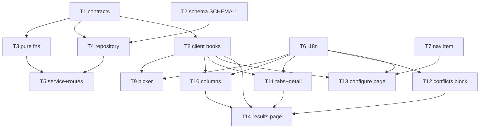

# Implementation Plan: Multi-Agent Review (Worktree A)

## Overview
Let a maintainer pick a subset of workspace review agents, launch them as one persisted
multi-agent run, and view the result in two modes (Columns and Tabs + detail) over one reload-safe
URL, plus a pre-run time/cost estimate and a "Where agents disagree" cross-agent conflict block.
The review execution engine (`ci/`, `agent-runner/`, run-executor concurrency, reviewer-core
pipeline) is consumed as-is; this feature adds only the selection, persistence linkage, grouping,
estimate and presentation around it. Source of truth:
`specs/2026-07-14-multi-agent-review.md` (resolved, no open clarifications).

## Execution mode
**multi-agent (parallel)** — the task explicitly asked for non-overlapping `Owned paths`, a
dependency DAG, and tasks that run in parallel where safe. The plan groups work into 4 phases with
contracts + schema first, so backend and client streams can proceed concurrently against the pinned
contracts. (No interactive user was reachable to choose the mode; the request itself specifies
parallel-capable shaping, which is recorded here.)

## Requirements (verified)
All requirements are restated from the spec's EARS acceptance criteria and verified against real
code. Each AC is cited on the task(s) that satisfy it.

- **R-Picker (AC-1…AC-4):** PR-page picker replaces `RunReviewDropdown`; multi-select ≥0 agents;
  run button labelled with count N; disabled at N=0; launching N≥1 creates one multi-agent run and
  navigates to its results surface; "Configure agents…" + "Clear" affordances.
- **R-Configure (AC-5…AC-9):** Configure-run page with PR selector + empty state; per-agent
  time·cost estimate from that agent's recent completed `agent_runs` (AVG); cold-start "no estimate
  yet" excluded from summary; summary estimate with fan-out wall-clock duration; estimate marked
  approximate and never blocks the run.
- **R-Persistence (AC-10…AC-12):** persist a `multi_agent_runs` record (workspace + PR scoped);
  link every fanned-out `agent_runs` row to it; stable reload-safe URL; every route workspace-scoped
  and refuses cross-workspace PR/agent/run (not-found).
- **R-Columns (AC-13…AC-17):** one column per agent with live status (running/done/failed), cost,
  findings count, per-finding attribution, and a "View trace" control opening that agent's run
  trace; live updates via the existing per-run SSE; one failing agent does not sink the others.
- **R-Conflicts (AC-18…AC-22, AC-28):** pure, deterministic grouping by same file + overlapping
  line range; per-group verdict per completed agent (severity or "did not flag"); conflict =
  ≥1 flagged AND ≥1 did not, or divergent severities; failed/running agents excluded; zero LLM calls.
- **R-Tabs (AC-23…AC-27):** view-mode toggle (query param) over the same run; per-agent tabs with
  finding detail (confidence + suggested fix); Accept/Dismiss via the existing finding-action flow;
  Learn / Turn-into-eval / Reply are inert hooks; disagreement block + toggle available in both modes.
- **R-a11y (AC-29):** status/severity/verdict/"did not flag" conveyed by icon+text (not colour);
  live status exposed to assistive tech; keyboard-operable toggle/tabs.
- **SCHEMA-1:** one nullable `multi_agent_run_id` uuid FK column on `agent_runs`
  (`on delete set null`). No `agent_id` on findings; no new columns on `multi_agent_runs`.

### Verified reuse (checked against code)
- `POST /pulls/:id/review` body is `{ agentId?, all? }` — single or all, not a set →
  `server/src/modules/reviews/routes.ts:27`, `service.ts:46`. New launch route required.
- Rate limit on the review-launch route = **10/min** → `reviews/routes.ts:29`. (The api-contracts
  doc's "120/min" is stale — see Recommendations.)
- `multi_agent_runs` is a bare stub (id, workspace_id, pr_id, ran_at); `agent_runs` has **no**
  multi-run FK → `server/src/db/schema/runs.ts:8,42`.
- Multi-agent contracts already exist → `server/src/vendor/shared/contracts/observability.ts`
  (`MultiAgentRun`, `AgentColumn`, `AgentColumnFinding`, `Conflict`, `ConflictTake`).
- `agent_runs` row is created in `reviews/repository/run.repo.ts` `createAgentRun`, invoked by
  `reviews/service.ts:120` `runReview` (fire-and-forget executor after). This is the linkage point.
- Overlap predicate to crib → `server/src/modules/eval/scorer.ts:36`
  (`a.file === b.file && Math.max(a.start_line,b.start_line) <= Math.min(a.end_line,b.end_line)`).
- Client reuse: `RunReviewDropdown` used in `PrDetailHeader.tsx:5,93`; `useRunEvents(runIds[])`,
  `usePrReviews`, `useFindingAction`, `usePrActiveRuns` all in `client/src/lib/hooks/reviews.ts`;
  `RunTraceDrawer` + `LiveLogStream` exist; `nav.multi-agent` label in `messages/en/shell.json:26`
  and `activeKeyFor('/multi-agent')` in `components/app-shell/helpers.ts:28` are staged, but
  `client/src/vendor/ui/nav.ts` has **no** multi-agent item yet (needs wiring).

## Open questions & recommendations
- Q: `MultiAgentRun.total_duration_ms` semantics (contract underspecifies) → default: **max of
  completed columns' durations** (fan-out wall-clock), matching the "parallel fan-out" framing of
  AC-8; `total_cost_usd` = sum of column costs; `agent_count` = linked run count. Confirm if a sum
  is preferred instead.
- Q: Estimate history window size → default: **last 10 completed runs per agent** in the workspace
  (bounded, satisfies the <200ms p95 gate AC-perf). Confirm the window.
- Rec 1 (rate limit): the launch route spawns N model-backed runs; **reuse the existing 10/min
  per-route budget** (as on `POST /pulls/:id/review`). The api-contracts doc says 120/min — that is
  stale; do not follow it. Flag to reconcile the doc (out of scope to edit here).
- Rec 2 (FK stamping — simpler path): stamp `multi_agent_run_id` via an **UPDATE right after**
  `reviewService.runReview(...)` returns the run ids, from the new module's repository — this keeps
  the `reviews` module **completely untouched** and reuses `runReview` verbatim. The UPDATE runs
  synchronously before the HTTP response, so it is set well before any reload (AC-11). Alternative
  (threading `multiAgentRunId` through `createAgentRun`) edits the reviews module and is not needed.
- Rec 3 (vendored contracts): `@devdigest/shared` is duplicated in `server/src/vendor/shared/` and
  `client/src/vendor/shared/` with **no sync script** (only `scripts/verify-l06.mjs` checks eval-ci
  parity). The new contract file must be added to **both** copies and **both** barrels.
- Rec 4 (service reuse): the new module's service instantiates `new ReviewService(container)` to
  reuse `runReview` — this mirrors the existing route pattern (`reviews/routes.ts:22`) and is the
  least-duplication launch path. Recorded so the architecture review does not flag it as a
  surprise service→service coupling.

## Affected modules & contracts
- **server / new module `modules/multi-agent-runs/`** — launch, read (columns + conflicts),
  estimate. Pure grouping + estimate helpers. Reuses `ReviewService`, `agentsRepo`, reviews/findings
  tables, and the eval overlap predicate.
- **server / db** — SCHEMA-1 column on `agent_runs` + generated migration.
- **server / reviews module** — **untouched** (reused as-is via `ReviewService.runReview`).
- **client / `app/multi-agent/`** — new Configure-run + results routes, Columns/Tabs/Conflicts
  components, agent picker on the PR page, new query/mutation hooks, i18n namespace, nav item.
- **Contracts:** add **one new file** `contracts/multi-agent-api.ts` (launch body/result +
  estimate) to **both** vendored copies + both barrels. Existing `observability.ts`
  (`MultiAgentRun` et al.) reused **as-is** — no edits to existing shared contracts.

## Architecture changes
- New Fastify module `server/src/modules/multi-agent-runs/{routes,service,repository,conflicts,estimate}.ts`
  registered in `server/src/modules/index.ts` (one import + one entry). Onion layering: `routes.ts`
  (validate → service), `service.ts` (orchestrate; instantiates `ReviewService`), `repository.ts`
  (Drizzle), `conflicts.ts`/`estimate.ts` (pure domain functions, zero I/O, zero LLM).
- New App-Router segment `client/src/app/multi-agent/` (RSC page shells) with `"use client"`
  interactive wrappers pushed as deep as possible; server state via TanStack Query hooks in
  `client/src/lib/hooks/multiAgent.ts`.

## Dependency DAG

## Phased tasks

### Phase 1 — Foundations (T1, T2 run concurrently)

- **T1 — Contracts: launch + estimate shapes**
  - **Action:** Add `contracts/multi-agent-api.ts` defining: `MultiAgentRunLaunchBody`
    (`{ agent_ids: string[].min(1) }`), `MultiAgentRunLaunchResult`
    (`{ id, pr_id, runs: ReviewRunTarget[] }` — import `ReviewRunTarget` from `review-api`),
    `MultiAgentEstimateAgent` (`{ agent_id, est_duration_ms: number.int|null, est_cost_usd:
    number|null }`), and `MultiAgentEstimate` (`{ agents: MultiAgentEstimateAgent[], summary:
    { est_duration_ms: number.int|null, est_cost_usd: number|null, agent_count: number.int } }`).
    Add the file **and** the `export * from './contracts/multi-agent-api.js'` barrel line to
    **both** `server/src/vendor/shared/` and `client/src/vendor/shared/`. Reuse existing
    `MultiAgentRun`/`AgentColumn`/`Conflict` from `observability.ts` as-is (do not edit).
  - **Module:** server (shared, consumed by client) · **Type:** core
  - **Skills to use:** zod, typescript-expert, onion-architecture (domain/contract placement)
  - **Owned paths:** `server/src/vendor/shared/contracts/multi-agent-api.ts`,
    `server/src/vendor/shared/index.ts`, `client/src/vendor/shared/contracts/multi-agent-api.ts`,
    `client/src/vendor/shared/index.ts`
  - **Depends-on:** none · **Risk:** low
  - **Known gotchas:** two vendored copies, no sync script (Rec 3); barrel edit is additive-only —
    do not touch existing exports.
  - **Acceptance:** `cd server && pnpm typecheck` and `cd client && pnpm typecheck` pass;
    `import { MultiAgentRunLaunchBody, MultiAgentEstimate } from '@devdigest/shared'` resolves in
    both packages; existing `MultiAgentRun` unchanged.

- **T2 — SCHEMA-1: `multi_agent_run_id` FK on `agent_runs`**
  - **Action:** In `server/src/db/schema/runs.ts` add
    `multiAgentRunId: uuid('multi_agent_run_id').references(() => multiAgentRuns.id, { onDelete: 'set null' })`
    (nullable) to `agentRuns`. Run `cd server && pnpm db:generate` to emit `0014_*.sql` + snapshot.
    Do **not** edit existing migrations; do **not** auto-run. Document `pnpm db:migrate` as the apply
    step. No `agent_id` on findings; no new columns on `multi_agent_runs`.
  - **Module:** server · **Type:** backend
  - **Skills to use:** drizzle-orm-patterns, postgresql-table-design
  - **Owned paths:** `server/src/db/schema/runs.ts`,
    `server/src/db/migrations/0014_*.sql`, `server/src/db/migrations/meta/*` (generated)
  - **Depends-on:** none · **Risk:** low
  - **Known gotchas:** migrations are explicit — never auto-run (server boots then queries fail);
    `db:migrate` silently no-ops if local DB was migrated on a divergent branch with newer journal
    timestamps (`server/insights/gotchas.md`) — verify the column actually lands after migrate.
    FK columns are not auto-indexed; an index on `multi_agent_run_id` is optional (small N per PR)
    but note it if read latency matters.
  - **Acceptance:** a new `0014_*.sql` adds the nullable FK with `on delete set null`;
    `cd server && pnpm typecheck` passes; after `pnpm db:migrate`, `\d agent_runs` shows the column
    (verifies SCHEMA-1, AC-10/AC-11 storage).

### Phase 2 — Backend module (T3, T4 concurrent; T5 after)

- **T3 — Pure conflict grouping + estimate summary**
  - **Action:** `conflicts.ts` — pure `computeConflicts(columns)` over **completed** agents only:
    group persisted findings by same file + overlapping line range (crib the predicate from
    `eval/scorer.ts:36`), emit `Conflict[]` with a `ConflictTake` per completed agent
    (`verdict = severity` if it flagged in-range, else `'ignored'` = "did not flag"), representative
    `line` = smallest `start_line` in the group, and mark a group a conflict when ≥1 flagged AND ≥1
    did not, or severities diverge. Deterministic, zero LLM. `estimate.ts` — pure
    `summariseEstimate(perAgent)`: sum costs, fan-out duration = **max** of per-agent est durations,
    exclude null (cold-start) agents from the summary. Hermetic unit tests for both.
  - **Module:** server · **Type:** core
  - **Skills to use:** typescript-expert, zod, onion-architecture (pure domain layer)
  - **Owned paths:** `server/src/modules/multi-agent-runs/conflicts.ts`,
    `server/src/modules/multi-agent-runs/conflicts.test.ts`,
    `server/src/modules/multi-agent-runs/estimate.ts`,
    `server/src/modules/multi-agent-runs/estimate.test.ts`
  - **Depends-on:** T1 · **Risk:** medium
  - **Known gotchas:** exclude failed **and** running agents from takes (AC-22); <2 completed
    reviewing agents → no conflicts (never crash/blank); same agent emitting two findings at a
    location is not intra-agent dedup (AC-289 edge).
  - **Acceptance:** `cd server && pnpm exec vitest run multi-agent-runs/` green; tests prove:
    same-file overlapping ranges group (AC-18), non-overlap/different-file do not (AC-18),
    "did not flag" for a completed non-flagging agent (AC-19), conflict vs agreement classification
    (AC-20), conflicts-eligibility excludes failed/running (AC-22), computing twice yields identical
    output (AC-28), and cold-start agent excluded from summary (AC-7/AC-8).

- **T4 — Repository: persist, link, read joins, estimate query**
  - **Action:** `repository.ts` with: `createMultiRun(workspaceId, prId)` → insert
    `multi_agent_runs`, return id; `linkRuns(multiRunId, runIds[])` → `UPDATE agent_runs SET
    multi_agent_run_id = $1 WHERE id = ANY($2)` (Rec 2); `getMultiRun(workspaceId, id)` and
    `getLatestForPull(workspaceId, prId)` (workspace-scoped, refuse cross-workspace → null →
    NotFound in service, AC-12); `loadColumns(multiRunId)` → linked `agent_runs` joined to their
    `reviews` + `findings` + agent name/provider/model (findings via `reviews.run_id`); `estimate`
    query → per-agent AVG(`duration_ms`)/AVG(`cost_usd`) over the agent's most recent **10**
    completed `agent_runs` in the workspace (bounded window, no full-table scan). Integration test
    (`.it.test.ts`, real Postgres).
  - **Module:** server · **Type:** backend
  - **Skills to use:** drizzle-orm-patterns, onion-architecture (infrastructure layer), postgresql-table-design
  - **Owned paths:** `server/src/modules/multi-agent-runs/repository.ts`,
    `server/src/modules/multi-agent-runs/repository.it.test.ts`
  - **Depends-on:** T1, T2 · **Risk:** medium
  - **Known gotchas:** `$inferSelect` types stay in the repo — map to contract DTOs before returning;
    column `status` derives from `agent_runs.status` (`running` when null/`'running'`); a running
    agent has empty findings until persisted.
  - **Acceptance:** `cd server && pnpm exec vitest run .it.test` green for this file; test proves a
    created multi-run + linked runs are retrievable as a group (AC-10), a cross-workspace id returns
    nothing (AC-12), and the estimate query is bounded to recent runs (AC-perf).

- **T5 — Service + routes + module registration**
  - **Action:** `service.ts`: `launch(workspaceId, prId, agentIds)` → resolve each agent via
    `container.agentsRepo.getById(workspaceId, id)` (refuse cross-workspace, AC-12), `createMultiRun`,
    `new ReviewService(container).runReview(...)` (fires the reused executor; PR tenancy re-checked
    inside), `linkRuns(...)`, return `{ id, pr_id, runs }`; `getRun(workspaceId, id)` /
    `getLatest(workspaceId, prId)` → assemble `MultiAgentRun` from `loadColumns` + `computeConflicts`
    + totals (`agent_count`, `total_cost_usd` = sum, `total_duration_ms` = max completed);
    `estimate(workspaceId, prId, agentIds)` → repo query + `summariseEstimate`. `routes.ts`:
    `POST /pulls/:id/multi-agent-run` (body `MultiAgentRunLaunchBody`, `rateLimit { max:10,
    timeWindow:'1 minute' }`), `GET /multi-agent-runs/:id`, `GET /pulls/:id/multi-agent` (latest),
    `GET /pulls/:id/multi-agent/estimate?agent_ids=` — all `getContext`-scoped, Zod params/body/
    response via `fastify-type-provider-zod`. Register in `server/src/modules/index.ts`. Route
    integration test (`.it.test.ts`).
  - **Module:** server · **Type:** backend
  - **Skills to use:** fastify-best-practices, onion-architecture, zod, drizzle-orm-patterns, security
  - **Owned paths:** `server/src/modules/multi-agent-runs/service.ts`,
    `server/src/modules/multi-agent-runs/routes.ts`,
    `server/src/modules/multi-agent-runs/routes.it.test.ts`,
    `server/src/modules/index.ts`
  - **Depends-on:** T3, T4 · **Risk:** medium
  - **Known gotchas:** thin routes (validate → one service call → reply); reuse `getContext` for
    tenancy; `runReview` is fire-and-forget — `linkRuns` must run on the awaited run-id list, not
    inside the background job; RunBus is in-memory (status reconciled from DB on reload, spec-accepted).
  - **Acceptance:** `cd server && pnpm typecheck` + `pnpm exec vitest run .it.test` green; route
    test proves: launching N agents creates one multi-run whose N `agent_runs` carry the FK
    (AC-3/AC-10), the read returns `columns[]` + computed `conflicts[]` reload-safe (AC-11/AC-13/
    AC-18), estimate returns per-agent + summary with cold-start nulls excluded (AC-6/AC-7/AC-8),
    cross-workspace target is refused (AC-12), and the launch route is rate-limited at 10/min.

### Phase 3 — Client foundations (T6, T7, T8 run concurrently)

- **T6 — i18n namespace `multiAgent`**
  - **Action:** Add `client/messages/en/multiAgent.json` with all new strings (picker: "Run
    multi-agent review ({count})", "Configure agents…", "Clear"; configure: "Pick a pull request
    first", estimate/approximate labels, "parallel fan-out"; columns/tabs: running/done/failed,
    "View trace", "{n} findings", confidence/suggested-fix labels, Accept/Dismiss, disagreement
    block + "Show only conflicts", "did not flag"; a11y accessible names). No hardcoded English in
    JSX downstream.
  - **Module:** client · **Type:** ui
  - **Skills to use:** frontend-architecture, next-best-practices (i18n)
  - **Owned paths:** `client/messages/en/multiAgent.json`
  - **Depends-on:** none · **Risk:** low
  - **Known gotchas:** each JSON top-level object is the `useTranslations("multiAgent")` scope.
  - **Acceptance:** `cd client && pnpm typecheck` passes; keys load via
    `useTranslations("multiAgent")` (verified when consumed by Phase 4).

- **T7 — Nav item wiring**
  - **Action:** Add a `multi-agent` entry to `NAV` in `client/src/vendor/ui/nav.ts` (key
    `multi-agent`, href `/multi-agent`, an icon, optional gKey), reusing the staged
    `nav.multi-agent` label and the existing `activeKeyFor('/multi-agent')` branch.
  - **Module:** client · **Type:** ui
  - **Skills to use:** frontend-architecture
  - **Owned paths:** `client/src/vendor/ui/nav.ts`
  - **Depends-on:** none · **Risk:** low
  - **Known gotchas:** label resolves via `t(\`nav.${key}\`)`; the `shell.json` label + helper
    branch already exist — only the NAV list entry is missing.
  - **Acceptance:** `cd client && pnpm typecheck` passes; the sidebar renders a "Multi-Agent Review"
    item that highlights on `/multi-agent` routes.

- **T8 — Client query/mutation hooks**
  - **Action:** `client/src/lib/hooks/multiAgent.ts`: `useLaunchMultiAgentRun()` (mutation →
    `api.post('/pulls/:id/multi-agent-run', { agent_ids })` returning `MultiAgentRunLaunchResult`),
    `useMultiAgentRun(id)` and `useLatestMultiAgentRun(prId)` (queries → `GET /multi-agent-runs/:id`
    / `GET /pulls/:id/multi-agent`), `useMultiAgentEstimate(prId, agentIds)` (query → estimate,
    debounced/enabled on ≥1 id). Reuse `api` from `lib/api.ts` and follow the inline query-key
    pattern in `hooks/reviews.ts`. Hermetic hook/unit smoke test.
  - **Module:** client · **Type:** ui
  - **Skills to use:** react-best-practices, frontend-architecture, react-testing-library, zod
  - **Owned paths:** `client/src/lib/hooks/multiAgent.ts`,
    `client/src/lib/hooks/multiAgent.test.ts`
  - **Depends-on:** T1 · **Risk:** low
  - **Known gotchas:** all data fetching in hooks, never component bodies; do not centralise keys —
    match the existing inline array-key convention.
  - **Acceptance:** `cd client && pnpm typecheck` + `pnpm test` (this file) green; hooks typed
    against the new `@devdigest/shared` shapes.

### Phase 4 — Client surfaces (T9–T13 concurrent; T14 after T10/T11/T12)

- **T9 — Agent picker (replaces `RunReviewDropdown`)**
  - **Action:** New `AgentPicker` component (multi-select checkboxes over the workspace agents from
    the existing agents-list hook, run button "Run multi-agent review ({N})", disabled at N=0,
    "Configure agents…" → agent management route, "Clear" → deselect all; on launch call
    `useLaunchMultiAgentRun` and `router.push('/multi-agent/' + result.id)`). Replace the
    `RunReviewDropdown` import + render in `PrDetailHeader.tsx` with `AgentPicker` (leave the old
    component files in place — deleting them is out of scope).
  - **Module:** client · **Type:** ui
  - **Skills to use:** react-best-practices, frontend-architecture, next-best-practices, security
  - **Owned paths:** `client/src/app/repos/[repoId]/pulls/[number]/_components/AgentPicker/**`,
    `client/src/app/repos/[repoId]/pulls/[number]/_components/PrDetailHeader/PrDetailHeader.tsx`
  - **Depends-on:** T6, T8 · **Risk:** medium
  - **Known gotchas:** `"use client"` only on the interactive picker; icon-only controls need
    `aria-label`; N=0 button is non-actionable, not hidden (AC-2).
  - **Acceptance:** `cd client && pnpm test` for the picker green; RTL flow proves the PR header
    renders the picker not the dropdown (AC-1), N updates on toggle and the button disables at N=0
    (AC-1/AC-2), launching with ≥1 agent calls the launch hook and navigates to the run URL (AC-3),
    Clear resets N and "Configure agents…" navigates (AC-4).

- **T10 — Columns mode component**
  - **Action:** `MultiAgentColumns` — one column per `AgentColumn`: header with agent name, live
    status (running/done/failed) via `useRunEvents(runIds)` + column `status`, cost once known,
    findings list (attributed) + count, and a "View trace" control opening `RunTraceDrawer` for that
    column's `run_id`. Status/severity by icon+text with a live region (AC-29).
  - **Module:** client · **Type:** ui
  - **Skills to use:** react-best-practices, frontend-architecture, react-testing-library
  - **Owned paths:** `client/src/app/multi-agent/[runId]/_components/MultiAgentColumns/**`
  - **Depends-on:** T6, T8 · **Risk:** medium
  - **Known gotchas:** `useRunEvents` takes an array of run ids (parallel SSE); status reconciles
    from persisted `status` after a restart drops the stream (spec-accepted); a failed column shows
    reason and does not block siblings (AC-16).
  - **Acceptance:** `cd client && pnpm test` green; RTL proves N columns for an N-agent run with
    per-status icon+text and findings counts (AC-13/AC-17), "View trace" opens the drawer for the
    correct run id (AC-15), a failed column shows failed+reason while others render (AC-16).

- **T11 — Tabs + detail mode component**
  - **Action:** `MultiAgentTabs` — one tab per agent (score/finding count); selecting a tab lists
    its findings; opening a finding shows confidence + suggested fix (from `usePrReviews`
    `FindingRecord`) and Accept/Dismiss via the existing `useFindingAction`. Render Learn / Turn
    into eval case / Reply to author as inert/stub hooks (no new backend, AC-26).
  - **Module:** client · **Type:** ui
  - **Skills to use:** react-best-practices, frontend-architecture, react-testing-library, security
  - **Owned paths:** `client/src/app/multi-agent/[runId]/_components/MultiAgentTabs/**`
  - **Depends-on:** T6, T8 · **Risk:** medium
  - **Known gotchas:** finding text is untrusted model output derived from PR code — render as
    escaped/sanitised markdown, never execute (spec Untrusted inputs); Accept/Dismiss reuse the
    existing endpoints only.
  - **Acceptance:** `cd client && pnpm test` green; RTL proves per-agent tabs, a finding detail
    showing confidence + suggestion (AC-24), Accept marks accepted / Dismiss marks dismissed via the
    existing hook (AC-25), and the three extra actions require no new endpoint (AC-26).

- **T12 — "Where agents disagree" block**
  - **Action:** `AgentDisagreement` — presentational over `MultiAgentRun.conflicts`: one row per
    group showing each completed agent's verdict (severity or "did not flag") by icon+text, plus a
    "Show only conflicts" toggle that hides agreement groups. Honest empty state when no groups.
  - **Module:** client · **Type:** ui
  - **Skills to use:** react-best-practices, frontend-architecture, react-testing-library
  - **Owned paths:** `client/src/app/multi-agent/[runId]/_components/AgentDisagreement/**`
  - **Depends-on:** T6 · **Risk:** low
  - **Known gotchas:** "did not flag" and severities must survive colour removal (AC-29); empty
    conflicts render a calm empty state, not a blank/crash.
  - **Acceptance:** `cd client && pnpm test` green; RTL proves the toggle hides all-agree groups and
    keeps disagreement groups (AC-21), verdicts (incl. "did not flag") shown per agent (AC-19),
    empty state on no groups.

- **T13 — Configure-run page (`/multi-agent`)**
  - **Action:** `client/src/app/multi-agent/page.tsx` (RSC shell) + `_components/ConfigureRun.tsx`
    (`"use client"`): PR selector; until a PR is chosen show the empty agents state + disabled run;
    once chosen, list workspace agents as checkboxes each showing per-agent est time·cost from
    `useMultiAgentEstimate` ("no estimate yet" placeholder on cold start); a summary estimate line
    with fan-out framing; run marked approximate and never blocked on estimates; launch →
    `useLaunchMultiAgentRun` → navigate to `/multi-agent/[runId]`.
  - **Module:** client · **Type:** ui
  - **Skills to use:** react-best-practices, frontend-architecture, next-best-practices, react-testing-library
  - **Owned paths:** `client/src/app/multi-agent/page.tsx`,
    `client/src/app/multi-agent/_components/**`
  - **Depends-on:** T6, T7, T8 · **Risk:** medium
  - **Known gotchas:** estimate is approximate ("≈"/"est.") and non-blocking (AC-9); URL-driven PR
    selection can live in a search param; push `"use client"` to the interactive wrapper only.
  - **Acceptance:** `cd client && pnpm test` green; RTL proves empty state + disabled run with no PR
    (AC-5), per-agent estimates after choosing a PR (AC-6/AC-7), a summary line for a selection
    (AC-8), estimates visibly approximate and launch allowed with a "no estimate yet" agent (AC-9).

- **T14 — Results page (`/multi-agent/[runId]`) with view-mode toggle**
  - **Action:** `client/src/app/multi-agent/[runId]/page.tsx` (RSC shell) + `_components/ResultsView.tsx`
    (`"use client"`): load `useMultiAgentRun(id)`, drive live column status via `useRunEvents` over
    the columns' run ids, render a keyboard-operable **view-mode toggle** carried in a `?view=`
    query param over one payload — Columns (`MultiAgentColumns`) vs Tabs+detail (`MultiAgentTabs`) —
    and mount `AgentDisagreement` (+ its toggle) in **both** modes. Reload-safe from persisted data.
  - **Module:** client · **Type:** ui
  - **Skills to use:** react-best-practices, frontend-architecture, next-best-practices, react-testing-library
  - **Owned paths:** `client/src/app/multi-agent/[runId]/page.tsx`,
    `client/src/app/multi-agent/[runId]/_components/ResultsView.tsx`
  - **Depends-on:** T8, T10, T11, T12 · **Risk:** medium
  - **Known gotchas:** `useSearchParams` needs a Suspense boundary (Next 15 CSR bailout); switching
    modes must not re-trigger a run (AC-23); reload re-renders the same run from the read endpoint
    (AC-11); disagreement block identical in both modes (AC-27).
  - **Acceptance:** `cd client && pnpm test` green; RTL proves Columns↔Tabs toggle shows the same
    run's data without a new run (AC-23), the disagreement block + toggle behave identically in both
    modes (AC-27), and reloading the URL re-renders from persisted data (AC-11, mocked hook).

## Testing strategy
- **Server unit (hermetic):** `cd server && pnpm exec vitest run multi-agent-runs/` — conflicts +
  estimate pure functions (T3), determinism (AC-28).
- **Server integration (real Postgres):** `cd server && pnpm exec vitest run .it.test` — repository
  link/read/estimate (T4) and route launch→link→read→estimate + tenancy + rate limit (T5); covers
  AC-3/AC-6/AC-7/AC-8/AC-10/AC-11/AC-12/AC-13/AC-18.
- **Client (vitest + jsdom + RTL):** `cd client && pnpm test` — picker (T9), columns (T10), tabs
  (T11), conflicts (T12), configure (T13), results toggle (T14); mock at the API boundary
  (MSW/`api`), never mock own components/hooks.
- **Typecheck gates:** `cd server && pnpm typecheck` and `cd client && pnpm typecheck` after each
  contract/schema change.
- **Migration apply:** `cd server && pnpm db:migrate` then verify the column exists (guard against
  the silent no-op gotcha).

## Risks & mitigations
- **Silent migration no-op across branches** → after `db:migrate`, assert `agent_runs.multi_agent_run_id`
  exists before running integration tests (T2/T4).
- **FK-stamp race (UPDATE after `runReview`)** → run `linkRuns` synchronously on the awaited run-id
  list inside the launch request, before responding, so reload is always consistent (T5).
- **Contract drift between the two vendored copies** → T1 adds the identical file + barrel line to
  both `server` and `client`; both typechecks must pass.
- **RunBus in-memory / restart drops SSE** → columns reconcile status from persisted `agent_runs`
  on reload (spec-accepted); no new resumability built.
- **Stale rate-limit doc (120/min)** → launch route uses 10/min in code (Rec 1); doc reconciliation
  is out of scope and flagged, not silently changed.
- **Service→service reuse** (`new ReviewService(container)`) may surprise an architecture audit →
  recorded in Rec 4 as an intentional least-duplication reuse mirroring the route pattern.

## Red-flags check
- [x] Every requirement maps to a task (AC-1…AC-29 + SCHEMA-1 cited on tasks above)
- [x] No specification was authored or edited — the spec is input; only this plan was written
- [x] Execution mode is recorded (multi-agent / parallel) and the plan is phased for it
- [x] Dependencies form a DAG (see diagram; no cycles)
- [x] Concurrent tasks have non-overlapping Owned paths (T1↔T2; T3↔T4; T6↔T7↔T8; T9↔T10↔T11↔T12↔T13)
- [x] Every Acceptance is a concrete command result / test / observable behaviour
- [x] No edits to existing shared contracts — a new `multi-agent-api.ts` is added to both copies;
      `observability.ts` reused as-is (barrel edits are additive-only, called out)
