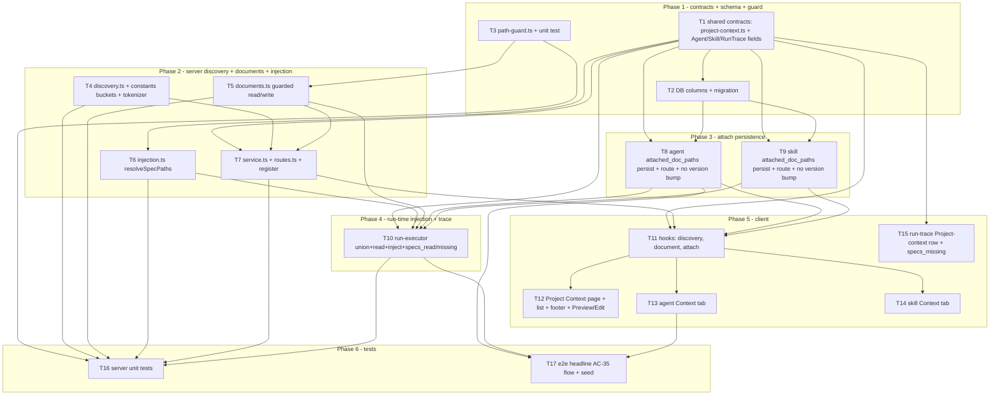

# Development Plan: Project Context

## Overview

Let a human manually attach existing repo markdown documents (`specs/`, `docs/`, `insights/` —
discovered via `**/{specs,docs,insights}/**/*.md`) to a review **agent** and/or a **skill**. On
every review run the union of attached paths is read fresh from the repo clone, deduped, ordered
deterministically, and injected into the **already-wired** `## Project context` prompt slot as an
untrusted block. The feature adds discovery, attach metadata (paths only), guarded read/write of
clone files, edit-in-place, run-time injection, and trace surfacing — with **zero new
LLM/embedding/network calls**. Sourced from SPEC-2026-06-30-project-context (approved).

## Execution mode

**multi-agent (parallel)** — recommended default for this feature. It spans three packages and a
dozen mostly-independent files (DB schema, two server modules, a new discovery module, the run
executor, four client surfaces, one e2e flow). The plan groups work into phases with strictly
non-overlapping `Owned paths` and a dependency DAG, with the shared contract changes defined first
so parallel client/server work can begin against a stable shape. If the user prefers a single pass,
the same task order read top-to-bottom is a valid linear sequence.

## Requirements (verified)

Restated from the spec's 35 EARS acceptance criteria (AC-1..AC-35), grouped:

- **Discovery (AC-1..AC-7):** return every `.md` under a `specs|docs|insights` folder at any depth
  and nothing outside; carry `{ path, bucket, estimatedTokens }`; bucket set is configurable
  (not inline); outermost-bucket-wins for nested matches; clone-absent → empty + not-available
  state (no error); token estimate via the shared tokenizer with char/4 fallback; page summary
  footer with file count + summed tokens + refreshed time, no chunk/index wording.
- **Attach — agent (AC-8..AC-14):** Context tab lists every discovered doc with order handle,
  attach toggle, filename, path, bucket badge, Preview, and "N of M attached"; persist the agent's
  **ordered list of paths** (never text); reorder persists and drives run-time order; running token
  estimate + untrusted note; search filters without changing attach state; Preview shows rendered
  markdown + 4 metadata items; attach/detach/reorder is mutable config and does **not** bump the
  agent/skill version.
- **Attach — skill (AC-15..AC-17):** skill Context tab with same row controls, "N attached" count,
  search, inheritance note; persist skill's **paths** (never text) in a **distinct** field (not
  `evidence_files`); "serializes as" contribution preview.
- **Run-time injection (AC-18..AC-24):** inject the **union** of agent paths + every **loaded
  (enabled)** skill's paths; dedupe by repo-relative path (once); deterministic order (agent order
  first, then skill-load order then each skill's order, first occurrence wins); each whole doc wrapped
  untrusted in the existing `## Project context` slot; fail-soft skip+record for missing/unreadable/
  clone-absent; omit the section entirely when none attached/all skipped; no new LLM/embedding/network
  call.
- **Observability — trace (AC-25..AC-28):** `specs_read` carries the actual read paths; a **new**
  `specs_missing` field carries skipped paths distinctly; the Prompt-assembly view shows the
  "Project context — attached specs (untrusted)" row with the wrapped block (copy + in-block search);
  tokens in→out shown from existing figures.
- **Untrusted handling (AC-29, AC-30):** each doc wrapped in the existing untrusted fence + the
  unconditional injection guard stays; **new** path-traversal / symlink-escape guard on both read
  AND write into the clone working tree.
- **Edit-in-place (AC-31..AC-34):** Preview/Edit toggle shows raw markdown; save writes the file to
  the clone working tree (AC-30-guarded), no git commit/push, no LLM; next run reads the updated text
  fresh; warn that resync (`git reset --hard`) clobbers uncommitted edits to **tracked** files.
- **Headline scenario (AC-35):** attach an architectural-invariant spec to the Security Reviewer →
  review a violating PR → at least one finding references the violation and survives `groundFindings()`.

## Codebase verification (spec claims vs. actual code)

The spec's central claim was audited against the real code. Result: **mostly CONFIRMED, with two
refinements the planner must build on rather than re-invent.**

- **CONFIRMED — the `specs` slot exists end-to-end in reviewer-core and already wraps + guards.**
  `ReviewInput.specs?: string[]` exists (`reviewer-core/src/review/run.ts:60`). `assemblePrompt`
  already builds the block and wraps each doc: `parts.specs.map((s, i) => wrapUntrusted(\`spec-${i}\`, s))`
  then `userSections.push(\`## Project context\n${specsBlock}\`)`
  (`reviewer-core/src/prompt.ts:101-104, 121`). The `INJECTION_GUARD` is appended unconditionally to
  every system prompt (`prompt.ts:16-28, 93`) and its header comment explicitly names "specs" as
  untrusted. **Consequence: AC-20 and AC-29 are already satisfied at the reviewer-core layer — no
  reviewer-core code change is required. The work is to populate the slot from the server.**
- **CONFIRMED — the trace slots exist but are hardcoded empty/null in the server executor.**
  `RunTrace.specs_read: z.array(z.string())` and `PromptAssembly.specs: z.string().nullish()` exist
  in `server/src/vendor/shared/contracts/trace.ts:43, 86`. The success-trace sets `specs_read: []`
  (`run-executor.ts` ~line 415) and the failure-trace sets `prompt_assembly.specs: null` +
  `specs_read: []` (~lines 594, 600). `assembly.specs` is populated by reviewer-core only when
  `specs` is passed. **Consequence: AC-25/AC-27/AC-28 fields are present; the executor must stop
  hardcoding them and feed real data.**
- **CONFIRMED — `specs_missing` does NOT exist.** No `specs_missing` field anywhere in the trace
  contract (`trace.ts` full scan). **This is a genuinely new, additive contract field (AC-26).**
- **CONFIRMED — `reviewPullRequest` does NOT pass `specs` today.** The call site
  (`run-executor.ts` ~lines 310-340) conditionally spreads `skills`, `callers`, `repoMap`,
  `prDescription`, `intent` — **no `specs`**. This is the gap the feature fills.
- **CONFIRMED — clone file access exists; the path guard does NOT.** `GitClient` exposes
  `clonePathFor(repo): string` and `readFile(repo, path): Promise<string>`
  (`server/src/vendor/shared/adapters.ts`; `server/src/adapters/git/simple-git.ts:37-39, 129-131`),
  but `readFile` is a bare `readFile(join(clonePathFor(repo), path))` with **no traversal/symlink
  guard**. **AC-30's guard is new and must gate both the new read-for-injection and the new write.**
- **CONFIRMED — the shared tokenizer + char/4 fallback exist** (`server/src/adapters/tokenizer/index.ts`:
  `TiktokenTokenizer.count` + `approxTokens(s) = Math.ceil(s.length/4)`), currently scoped to
  repo-intel and swappable via `ContainerOverrides.tokenizer`. AC-6 reuses this.
- **CONFIRMED — agent & skill versioning auto-bumps.** Agent `update` bumps version on any config
  change except `enabled` (`agents/repository.ts:120-122` via `isConfigChange`); skill `update`
  bumps version only on `body` change (`skills/repository.ts:163-165`). **AC-14: the new attach
  field must be excluded from `isConfigChange` (agent) and must not be treated as a body change
  (skill) so attach/detach/reorder never snapshots a version.**
- **CONFIRMED — skill `evidence_files` exists and is unrelated** (`skills` table `evidenceFiles
  jsonb $type<string[]>`; contract `evidence_files: z.array(z.string()).nullable()`). Per spec
  assumption, the new skill field is **distinct** — do not overload it.
- **CONFIRMED — repo clone path is on the repo row** (`repos.clonePath text`) and derivable via
  `clonePathFor({owner,name})`; `loadDiff` already falls back to `pr_files` when the clone is absent.
- **CONFIRMED — UI surfaces exist to extend.** Agent editor tabs (`config`, `skills`) with the
  existing **SkillsTab attach/reorder** pattern to mirror; skill editor tabs (`config`, `preview`,
  `stats`, `versions`); run-trace `TraceBody` already renders a `specsRead` row and a
  `prompt_assembly.specs` PromptBlock (gated on `!= null`); `Markdown` primitive
  (`react-markdown` + `remark-gfm`) for Preview; `api.get/post/put`, hooks in `lib/hooks/`,
  `next-intl` messages under `client/messages/en/<ns>.json`.

## Open questions & recommendations

- **Q (skill storage field):** add a **distinct** `attached_doc_paths` column on `skills` rather
  than overloading `evidence_files`? → **default: yes, distinct field** (spec assumption; cleaner
  semantics; `evidence_files` serves convention-evidence). Confirm if you'd rather reuse.
- **Q (token budget cap):** any hard cap on injected doc volume in v1? → **default: no cap**; the
  running estimate (AC-11) and trace token sizes (AC-28) make volume visible (spec assumption).
- **Q (discovery scope per repo vs per agent):** the Project Context page is **per-repo** (discovery
  walks one clone); the agent/skill Context tabs attach docs discovered for the repo the
  agent/skill is associated with. → **default: discovery is keyed by `repoId`; the agent/skill
  Context tabs take a `repoId` to discover against** (agents/skills are workspace-scoped, not
  repo-scoped, so the tab needs a repo selector or a default repo). **Recommend** confirming how an
  agent's "current repo" is chosen for its Context tab — see Risk R-7.
- **Rec (no reviewer-core change):** because `prompt.ts` already wraps+guards `specs`, do **not**
  add a reviewer-core task. Populate the existing slot from the server only. This keeps the
  mandatory `groundFindings()` gate and the untrusted fence untouched (AC-29 satisfied for free).
- **Rec (single guard utility):** implement the AC-30 path/symlink guard once as a shared helper in
  the discovery/workspace module and call it from both the read-for-injection path and the
  edit-write path, so the security invariant has one implementation (and one test).
- **Rec (clone-path source):** resolve the working-tree root via `container.git.clonePathFor(repoRef)`
  (already absolute) and treat "clone absent" as `fs.stat` miss → not-available, rather than relying
  on the nullable `repos.clone_path` column.

## Affected modules & contracts

- **server — new module `modules/project-context/`** — discovery (filesystem walk + bucket
  assignment + token estimate), the path-traversal/symlink guard, guarded document read/write
  (Preview/Edit), and the run-time path-union resolver. Routes for discovery, summary, document
  read/save. Registered in `modules/index.ts`.
- **server — `modules/agents/`** — add `attached_doc_paths` (ordered string[]) to the agent
  shape/storage, surfaced via a set/reorder route; exclude it from `isConfigChange` (no version bump).
- **server — `modules/skills/`** — add a **distinct** `attached_doc_paths` (ordered string[]) field;
  set route; must not trigger a version bump.
- **server — `modules/reviews/run-executor.ts`** — resolve union(agent paths, loaded enabled skills'
  paths), dedupe + order, read each file fresh (guarded, fail-soft), pass `specs: string[]` into
  `reviewPullRequest`, and write `specs_read` + the new `specs_missing` into the trace (success and
  failure paths).
- **server — DB** — `agents.attached_doc_paths jsonb $type<string[]>` and
  `skills.attached_doc_paths jsonb $type<string[]>`; one generated migration.
- **reviewer-core** — **no change.** The `specs` slot, untrusted wrapping, `## Project context`
  rendering, and `INJECTION_GUARD` already exist (verified). Only consumed.
- **client** — Project Context page (discovery list + summary footer + Preview/Edit toggle), agent
  Context tab, skill Context tab, run-trace Project-context row enhancements; hooks + i18n messages.
- **e2e** — one new agent-browser flow + seed for the AC-35 headline scenario.
- **Contracts (@devdigest/shared):**
  - **NEW file `contracts/project-context.ts`** (additive): `DiscoveredDocument`,
    `DiscoverySummary`, `DocumentContent`, and request/response bodies for set-attach + read/save.
  - **CHANGE `contracts/knowledge.ts` (explicit callout):** add `attached_doc_paths: z.array(z.string())`
    (default `[]`) to **`Agent`** and **`Skill`**. Additive optional/defaulted field — no existing
    field changes shape; cascades to client (types only) and reviewer-core (which does not consume
    these). Add the matching update-body fields.
  - **CHANGE `contracts/trace.ts` (explicit callout):** add `specs_missing: z.array(z.string()).default([])`
    to `RunTrace`. Additive; existing `specs_read` and `prompt_assembly.specs` keep their shape
    (only their runtime values change from empty/null to populated).

## Architecture changes

- **New backend module `server/src/modules/project-context/`** (onion):
  - `discovery.ts` (infrastructure — filesystem I/O): walk the clone working tree once, glob-match
    `**/{specs,docs,insights}/**/*.md`, assign bucket by **outermost** matching segment, compute
    `estimatedTokens` via injected `Tokenizer` (`approxTokens` fallback). Reads paths + sizes only,
    never file bodies, during discovery (NFR p95 ≤ 2 s). Clone-absent → empty + not-available flag.
  - `path-guard.ts` (infrastructure — pure + `fs.realpath`): `assertInsideClone(cloneRoot, relPath)`
    rejecting `..`, absolute, and out-of-tree symlink targets; reused by read, write, and injection.
  - `documents.ts` (infrastructure): guarded `readDocument(repoRef, path)` and
    `writeDocument(repoRef, path, text)` using `container.git.clonePathFor` + the guard. No git
    add/commit/push.
  - `injection.ts` (application — pure): `resolveSpecPaths({ agentPaths, loadedSkills })` →
    deterministic deduped ordered path list (agent first, then skill-load order then skill order,
    first wins); used by the executor.
  - `service.ts` (application): orchestrates discovery + summary + read/save + `usedByAgents` count
    (derived from attach metadata across agents).
  - `routes.ts` (presentation): thin Fastify plugin, Zod params/body/response, `getContext`.
  - Bucket set lives in `constants.ts` (`BUCKETS = ['specs','docs','insights']`) — configurable,
    not inline (AC-3).
- **DI:** the new service pulls `container.git` and `container.tokenizer` (already overridable). No
  new adapter/port required (clone access + tokenizer both exist). The path guard is a module helper,
  not an adapter.
- **`run-executor.ts`:** after diff load and skill load, before the agent loop — for each agent
  build `specPaths = resolveSpecPaths(...)`, read each via the guarded `documents.readDocument`
  (try/catch → push to `missing`), pass `specs: texts` into `reviewPullRequest`, set
  `specs_read = readPaths`, `specs_missing = missing`, and let reviewer-core populate
  `prompt_assembly.specs`. Fail-soft: any read error skips that doc; clone-absent skips all.
- **Client RSC boundary:** the Project Context **page** is a Server Component shell that renders a
  `"use client"` discovery list (toggles, drag, search, Preview/Edit are interactive). Agent/skill
  Context tabs are `"use client"` (mirror the existing SkillsTab). Trace row changes are inside the
  already-client `TraceBody`.

## Phased tasks

### Phase 1 — Contracts, schema, security guard

- **T1**
  - **Action:** Add the shared contracts. (1) NEW file
    `server/src/vendor/shared/contracts/project-context.ts` exporting Zod schemas + inferred types:
    `DiscoveredDocument = { path: string; bucket: z.enum(['specs','docs','insights']); estimated_tokens:
    z.number().int(); used_by_agents: z.number().int().optional() }`;
    `DiscoverySummary = { document_count: int; total_estimated_tokens: int; refreshed_at: z.string()
    (ISO); clone_available: z.boolean() }`;
    `DocumentContent = { path: string; text: string }`;
    `SetAttachedDocsBody = { paths: z.array(z.string()) }` (ordered);
    `SaveDocumentBody = { path: string; text: string }`. Export all from
    `server/src/vendor/shared/index.ts`. (2) In `contracts/knowledge.ts` add
    `attached_doc_paths: z.array(z.string()).default([])` to **both** `Agent` and `Skill`, and the
    matching optional field to their update bodies if those live in shared. (3) In `contracts/trace.ts`
    add `specs_missing: z.array(z.string()).default([])` to `RunTrace`.
  - **Module:** server (shared contracts) | **Type:** backend
  - **Skills to use:** zod (schema-use-enums, type-use-z-infer, object-extend-for-composition),
    onion-architecture (contract = domain), typescript-expert
  - **Owned paths:** `server/src/vendor/shared/contracts/project-context.ts`,
    `server/src/vendor/shared/contracts/knowledge.ts`,
    `server/src/vendor/shared/contracts/trace.ts`, `server/src/vendor/shared/index.ts`
  - **Depends-on:** none
  - **Risk:** medium
  - **Known gotchas:** `vendor/shared/` cascades to client + reviewer-core — additive only, no
    existing field changes shape (explicit callout). The new `Agent`/`Skill` field is
    **default([])** so existing serialized rows and `toAgentDto`/`toSkillDto` mappers stay valid
    until T8/T9 wire them. `RunTrace.specs_missing` is `.default([])` so existing persisted traces
    (JSONB) without the field still parse. Do NOT touch `evidence_files`.
  - **Acceptance:** `cd server && pnpm typecheck`, `cd client && pnpm typecheck`,
    `cd reviewer-core && npm run typecheck` all pass; `Agent.parse`/`Skill.parse` of an object
    without `attached_doc_paths` yields `[]`; `RunTrace.parse` of an old trace without
    `specs_missing` yields `[]`.

- **T2**
  - **Action:** Add `attachedDocPaths: jsonb('attached_doc_paths').$type<string[]>().notNull().default([])`
    to `server/src/db/schema/agents.ts` and `server/src/db/schema/skills.ts`. Run
    `cd server && pnpm db:generate` to produce ONE new numbered migration in
    `server/src/db/migrations/` (do not edit existing migrations). Verify the generated SQL adds both
    columns with a `'[]'::jsonb` default.
  - **Module:** server | **Type:** backend
  - **Skills to use:** drizzle-orm-patterns (schema definition, migrations),
    postgresql-table-design (jsonb + non-volatile default = fast add), onion-architecture
  - **Owned paths:** `server/src/db/schema/agents.ts`, `server/src/db/schema/skills.ts`,
    `server/src/db/migrations/` (new generated file + `meta/` updates only)
  - **Depends-on:** T1
  - **Risk:** medium
  - **Known gotchas:** Migrations never auto-run on boot — the migration is generated here and
    applied via `pnpm db:migrate` (a `'[]'::jsonb` default is non-volatile, so the column add does
    not rewrite the table). Use `snake_case` `attached_doc_paths`. Skills table is a pre-existing
    "stub" table that is allowed to be extended. Do not rename/remove other stub tables.
  - **Acceptance:** `cd server && pnpm db:generate` produces exactly one new migration touching only
    these two columns; `cd server && pnpm db:migrate` applies cleanly against a fresh DB;
    `cd server && pnpm typecheck` passes (`$inferSelect` now carries `attachedDocPaths`).

- **T3**
  - **Action:** Create `server/src/modules/project-context/path-guard.ts` exporting
    `assertInsideClone(cloneRoot: string, relPath: string): string` that: rejects absolute `relPath`
    and any containing `..`; resolves `join(cloneRoot, relPath)`; calls `fs.realpath` on the resolved
    path (and on `cloneRoot`) and verifies the real path is `=== cloneRoot` or starts with
    `cloneRoot + path.sep` (blocking out-of-tree symlinks); throws `ValidationError` otherwise;
    returns the validated absolute path. Provide a variant `assertInsideCloneForWrite` that performs
    the same checks but tolerates a not-yet-existing target file by `realpath`-ing the **parent dir**
    (so a brand-new write is allowed, a symlinked parent is not).
  - **Module:** server | **Type:** backend
  - **Skills to use:** security (A05 path traversal, `path.basename`/`realpath` discipline,
    symlink-escape), onion-architecture (infrastructure helper), typescript-expert
  - **Owned paths:** `server/src/modules/project-context/path-guard.ts`
  - **Depends-on:** none
  - **Risk:** high
  - **Known gotchas:** This guard does NOT exist today (`simple-git.readFile` is unguarded) — it is
    the AC-30 security boundary for BOTH read and write. `..` string-checks alone are insufficient;
    a symlink inside the clone can still point outside, so `realpath` containment is mandatory. Use
    the existing `ValidationError` type. On Windows-style separators be permissive (project runs on
    POSIX); normalize with `path.resolve`.
  - **Acceptance:** unit test (T16) asserts: `../../etc/passwd`, `/etc/passwd`, and a symlink whose
    realpath is outside `cloneRoot` are all rejected (ValidationError) for read and write; a normal
    in-tree `docs/x.md` and a new in-tree file for write are accepted and return the absolute path.
    `cd server && pnpm typecheck` passes.

### Phase 2 — Server discovery, documents, injection resolver, routes

- **T4**
  - **Action:** Create `server/src/modules/project-context/constants.ts` with
    `export const BUCKETS = ['specs', 'docs', 'insights'] as const;` and a `BucketName` type. Create
    `discovery.ts` exporting `discover(cloneRoot: string | null, tokenizer: Tokenizer): { documents:
    DiscoveredDocument[]; summary: DiscoverySummary }`. If `cloneRoot` is null or `fs.stat` misses →
    return `{ documents: [], summary: { ..., clone_available: false, refreshed_at: now } }` (AC-5).
    Walk the tree once (e.g. `fs.readdir` recursive or a small DFS, skipping `.git` and `node_modules`),
    collect files matching `**/{specs,docs,insights}/**/*.md`, assign `bucket` = the **outermost**
    path segment that is in `BUCKETS` (AC-4 deterministic), compute `estimated_tokens =
    tokenizer.count(<file contents>)` — note: to keep discovery body-free per the NFR, estimate from
    `fs.stat().size` via `approxTokens`-equivalent on byte length, falling back to reading only if a
    precise count is required; **use `approxTokens(sizeBytes)` (chars≈bytes/4) for the listing and
    document the heuristic** so discovery never reads bodies (AC-6 consistency note). Sort results
    deterministically by path.
  - **Module:** server | **Type:** backend
  - **Skills to use:** onion-architecture (infrastructure I/O, injected tokenizer), typescript-expert,
    zod (return shape matches `DiscoveredDocument`/`DiscoverySummary`)
  - **Owned paths:** `server/src/modules/project-context/discovery.ts`,
    `server/src/modules/project-context/constants.ts`
  - **Depends-on:** T1 (contract shapes)
  - **Risk:** medium
  - **Known gotchas:** NFR: discovery must complete p95 ≤ 2 s for ≤5k files and read **no** file
    bodies — estimate tokens from byte size, not content (the run-time read in T10 is where bodies
    are read). "Outermost bucket wins" means for `docs/specs/x.md` choose `docs` (first matching
    segment from the repo root). The shared tokenizer (`adapters/tokenizer`) is currently
    repo-intel-scoped but is injectable via `ContainerOverrides.tokenizer`; reuse `approxTokens` for
    the size-based estimate to stay consistent with run-trace figures. Exclude `.git`/`node_modules`.
  - **Acceptance:** unit test (T16) over a fixture tree asserts: files inside `specs|docs|insights`
    at any depth are returned and files outside are not (AC-1); each result has `path/bucket/
    estimated_tokens` (AC-2); `docs/specs/x.md` → bucket `docs` and stable on repeat (AC-4); changing
    `BUCKETS` changes discovery (AC-3); a null/absent clone returns empty + `clone_available: false`
    (AC-5). `cd server && pnpm typecheck` passes.

- **T5**
  - **Action:** Create `server/src/modules/project-context/documents.ts` exporting
    `readDocument(git: GitClient, repoRef: RepoRef, path: string): Promise<string>` and
    `writeDocument(git: GitClient, repoRef: RepoRef, path: string, text: string): Promise<void>`.
    Both compute `cloneRoot = git.clonePathFor(repoRef)`, call the T3 guard
    (`assertInsideClone` for read, `assertInsideCloneForWrite` for write), then `fs.readFile`/
    `fs.writeFile` (utf8) on the validated absolute path. Write performs NO git operation (no
    add/commit/push). Surface a clear error if the file is missing on read or the write target's
    parent is missing (AC: save failure reported, not silently dropped).
  - **Module:** server | **Type:** backend
  - **Skills to use:** security (guarded fs read/write, no git side effects), onion-architecture
    (infrastructure), typescript-expert
  - **Owned paths:** `server/src/modules/project-context/documents.ts`
  - **Depends-on:** T3
  - **Risk:** medium
  - **Known gotchas:** Do NOT reuse the unguarded `git.readFile` — route reads through the T3 guard
    so the same boundary covers Preview, Edit-save, and run-time injection. Edits are working-tree
    writes only; the resync-clobber limitation is a UI warning (T12/T13), not handled here. Treat
    non-UTF-8/unreadable as a thrown error so callers (run executor) can skip-and-record (AC-22).
  - **Acceptance:** unit test (T16) with a temp clone dir asserts: read returns file text; write
    persists new text then read returns it (AC-32/AC-33); a traversal path is refused for both
    (delegates to T3); write makes no git call. `cd server && pnpm typecheck` passes.

- **T6**
  - **Action:** Create `server/src/modules/project-context/injection.ts` exporting
    `resolveSpecPaths(input: { agentPaths: string[]; loadedSkills: { paths: string[] }[] }): string[]`.
    Build the ordered list: agent paths in given order first, then for each loaded skill (in load
    order) its paths in given order; dedupe by exact repo-relative string keeping the **first**
    occurrence (AC-19, AC-21). Pure function, no I/O.
  - **Module:** server | **Type:** backend
  - **Skills to use:** typescript-expert, onion-architecture (application-pure), zod (N/A)
  - **Owned paths:** `server/src/modules/project-context/injection.ts`
  - **Depends-on:** T1
  - **Risk:** low
  - **Known gotchas:** Only **enabled/loaded** skills contribute — the executor passes only loaded
    skills (AC-18, disabled-skill edge case); this helper does not filter enabled itself, it trusts
    its input list. Dedupe key is the exact repo-relative path string (matches discovery output).
  - **Acceptance:** unit test (T16): agent `[a,b]` + skill1 `[b,c]` + skill2 `[a,d]` →
    `[a,b,c,d]` (first-wins, deterministic) (AC-19/AC-21); empty inputs → `[]`. `cd server && pnpm
    typecheck` passes.

- **T7**
  - **Action:** Create `service.ts` exporting `class ProjectContextService { constructor(container) }`
    with: `listForRepo(workspaceId, repoId)` → resolve repoRow, `cloneRoot =
    git.clonePathFor(repoRef)` (or null if `repos.clone_path`/dir absent), call `discover(...)`, then
    enrich each document's `used_by_agents` by counting agents in the workspace whose
    `attached_doc_paths` include that path (read from `agentsRepo`); return `{ documents, summary }`.
    `readDocument(workspaceId, repoId, path)` → `{ path, text }` via T5. `saveDocument(workspaceId,
    repoId, path, text)` → write via T5, return `{ path, text }`. Create `routes.ts` (thin Fastify
    plugin, `withTypeProvider<ZodTypeProvider>`, `getContext`):
    - `GET /repos/:repoId/project-context` → `{ documents, summary }`.
    - `GET /repos/:repoId/project-context/document?path=...` → `DocumentContent`.
    - `PUT /repos/:repoId/project-context/document` body `SaveDocumentBody` → `DocumentContent`.
    Register the module in `server/src/modules/index.ts` (one import + one entry).
  - **Module:** server | **Type:** backend
  - **Skills to use:** fastify-best-practices (thin routes, declared Zod schemas, error mapping),
    onion-architecture (service orchestrates repo + git + discovery; routes thin), zod, security
  - **Owned paths:** `server/src/modules/project-context/service.ts`,
    `server/src/modules/project-context/routes.ts`, `server/src/modules/index.ts`
  - **Depends-on:** T4 (discovery), T5 (documents). (Consumes T1 shapes.)
  - **Risk:** medium
  - **Known gotchas:** `modules/index.ts` is the single registration point — add one import + one
    key. Resolve repoRef via the repos repository (owner/name) for `clonePathFor`. `used_by_agents`
    is derived from attach metadata (no new column needed beyond T2). The document GET takes `path`
    as a query string — declare it in the Zod `querystring` schema. Map a missing file to 404 and a
    guard violation to 400 (`ValidationError`).
  - **Acceptance:** `cd server && pnpm typecheck` passes; module appears in `modules/index.ts`; an
    optional hermetic route test returns the discovery payload + summary footer fields
    (`document_count`, `total_estimated_tokens`, `refreshed_at`) (AC-7) and a guarded document
    read/save round-trips.

### Phase 3 — Attach persistence (agent + skill)

- **T8**
  - **Action:** Wire `attached_doc_paths` on the agent. (1) `agents/helpers.ts` `toAgentDto`: map
    `attached_doc_paths: row.attachedDocPaths`. (2) `agents/repository.ts`: add a method
    `setAttachedDocs(workspaceId, id, paths: string[])` that updates only `attachedDocPaths` and
    **does not** bump `version` — and ensure the field is **excluded** from `isConfigChange`
    (`agents/helpers.ts`) so a general `update` carrying it (if any) never snapshots a version
    (AC-14). (3) `agents/service.ts`: `setAttachedDocs(...)` returning the updated `Agent`.
    (4) `agents/routes.ts`: `PUT /agents/:id/attached-docs` body `SetAttachedDocsBody` →
    `service.setAttachedDocs(...)` → returns the `Agent` (with unchanged `version`).
  - **Module:** server | **Type:** backend
  - **Skills to use:** drizzle-orm-patterns (targeted update), onion-architecture (repo owns SQL,
    service orchestrates, route thin), fastify-best-practices, zod
  - **Owned paths:** `server/src/modules/agents/repository.ts`,
    `server/src/modules/agents/service.ts`, `server/src/modules/agents/routes.ts`,
    `server/src/modules/agents/helpers.ts`
  - **Depends-on:** T1 (contract), T2 (column)
  - **Risk:** medium
  - **Known gotchas:** AC-14 is the trap: agent `update` auto-bumps version on any config change
    except `enabled` via `isConfigChange`. The attach field MUST be excluded from that predicate (or
    written through a dedicated method that never touches version/snapshot). Persist paths only,
    never document text (AC-9). Order in the array IS the attach order (AC-10).
  - **Acceptance:** unit test (T16): after `setAttachedDocs(['a.md','b.md'])` the agent's
    `attached_doc_paths` equals that ordered array and `version` is unchanged (AC-9/AC-10/AC-14);
    reordering persists the new order. `cd server && pnpm typecheck` passes.

- **T9**
  - **Action:** Wire the **distinct** `attached_doc_paths` on the skill (NOT `evidence_files`).
    (1) `skills/service.ts` `toSkillDto`: map `attached_doc_paths: row.attachedDocPaths`.
    (2) `skills/repository.ts`: add `setAttachedDocs(workspaceId, id, paths)` updating only
    `attachedDocPaths`, **not** treated as a body change (so no version bump / no snapshot / no
    threat re-scan) (AC-14). (3) `skills/service.ts`: `setAttachedDocs(...)`. (4) `skills/routes.ts`:
    `PUT /skills/:id/attached-docs` body `SetAttachedDocsBody` → returns the `Skill` (unchanged
    `version`).
  - **Module:** server | **Type:** backend
  - **Skills to use:** drizzle-orm-patterns, onion-architecture, fastify-best-practices, zod, security
  - **Owned paths:** `server/src/modules/skills/repository.ts`,
    `server/src/modules/skills/service.ts`, `server/src/modules/skills/routes.ts`
  - **Depends-on:** T1, T2
  - **Risk:** medium
  - **Known gotchas:** Skill `update` bumps version only on `body` change and resets `threat_level`
    — the attach write must go through a dedicated method that touches neither (AC-14). Do NOT
    overload `evidence_files` (distinct field per spec assumption). Paths only, never text (AC-16).
  - **Acceptance:** unit test (T16): `setAttachedDocs` persists ordered paths, leaves `version`,
    `evidence_files`, and `threat_level` untouched (AC-14/AC-16). `cd server && pnpm typecheck` passes.

### Phase 4 — Run-time injection + trace

- **T10**
  - **Action:** In `run-executor.ts` `executeRuns`, after diff load and after the per-agent skill
    load (`linkedSkills` filtered to `enabled`): for the agent, build
    `loadedSkills = linkedSkills.filter(s => s.skill.enabled).map(s => ({ paths: s.skill.attachedDocPaths ?? [] }))`
    and `specPaths = resolveSpecPaths({ agentPaths: agent.attached_doc_paths ?? [], loadedSkills })`
    (T6). Read each path fresh via `documents.readDocument(this.container.git, repoRef, p)` inside a
    try/catch: success → push text to `specTexts` and path to `readPaths`; failure (missing/
    unreadable/guard-refused/clone-absent) → push path to `missing` (AC-22). Pass
    `...(specTexts.length > 0 ? { specs: specTexts } : {})` into `reviewPullRequest`. In the success
    trace set `specs_read: readPaths` and `specs_missing: missing` (replace the hardcoded `[]`); the
    existing `prompt_assembly` already carries `specs` from reviewer-core (no extra work). In the
    failure/cancel trace set `specs_read: readPaths`, `specs_missing: missing` if available, else `[]`.
    Read the attach lists once at run start (snapshot — accepted edge case). Make NO new LLM/
    embedding/network call (AC-24).
  - **Module:** server | **Type:** backend
  - **Skills to use:** onion-architecture (executor stays orchestration; discovery/guard/inject are
    helpers), security (untrusted docs → reviewer-core already wraps + guards; never bypass), zod,
    fastify-best-practices (RunLogger)
  - **Owned paths:** `server/src/modules/reviews/run-executor.ts`
  - **Depends-on:** T5 (read), T6 (resolve), T8 (agent paths), T9 (skill paths), T1 (trace field)
  - **Risk:** high
  - **Known gotchas:** reviewer-core ALREADY wraps each spec with `wrapUntrusted('spec-N', ...)` and
    appends the `INJECTION_GUARD` — do NOT wrap again and do NOT add a reviewer-core change (AC-20/
    AC-29 already satisfied). `specs_read`/`specs_missing` are currently hardcoded `[]`/absent at
    ~lines 415, 594-600 — both the success and the failure trace paths must be updated. Compute the
    union ONCE per agent (an agent + its skills); reading happens per-agent because different agents
    have different attach sets. Fail-soft: a stale path must NOT fail the run — try/catch each read.
    When `specPaths` is empty OR all reads fail, omit `specs` so no `## Project context` section is
    produced (AC-23). Only enabled skills contribute (filter before T6). `loadDiff` already falls
    back to `pr_files`, but doc reads need the real clone — clone-absent → all docs go to `missing`.
  - **Acceptance:** unit test (T16) with a fake repo/clone + `MockLLMProvider`: a run with one agent
    doc + one enabled-skill doc injects both, deduped (AC-18/AC-19), in deterministic order (AC-21);
    a stale path is skipped, survivors injected, and the path appears in `specs_missing` distinct
    from `specs_read` (AC-22/AC-26); zero attached docs → no `## Project context` in the assembled
    prompt and `specs_read: []` (AC-23); provider call count is identical with and without docs
    (AC-24). `cd server && pnpm exec vitest run --exclude '**/*.it.test.ts'` stays green.

### Phase 5 — Client (page, tabs, hooks, trace row)

- **T11**
  - **Action:** Create `client/src/lib/hooks/projectContext.ts` with:
    `useProjectContext(repoId)` — `useQuery({ queryKey: ['project-context', repoId], queryFn: () =>
    api.get<{ documents: DiscoveredDocument[]; summary: DiscoverySummary }>(\`/repos/${repoId}/project-context\`), enabled: !!repoId })`;
    `useDocument(repoId, path)` — query for `DocumentContent` (`enabled` when both set);
    `useSaveDocument(repoId)` — `useMutation` PUT `/repos/${repoId}/project-context/document`, on
    success update the `['project-document', repoId, path]` cache;
    `useSetAgentDocs(agentId)` — `useMutation` PUT `/agents/${agentId}/attached-docs`, invalidate the
    agent query; `useSetSkillDocs(skillId)` — `useMutation` PUT `/skills/${skillId}/attached-docs`,
    invalidate the skill query. Import types from `@devdigest/shared`.
  - **Module:** client | **Type:** ui
  - **Skills to use:** react-best-practices (data fetching in hooks), next-best-practices,
    frontend-architecture (hooks in `lib/hooks/`), typescript-expert
  - **Owned paths:** `client/src/lib/hooks/projectContext.ts`
  - **Depends-on:** T7, T8, T9
  - **Risk:** low
  - **Known gotchas:** `@devdigest/shared` is a TS alias to `../server/src/vendor/shared` — import
    TYPES only. `api.get/put` live in `client/src/lib/api.ts`; `fetch` is globally mocked in vitest.
    Document GET passes `path` as a query param — encode it.
  - **Acceptance:** `cd client && pnpm typecheck` passes; query keys are
    `['project-context', repoId]` / `['project-document', repoId, path]`; mutations invalidate/update
    the right caches.

- **T12**
  - **Action:** Create the Project Context page under the repo route (e.g.
    `client/src/app/repos/[repoId]/project-context/page.tsx` as a Server Component shell) plus a
    `"use client"` `_components/ProjectContextView` that renders: the discovery list (one row per
    `DiscoveredDocument` with filename, folder path, a **bucket badge that uses colour + a text
    label** per WCAG, and a Preview affordance), a **summary footer** (`● {document_count} documents ·
    ≈ {total_estimated_tokens} tokens total · refreshed {relative}` — NO "chunks"/"indexed"/index
    wording) (AC-7), and a Preview/Edit drawer using the `Markdown` primitive for Preview and a
    keyboard-operable `<textarea>` for Edit (AC-31). Edit shows a **resync-clobber warning** when the
    doc is git-tracked (AC-34) and a Save button using `useSaveDocument`; surface save failure
    (AC: report save failure). All strings via `useTranslations`; add a new `projectContext`
    namespace messages file. Clone-not-available → render the not-available state (AC-5).
  - **Module:** client | **Type:** ui
  - **Skills to use:** react-best-practices (presentational, derive-don't-store, conditional
    rendering, a11y: aria-label on icon buttons, aria-live for save status), next-best-practices
    (RSC shell + client interactivity boundary), frontend-architecture (colocated `_components`),
    react-testing-library (for T16 client coverage if added)
  - **Owned paths:** `client/src/app/repos/[repoId]/project-context/page.tsx`,
    `client/src/app/repos/[repoId]/project-context/_components/` (new dir),
    `client/messages/en/projectContext.json`
  - **Depends-on:** T11
  - **Risk:** medium
  - **Known gotchas:** No hardcoded English — `useTranslations` only; a new messages namespace file
    must be added or keys render as the key string. The footer MUST avoid any chunk/index wording
    (AC-7). Bucket badge must not rely on colour alone (WCAG 2.1 AA). The Edit textarea must be
    keyboard reachable/operable. "git-tracked" detection for the warning: default to showing the
    warning for all discovered docs unless a cheap signal exists — confirm with the implementer; the
    spec only requires the warning be surfaced for tracked files (AC-34).
  - **Acceptance:** `cd client && pnpm typecheck` and `cd client && pnpm test` pass; the page renders
    the list with bucket badges (colour + label), the summary footer with count + summed tokens +
    refresh time and NO chunk/index text (AC-7), a Preview rendering markdown, an Edit textarea whose
    Save calls the mutation and shows success/failure, and the resync warning (AC-31/AC-32/AC-34); a
    clone-absent response shows the not-available state (AC-5).

- **T13**
  - **Action:** Add a **Context** tab to the agent editor mirroring the existing SkillsTab. (1) Add
    a `context` entry to the agent editor `TABS` constants. (2) Create
    `_components/AgentEditor/_components/ContextTab/ContextTab.tsx` (`"use client"`): given the
    agent's repo, call `useProjectContext(repoId)` and render one row per discovered doc with an
    order/drag handle, an attach/detach toggle, filename, folder path, a bucket badge, and a Preview
    affordance, plus a header "N of M attached" count (AC-8); a search box filtering by filename/path
    without changing attach state (AC-12); a running token estimate of the attached set + the note
    "injected as an untrusted block (`## Project context`) into every run" (AC-11); a Preview drawer
    showing rendered markdown, bucket badge, token count, "Used by N agents", and an attach toggle
    (AC-13). Persist via `useSetAgentDocs` (ordered paths). Provide a **keyboard alternative to
    drag** reorder (WCAG). Wire `ContextTab` into the editor's tab switch.
  - **Module:** client | **Type:** ui
  - **Skills to use:** react-best-practices (a11y: keyboard-operable toggles + reorder alternative,
    aria-live for counts, icon-button aria-label; derive don't store), next-best-practices,
    frontend-architecture (colocated under AgentEditor), react-testing-library
  - **Owned paths:**
    `client/src/app/agents/[id]/_components/AgentEditor/_components/ContextTab/` (new dir),
    `client/src/app/agents/[id]/_components/AgentEditor/AgentEditor.tsx`,
    `client/src/app/agents/[id]/_components/AgentEditor/constants.ts`
  - **Depends-on:** T11
  - **Risk:** medium
  - **Known gotchas:** Mirror the existing SkillsTab attach/reorder UX (whole-set replace on save,
    `order = index`). Attach state is by **path**, not by visible row — filtering must not drop
    toggles (AC-12). The agent's `repoId` for discovery: agents are workspace-scoped, so the tab
    needs a repo to discover against — see Risk R-7; default to a repo selector or the workspace's
    single/first repo, confirm with the implementer. Drag-reorder needs a keyboard alternative
    (WCAG). All strings via `useTranslations` (reuse the `projectContext` namespace).
  - **Acceptance:** `cd client && pnpm typecheck` + `cd client && pnpm test` pass; the tab renders
    one row per doc with all listed controls and the "N of M attached" count (AC-8); toggling
    persists ordered paths via the mutation and the running token estimate + untrusted note update
    (AC-9/AC-10/AC-11); search narrows the list while toggles persist (AC-12); Preview shows the four
    metadata items (AC-13); no untranslated literals.

- **T14**
  - **Action:** Add a **Context** tab to the skill editor. (1) Add `context` to the skill editor
    `TABS` constants. (2) Create `_components/SkillEditor/_components/ContextTab/ContextTab.tsx`
    (`"use client"`): same row controls as the agent tab, a "N attached" header count, a search box,
    and the note "Any agent using this skill inherits these documents." (AC-15); a "serializes as"
    preview listing the attached paths under the contribution heading (AC-17). Persist via
    `useSetSkillDocs` (paths only). Wire into the skill editor tab switch.
  - **Module:** client | **Type:** ui
  - **Skills to use:** react-best-practices (a11y, derive don't store), next-best-practices,
    frontend-architecture (colocated under SkillEditor), react-testing-library
  - **Owned paths:**
    `client/src/app/skills/[id]/_components/SkillEditor/_components/ContextTab/` (new dir),
    `client/src/app/skills/[id]/_components/SkillEditor/SkillEditor.tsx`,
    `client/src/app/skills/[id]/_components/SkillEditor/constants.ts`
  - **Depends-on:** T11
  - **Risk:** medium
  - **Known gotchas:** Persist to the **distinct** skill `attached_doc_paths` (T9), never
    `evidence_files`. Skill is workspace-scoped → same repo-to-discover-against question as T13
    (R-7). The "serializes as" preview is the contribution heading + the attached path list (AC-17).
    All strings via `useTranslations`.
  - **Acceptance:** `cd client && pnpm typecheck` + `cd client && pnpm test` pass; the tab renders
    rows + "N attached" count + search + inheritance note (AC-15), persists paths via the mutation
    (AC-16), and shows the "serializes as" path list (AC-17); no untranslated literals.

- **T15**
  - **Action:** Enhance the run-trace UI in `TraceBody.tsx`. (1) The existing `specsRead` row already
    renders `trace.specs_read` — confirm it lists the actual read paths (now populated by T10) (AC-25).
    (2) Add a distinct **"missing/skipped"** row rendering `trace.specs_missing` (separate from
    specs-read) so a dropped spec is visible (AC-26). (3) Ensure the Prompt-assembly section's
    `prompt_assembly.specs` PromptBlock is labelled "Project context — attached specs (untrusted)"
    and is shown only when non-null, with the existing copy + in-block search affordances (AC-27).
    (4) Confirm the tokens in→out display already present is shown for the run (AC-28 — existing
    `RunStats.tokens_in/out`). Add the new i18n keys (e.g. `trace.config.specsMissing`,
    `trace.prompt.specs` label) to the `runs` messages namespace.
  - **Module:** client | **Type:** ui
  - **Skills to use:** react-best-practices (conditional rendering, a11y), next-best-practices,
    frontend-architecture, react-testing-library
  - **Owned paths:**
    `client/src/app/repos/[repoId]/pulls/[number]/_components/RunTraceDrawer/_components/TraceBody/TraceBody.tsx`,
    `client/messages/en/runs.json`
  - **Depends-on:** T1 (the `specs_missing` field on the contract)
  - **Risk:** low
  - **Known gotchas:** `TraceBody` already renders `specs_read` and a `prompt_assembly.specs`
    PromptBlock gated on `!= null` — extend, don't duplicate. The new `specs_missing` field is
    `.default([])` so older traces render an empty/none state safely. Add new keys to
    `messages/en/runs.json` or they render as the key string. Tokens in/out are already in
    `RunStats` — no new data needed (AC-28).
  - **Acceptance:** `cd client && pnpm typecheck` + `cd client && pnpm test` pass; a trace with
    attached docs shows the specs-read paths (AC-25), a separate missing/skipped row for stale paths
    (AC-26), the labelled "Project context — attached specs (untrusted)" prompt block with copy +
    search (AC-27), and the tokens in→out (AC-28); no untranslated literals.

### Phase 6 — Tests

- **T16**
  - **Action:** Add hermetic server unit tests (no `.it.test.ts` suffix; LLM via `MockLLMProvider`,
    git/clone via a temp dir or `MockGitClient`, tokenizer via a mock counter from
    `src/adapters/mocks.ts` / `ContainerOverrides.tokenizer`):
    - `path-guard.test.ts` — traversal + absolute + symlink-escape rejection for read AND write;
      in-tree accept (T3 / AC-30).
    - `discovery.test.ts` — bucket inclusion/exclusion, three fields, outermost-bucket, configurable
      buckets, clone-absent empty (T4 / AC-1..AC-6).
    - `documents.test.ts` — guarded read/write round-trip, no git side effects (T5 / AC-32/AC-33).
    - `injection.test.ts` — union + dedupe + deterministic order (T6 / AC-19/AC-21).
    - `agents`/`skills` attach tests — `setAttachedDocs` persists ordered paths and leaves `version`
      (and skill `evidence_files`/`threat_level`) unchanged (T8/T9 / AC-9/AC-14/AC-16).
    - `run-executor` injection test — union injected + deduped + ordered, fail-soft skip→`specs_missing`,
      empty→no section, identical provider-call count (T10 / AC-18..AC-24/AC-26).
  - **Module:** server | **Type:** backend
  - **Skills to use:** react-testing-library N/A; vitest + `src/adapters/mocks.ts`, onion-architecture
    (test doubles via container), security (assert traversal/symlink rejection), zod, drizzle-orm-patterns
  - **Owned paths:** `server/src/modules/project-context/path-guard.test.ts`,
    `server/src/modules/project-context/discovery.test.ts`,
    `server/src/modules/project-context/documents.test.ts`,
    `server/src/modules/project-context/injection.test.ts`,
    `server/src/modules/agents/attached-docs.test.ts`,
    `server/src/modules/skills/attached-docs.test.ts`,
    `server/src/modules/reviews/project-context-injection.test.ts`
  - **Depends-on:** T3, T4, T5, T6, T7, T8, T9, T10
  - **Risk:** medium
  - **Known gotchas:** `*.it.test.ts` = integration (real Postgres) — these are hermetic, so do NOT
    use that suffix. Mock at the port level (`mocks.ts`), never at the network level. For path-guard
    symlink tests, create real temp dirs + `fs.symlink` (allowed in a hermetic unit test — it's local
    fs, not network). Provide a valid `Finding` fixture for the executor test's `MockLLMProvider`.
  - **Acceptance:** `cd server && pnpm exec vitest run --exclude '**/*.it.test.ts'` passes including
    all new files.

- **T17**
  - **Action:** Add the AC-35 headline e2e flow. (1) Add a seed (or fixture clone) where the Security
    Reviewer agent has an architectural-invariant spec attached (e.g. a `specs/architecture.md`
    stating "module `api/` must not import `db/` directly") and a PR exists whose diff violates it.
    (2) Create `e2e/flows/project-context-invariant.json` driving: open the PR, run the Security
    Reviewer, assert a finding referencing the violation appears (and, via the trace, that the spec
    path is in `specs_read`). (3) Register it in `e2e/run.ts`. Prefer `data-testid` selectors;
    add them to the finding/trace components if missing.
  - **Module:** e2e | **Type:** e2e
  - **Skills to use:** typescript-expert (run.ts wiring), mermaid-diagram N/A
  - **Owned paths:** `e2e/flows/project-context-invariant.json`, `e2e/run.ts`, and the seed file
    that backs the scenario (implementer confirms the seed path under `server/` db:seed or an e2e
    fixture clone)
  - **Depends-on:** T8 (agent attach), T10 (injection), T13 (agent Context tab — if the flow attaches
    via UI rather than seed)
  - **Risk:** high
  - **Known gotchas:** agent-browser flows are deterministic, no LLM — so the "grounded finding" must
    come from a seeded/deterministic review path, OR the flow asserts the trace shows the spec was
    read and injected (the finding-generation itself depends on the live LLM and is not deterministic
    in agent-browser). Recommend the flow asserts: spec attached → run → trace `specs_read` contains
    the spec path AND the assembled `## Project context` block contains the invariant text; assert
    the grounded-finding outcome in the T16 server test with a `MockLLMProvider` returning a finding
    whose quote exists in the diff (so `groundFindings()` keeps it). This splits AC-35 into a
    deterministic e2e (injection visible) + a hermetic unit assertion (grounded finding survives the
    gate). Confirm seed availability with the implementer.
  - **Acceptance:** `./scripts/e2e.sh` runs the new flow green: attaching the invariant spec to the
    Security Reviewer and running a review surfaces the spec path in the trace's specs-read and the
    Project-context block contains the invariant; the companion T16 assertion shows a grounded finding
    referencing the violation survives `groundFindings()` (AC-35).

## Testing strategy

- **reviewer-core:** no change → no new tests; existing `cd reviewer-core && npm test` /
  `npm run typecheck` must stay green (the `specs` slot is exercised indirectly via the server test).
- **server unit (hermetic):** `cd server && pnpm exec vitest run --exclude '**/*.it.test.ts'` —
  path-guard, discovery, documents, injection resolver, agent/skill attach persistence, and the
  run-executor injection/trace behavior (T16).
- **server integration (optional):** `cd server && pnpm exec vitest run .it.test` — only if a
  route-level `.it.test.ts` for the project-context routes is added (not required by this plan).
- **DB:** `cd server && pnpm db:generate` (one migration) then `cd server && pnpm db:migrate` clean.
- **client:** `cd client && pnpm test` (Project Context page, agent/skill Context tabs, trace row)
  and `cd client && pnpm typecheck`.
- **e2e:** `./scripts/e2e.sh` — the AC-35 headline flow (T17).
- **typecheck (all):** `cd server && pnpm typecheck`, `cd client && pnpm typecheck`,
  `cd reviewer-core && npm run typecheck`.

## Risks & mitigations

- **R-1 Path traversal / symlink escape (read AND write):** the guard is new and is the AC-30
  boundary. → One shared `path-guard.ts` (T3) using `realpath` containment, called by both read and
  write (T5) and by the executor (T10); dedicated rejection tests (T16).
- **R-2 Version-bump regression (AC-14):** agent/skill `update` auto-bumps version. → Attach writes
  go through dedicated `setAttachedDocs` methods that never touch version/snapshot, and the field is
  excluded from `isConfigChange`; asserted in T16.
- **R-3 Run never fails on a bad doc (AC-22):** → per-doc try/catch in T10; clone-absent → all docs
  to `specs_missing`; the run proceeds. Asserted in T16.
- **R-4 Discovery performance / no body reads (NFR p95 ≤ 2 s):** → discovery estimates tokens from
  byte size, walks once, excludes `.git`/`node_modules`, reads no bodies (T4).
- **R-5 Double-wrapping / breaking the guard (AC-29):** reviewer-core already wraps each spec +
  appends the guard. → No reviewer-core change; the executor passes raw texts only (T10); a test
  asserts the assembled prompt contains the untrusted fence + guard (existing reviewer-core tests
  cover the fence).
- **R-6 Shared-contract cascade:** `Agent`/`Skill`/`RunTrace` changes ripple to client + reviewer-core.
  → All additive + defaulted (T1); typecheck all three packages; explicit callout in Contracts.
- **R-7 "Which repo does an agent/skill Context tab discover against?":** agents/skills are
  workspace-scoped but discovery is per-repo. → Default: the Context tab takes a `repoId` (selector
  or the workspace's default/first repo). **Flagged for user confirmation** — does not block server
  work, only the T13/T14 UI shape.
- **R-8 AC-35 determinism in e2e:** agent-browser has no LLM, so a grounded finding is not
  deterministic there. → Split AC-35: e2e asserts injection visibility (spec read + block present);
  the grounded-finding-survives-gate assertion lives in a hermetic T16 test with `MockLLMProvider`.

## Red-flags check

- [x] Every requirement maps to a task — AC-1..AC-7→T4/T7/T12; AC-8..AC-14→T8/T13; AC-15..AC-17→T9/T14;
  AC-18..AC-24→T6/T10; AC-25..AC-28→T1/T10/T15; AC-29..AC-30→(reviewer-core existing)/T3/T5/T10;
  AC-31..AC-34→T5/T12/T13; AC-35→T17 + T16 companion. Per-task `pnpm typecheck` covers the build gate.
- [x] No specification was authored or edited — the approved spec was taken as input; only this plan
  under `docs/plans/` was written.
- [x] Execution mode recorded (multi-agent) and the plan is shaped for it (phases + non-overlapping
  owned paths + DAG + contracts-first).
- [x] Dependencies form a DAG (no cycles) — see Mermaid graph; every Depends-on points to an earlier task.
- [x] Concurrent tasks have non-overlapping Owned paths — T8 owns only `agents/*`, T9 only `skills/*`,
  T10 only `run-executor.ts`; each new module file is single-owner; T12/T13/T14/T15 own disjoint client
  dirs/files; T1 is the sole owner of the shared contract files; T2 the sole owner of schema/migrations.
- [x] Every Acceptance is measurable — named test assertions, typecheck/migrate commands, observable
  prompt-trace content, and e2e flow assertions.
- [x] Shared-contract edits called out — T1 (additive `project-context.ts`; additive defaulted fields
  on `Agent`/`Skill`/`RunTrace`); no existing field changes shape; reviewer-core unchanged.
