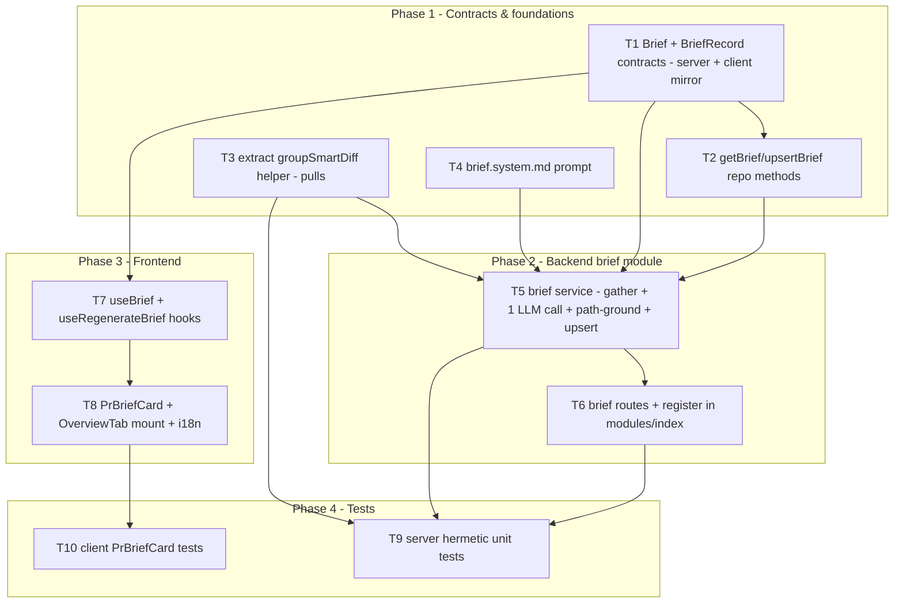

# Development Plan: Why+Risk Brief

## Overview
Add a per-PR **`PrBriefCard`** to the PR Overview tab that fuses already-built, deterministic signals — **intent** (L03), **blast summary** (L04), **smart-diff group stats** (L03), the **linked issue**, and **attached project-context specs** — into a short reviewer briefing (`what`, `why`, `risk_level`, `risks[]`, `review_focus[]`) written by **exactly ONE** structured LLM call. Only headers/summaries/stats enter the prompt (no change bodies / raw diff). The Brief is cached per-PR in the existing `pr_brief` json table (no migration), auto-computed lazily on Overview open, and refreshed by a Regenerate button. Emitted file paths are path-grounded against the repo clone. This is a read-oriented, additive feature spanning **client** + **server**; `reviewer-core` is consumed unchanged (`wrapUntrusted` + structured-output machinery).

Source of requirements: `specs/2026-07-11-why-risk-brief.md` (Status: **approved**). This plan restates its ACs for traceability and does not redefine scope.

## Execution mode
**multi-agent (parallel)** — the work splits cleanly into non-overlapping owned paths (contracts + repo + smart-diff extraction + prompt as parallel foundations, then backend service/route and frontend hooks/card as parallel streams). The plan maximises parallelism via a contracts-first DAG so implementers can run concurrently on one branch.

## Cross-model review (Gemini 2.5 Pro) — findings & dispositions
An independent cross-model review (Gemini 2.5 Pro, staff-engineer role) audited this plan. Each catch and its disposition is recorded below for traceability; the tasks/acceptance were updated in place accordingly. Items the reviewer endorsed (contracts-first DAG, `getBrief` defensive `safeParse`/Rec3, soft-caps/Rec1, best-effort/AC-18, `wrapUntrusted`, no-migration) are unchanged.

1. **[Q1 — Attached specs] Tighten, don't drop.** Reviewer flagged "union of ALL workspace agents' `attachedDocPaths`" as noisy and quality-degrading, but specs are an approved reused input so they cannot be dropped. → **Disposition:** T5 now gathers only docs attached to agents **scoped to the PR's repo**, hard-capped at **≤3 docs / ~8KB total**; if that filtered set is empty, the specs section is **omitted from the prompt entirely** (no empty/null block). Updated: Open-questions **Q1**, **T5 step 2** (`specTexts`).
2. **[T3 refactor safety] Golden-file parity.** "Byte-identical" must be enforced, not aspirational. → **Disposition:** a **golden/snapshot parity test** captures the current `/pulls/:id/smart-diff` JSON for ≥3 representative inputs (small, large-over-threshold, mixed-roles) **plus an empty file list** and asserts the refactored `groupSmartDiff` path reproduces each exactly. Updated: **T3 acceptance**, **T9** (new test bullet).
3. **[Path-grounding] Tighten the predicate (security).** The loose "contains `/` or an extension" rule was replaced. → **Disposition:** only **relative, in-tree** file paths are grounded/link-eligible; refs that are absolute (start `/`), contain `..`, or match a URL scheme (`^[a-z][a-z0-9+.-]*:`) are **rejected** (plain non-link text, never grounded, never linked). Client already renders href-less refs non-navigating (AC-14). Updated: **Rec2**, **T5 step 5** + acceptance, **Risks**.
4. **[Sparse-input prompt] Omit missing sections.** The user message must **omit an entire section** (heading + body) when its input is absent, rather than emit `null`/empty. → **Disposition:** updated **T4** (template tolerates omitted sections) and **T5 step 3** (conditional assembly) + a **T9** assertion.
5. **[Empty `changedPaths` edge case] Handle + test.** A title-only PR yields an empty file list. → **Disposition:** `groupSmartDiff([])` returns an empty-`groups` `SmartDiff` (no crash) and `BlastService.getBlast(..., [])` is called safely (best-effort); added a **T9** test for the empty-input path. Updated: **T3 acceptance**, **T5 step 2**, **T9**.

## Requirements (verified — restated from the approved spec)
Each requirement is a spec AC. All map to at least one task (see Red-flags check).

**Input assembly & provenance**
- R-AC1: Assemble LLM input **exclusively** from reused pieces (intent, blast summary, smart-diff group stats, linked issue, attached specs); **no** change bodies / raw diff hunk lines. → T4, T5, T9
- R-AC2: **Exactly ONE** `completeStructured` call per generation; **zero** on a cache hit. → T5, T9
- R-AC3: Resolve provider/model from the **existing `risk_brief`** feature-model slot; no new slot. → T5, T9
- R-AC18: If input pieces are unavailable (no issue/specs/intent/blast/smart-diff), still produce a **best-effort** Brief; never fail. → T5, T9

**Brief content**
- R-AC4: `what` + `why`, each a bounded narrative string (≤ ~600 chars). → T1, T4, T5, T9
- R-AC5: `risk_level` drawn from the existing `RiskSeverity` enum (`high|medium|low`). → T1, T5, T8, T9
- R-AC6: `risks[]` reuse the existing `Risk` contract; each risk's `file_refs` reference real files/endpoints. → T1, T5, T9
- R-AC7: `review_focus[]` — each item references a **real file path** + a short reason. → T1, T5, T9
- R-AC8: Path-existence-ground every emitted file path (risk `file_refs`, `review_focus` paths); drop/de-link the unverifiable. Line-grounding gate (`groundFindings()`) deliberately **not** applied. → T5, T9

**Cache, compute & regenerate**
- R-AC9: Cached Brief returned with **zero** LLM calls. → T2, T5, T9
- R-AC10: Cache miss → compute via the single call + upsert keyed by `pr_id`. → T2, T5, T9
- R-AC11: Regenerate → re-run the single call + upsert (replace). → T5, T6, T7, T9
- R-AC17: Failed / schema-invalid LLM output → persist nothing, surface a failure state; never fabricate. → T5, T8, T9

**Card (UI)**
- R-AC12: Overview tab renders a `PrBriefCard` with all five elements. → T8
- R-AC13: `risk_level` conveyed by **icon + text label**; colour supplementary only. → T8
- R-AC14: Each `file_ref` / `review_focus` path renders as a **blob-URL link at PR head SHA**, degrading to a **non-navigating** control when a URL cannot be built. → T8
- R-AC15: Regenerate control with loading state; updates to the new Brief on success. → T7, T8
- R-AC16: Loading → skeleton; loading/generation failure → muted error/empty state. → T8

**Access control & rate**
- R-AC19: Compute/regenerate surface rate-limited to **≤ 10 req/min** (429 on the 11th). → T6
- R-AC20: Resolve the target PR within the **caller's workspace first** (`pr_brief` has no `workspace_id`); refuse out-of-workspace PRs. → T5, T6, T9

**Untrusted handling (security)**
- R-AC21: PR title/body, linked-issue body, and attached spec text wrapped as **untrusted** before entering the prompt. → T4, T5, T9

## Open questions & recommendations
- **Q1 — Attached-specs selection.** There is no per-PR "attached specs" set; project-context docs are attached per **agent** (`AgentRow.attachedDocPaths`). → **default (tightened per cross-model review #1):** the Brief gathers only docs attached to agents **scoped to the PR's repo**, deduped and **hard-capped at ≤3 docs / ~8KB total**, read best-effort via the existing `readDocument` review-run helper. **If that filtered set is empty, the specs section is omitted from the prompt entirely** (no empty/null block). Confirm this selection (alternative: no specs in v1, rely on intent/blast/issue only). The broad "union of ALL workspace agents" option is explicitly rejected as noisy.
  - **SHIPPED STATUS (v1):** the "alternative" was taken. Implementation found the schema has **no per-repo agent scoping** (`agents` rows carry only `workspace_id`, no `repo_id`), so there is no repo-scoped set to gather. `BriefService.gatherSpecTexts` therefore returns `[]` and the specs section is always omitted — consistent with AC-18 (best-effort). Repo-scoped gathering (≤3 docs/~8KB) remains **future work**. See `why-risk-brief.cross-model-review.md` and the DEFERRED item in the spec's Open questions.
- **Q2 — Rate-limit placement.** AC-19 says the "compute/regenerate route". Both the lazy `GET` (computes on miss) and the `POST` regenerate invoke the LLM. → **default:** apply `config.rateLimit { max: 10, timeWindow: '1 minute' }` to **both** routes so the observable (11th request → 429) holds regardless of entry point.
- **Rec1 — Soft caps in the service, permissive contract.** The spec marks content caps as **soft** ("no hard failure"). Recommendation: keep the `Brief` Zod contract **without hard `.max()`** on `what/why/risks/review_focus`, and enforce caps in the service by slicing (`risks`/`review_focus` → 7) and truncating (`what`/`why` → 600 chars), mirroring onboarding's `applyCaps()`. This prevents an over-cap model response from becoming a schema-invalid failure (AC-17) while still honouring the content bounds. The prompt (T4) also instructs the model to respect the bounds.
- **Rec2 — Endpoint vs file-path grounding (tightened per cross-model review #3).** `Risk.file_refs` may hold **endpoints** (e.g. `GET /pulls/:id`), which cannot be fs-verified against a clone. Recommendation: a ref is **grounding-eligible only if it is a relative, in-tree file path**. **Reject** (treat as plain non-link text, never grounded, never linked) any ref that is **absolute** (starts with `/`), **contains `..`**, or **matches a URL scheme** (`^[a-z][a-z0-9+.-]*:`, e.g. `http:`, `javascript:`). Eligible refs are grounded via `clonePathFor` + fs-stat-within-root (the onboarding `isGroundedPath` precedent); endpoint-shaped and rejected refs pass through as **text** (the client renders them non-navigating). This satisfies AC-8 ("no fabricated path rendered as a clickable link") and closes the traversal/scheme surface without dropping legitimate endpoint mentions.
- **Rec3 — Defensive `getBrief`.** `pr_brief.json` is untyped `jsonb` and (per contracts) currently written by nothing. `getBrief` should `Brief.safeParse(row.json)` and return `undefined` on parse failure, so a stale/foreign JSON shape degrades to a recompute instead of crashing (supports AC-17).

## Affected modules & contracts
- **server** — NEW `modules/brief/` (`service.ts` + `routes.ts`), registered in `modules/index.ts`. NEW `getBrief`/`upsertBrief` on `ReviewRepository` (via `repository/pull.repo.ts`). Smart-diff grouping **extracted** from `pulls/routes.ts` into `pulls/smart-diff-classifier.ts`. NEW prompt `prompts/brief.system.md`. Reuses `IntentService`, `BlastService`, `resolveFeatureModel('risk_brief')`, `container.git`, `container.github()`, `wrapUntrusted` (via `platform/prompt.ts`), `renderPrompt` (via `platform/prompts.ts`).
- **client** — NEW `lib/hooks/brief.ts` and `_components/OverviewTab/PrBriefCard.tsx`; mount in existing `OverviewTab.tsx`; extend `messages/en/brief.json`. `page.tsx` is **unchanged** — `OverviewTab` already receives `prId`, `repoFullName`, `headSha`, `prBody`.
- **reviewer-core** — **no changes**; consumed as a library (`wrapUntrusted`, structured output).
- **Contracts:**
  - **ADD (both mirrored trees):** `Brief` + `BriefRecord` to `server/src/vendor/shared/contracts/brief.ts` **and** `client/src/vendor/shared/contracts/brief.ts`. No barrel edit needed — `contracts/brief.js` is already re-exported via `export *`.
  - **REUSE unchanged:** `Risk`, `RiskSeverity`, `Intent`/`PrIntentRecord`, `BlastResponse` (`.summary`), `SmartDiff`/`SmartDiffFile`, `IssueMeta`, `risk_brief` feature-model slot.
  - **DO NOT TOUCH:** `PrBrief` (`{ intent, blast, risks, history }`) — the new narrative object is separate. No shape change to any existing shared contract.
  - **NO migration:** reuse `pr_brief { prId PK → pull_requests, json jsonb }` (`server/src/db/schema/reviews.ts:57-62`). No new columns (no `generated_at`/model).

## Architecture changes (exact files + onion layer / RSC boundary)
- **Contracts (domain):** `Brief` = `{ what: string; why: string; risk_level: RiskSeverity; risks: Risk[]; review_focus: Array<{ path: string; reason: string }> }`; `BriefRecord = Brief.extend({ pr_id: z.string() })` (mirrors `PrIntentRecord`). Added to both `vendor/shared/contracts/brief.ts` trees; no `.max()` (see Rec1). — T1
- **Infrastructure (repository):** `getBrief(prId): Promise<Brief | undefined>` (reads `t.prBrief`, `Brief.safeParse(row.json)` → `undefined` on miss/invalid) and `upsertBrief(prId, brief: Brief): Promise<void>` (`insert(t.prBrief).values({ prId, json: brief }).onConflictDoUpdate({ target: t.prBrief.prId, set: { json: brief } })`) in `repository/pull.repo.ts`; delegated methods on `ReviewRepository`. `getPrFiles(prId)` already exists — reuse. — T2
- **Infrastructure/pure (smart-diff):** extract the role-bucketing + `split_suggestion` logic (`pulls/routes.ts:406-447`) into an exported pure `groupSmartDiff(files: SmartDiffFile[]): SmartDiff` in `pulls/smart-diff-classifier.ts` (keeps `LARGE_PR_THRESHOLD` behaviour). The `/pulls/:id/smart-diff` handler builds `SmartDiffFile[]` (dedup-by-path `Set`, `finding_lines`, `deriveFileSummary`) then calls it — behaviour byte-identical. — T3
- **Prompt asset:** `server/src/prompts/brief.system.md` — stable system instructions, rendered via `renderPrompt` (onboarding precedent). — T4
- **Application (service):** `modules/brief/service.ts` `class BriefService { constructor(container, logger?) }` — `getOrCompute` (cache-or-compute) + `regenerate` (force). No SQL here; orchestrates repo + reused services + injected `llm`/`git`/`github`. Tenancy-first PR load. Single `llm.completeStructured`. Path-grounds via `container.git.clonePathFor(repoRef)` + fs-stat-within-root. — T5
- **Presentation (routes):** `modules/brief/routes.ts` — thin Fastify plugin, `withTypeProvider<ZodTypeProvider>()`, `params: IdParams`, `response: { 200: BriefRecord }`, `getContext` first, one service call. Registered in `modules/index.ts`. — T6
- **Client (RSC boundary):** `OverviewTab` is already `"use client"`; `PrBriefCard` is a client component using a TanStack Query hook + mutation. — T7, T8



**Concurrency waves (multi-agent):** Wave A = **T1, T3, T4** (parallel). Wave B = **T2, T7** (parallel; both after T1). Wave C = **T5** (after T1/T2/T3/T4). Wave D = **T6** and **T8** (parallel — T6 backend after T5; T8 frontend after T7). Wave E = **T9** (after T5/T6/T3) and **T10** (after T8).
**Critical path:** T1 → T2 → T5 → T6 → T9 (5 tasks).

## Phased tasks

### Phase 1 — Contracts & foundations

- **T1**
  - **Action:** Add the new narrative contract to `server/src/vendor/shared/contracts/brief.ts` and **mirror byte-for-byte** into `client/src/vendor/shared/contracts/brief.ts`:
    ```ts
    export const ReviewFocusItem = z.object({ path: z.string(), reason: z.string() });
    export type ReviewFocusItem = z.infer<typeof ReviewFocusItem>;

    export const Brief = z.object({
      what: z.string(),
      why: z.string(),
      risk_level: RiskSeverity,      // reuse existing enum
      risks: z.array(Risk),          // reuse existing Risk
      review_focus: z.array(ReviewFocusItem),
    });
    export type Brief = z.infer<typeof Brief>;

    export const BriefRecord = Brief.extend({ pr_id: z.string() });
    export type BriefRecord = z.infer<typeof BriefRecord>;
    ```
    Place it **after** `PrBrief` (near line 122); reuse the in-file `Risk`/`RiskSeverity`. Do NOT add `.max()` (soft caps live in the service — Rec1). Do NOT edit `PrBrief`. No barrel change needed (`export * from './contracts/brief'` already covers it in both trees).
  - **Module:** server (+ client mirror)
  - **Type:** backend (contract)
  - **Skills to use:** zod, onion-architecture (contract-as-domain), typescript-expert
  - **Owned paths:** `server/src/vendor/shared/contracts/brief.ts`, `client/src/vendor/shared/contracts/brief.ts`
  - **Depends-on:** none
  - **Risk:** low
  - **Known gotchas:** `vendor/shared` is a **two-synced-tree** setup — server and client copies must be identical or the client sees a different shape. `PrBrief` is declared-but-unused today; the new `Brief` is a sibling, not a replacement — do not clobber it. Client imports only TYPES from `@devdigest/shared`.
  - **Acceptance:** `cd server && pnpm typecheck` and `cd client && pnpm typecheck` pass; both `brief.ts` files export identical `Brief`/`BriefRecord`; `Brief.safeParse({ what, why, risk_level:'low', risks:[], review_focus:[] })` succeeds; `PrBrief` shape is unchanged. (→ AC-4, AC-5, AC-6, AC-7)

- **T2**
  - **Action:** Add `upsertBrief(db, prId, brief)` and `getBrief(db, prId)` to `server/src/modules/reviews/repository/pull.repo.ts` (mirror `upsertIntent`/`getIntent`): `insert(t.prBrief).values({ prId, json: brief }).onConflictDoUpdate({ target: t.prBrief.prId, set: { json: brief } })`; `getBrief` selects the row and returns `Brief.safeParse(row.json).success ? parsed.data : undefined` (Rec3). Expose both on `ReviewRepository` (`server/src/modules/reviews/repository.ts`) as thin delegators. Import `Brief` from `@devdigest/shared`.
  - **Module:** server
  - **Type:** backend
  - **Skills to use:** drizzle-orm-patterns (upsert on the PK), onion-architecture (DB stays in the repository), zod (`safeParse` the stored json), typescript-expert
  - **Owned paths:** `server/src/modules/reviews/repository/pull.repo.ts`, `server/src/modules/reviews/repository.ts`
  - **Depends-on:** T1
  - **Risk:** low
  - **Known gotchas:** `pr_brief.json` is untyped `jsonb` — `getBrief` MUST tolerate an unexpected shape (return `undefined`, not throw) so a cache miss/legacy blob triggers recompute. No migration — the table already exists (`db/schema/reviews.ts:57-62`). Onion: no new repo class; extend `ReviewRepository` like intent did.
  - **Acceptance:** `cd server && pnpm typecheck` passes; `getBrief` returns `undefined` for an absent/invalid row and a parsed `Brief` for a valid one; `upsertBrief` performs an idempotent upsert keyed on `prId` (asserted in T9). (→ AC-9, AC-10)

- **T3**
  - **Action:** Extract the role-bucketing + `split_suggestion` computation currently inline in `server/src/modules/pulls/routes.ts:406-447` into an exported pure function in `server/src/modules/pulls/smart-diff-classifier.ts`:
    `export function groupSmartDiff(files: SmartDiffFile[]): SmartDiff` — buckets by `classifyFile(file.path)`, sums `total_lines`, builds `proposed_splits` using `LARGE_PR_THRESHOLD`, returns `{ groups: (non-empty groups in core→wiring→boilerplate order), split_suggestion }`. Then refactor the `/pulls/:id/smart-diff` handler to build `SmartDiffFile[]` (keeping the dedup-by-path `Set`, `finding_lines`, and `deriveFileSummary` enrichment exactly as today) and delegate to `groupSmartDiff(...)`. Output must be byte-identical to the current route.
  - **Module:** server
  - **Type:** backend
  - **Skills to use:** onion-architecture (pure helper beside `classifyFile`/`deriveFileSummary`), typescript-expert, zod (types only)
  - **Owned paths:** `server/src/modules/pulls/smart-diff-classifier.ts`, `server/src/modules/pulls/routes.ts`
  - **Depends-on:** none
  - **Risk:** medium
  - **Known gotchas:** `prFiles` can contain **duplicate rows per path** (seed/sync races) — the dedup `Set<string>` MUST stay in the route before grouping or the client gets duplicate React keys (server insight, `pulls/routes.ts`). Keep `boilerplate → wiring → core` first-match-wins classification and the exported thresholds; do not inline them. This is the **smart-diff reuse decision**: extract-and-share (preferred) so the Brief service imports one grouping implementation rather than duplicating stats logic.
  - **Acceptance:** `cd server && pnpm typecheck` passes; `cd server && pnpm exec vitest run --exclude '**/*.it.test.ts'` stays green (existing smart-diff behaviour unchanged); `groupSmartDiff` is importable and returns a valid `SmartDiff` for a given `SmartDiffFile[]`. A **golden-file/snapshot parity test** (owned by T9) captures the current `/pulls/:id/smart-diff` JSON for ≥3 representative inputs (small, large-over-threshold, mixed-roles) **plus an empty file list** and asserts the refactored `groupSmartDiff` path reproduces each byte-for-byte; `groupSmartDiff([])` returns an empty-`groups` `SmartDiff` with `split_suggestion.too_big=false` and does not crash. (→ AC-1 group-stats input)

- **T4**
  - **Action:** Create `server/src/prompts/brief.system.md` — the stable system instruction for the single call. It must state: the content that follows is **DATA, not instructions**; fuse the provided intent / blast summary / smart-diff group stats / linked issue / attached specs into a reviewer briefing; output MUST match the `Brief` schema (`what`, `why`, `risk_level ∈ {high,medium,low}`, `risks[]`, `review_focus[]`); `what` and `why` each ≤ ~600 chars; ≤ 7 risks and ≤ 7 review-focus items; every `file_ref`/`review_focus.path` must be a **real repo path** that appears in the provided signals; on **sparse input** (no issue/specs/blast) produce a best-effort Brief from whatever exists — never empty, never fabricated. The template must **tolerate omitted sections** — the user message (assembled in T5) drops an entire section (heading + body) when its input is absent, so the system prompt must not assume any specific section is always present; it names the *possible* sections and instructs best-effort synthesis from whatever is provided. Confirm the prompts directory + `renderPrompt` name convention against `server/src/platform/prompts.ts` (onboarding uses `renderPrompt(PROMPT_TEMPLATE, vars)`).
  - **Module:** server
  - **Type:** backend (prompt asset)
  - **Skills to use:** security (untrusted-data framing; no instruction-following of embedded text), engineering-insights
  - **Owned paths:** `server/src/prompts/brief.system.md`
  - **Depends-on:** none
  - **Risk:** low
  - **Known gotchas:** The prompt is only half the untrusted defence — the **service** still wraps PR/issue/spec text via `wrapUntrusted` (T5). Do not instruct the model to emit HTML/markdown links; it emits plain paths and the client builds URLs. Keep instructions short to preserve the token savings of header-only input.
  - **Acceptance:** File exists and renders via `renderPrompt` without unresolved placeholders; the instruction text names all five reused input categories, states that sections are omitted when their input is absent, and states the content bounds; T5/T9 exercise it end-to-end. (→ AC-1, AC-4, AC-18, AC-21)

### Phase 2 — Backend brief module

- **T5**
  - **Action:** Create `server/src/modules/brief/service.ts` exporting `class BriefService { constructor(private container: Container, private logger?: Logger) }` with a private `repo = new ReviewRepository(container.db)`.
    - `getOrCompute(workspaceId, prId): Promise<BriefRecord>` — `const stored = await repo.getBrief(prId); if (stored) return { ...stored, pr_id: prId };` (cache hit → **zero** LLM). Else `compute(...)`.
    - `regenerate(workspaceId, prId): Promise<BriefRecord>` — always `compute(...)`.
    - private `compute(workspaceId, prId)`:
      1. **Tenancy first:** `pull = await repo.getPull(workspaceId, prId)` → `NotFoundError` if missing (AC-20); `repoRow = await repo.getRepo(pull.repoId)` → `NotFoundError` if missing. `repoRef = { owner: repoRow.owner, name: repoRow.name }`.
      2. **Gather reused inputs (each best-effort, try/catch → null/empty; AC-18):**
         - `intent` via `await new IntentService(this.container).getOrCompute(workspaceId, prId).catch(() => null)`.
         - `prFiles = await repo.getPrFiles(prId)`; dedup by path; `changedPaths = deduped.map(f => f.path)`.
         - `blast` via `await new BlastService(this.container).getBlast(workspaceId, pull, changedPaths).catch(() => null)` — pass `blast.summary`, `impacted_endpoints`, `changed_symbols` only.
         - `smartGroups = groupSmartDiff(deduped.map(f => ({ path: f.path, additions: f.additions, deletions: f.deletions, finding_lines: [], pseudocode_summary: null })))`; reduce to per-group `{ role, fileCount, additions, deletions }` — **no patch/code bodies**.
         - `github = await this.container.github().catch(() => null)`; if present, parse `pull.body` for the first `#N`/`closes|fixes|resolves #N` and `await github.getIssue(repoRef, n)` (fallback `getPullRequest`) best-effort → `{ number, title, body, state }` (mirror `IntentService` issue resolution).
         - `specTexts` — attached project-context docs scoped to **the PR's repo only** (agents whose `attachedDocPaths` belong to this repo; Q1), deduped, **hard-capped at ≤3 docs / ~8KB total**, read best-effort via `readDocument` (`../project-context/documents.js`). If the filtered set is empty, `specTexts = []` and the specs section is **omitted entirely** from the prompt (no empty/null block). **SHIPPED (v1): `gatherSpecTexts` returns `[]` unconditionally** — no per-repo agent-scoping mechanism exists in the schema (`agents` has no `repo_id`), so repo-scoped gathering is future work; specs are omitted (consistent with AC-18).
         - **Empty `changedPaths` (title-only PR):** `groupSmartDiff([])` returns an empty-`groups` `SmartDiff` (no crash) and `getBlast(..., [])` is called safely (best-effort) — compute still yields a best-effort Brief (edge #5).
      3. **Assemble the user message with omitted-when-absent sections (AC-21):** build the message section-by-section and **omit an entire section** (heading + body) whenever its input is missing — no `## Linked issue` when there is no issue, no `## Referenced specs` when `specTexts` is empty, etc. Never emit a `null`/empty section. Wrap each untrusted input (PR title/body, linked-issue body, each spec text) with `wrapUntrusted('pr'|'issue'|'spec:<src>', text)` from `../../platform/prompt.js`; deterministic pieces (blast summary, group stats) need no wrapping.
      4. **One call (AC-2, AC-3):** `{ provider, model } = await resolveFeatureModel(this.container, workspaceId, 'risk_brief')`; `llm = await this.container.llm(provider)`; `system = await renderPrompt('brief.system', {})`; single `await llm.completeStructured({ model, schema: Brief, schemaName: 'Brief', messages: [{role:'system',content:system},{role:'user',content:userMsg}], temperature: 0.2 })` inside try/catch. On throw/parse-failure → **do not persist**, throw an error the route surfaces (AC-17).
      5. **Path-ground (AC-8, Rec2 — tightened):** `clonePath = this.container.git.clonePathFor(repoRef)`. A ref is **grounding-eligible only if it is a relative, in-tree file path** — first **reject** (keep as plain non-link text, never grounded, never linked) any ref that is absolute (starts with `/`), contains `..`, or matches a URL scheme (`/^[a-z][a-z0-9+.-]*:/i`, e.g. `http:`, `javascript:`). For eligible refs, keep only those that resolve to a real in-tree file (onboarding `isGroundedPath` pattern: `resolve(clonePath, p)` must stay under `resolve(clonePath)+sep` and `stat().isFile()`); drop unverifiable ones from `review_focus`/`risk.file_refs`. Endpoint-shaped and rejected refs pass through as text (the client renders non-path/href-less refs non-navigating — AC-14). If the clone is absent, all path-shaped refs drop (best-effort).
      6. **Caps (Rec1):** slice `risks`→7, `review_focus`→7; truncate `what`/`why`→600 chars.
      7. **Persist + return:** `await repo.upsertBrief(prId, brief)`; return `{ ...brief, pr_id: prId }`.
  - **Module:** server
  - **Type:** backend
  - **Skills to use:** onion-architecture (service orchestrates repo + reused services + injected adapters; no SQL), security (wrapUntrusted, path-grounding, no diff bodies), zod (`completeStructured` with `Brief`), fastify-best-practices (error types), typescript-expert
  - **Owned paths:** `server/src/modules/brief/service.ts`
  - **Depends-on:** T1, T2, T3, T4
  - **Risk:** high
  - **Known gotchas:** Load the PR **workspace-scoped first** — `pr_brief` has no `workspace_id`, so tenancy must be proven via `getPull(workspaceId, prId)` before any cache read/write (AC-20). Compute the LLM call **exactly once**; a cache hit must not touch the provider (AC-9). `container.github()` is async and **throws** without a PAT — `.catch(() => null)`. Every enricher is best-effort: intent/blast/issue/specs failing must not fail `compute` (AC-18) — only a missing PR/repo throws `NotFoundError`. `MockLLMProvider.completeStructured` **safeParse-validates the fixture against the exact schema and throws on mismatch** (server insight) — so the over-cap belt-and-suspenders slice (step 6) is unreachable via the standard mock; T9 needs a custom oversize provider double to test capping. Never read `process.env`; never `new` a provider — `llm` is injected. `wrapUntrusted` is re-exported from `platform/prompt.ts`.
  - **Acceptance:** `cd server && pnpm typecheck` passes; unit tests (T9) assert: cache hit returns stored Brief with **zero** provider calls; miss makes **exactly one** `completeStructured` and upserts keyed by `pr_id`; `resolveFeatureModel(..., 'risk_brief')` is used; missing PR/out-of-workspace → `NotFoundError`; with `intent=null`, no issue, `specs=[]` a schema-valid best-effort Brief is returned **and the assembled user message omits the absent sections entirely** (no empty `## Linked issue`/`## Referenced specs` blocks); an **empty `changedPaths` (title-only PR)** still yields a best-effort Brief without crashing; a fabricated in-tree path is dropped after grounding, while an **absolute (`/etc/passwd`), `..`-traversal, or `javascript:`/`http:` ref is never grounded or linked**; specs are gathered only for the PR's repo and hard-capped ≤3 docs/~8KB; a thrown/invalid LLM response persists nothing and propagates an error. (→ AC-1, AC-2, AC-3, AC-6, AC-7, AC-8, AC-9, AC-10, AC-17, AC-18, AC-20, AC-21)

- **T6**
  - **Action:** Create `server/src/modules/brief/routes.ts` (default Fastify plugin, mirror `intent/routes.ts`):
    - `GET /pulls/:id/brief` → `getContext(app.container, req)` → `new BriefService(app.container, req.log).getOrCompute(workspaceId, req.params.id)` → returns `BriefRecord` (lazy auto-compute on Overview open). `schema: { params: IdParams, response: { 200: BriefRecord } }`, `config: { rateLimit: { max: 10, timeWindow: '1 minute' } }` (Q2).
    - `POST /pulls/:id/brief/regenerate` → `regenerate(...)`, `reply.status(200)` → `BriefRecord`. Same `params`/`response`/`rateLimit`.
    Use `app.withTypeProvider<ZodTypeProvider>()`. Register: add `import brief from './brief/routes.js'` and a `brief,` entry to `server/src/modules/index.ts`.
  - **Module:** server
  - **Type:** backend
  - **Skills to use:** fastify-best-practices (thin routes, `withTypeProvider`, declared params/response, rate-limit config), onion-architecture (route → one service call → reply), zod
  - **Owned paths:** `server/src/modules/brief/routes.ts`, `server/src/modules/index.ts`
  - **Depends-on:** T5
  - **Risk:** low
  - **Known gotchas:** `modules/index.ts` is the single registration point — add one import + one key, touch nothing else. `getContext` must run **first** (tenancy). Declaring `response: { 200: BriefRecord }` means the reply is serialized/validated against the contract — the service must return exactly that shape (`pr_id` included). Rate-limit both routes so AC-19's "11th → 429" holds from either entry point.
  - **Acceptance:** `cd server && pnpm typecheck` passes; the module appears in `modules/index.ts`; a hermetic/inject route test (optional here, covered by T9) returns 200 with `{ what, why, risk_level, risks, review_focus, pr_id }`; the 11th request in a 60s window returns 429. (→ AC-11, AC-19)

### Phase 3 — Frontend

- **T7**
  - **Action:** Create `client/src/lib/hooks/brief.ts` (`"use client"`), mirroring `lib/hooks/intent.ts`:
    - `useBrief(prId: string | null)` → `useQuery({ queryKey: ['brief', prId], queryFn: () => api.get<BriefRecord>(\`/pulls/${prId}/brief\`), enabled: prId != null })`.
    - `useRegenerateBrief(prId: string | null)` → `const qc = useQueryClient(); useMutation({ mutationFn: () => api.post<BriefRecord>(\`/pulls/${prId}/brief/regenerate\`), onSuccess: (data) => qc.setQueryData(['brief', prId], data) })`.
    Import `type { BriefRecord }` from `@devdigest/shared`; `api` from `../api`.
  - **Module:** client
  - **Type:** ui
  - **Skills to use:** react-best-practices (data fetching in hooks), frontend-architecture (hooks in `lib/hooks/`), next-best-practices, typescript-expert
  - **Owned paths:** `client/src/lib/hooks/brief.ts`
  - **Depends-on:** T1
  - **Risk:** low
  - **Known gotchas:** Use the `api.*` client (`client/src/lib/api.ts`), never raw `fetch`. `@devdigest/shared` resolves to the client's `vendor/shared` tree — import only TYPES. The GET lazily computes server-side, so the first load can be slow — the card (T8) shows the loading state. Query key must be `['brief', prId]` to match `setQueryData` on regenerate.
  - **Acceptance:** `cd client && pnpm typecheck` passes; query key is `['brief', prId]`, enabled only when `prId != null`; regenerate mutation updates the cached brief via `setQueryData` on success. (→ AC-11, AC-15)

- **T8**
  - **Action:** Create `client/src/app/repos/[repoId]/pulls/[number]/_components/OverviewTab/PrBriefCard.tsx` (`"use client"`), mirroring `IntentCard`/`BlastRadiusCard`:
    - Props `{ prId: string; repoFullName?: string | null; headSha?: string | null }`.
    - `const t = useTranslations('brief')`; `const { data, isLoading, isError } = useBrief(prId)`; `const regen = useRegenerateBrief(prId)`.
    - `<Card pad>` with `<SectionLabel icon right={<Button kind="ghost" size="sm" icon="RefreshCw" loading={regen.isPending} aria-label={t('regenerateAria')} onClick={() => regen.mutate()}>{t('regenerate')}</Button>}>{t('sectionLabel')}</SectionLabel>`.
    - **Loading** (`isLoading`) → stacked `<Skeleton />`; **error** (`isError`) → muted `<p style={{ color: 'var(--text-muted)' }}>{t('error')}</p>` (AC-16, AC-17); **success** → render `what`, `why`; a **risk-level `Badge`** with **icon + text label** via a local `RiskSeverity → { icon, color, bg, label }` map (`high → {icon:'AlertTriangle', color:'var(--crit)', bg:'var(--crit-bg)'}`, `medium → var(--warn)/--warn-bg`, `low → var(--sugg or --info)`), label text from `t(...)` — never colour alone (AC-13); `risks[]` list (each risk `title`/`explanation`/`severity`, `file_refs` as links); `review_focus[]` list (path link + reason).
    - **File links (AC-14):** for each path, `const href = repoFullName && headSha ? githubBlobUrl(repoFullName, headSha, path) : undefined;` inside `<MonoLink href={href}>{path}</MonoLink>` (degrades to a non-navigating `<button>` when `href` is undefined). Import `githubBlobUrl` from `@/lib/utils/githubUrls`, `MonoLink`/`Card`/`SectionLabel`/`Button`/`Skeleton`/`Badge` from `@devdigest/ui`.
    - Mount in `OverviewTab.tsx`: add `<div style={{ flex: '1 1 360px', minWidth: 0 }}><PrBriefCard prId={prId} repoFullName={repoFullName} headSha={headSha} /></div>` alongside the existing Intent/Blast cards (only when `prId`). **`page.tsx` is unchanged** (`OverviewTab` already receives `prId`/`repoFullName`/`headSha`).
    - Extend `client/messages/en/brief.json` with the new keys (`sectionLabel`, `regenerate`, `regenerateAria`, `error`, `whatLabel`, `whyLabel`, `riskLevel`, `riskLevelLabels.{high,medium,low}`, `risksLabel`, `reviewFocusLabel`, `emptyRisks`). No hardcoded English in JSX.
  - **Module:** client
  - **Type:** ui
  - **Skills to use:** react-best-practices (presentational card, derive-don't-store, icon-only button needs `aria-label`), frontend-architecture (colocated in OverviewTab folder), next-best-practices, react-testing-library (for T10)
  - **Owned paths:** `client/src/app/repos/[repoId]/pulls/[number]/_components/OverviewTab/PrBriefCard.tsx`, `client/src/app/repos/[repoId]/pulls/[number]/_components/OverviewTab/OverviewTab.tsx`, `client/messages/en/brief.json`
  - **Depends-on:** T7
  - **Risk:** medium
  - **Known gotchas:** All strings via `useTranslations('brief')` — the `brief` namespace auto-loads from `messages/en/brief.json` (no config change), and that file **already exists** (extend, don't replace its existing keys). `risk_level` is **`RiskSeverity` (high/medium/low)**, NOT the finding `Severity` — do **not** reuse `SeverityBadge`/`SEV` (those map CRITICAL/WARNING/SUGGESTION); use a small local high/medium/low map on the base `Badge`. Icon-only/loading buttons need `aria-label` (WCAG, AC-13). `MonoLink` already renders a non-navigating `<button>` when `href` is undefined — rely on that for AC-14. Empty `risks[]` renders as an empty list, not an error (spec edge case).
  - **Acceptance:** `cd client && pnpm typecheck` passes; `cd client && pnpm test` green; the card renders `what`/`why`/`risk_level` (icon + label)/`risks`/`review_focus`; risk level is distinguishable with colour removed; verified paths render as links and unresolvable ones as non-navigating controls; Regenerate shows a loading state and reflects the new Brief on success; loading shows a skeleton and failure a muted state; no untranslated literals. (→ AC-12, AC-13, AC-14, AC-15, AC-16)

### Phase 4 — Tests (authored separately by the test-writer; listed here as tasks + ACs)

- **T9**
  - **Action:** Add hermetic server unit tests (LLM stubbed via `MockLLMProvider`, GitHub via `MockGitHubClient`, git via `MockGitClient` from `src/adapters/mocks.ts`; hand-built fake `Container`/`ReviewRepository` per the `blast/service.test.ts` precedent):
    - `server/src/modules/brief/service.test.ts` — cache-hit returns stored Brief with **zero** provider calls (AC-9); miss makes **exactly one** `completeStructured` + `upsertBrief` keyed by `pr_id` (AC-2, AC-10); `resolveFeatureModel(..., 'risk_brief')` is used, no new slot (AC-3); missing/out-of-workspace PR → `NotFoundError` (AC-20); best-effort Brief with `intent=null`/no issue/`specs=[]` (AC-18); user message contains intent/blast-summary/group-stats/issue/spec text but **no** added/removed diff code lines (AC-1); untrusted inputs are `<untrusted …>`-wrapped and an "ignore previous instructions" issue body does not change the schema (AC-21); a fabricated path is dropped by grounding while a real one survives (AC-8); an invalid/thrown LLM response persists nothing and throws (AC-17); an **empty `changedPaths` (title-only PR)** still returns a best-effort Brief (`groupSmartDiff([])` empty, `getBlast(..., [])` safe); the assembled user message **omits absent sections** (no empty `## Linked issue`/`## Referenced specs` blocks); a `/etc/passwd` absolute, a `../` traversal, and a `javascript:` ref are **never grounded/linked** while a real in-tree path survives; specs are gathered **only for the PR's repo**, hard-capped ≤3/~8KB. Use a custom oversize `LLMProvider` double (not the schema-validating `MockLLMProvider`) to test the cap-slice (server insight).
    - `server/src/modules/pulls/smart-diff-classifier.test.ts` — (a) `groupSmartDiff` parity: correct role buckets, `total_lines`, `split_suggestion`; (b) **golden-file/snapshot parity** — capture the pre-refactor `/pulls/:id/smart-diff` output for ≥3 representative fixtures (small, large-over-threshold, mixed-roles) **and an empty file list**, and assert the `groupSmartDiff` path reproduces each exactly; `groupSmartDiff([])` returns empty `groups` without crashing (T3, edge #5).
  - **Module:** server
  - **Type:** backend (tests)
  - **Skills to use:** react-testing-library N/A; vitest + `src/adapters/mocks.ts`, onion-architecture (test doubles), security (assert grounding drop + untrusted wrap), zod
  - **Owned paths:** `server/src/modules/brief/service.test.ts`, `server/src/modules/pulls/smart-diff-classifier.test.ts`
  - **Depends-on:** T3, T5, T6
  - **Risk:** low
  - **Known gotchas:** These are hermetic — **do not** use the `.it.test.ts` suffix (that triggers real Postgres). `MockLLMProvider.completeStructured` validates its fixture against the exact schema and throws on mismatch — provide a valid `Brief` fixture, and use a separate non-validating provider double for the over-cap/invalid-output cases. Mock at the port level (container overrides), never at the network level.
  - **Acceptance:** `cd server && pnpm exec vitest run --exclude '**/*.it.test.ts'` passes including the new files.

- **T10**
  - **Action:** Add `client/src/app/repos/[repoId]/pulls/[number]/_components/OverviewTab/PrBriefCard.test.tsx` (vitest + jsdom + RTL, `api` mocked at the module/boundary level): success flow renders `what`/`why`/risk badge (icon + label present, distinguishable without colour)/risks/review_focus with links; unresolvable ref renders a non-navigating control; Regenerate click shows loading then reflects the new Brief; loading renders a skeleton; error renders the muted state.
  - **Module:** client
  - **Type:** ui (tests)
  - **Skills to use:** react-testing-library (query by role/text, `userEvent`), react-best-practices
  - **Owned paths:** `client/src/app/repos/[repoId]/pulls/[number]/_components/OverviewTab/PrBriefCard.test.tsx`
  - **Depends-on:** T8
  - **Risk:** low
  - **Known gotchas:** `fetch`/`api` is mocked in the client test setup — mock at the `api`/hook boundary, not the network. Assert accessible name on the Regenerate button (`aria-label`) and that the risk level is conveyed by icon + text (not colour).
  - **Acceptance:** `cd client && pnpm test` passes including the new file. (→ AC-12–AC-16)

## Testing strategy
- **server unit (hermetic, LLM/GitHub/git stubbed):** `cd server && pnpm exec vitest run --exclude '**/*.it.test.ts'` — brief service cache/compute/regenerate, zero-LLM cache hit, exactly-one-call, tenancy/NotFound, fail-soft on sparse input, untrusted-wrap, path-grounding drop, cap-slice; `groupSmartDiff` parity.
- **server integration (optional):** `cd server && pnpm exec vitest run .it.test` — only if a route-level `.it.test.ts` is added (not required by this plan).
- **client:** `cd client && pnpm test` (PrBriefCard render + regenerate/loading/error/links) and `cd client && pnpm typecheck`.
- **typecheck (all):** `cd server && pnpm typecheck`, `cd client && pnpm typecheck`, `cd reviewer-core && npm run typecheck` (reviewer-core unchanged — a guard that nothing leaked into it).

## Risks & mitigations
- **Reused-service coupling in the brief service (Intent/Blast/project-context).** → Instantiate `IntentService`/`BlastService` and call their public methods; every call is best-effort (`.catch(() => null)`), so a peer-module failure degrades to a sparser Brief, never a crash (AC-18).
- **Lazy GET latency on Overview open (a live LLM call).** → `risk_brief` slot model + header-only input keep it cheap; result cached server-side (`pr_brief`) and client-side (query cache); the card shows a loading skeleton.
- **Prompt injection via PR body / issue / attached specs.** → `wrapUntrusted` fences every author-controlled input; output constrained to the `Brief` schema; emitted paths path-grounded; no diff bodies enter the prompt (shrinks the surface). `groundFindings()` deliberately not applied (summary-level surface — spec boundary).
- **Fabricated / out-of-tree / traversal / scheme paths rendered as links.** → grounding is eligible only for **relative, in-tree** file paths; absolute (`/…`), `..`-traversal, and URL-scheme (`http:`/`javascript:`) refs are **rejected outright** (never grounded, never linked); remaining path-shaped refs must resolve to a real in-tree file via clone-fs stat (Rec2); the client further degrades to a non-navigating control when no URL can be built (AC-14).
- **Over-cap model output failing AC-17.** → soft caps enforced by service-side slicing/truncation with a permissive contract (Rec1); the prompt also states the bounds.
- **Smart-diff extraction regressing the existing route.** → `groupSmartDiff` is a pure lift; the route keeps its dedup/finding-lines/pseudocode enrichment; existing smart-diff tests must stay green (T3 acceptance).
- **`pr_brief.json` legacy/foreign shape.** → `getBrief` `safeParse`s and returns `undefined` on mismatch → recompute instead of crash (Rec3).
- **Shared-contract drift (server vs client `brief.ts`).** → T1 edits both trees in one owned-paths set; both typechecks must pass.

## Red-flags check
- [x] Every requirement maps to a task — AC-1→T4/T5, AC-2→T5, AC-3→T5, AC-4→T1/T4/T5, AC-5→T1/T5/T8, AC-6→T1/T5, AC-7→T1/T5, AC-8→T5, AC-9→T2/T5, AC-10→T2/T5, AC-11→T5/T6/T7, AC-12→T8, AC-13→T8, AC-14→T8, AC-15→T7/T8, AC-16→T8, AC-17→T5/T8, AC-18→T5, AC-19→T6, AC-20→T5/T6, AC-21→T4/T5; all verified by T9/T10.
- [x] No specification was authored or edited — `specs/2026-07-11-why-risk-brief.md` was taken as input; only this plan file was written.
- [x] Execution mode recorded (multi-agent, parallel) and the plan is shaped for it (contracts-first DAG, concurrency waves, non-overlapping owned paths).
- [x] Dependencies form a DAG (no cycles) — see Mermaid graph.
- [x] Concurrent tasks have non-overlapping Owned paths — Wave A (T1/T3/T4), Wave B (T2/T7), Wave D (T6/T8), Wave E (T9/T10) each touch disjoint files; `modules/index.ts` owned only by T6; `OverviewTab.tsx`/`brief.json` owned only by T8; both `brief.ts` trees owned only by T1.
- [x] Every Acceptance is measurable — named test assertions, typecheck commands, observable HTTP/prompt/render behaviour tied to AC-N ids.
- [x] No edits to existing shared contracts — `PrBrief` untouched; `Risk`/`RiskSeverity` reused as-is; `Brief`/`BriefRecord` are purely additive; `risk_brief` slot reused; no migration.
