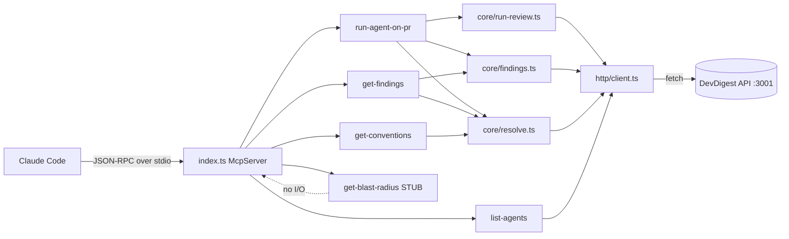

# DevDigest MCP Server

A local stdio MCP server that exposes 5 code-review tools to Claude Code.
The server is a thin HTTP client over the DevDigest API at `http://localhost:3001` — it holds no business logic of its own.

## Architecture



## Prerequisites

The DevDigest API **must be running on port 3001** before any tool call will succeed.

```bash
# From the repo root — starts Postgres + API (seeded) + web
./scripts/dev.sh

# API only (no web client)
./scripts/dev.sh --no-seed   # skip demo data
```

## Install

```bash
cd mcp-server
pnpm install
```

Dependencies are already declared in `package.json`; no separate build step is required.
`tsx` runs TypeScript directly at runtime.

## Tools reference

| Tool | Args | Returns | Annotations |
|---|---|---|---|
| `devdigest_list_agents` | _(none)_ | `{ agents: [{ id, name, enabled, model }] }` | readOnly, idempotent, openWorld |
| `devdigest_run_agent_on_pr` | `repo: string`, `pr: number`, `agent: string` | completed: `{ verdict, score, counts, findings[] }`; timeout: `{ status:"running", run_id, message }` | NOT readOnly, NOT idempotent, openWorld |
| `devdigest_get_findings` | `repo: string`, `pr: number`, `run_id?: string`, `response_format?: "concise"\|"detailed"`, `offset?: number`, `limit?: number` | `{ verdict, score, total, returned, offset, counts, findings[] }` | readOnly, idempotent, openWorld |
| `devdigest_get_conventions` | `repo: string` | `{ repo, conventions: [{ rule, file, confidence, accepted }] }` | readOnly, idempotent, openWorld |
| `devdigest_get_blast_radius` | `repo?: string`, `pr?: number` | `{ status: "not_implemented", message }` | readOnly, idempotent, openWorld |

### Recommended call order

1. `devdigest_list_agents` — get a valid `agent` id.
2. `devdigest_run_agent_on_pr` — trigger a review; blocks until done (up to ~2 min).
3. `devdigest_get_findings` — retrieve or paginate findings for a completed run.
4. `devdigest_get_conventions` — check findings against the repo's house rules.

## Design principles

1. **HTTP-wrap, not in-process.** The MCP server talks to `localhost:3001` over HTTP — it never imports the server's `Container` or touches the database.
2. **stdio transport; stderr only for logs.** stdout is the JSON-RPC channel — any stray write to stdout corrupts the protocol. All logging routes through `src/log.ts` (`console.error`).
3. **Errors lead forward.** Business failures are returned as tool results with `isError: true` and actionable messages (e.g. "Available repos: …", "Call `devdigest_list_agents` first"). Empty results are never errors.
4. **One composition root.** `src/index.ts` is the only place that constructs/wires concrete dependencies. Tools and core modules receive them by injection; nothing instantiates adapters on its own.

## Id-resolution strategy

Tool args use human-readable identifiers (`repo` as `owner/name` or bare name; `pr` as a PR number). Internally the API requires UUIDs.

Resolution is performed in `src/core/resolve.ts` via list-then-match:

- **repo → repoId**: `GET /repos` returns `Repo[]`; match `repo` case-insensitively against `full_name`, then `name`. Exactly one match → use its `id`. Ambiguous bare name → error asking for `owner/name`. No match → error listing available `full_name`s.
- **(repo, pr#) → pullId**: with the resolved `repoId`, `GET /repos/:repoId/pulls` returns `PrMeta[]`; match on `number === pr`. Not found → error with a few open PR numbers.

No direct lookup-by-name or lookup-by-number endpoint exists in the API; list-then-match is the only path.

## Verification

### MCP Inspector (interactive)

```bash
cd mcp-server

# Using the package script
pnpm inspect

# Or directly
npx @modelcontextprotocol/inspector tsx src/index.ts
```

Open the Inspector UI, confirm all 5 `devdigest_*` tools appear with their input schemas and annotations, then invoke each:

- `devdigest_list_agents` → array of `{id, name, enabled, model}`.
- `devdigest_get_conventions { repo: "owner/repo" }` → conventions list (or `isError` for an unknown repo).
- `devdigest_run_agent_on_pr { repo, pr, agent }` → blocks, then `{ verdict, score, findings[] }`; unknown agent → `isError` with valid ids.
- `devdigest_get_findings { repo, pr }` → concise findings; `response_format: "detailed"` for full fields.
- `devdigest_get_blast_radius {}` → `{ status: "not_implemented" }` — no error.

### CLI (no UI)

For a quick one-shot tool call without the Inspector — useful in scripts or smoke checks:

```bash
cd mcp-server
pnpm call devdigest_list_agents
pnpm call devdigest_get_conventions '{"repo":"owner/repo"}'
pnpm call devdigest_run_agent_on_pr '{"repo":"owner/repo","pr":42,"agent":"<agent-id>"}'
```

It spawns the server over stdio, performs the handshake, calls the one tool, prints the
result, and exits. Honors `DEVDIGEST_API_URL`; set `MAX_WAIT_MS` to extend the wait for
long reviews. See `scripts/call.mjs`.

### Inside Claude Code

The root `.mcp.json` registers the server automatically when Claude Code is opened from this repository.

```bash
# From the repo root
claude mcp list          # should show "devdigest" connected
```

Or type `/mcp` inside a Claude Code session — you should see `devdigest` listed with the 5 `devdigest_*` tools.

Then run a natural-language request:

```
List the available DevDigest agents, then run a review on PR #1 in my repo, 
and finally show me the findings.
```

Claude Code will invoke `devdigest_list_agents` → `devdigest_run_agent_on_pr` → `devdigest_get_findings` in sequence.

### Stdout-cleanliness check

```bash
# Must produce no stdout output (only stderr is allowed)
cd mcp-server && pnpm start </dev/null 2>/dev/null | head -c 200

# Check for accidental console.log usage
! grep -rn "console.log(" mcp-server/src && echo "clean"
```
