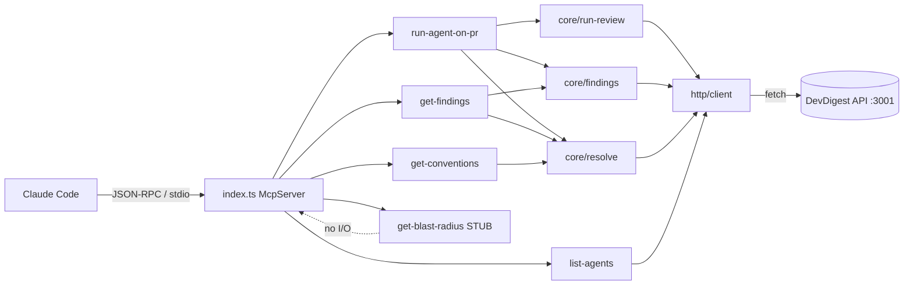

# @devdigest/mcp-server

A local **stdio** [Model Context Protocol](https://modelcontextprotocol.io) server that exposes
DevDigest's review engine to Claude Code as **5 tools**. It is a *thin HTTP client* over the
existing DevDigest API on `http://localhost:3001` — it holds no business logic, never imports the
server's DI container, and never touches the database.

## Not started by `./scripts/dev.sh` — launch it separately

This server is **deliberately decoupled** from the app boot scripts. `./scripts/dev.sh`
brings up **only** Postgres + the API + the web client — it never touches `mcp-server/`.
Start the MCP server yourself, on demand, one of two ways:

- **manually** — `cd mcp-server && pnpm start` (or `pnpm inspect` / `pnpm smoke`);
- **by Claude Code** — the project-scoped `/.mcp.json` makes Claude Code spawn it *only
  inside a Claude Code session* (and only after you approve it). That is separate from the
  app scripts — running `./scripts/dev.sh` will not launch it.

## Running from scratch (full runbook)

Assumes a fresh machine. Prerequisites: **Node ≥22, pnpm ≥10, Docker** (same as the repo).

**1. Start the DevDigest API** (the MCP server is a thin client over it — it must exist on `:3001`):

```bash
# from the repo root
./scripts/dev.sh --no-client      # Postgres + migrations + seed + API on :3001 (no web UI needed)
```

Wait for `▸ API healthy`, then confirm:

```bash
curl -s localhost:3001/health      # → {"status":"ok"}
```

> Leave this running in its own terminal. `Ctrl-C` stops the API but leaves Postgres up.

**2. Install the MCP server's dependencies** (one-time, in a second terminal):

```bash
cd mcp-server
pnpm install
```

**3. (optional) Point at a non-default API** — only if your API isn't on `localhost:3001`:

```bash
cp .env.example .env               # then edit DEVDIGEST_API_URL
# or inline: DEVDIGEST_API_URL=http://localhost:3001 pnpm start
```

**4. Sanity-check the build:**

```bash
pnpm typecheck                     # tsc --noEmit — nothing is compiled to JS
```

**5. Run the server** (pick one):

```bash
pnpm start        # bare stdio server — waits for a JSON-RPC client on stdin (Ctrl-C to stop)
pnpm inspect      # opens MCP Inspector (browser UI) to click through the 5 tools
pnpm smoke        # automated end-to-end check against the running API (see Verification)
```

`pnpm start` looks idle by design: over stdio it waits silently for a client and logs only to
stderr (`[mcp:info] devdigest MCP server ready …`). It is normally launched *by a client*
(Inspector or Claude Code), not run bare.

### What you see on Connect

When a client (MCP Inspector, Claude, …) presses **Connect**, the server advertises the
repositories it can see through the MCP `instructions` field (part of the `initialize` response),
which clients show in their **server-info panel**:

```
DevDigest MCP server — inspect review agents, findings, and repo conventions via the local DevDigest API.

Connected repositories (5): acme/payments-api, …, devivasha/DevDigest.
```

This is a **protocol channel, not stderr**, so it renders as info in the server panel — never as an
error. (Anything written to stderr over stdio is shown by clients as an error/warning regardless of
level, which is why the connected-repo info goes through `instructions` instead of a log line.)

The repo list is fetched once, over HTTP, *before* the server is built:

- **API reachable** → `Connected repositories (N): …` (or `Connected repository: <name>` for one;
  `none found …` if the API has no repos yet).
- **API down** → instructions degrade to `(API … is currently unreachable …)` and a single `warn`
  goes to stderr for the operator. The server still starts and every tool still registers; per-call
  tool errors carry the detail, so the connection is never lost.

The list reflects startup state — register a new repo and reconnect to refresh it.

> No API keys live here. The MCP client sends no auth/workspace headers —
> `LocalNoAuthProvider` resolves the default workspace server-side. The only
> config is `DEVDIGEST_API_URL` (see `.env.example`).

## The 5 tools

| Tool | Args | Returns (concise) | Annotations | Backing endpoint(s) |
|---|---|---|---|---|
| `devdigest_list_agents` | _(none)_ | `{ agents: [{ id, name, enabled, model }] }` | read-only, idempotent | `GET /agents` |
| `devdigest_run_agent_on_pr` | `repo`, `pr`, `agent` | done → `{ verdict, score, counts, findings[] }`; timeout → `{ status:"running", run_id, repo, pr }` | not read-only, not idempotent, open-world | `POST /pulls/:id/review` + poll `GET /pulls/:id/runs` → `GET /pulls/:id/reviews` |
| `devdigest_get_findings` | `repo`, `pr`, `run_id?`, `response_format?`, `offset?`, `limit?` | `{ verdict, score, total, returned, offset, counts, findings[] }` | read-only, idempotent | `GET /pulls/:id/reviews` |
| `devdigest_get_conventions` | `repo` | `{ repo, conventions: [{ rule, file, confidence, accepted }] }` | read-only, idempotent | `GET /repos/:repoId/conventions` |
| `devdigest_get_blast_radius` | `repo?`, `pr?` | `{ status:"not_implemented", message }` (STUB) | read-only, idempotent | _none (stub)_ |

All tools are namespaced `devdigest_*` (snake_case) with per-field `.describe()` input schemas.

## Design principles honored

- **Thin HTTP wrap** — all I/O is in `src/http/client.ts`; the rest is pure. Onion layering:
  `index.ts` (composition root) → `tools/*` (thin presentation) → `core/*` (orchestration) →
  `http/client.ts` (infrastructure). Dependencies point inward only.
- **Result, not operation** — `run_agent_on_pr` triggers + waits + returns in one call; the agent
  never polls. On a >120s run it returns `{ status:"running", run_id }` so results can be fetched
  later with `get_findings`.
- **Token-efficient** — exactly 5 tools with short, signal-rich descriptions (so the whole toolset
  stays cheap to load at chat start), and **concise-by-default** responses: `file:line` + title +
  severity over UUIDs, top-N + severity counts, `offset`/`limit` pagination, `response_format:"detailed"`
  opt-in. Logs go to **stderr only** so stdout never pollutes the JSON-RPC channel.
- **Errors lead forward** — business failures return `isError:true` with the next step (list agents,
  pass `owner/name`, start the API…). An empty result (`{ agents: [] }`) is **not** an error.

## Id-resolution

Tools take flat `repo` (name) + `pr` (number), but the API uses internal ids and has **no
lookup-by-name endpoint**. `src/core/resolve.ts` resolves by listing + matching:

1. `repo` → `repoId` via `GET /repos`, matching `full_name` → `owner/name` → bare `name`
   (case-insensitive). Ambiguous bare name → error asking for `owner/name`.
2. `(repo, pr#)` → `pullId` via `GET /repos/:repoId/pulls`, matching `number === pr`.

## Architecture



## Verification

**Automated smoke test** (requires the API running — step 1 above):

```bash
cd mcp-server && pnpm smoke
```

It spawns the server the way Claude Code does, does a real JSON-RPC handshake, and asserts:
5 tools listed, `list_agents` reachable, unknown-repo → forward-leading `isError`, the stub →
non-error `not_implemented`, and **stdout carries only clean JSON-RPC**. Exits non-zero on any
failure. To also exercise a **real review run** (an LLM call):

```bash
SMOKE_RUN=1 SMOKE_REPO=acme/payments-api SMOKE_PR=482 SMOKE_AGENT="General Reviewer" pnpm smoke
```

**Typecheck (primary gate — nothing is compiled to JS):**

```bash
cd mcp-server && pnpm typecheck
```

**MCP Inspector** (interactive):

```bash
cd mcp-server && pnpm inspect
# → confirm all 5 tools list with field descriptions + annotations, then invoke:
#   devdigest_list_agents            → array of agents
#   devdigest_get_conventions {repo} → conventions (isError for unknown repo)
#   devdigest_run_agent_on_pr {...}  → blocks then { verdict, findings }
#   devdigest_get_findings {...}     → concise + detailed + pagination
#   devdigest_get_blast_radius {}    → { status:"not_implemented" }, no error
```

**Inside Claude Code** — the project-scoped `/.mcp.json` registers this server automatically. With
the API running, `claude mcp list` (or `/mcp`) shows `devdigest` connected with its 5 `devdigest_*`
tools. `MCP_TOOL_TIMEOUT=150000` keeps the blocking `run_agent_on_pr` from being cut off early.

### `run_agent_on_pr` and `MCP error -32001: Request timed out`

`-32001` is a **client-side** timeout, not a server failure — the review keeps running and completes
regardless. A real LLM review can take longer than a client's default per-request timeout (the MCP
**Inspector**'s is ~10s), so the client aborts the JSON-RPC call before the tool returns.

Two mechanisms keep this from happening:

- **Progress heartbeats.** While it blocks, the tool emits `notifications/progress` every ~2s (when
  the client sends a `progressToken`). Clients that *reset their request timeout on progress* — the
  Inspector's **"Reset timeout on progress"**, on by default — stay alive for the whole inline wait.
- **Graceful fallback.** If the review outlasts the inline budget (`DEVDIGEST_INLINE_WAIT_MS`,
  default 45s — kept under the Inspector's 60s hard *max-total* cap), the tool returns a **success**
  `{ status:"running", run_id, repo, pr }` (not an error). Call `devdigest_get_findings` with the
  same `repo`/`pr` a moment later to fetch the verdict + findings.

If you still hit `-32001` in the Inspector: open its **Configuration** and raise **Request Timeout**
(e.g. 120000ms), keep **Reset timeout on progress** enabled, and make sure **Maximum total timeout**
isn't lower than the review takes. In Claude Code, `MCP_TOOL_TIMEOUT=150000` already covers this.
