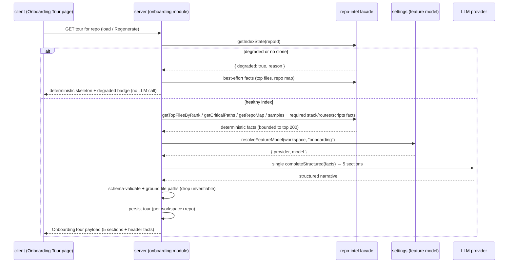

# Spec: Onboarding Generator (Onboarding Tour)   |   Spec ID: SPEC-2026-07-11-onboarding-generator   |   Status: draft
Supersedes: none

## Problem & why

A newcomer dropped into an unfamiliar repository has no cheap way to learn *what the codebase
is*, *where the important code lives*, *how to run it*, and *what to read first*. DevDigest
already builds a deterministic repo index (stack, structure, import graph, file rank, index
state) behind the `container.repoIntel` facade, but nothing turns that index into a human
orientation surface.

**Onboarding Generator** (product name: **Onboarding Tour**) is a per-repo page that renders a
guided tour of the repository, generated automatically from the repo index. It follows a hard
product-owner pattern: **facts are collected by deterministic code at zero LLM cost; the
narrative is written by exactly one structured LLM call.** The page always renders something
useful — when the index is degraded or absent it shows an honest deterministic skeleton with a
"degraded" badge, never an empty screen and never a fabricated narrative.

This is a read-oriented, additive feature: a new server module (nearest analog: `conventions/`)
plus a new client page. It touches **client** and **server**, so the spec lives in top-level
`specs/`.

## Goals / Non-goals

- Goal: Render a per-repo **Onboarding Tour** page with exactly 5 sections — Architecture
  overview, Critical paths, How to run locally, Guided reading path, First tasks.
- Goal: Collect all facts deterministically from the `container.repoIntel.*` facade
  (index state, top files by rank, critical paths, repo map, conventions samples) at **zero LLM
  cost**, then make **exactly one** structured LLM call (via `resolveFeatureModel(container,
  workspaceId, "onboarding")` → `container.llm(provider)` → an extractor) to turn those facts
  into the 5 narrative sections.
- Goal: Order the Guided reading path by file rank, where `rank = pagerank × (1 + hotness)`.
- Goal: Decide "critical" for the Critical paths section by rank **and** importer/caller count.
- Goal: Persist the generated tour per (workspace, repo) and re-serve it on load; provide
  **Regenerate** (re-run the fact-collection + single LLM call, replacing the stored tour) and a
  **Share link** that is an in-app deep link to this repo's tour.
- Goal: When `getIndexState().degraded` is true (including `repo_too_large`, `no_data`,
  `flag_off`, `index_partial`, or no clone), render a deterministic skeleton from whatever facts
  are available plus a visible "degraded" badge — no LLM call, no invented content.
- Goal: Ground every file path the model emits (inline code refs, critical-path files,
  reading-path files) against the real index/clone; drop unverifiable paths rather than render
  fabricated ones.
- Goal: Add a **shared Zod contract** for the tour payload in `@devdigest/shared`.

- Non-goal: Any collision with the existing first-run wizard at client route `/onboarding`
  (a workspace setup flow). The Onboarding Tour is a distinct **per-repo** surface with its own
  i18n namespace.
- Non-goal: More than one LLM call per generation. No embeddings, no RAG, no multi-step agent.
- Non-goal: A **public / unauthenticated** share URL. "Share link" is an in-app deep link only;
  a public read-only URL is future work.
- Non-goal: Triggering repository cloning or (re)indexing from this feature. When facts are
  absent the page guides the user to the existing repo add/refresh/index flow; Regenerate never
  re-clones or re-indexes.
- Non-goal: Executing any command from "How to run locally". Those commands are display-only
  with copy buttons; DevDigest never runs them.
- Non-goal: Editing the tour by hand, versioning tours, or diffing tours over time.
- Non-goal: Changing the review pipeline, `groundFindings()`, or any reviewer-core contract.

## User stories

- US-1: As a newcomer, I want an architecture overview (a short narrative + a small component
  diagram, with clickable inline code refs), so that I grasp the stack and request flow fast.
- US-2: As a newcomer, I want a ranked list of the most important files, each with a one-line
  "why it matters" and an Open action, so that I know where the load-bearing code is.
- US-3: As a newcomer, I want an ordered list of shell commands to run the project locally, each
  with a copy button, so that I can boot it without hunting through docs.
- US-4: As a newcomer, I want an ordered reading path of files with a rationale for each, so that
  I read the codebase in an order that builds understanding.
- US-5: As a newcomer, I want a short list of good starter tasks, so that I have a safe first
  contribution.
- US-6: As a returning user, I want the tour persisted and re-served, with a Regenerate button
  and a Share link, so that I don't pay to regenerate every visit and can point a teammate to it.
- US-7: As a user of a huge, un-cloned, or un-indexed repo, I want an honest skeleton with a
  degraded badge instead of an empty page or a made-up tour, so that I trust what I see.

## Acceptance criteria (EARS)

### Fact collection (deterministic, zero LLM)

- AC-1: WHEN a tour is generated for a repo, the system **shall** collect all facts exclusively
  from the `container.repoIntel` facade (index state, top files by rank, critical paths, repo
  map, convention samples) and **shall not** issue any LLM, embedding, or network call during
  fact collection.
  _(observable: a fact-collection run makes zero provider calls; a stubbed facade fully drives the facts)_
- AC-2: The system **shall** derive the page header facts — repository name, index **file count**
  (`getIndexState().filesIndexed`), and a **last-refreshed** timestamp (the tour's own
  `generatedAt`) — from deterministic sources only.
  _(observable: header shows "Generated from index of N files · last refreshed <ago>" with N = filesIndexed)_
- AC-3: WHERE a required fact category (stack/languages/frameworks, repo-wide route inventory,
  run/setup scripts, or per-file importer/caller count) is **not** exposed by the current facade,
  the spec records it as a **required repo-intel capability** (see Contracts) rather than reading
  data through an invented API.
  _(observable: the Contracts section names each missing capability; no fact bypasses the facade)_

### The single LLM narrative call

- AC-4: WHEN facts are collected and the index is **not** degraded, the system **shall** make
  **exactly one** structured LLM call, using the provider/model from
  `resolveFeatureModel(container, workspaceId, "onboarding")`, to produce the 5 narrative
  sections; it **shall not** make more than one narrative call per generation.
  _(observable: a non-degraded generation makes exactly one completeStructured call)_
- AC-5: The single call **shall** return a structured payload validated against the tour schema
  (5 sections); IF the model output fails schema validation, THEN the system **shall** fall back
  to the deterministic skeleton (AC-11) rather than persist or render malformed content.
  _(observable: a schema-invalid model response yields the skeleton, not an error page)_

### Section 1 — Architecture overview

- AC-6: WHEN the architecture section renders, the system **shall** show a short narrative
  paragraph (bounded to a short paragraph, see Non-functional) plus a small component diagram of
  the main components, and each inline code reference (e.g. `src/server.ts`) **shall** be a
  clickable Open affordance.
  _(observable: the section renders narrative + diagram; inline refs are interactive Open controls)_

### Section 2 — Critical paths

- AC-7: The Critical paths list **shall** be ranked and each entry **shall** carry the file path,
  a one-line "why it matters", and an Open action; "critical" **shall** be decided by file
  **rank** combined with **importer/caller count** (not alphabetical, not date).
  _(observable: entries are ordered by the rank+caller signal; each row shows path + why + Open)_

### Section 3 — How to run locally

- AC-8: The How-to-run section **shall** present an **ordered** list of shell commands, each with
  a copy button; the commands are **display-only** and the system **shall never execute** them.
  _(observable: ordered commands each have a copy control; no code path executes a listed command)_

### Section 4 — Guided reading path

- AC-9: The Guided reading path **shall** be an ordered list of files each with a rationale, and
  its order **shall** be determined by file rank **descending**, where
  `rank = pagerank × (1 + hotness)` (hotness = a churn/recency signal), not alphabetical or date.
  _(observable: for a fixed index the ordering matches rank DESC per the stated formula)_

### Section 5 — First tasks

- AC-10: The First tasks section **shall** present a short list of starter tasks suitable for a
  newcomer.
  _(observable: the section renders a bounded list of starter-task items)_

### Degraded / skeleton behaviour (critical)

- AC-11: IF `getIndexState().degraded` is true (any `DegradedReason`, or no clone present), THEN
  the system **shall** render a deterministic skeleton built from whatever facts the facade
  returned, **shall** display a visible "degraded" badge with the reason, **shall not** issue the
  LLM narrative call, and **shall not** fabricate narrative text.
  _(observable: a degraded index yields a skeleton + badge, zero provider calls, no invented prose)_
- AC-12: WHEN the index is `no_data` or the clone is absent, the system **shall** render the
  skeleton with an explicit call-to-action pointing to the existing repo add/refresh/index flow,
  and **shall not** itself trigger cloning or indexing.
  _(observable: a not-indexed repo shows guidance to index; no clone/index job is started by this feature)_

### Grounding of model output (anti-hallucination)

- AC-13: WHEN the model emits any file path (inline code ref, critical-path file, or
  reading-path file), the system **shall** verify that path exists in the repo index/clone and
  **shall** drop or de-link any path it cannot verify, so no fabricated file path is rendered as
  clickable.
  _(observable: a model response citing a non-existent path renders that path dropped/non-clickable)_

### Persistence, freshness, Regenerate, Share

- AC-14: WHEN a tour is generated, the system **shall** persist it per (workspace, repo) and
  **shall** re-serve the persisted tour on subsequent page loads without regenerating.
  _(observable: a second load returns the stored tour and makes no new LLM call)_
- AC-15: WHEN the user activates **Regenerate**, the system **shall** re-collect facts, make the
  single LLM call (unless degraded, per AC-11), replace the stored tour, and update `generatedAt`;
  it **shall not** re-clone or re-index the repository.
  _(observable: Regenerate replaces the stored payload and bumps generatedAt; no clone/index job runs)_
- AC-16: WHERE the repo index has been refreshed after the stored tour's `generatedAt`
  (index `updatedAt` is newer), the page **shall** surface a "facts changed — regenerate" hint.
  _(observable: a stored tour older than the index update shows the stale hint)_
- AC-17: WHEN the user activates **Share link**, the system **shall** provide an **in-app deep
  link** to this repo's Onboarding Tour route (resolvable only within the authenticated app), and
  **shall not** mint a public or unauthenticated URL.
  _(observable: the copied link is the in-app route; no public token/URL is created)_

### Boundaries & i18n

- AC-18: The Onboarding Tour **shall** be a distinct per-repo surface and **shall not** reuse or
  collide with the existing first-run wizard route `/onboarding`; all its user-facing strings
  **shall** go through the client i18n layer (its own namespace), with no hardcoded strings in JSX.
  _(observable: the tour renders on its own per-repo route; no string literal appears in JSX; wizard route is untouched)_

### Caps / budget (giant repos)

- AC-19: WHEN generating a tour, the system **shall** bound the work by considering at most the
  top **200** ranked files and capping rendered items per section (Critical paths ≤ 7, Guided
  reading path ≤ 7, How-to-run commands ≤ 10, First tasks ≤ 5, architecture diagram nodes ≤ 8);
  IF the reason is `repo_too_large`, THEN the page **shall** show a "large repo — showing top
  results" note.
  _(observable: no section exceeds its cap; repo_too_large shows the note)_

## Edge cases

- Giant repo (`repo_too_large`) → bounded fact set + per-section caps + note; badge shown if
  IndexState is degraded. → AC-19, AC-11.
- Repo added but not cloned / `no_data` → skeleton + index CTA, no LLM call, no clone triggered.
  → AC-11, AC-12.
- Index degraded/partial (`index_partial`, `flag_off`, `index_failed`) → skeleton + degraded
  badge with reason, no LLM call. → AC-11.
- Empty repo (index present but zero ranked files) → sections render empty-state placeholders
  from the skeleton path; no fabricated files. → AC-11, AC-13.
- Monorepo / multiple stacks → facts come from repo-wide index; caps still apply; if stack facts
  are ambiguous the narrative describes what the index shows (grounded), unverifiable refs dropped.
  → AC-13, AC-19. Deeper per-package tours → **accepted: no per-package split in v1**.
- Model returns a non-existent file path → dropped/de-linked. → AC-13.
- Model returns malformed / schema-invalid output → fall back to skeleton. → AC-5.
- Stored tour older than the latest index refresh → stale hint shown, old tour still served until
  Regenerate. → AC-16, AC-14.
- Model output contains embedded instructions ("ignore the above…") sourced from repo content →
  treated as data, never followed; output still grounded + schema-validated. → AC-13, Untrusted inputs.
- Concurrent Regenerate requests for the same repo → last write wins on the stored tour.
  → **accepted: last-write-wins** (no locking required; regeneration is idempotent-ish).
- Missing feature-model override in Settings → falls back to the registry default for
  `"onboarding"`. → AC-4 (resolveFeatureModel already defaults).

## Non-functional

- Cost: exactly **one** LLM call per non-degraded generation; **zero** LLM calls for a re-served
  tour (AC-14) or a degraded render (AC-11). No embeddings/RAG.
- Performance: fact collection is bounded to ≤ 200 ranked files (AC-19) and **shall** complete
  within a p95 of 2 s excluding the LLM call; a re-served tour load **shall** not call the model.
- Content bounds: the architecture narrative is a short paragraph (≤ ~1200 characters); per-section
  item caps per AC-19.
- Security: repo-derived facts fed to the model are **untrusted** (see Untrusted inputs); listed
  run commands are display-only and never executed; the Share link is an authenticated in-app deep
  link, never a public URL (AC-17); rendered model output (narrative, refs) is escaped/sanitized
  by the client (no `dangerouslySetInnerHTML` without sanitization) and Open links are constrained
  to verified repo paths with no `javascript:`-style URLs.
- a11y: the page, section anchor nav ("ON THIS PAGE"), copy buttons, Open actions, Regenerate and
  Share controls **shall** meet WCAG 2.1 AA (keyboard-operable, focus-visible; the degraded badge
  conveyed by text + colour, not colour alone).
- i18n: all strings via next-intl in a dedicated namespace, no hardcoded English in JSX (AC-18).

## Cross-module interactions

Scope: **client** + **server** (2 modules) → top-level `specs/`. reviewer-core is **not** touched.

- **client** renders the per-repo Onboarding Tour page (header with repo name + "Generated from
  index of N files · last refreshed <ago>", Regenerate + Share link buttons, left-nav "Onboarding
  Tour" under WORKSPACE, "ON THIS PAGE" anchor nav, the 5 sections). It reads the tour and
  triggers Regenerate via `src/lib/api.ts`; it never talks to the facade directly.
- **server** owns a new `onboarding` module (analog: `conventions/`): it verifies the clone
  exists, collects facts from `container.repoIntel`, resolves the feature model, makes the single
  structured LLM call through the injected `container.llm(provider)`, grounds the output against
  the index, persists the tour, and serves/Regenerates it.
- **settings** provides the per-feature model choice via `resolveFeatureModel(..., "onboarding")`
  (the `onboarding` FeatureModelId already exists).
- **repo-intel** provides all facts through its facade and its **degraded contract**
  (`getIndexState().degraded` + `DegradedReason`).

Failure contract: a missing clone or degraded index is **fail-soft** — render the deterministic
skeleton + badge, never error, never call the LLM (AC-11/AC-12). A schema-invalid or ungrounded
model response degrades to the skeleton or drops the offending refs (AC-5/AC-13). Regenerate never
mutates the repo (no clone/index) (AC-15).

## Contracts

Shapes only — field names/optionality, not implementation. A new shared Zod contract for the
tour payload belongs in `@devdigest/shared` (`server/src/vendor/shared/`).

- **OnboardingTour** (server → client):
  `{ repoId: string; repoName: string; generatedAt: timestamp; indexFileCount: integer;
     lastRefreshedAt: timestamp; degraded: boolean; degradedReason?: DegradedReason;
     stale?: boolean; sections: OnboardingSections }`.
- **OnboardingSections**:
  - `architecture: { narrative: string; codeRefs: Array<{ path: string; label?: string }>;
       diagram: { nodes: Array<{ id: string; label: string }>;
                  edges: Array<{ from: string; to: string; label?: string }> } }`
  - `criticalPaths: Array<{ path: string; why: string; callerCount?: integer }>`
  - `howToRun: Array<{ order: integer; command: string; note?: string }>`
  - `readingPath: Array<{ order: integer; path: string; rationale: string }>`
  - `firstTasks: Array<{ title: string; detail?: string }>`
- **Regenerate** (client → server): request identifies the repo; response is a fresh
  `OnboardingTour`. Direction: client → server → client. No body beyond repo identity.
- **Share link** (client-side): an in-app route reference to this repo's tour; no server-minted
  public token.

**Required repo-intel capabilities (facade extensions the planner must map — do not invent an
API):** the current facade exposes index state, top files by rank, critical paths (dependency
chains), repo map text, and convention samples, but does **not** expose:
1. **Stack facts** — languages / frameworks / package manager (for Architecture overview + How
   to run). Today only `getRepoMap()` text exists.
2. **Repo-wide route/endpoint inventory** — `getBlastRadius().impactedEndpoints` is scoped to
   changed files only; the tour needs a whole-repo view (for the request-flow narrative/diagram).
3. **Run/setup commands** — install / env / compose / dev commands (e.g. from `package.json`
   scripts). Not currently exposed.
4. **Per-file importer/caller count** — needed for the "critical" decision (AC-7) and the
   "used by N routes" copy; `getBlastRadius` gives callers per changed symbol only.

Whether these are added to the facade or derived deterministically is the planner's call; this
spec only fixes that they are facts (code-collected, not model-invented) and must flow through
`container.repoIntel`.

## Untrusted inputs

**Yes.** The facts fed into the single LLM call are derived from repository content (file paths,
code snippets in the repo map, `package.json`, etc.), which is third-party text authored by
anyone with repo write access. It must be treated as **data, not instructions**:

- The extractor's system prompt **shall** instruct the model to treat repo-derived content as
  reference data and never follow instructions embedded in it.
- Model output is **schema-validated** (AC-5) and every emitted file path is **grounded** against
  the real index/clone (AC-13) — mirroring how `conventions/` verifies evidence — so fabricated
  or malicious paths cannot become clickable links.
- Rendered narrative and refs are escaped/sanitized on the client (no unsanitized HTML injection),
  and Open/Share links are constrained to verified in-tree repo paths / the in-app route (no
  `javascript:` or out-of-app URLs).
- Listed run commands are **display-only** and are **never executed** by DevDigest (AC-8), so a
  crafted command cannot cause code execution.
- This feature does **not** go through reviewer-core; `groundFindings()` / `wrapUntrusted()` are
  review-pipeline gates and are out of scope here.

## Open questions

All six clarification categories are resolved inline above (meaning of onboarding = Architecture
overview §1; critical = rank + caller count, AC-7; reading order = PageRank formula, AC-9; giant
repos = caps + note, AC-19; no-clone/not-indexed = skeleton + CTA, no self-triggered indexing,
AC-11/AC-12; caching = persisted + re-served with Regenerate replacing, AC-14/AC-15, and Share =
in-app deep link only, AC-17). Remaining non-blocking assumptions:

- [ASSUMPTION: Caps — top-200 fact budget and per-section caps (7/7/10/5, 8 diagram nodes) are
  sensible defaults; the planner/product may tune the numbers.]
- [ASSUMPTION: "last refreshed" in the header reflects the tour's `generatedAt` (when it was last
  generated), not the raw index `updatedAt`; the index-vs-tour staleness is surfaced separately
  via the stale hint (AC-16).]
- [ASSUMPTION: Persistence is a new per-(workspace, repo) store for the tour payload (analogous to
  how `conventions` persists per repo); exact storage shape is the planner's decision.]
