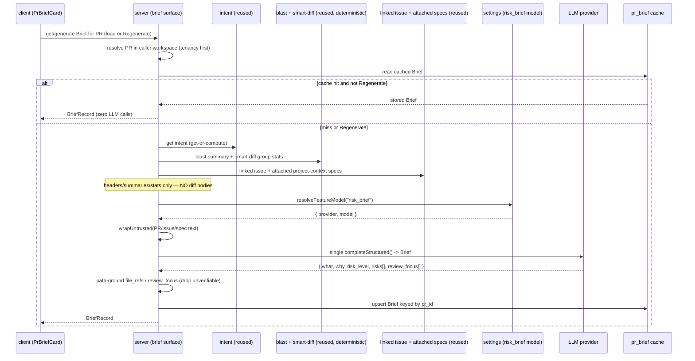

# Spec: Why+Risk Brief   |   Spec ID: SPEC-2026-07-11-why-risk-brief   |   Status: approved
Supersedes: none

## Problem & why

A reviewer opening a pull request today has to reconstruct, by hand, the three things they
most need before reading a single line of diff: **what** this PR does, **why** it exists, and
**how risky** it is. DevDigest already computes the raw materials for that judgement — the
PR's **intent** (L03), a deterministic **blast-radius summary** (L04), **smart-diff group
stats** (core/wiring/boilerplate line counts), the **linked issue**, and any **attached
project-context specs** — but they live in separate cards and none of them answers "where do I
start reading, and what should I worry about?".

The **Why+Risk Brief** is a single per-PR card (`PrBriefCard`) on the PR Overview tab that
fuses those already-built signals into a short reviewer briefing: a **what**, a **why**, an
overall **risk level**, a list of concrete **risks** (each linking real files/endpoints), and a
**review-focus** list (where to look first, with file links).

It follows the same hard product pattern proven by the Onboarding Generator and the Intent
Layer: **every input is gathered from existing deterministic/reused pieces at zero extra cost;
the narrative is written by exactly ONE structured LLM call.** No change bodies or raw diff
text ever enter the prompt — only headers, summaries, and stats. The result is cached per-PR so
repeat visits cost nothing, and a Regenerate button re-runs the one call on demand.

This is a read-oriented, additive feature. It touches **client** and **server**, so the spec
lives in top-level `specs/`.

## Goals / Non-goals

- Goal: Render a per-PR **`PrBriefCard`** on the PR Overview tab showing `what`, `why`,
  `risk_level`, `risks[]` (each linking real files/endpoints), and `review_focus[]` (where to
  read first, with file links).
- Goal: Assemble the Brief's input **exclusively from already-built, reused pieces** — intent
  `[reused]`, blast summary `[reused] [deterministic]`, smart-diff group stats
  `[reused] [deterministic]`, linked issue `[reused]`, attached project-context specs
  `[reused]` — using only **headers, summaries, and stats**. **No change bodies / raw diff text**
  are ever included.
- Goal: Produce the Brief narrative with **exactly ONE structured LLM call** (the only
  `[new call]` and the only new LLM cost), reusing the **existing `risk_brief` feature-model
  slot** (no new slot).
- Goal: Reuse the existing **`Risk`** and **`RiskSeverity`** contracts for the Brief's
  `risks[]` and `risk_level`; add a **new, distinctly-named** narrative contract so the existing
  `PrBrief` data-composition contract is left untouched.
- Goal: Ground every file path the model emits (risk `file_refs`, `review_focus` paths) against
  the real repo clone/index; drop or de-link any path it cannot verify.
- Goal: **Cache the Brief per-PR** in the existing `pr_brief` json table; serve the cached Brief
  with **zero LLM calls**; provide a **Regenerate** button that re-runs the single call and
  upserts.
- Goal: Show `risk_level` by an **icon + text label** (colour supplementary), never colour
  alone.

- Non-goal: **More than one LLM call** per generation. No embeddings, no RAG, no multi-step
  agent, no per-file calls.
- Non-goal: Feeding **change bodies / raw diff hunks** into the Brief prompt. Input is
  headers/summaries/stats only (mirrors the Intent Layer's header-only discipline).
- Non-goal: The **`groundFindings()` line-grounding gate**. The Brief is a summary-level surface
  (like intent/onboarding), not a review-pipeline finding; it is **not** routed through
  `groundFindings()`. Its only grounding is **path-existence** verification of emitted file refs
  (see AC-8). This is an explicit, deliberate boundary — see Untrusted inputs.
- Non-goal: A **new feature-model slot**. The `risk_brief` slot already exists and is reused.
- Non-goal: Renaming, reshaping, or repurposing the existing **`PrBrief`** contract
  `{ intent, blast, risks, history }`. The new narrative object is a **separate** contract.
- Non-goal: A **staleness / "facts changed — regenerate"** hint in v1 (would require persisting
  `generated_at` / a head-SHA and a migration). Recorded as future work; see Open questions.
  Regenerate is always available regardless.
- Non-goal: Any **public / unauthenticated** surface. The Brief is served only within the
  authenticated, workspace-scoped app.
- Non-goal: Triggering cloning, indexing, intent/blast recompute, or a review run from this
  feature. It **reads** whatever the reused pieces already provide (computing them lazily where
  those pieces already support it, e.g. `IntentService.getOrCompute`).

## User stories

- US-1: As a reviewer, I want a per-PR card that states **what** the PR does and **why**, so I
  grasp its purpose without reading the diff.
- US-2: As a reviewer, I want the PR's **overall risk level** shown unambiguously (icon + label,
  not colour alone), so I can triage which PRs need careful attention.
- US-3: As a reviewer, I want a list of **concrete risks**, each linking the real files/endpoints
  involved, so I can jump straight to the risky code.
- US-4: As a reviewer, I want a **review-focus** list telling me where to look first, with file
  links, so I spend my attention efficiently.
- US-5: As a reviewer, I want a **Regenerate** button that re-runs the analysis and refreshes the
  card, so I can update the Brief after the PR or its inputs change.
- US-6: As a cost-conscious maintainer, I want the Brief **cached per-PR** and re-served with
  **zero LLM calls** on a cache hit, so repeated visits are free.
- US-7: As a security-conscious maintainer, I want PR/issue/spec text treated as **untrusted
  data**, so a crafted PR body or spec cannot hijack Brief generation.

## Acceptance criteria (EARS)

### Input assembly & provenance

- AC-1: WHEN a Brief is generated, the system **shall** assemble its LLM input exclusively from
  the reused pieces — intent, blast **summary** (deterministic one-liner + impacted endpoints +
  changed symbols), smart-diff **group stats** (core/wiring/boilerplate additions/deletions per
  group), the linked issue, and attached project-context specs — and **shall not** include any
  change bodies or raw diff hunk lines.
  _(observable: the assembled prompt input contains the intent/blast-summary/group-stats/issue/spec
   text but contains no added/removed code lines from the diff)_
- AC-2: WHEN a Brief is generated or regenerated, the system **shall** make **exactly ONE**
  structured LLM call (the only `[new call]`) and **shall not** make more than one narrative call
  per generation.
  _(observable: a generation makes exactly one `completeStructured` call; a re-served cache hit makes zero)_
- AC-3: The single LLM call **shall** resolve its provider/model from the **existing
  `risk_brief` feature-model slot** and **shall not** introduce a new feature-model slot.
  _(observable: the call resolves via `resolveFeatureModel(..., "risk_brief")`; no new FeatureModelId is added)_
- AC-18: IF one or more input pieces are unavailable (no linked issue, no attached specs, or an
  absent/empty intent, blast, or smart-diff), THEN the system **shall** still generate a
  best-effort Brief from the available signals and **shall not** fail.
  _(observable: with `linked_issue = null` and `specs = []`, generation still returns a schema-valid Brief)_

### Brief content

- AC-4: The Brief **shall** carry a `what` (what the PR does) and a `why` (why it exists), each a
  bounded narrative string (see Non-functional content bounds).
  _(observable: the persisted/rendered Brief contains non-empty `what` and `why` strings within bounds)_
- AC-5: The Brief **shall** carry an overall `risk_level` drawn from the **existing
  `RiskSeverity`** enum (`high | medium | low`).
  _(observable: `risk_level` validates against `RiskSeverity`; no value outside the enum is accepted)_
- AC-6: The Brief **shall** carry `risks[]` reusing the **existing `Risk`** contract
  (`{ kind, title, explanation, severity, file_refs[] }`), where each risk's `file_refs`
  reference real files/endpoints.
  _(observable: `risks[]` validate against `Risk[]`; every rendered `file_ref` is a repo-verified path/endpoint)_
- AC-7: The Brief **shall** carry `review_focus[]` where **each item references a real file path**
  plus a short reason to look there.
  _(observable: each `review_focus` item carries a path that exists in the repo clone/index and a non-empty reason)_
- AC-8: WHEN the model emits any file path in a risk `file_ref` or a `review_focus` item, the
  system **shall** verify the path exists in the repo clone/index and **shall** drop or de-link
  any path it cannot verify, so no fabricated path is rendered as a clickable link. (This is
  **path-existence** grounding only; the `groundFindings()` line-grounding gate is deliberately
  not applied — summary-level, like intent/onboarding.)
  _(observable: a Brief citing a non-existent path renders that path dropped / non-navigating)_

### Cache, compute & regenerate

- AC-9: WHEN a Brief is requested for a PR that already has a cached Brief, the system **shall**
  return the cached Brief **without making any LLM call**.
  _(observable: a request for a PR with a stored Brief returns it and makes zero provider calls)_
- AC-10: WHEN a Brief is requested for a PR with no cached Brief, the system **shall** compute it
  via the single LLM call and **shall** persist (upsert) it keyed by PR id.
  _(observable: the first request computes + stores; the stored row is keyed by `pr_id`)_
- AC-11: WHEN the user activates **Regenerate**, the system **shall** re-run the single LLM call
  and **shall** upsert (replace) the stored Brief for that PR.
  _(observable: Regenerate replaces the persisted Brief and makes exactly one new LLM call)_
- AC-17: IF the single LLM call fails or returns schema-invalid output, THEN the system **shall
  not** persist or render a malformed Brief and **shall** surface a failure state rather than
  fabricating content.
  _(observable: a schema-invalid/failed response yields no stored Brief and a visible error state, not a crash or invented Brief)_

### Card (UI)

- AC-12: The PR Overview tab **shall** render a `PrBriefCard` showing `what`, `why`, `risk_level`,
  `risks[]`, and `review_focus[]`.
  _(observable: the card renders all five elements on the Overview tab)_
- AC-13: The card **shall** convey `risk_level` by an **icon and a text label**, with colour used
  only as a supplementary channel (never colour alone).
  _(observable: the risk level is distinguishable with colour removed; an icon + text label are present)_
- AC-14: The card **shall** render each risk `file_ref` and each `review_focus` path as a **link
  to the file** (repo blob URL at the PR head SHA), degrading to a **non-navigating** control when
  a URL cannot be built.
  _(observable: verified refs render as navigable links; an unresolvable ref renders as a non-navigating control)_
- AC-15: The card **shall** provide a **Regenerate** control with a loading state while
  regeneration is pending, and **shall** update to the new Brief on success.
  _(observable: activating Regenerate shows a loading state; on success the card reflects the new Brief)_
- AC-16: WHILE a Brief is loading the card **shall** show a loading state; IF loading or
  generation fails, THEN the card **shall** show a muted error/empty state rather than an invented
  Brief.
  _(observable: loading renders a skeleton; failure renders a muted error, with no fabricated content)_

### Access control & rate

- AC-19: The Brief compute/regenerate route **shall** be rate-limited to at most **10 requests
  per minute**.
  _(observable: the 11th request within a 60 s window is rejected with HTTP 429)_
- AC-20: WHEN serving or generating a Brief, the system **shall** resolve the target PR within the
  **caller's workspace scope first** (the `pr_brief` table has no `workspace_id`), and **shall**
  refuse a PR outside the caller's workspace.
  _(observable: a request for a PR in another workspace is refused (not-found), never served)_

### Untrusted handling (security)

- AC-21: The PR title/body, the linked-issue body, and the attached spec text used as input
  **shall** be wrapped as **untrusted** before entering the prompt, so instructions embedded in
  them are treated as data, not commands.
  _(observable: the assembled prompt wraps those inputs in the untrusted fence; an issue body
   containing "ignore previous instructions…" does not alter the Brief's structure/schema)_

## Edge cases

- No linked issue / no attached specs / absent intent / empty blast / empty smart-diff → best-effort
  Brief from whatever signals exist; never fails. → AC-18.
- Model emits a non-existent file path in a risk `file_ref` or `review_focus` item → dropped /
  de-linked, not rendered as a working link. → AC-8, AC-14.
- Single LLM call fails or returns schema-invalid output → nothing persisted, muted error state
  shown. → AC-17, AC-16.
- Cache hit (Brief already stored) → served with zero LLM calls. → AC-9.
- PR belongs to another workspace → refused (not-found), never served (pr_brief has no
  workspace_id, so PR-workspace scope is checked first). → AC-20.
- Prompt-injection text in PR body / issue / attached spec ("ignore previous instructions…") →
  wrapped untrusted; treated as data; output still schema-constrained. → AC-21.
- `risks[]` is empty (a genuinely low-risk PR) → the Brief still carries a `risk_level` (expected
  `low`) and renders an empty risks list without error. → AC-5, AC-12; **accepted: empty risks
  render as an empty list**.
- Very large input set (many changed groups, large attached specs) → bounded by the content caps
  in Non-functional (risks/review-focus item caps; specs are summaries/headers, not full diffs).
  → **accepted: soft caps in Non-functional; no hard failure**.
- Concurrent Regenerate requests for the same PR → last write wins on the upsert. → **accepted:
  last-write-wins** (upsert is idempotent-ish; no locking).
- PR head SHA / inputs change after the Brief was cached → the stale Brief is served until the
  user regenerates; v1 shows **no** "facts changed" hint. → **accepted: no staleness hint in v1**
  (future work; see Open questions).
- Clone absent so blast/smart-diff degrade to empty → best-effort Brief from intent + issue +
  title/body; emitted paths that cannot be verified are dropped. → AC-18, AC-8.

## Non-functional

- Cost: **exactly one** LLM call per generation/regenerate (AC-2); **zero** LLM calls on a cache
  hit / re-served Brief (AC-9). No embeddings, no RAG.
- Rate: the compute/regenerate surface is limited to **≤ 10 requests / minute** (AC-19).
- Performance: a cache-hit serve **shall** not call the model and **shall** complete within a p95
  of **300 ms** (excluding network); a cold generation is bounded by the single model call plus
  reused-input assembly (assembly reads only already-computed summaries/stats, no diff bodies).
- Content bounds: `what` and `why` each ≤ **~600 characters**; `risks[]` ≤ **7** items;
  `review_focus[]` ≤ **7** items. These bound both prompt output size and card density.
- Security: no change bodies/raw diff enter the prompt (AC-1); PR/issue/spec inputs are untrusted
  and wrapped (AC-21); emitted file refs are path-grounded and dropped if unverifiable (AC-8);
  access is workspace-scoped (AC-20). The `groundFindings()` gate is **not** applied here (this is
  not a review-pipeline finding) — this is a deliberate boundary, not an omission.
- a11y: the card and its Regenerate control **shall** meet **WCAG 2.1 AA** — risk level conveyed
  by icon + text label (not colour alone, AC-13); Regenerate keyboard-operable with an
  accessible name (icon-only/loading buttons carry an `aria-label`); file links keyboard-reachable.
- i18n: all new user-facing strings go through the client i18n layer (a dedicated `brief`
  namespace); no hardcoded English in JSX.

## Cross-module interactions

Scope: **client** + **server** (2 modules) → top-level `specs/`. reviewer-core is **consumed
unchanged** (its `wrapUntrusted` / structured-output machinery), **not modified**.

- **client** renders `PrBriefCard` on the PR Overview tab (mirroring the Intent / Blast-radius
  cards): it reads the Brief and triggers Regenerate via the app API client; it never talks to the
  server internals directly. It renders `risk_level` as an icon + label + supplementary colour,
  and renders risk `file_refs` / `review_focus` paths as blob-URL links at the PR head SHA.
- **server** owns a new Brief surface that: resolves the PR within the caller's workspace
  (tenancy first), returns the cached Brief if present (no LLM), else **gathers reused inputs**
  (intent via the intent module's get-or-compute, blast summary via the blast module,
  smart-diff group stats via the existing smart-diff grouping, the linked issue from the PR
  detail, and attached project-context specs), makes the **single** structured LLM call via the
  injected provider resolved from the `risk_brief` slot, **path-grounds** emitted file refs, and
  **upserts** the Brief into the `pr_brief` json table.
- **settings** provides the model choice via `resolveFeatureModel(..., "risk_brief")` (the slot
  already exists).
- **reviewer-core** is used as a library only: its `wrapUntrusted` wraps the untrusted inputs and
  its structured-output helpers back the single call. No reviewer-core contract changes.

Failure contract: missing input pieces are **fail-soft** — a best-effort Brief is produced from
whatever exists (AC-18); a failed/invalid LLM call persists nothing and shows an error state
(AC-17); unverifiable emitted paths are dropped (AC-8). A cache hit never calls the model (AC-9).
Access is refused for out-of-workspace PRs (AC-20).

## Contracts

Shapes only — field names/optionality, not implementation. Existing contracts are **reused**;
the new narrative object is added alongside the untouched `PrBrief`.

### Inputs (provenance-tagged)

| Input | Provenance | Source (reused) | What is passed |
|---|---|---|---|
| Intent | `[reused]` | intent module get-or-compute (`Intent`/`PrIntentRecord`) | `{ intent, in_scope, out_of_scope }` |
| Blast summary | `[reused] [deterministic]` | blast module (`BlastResponse.summary`) | deterministic one-liner + impacted endpoints + changed symbols |
| Smart-diff group stats | `[reused] [deterministic]` | smart-diff grouping (`SmartDiff` groups) | per-group role + additions/deletions counts (NO code bodies) |
| Linked issue | `[reused]` | PR detail (`IssueMeta` on `linked_issue`) | `{ number, title, body?, state }` (untrusted) |
| Attached specs | `[reused]` | project-context attached documents | spec text (untrusted, wrapped) |
| **Brief narrative** | **`[new call]`** | the single structured LLM call | produces the `Brief` below — the ONLY new LLM cost |

### New contract (add; do not touch `PrBrief`)

- **Brief** (LLM output; server → client): the new narrative object.
  `{ what: string; why: string; risk_level: RiskSeverity; risks: Risk[];
     review_focus: Array<{ path: string; reason: string }> }`.
  - `risk_level` **reuses** the existing `RiskSeverity` enum (`high | medium | low`).
  - `risks` **reuses** the existing `Risk` contract (`{ kind, title, explanation, severity,
    file_refs[] }`).
  - `review_focus[]` items each carry a **real** repo `path` and a short `reason`.
- **BriefRecord** (transport; server → client): `Brief.extend({ pr_id: string })` — mirrors the
  `PrIntentRecord` pattern.
- **Storage** (resolved): the Brief JSON is stored in the **existing
  `pr_brief` { prId PK → pull_requests, json jsonb }** table. That table and the `PrBrief`
  contract are currently **declared but read/written by nothing**, so reusing the `json` column is
  clean and requires **no migration**. Only the Brief JSON is stored — no `generated_at`/model
  columns in v1. `PrBrief` (`{ intent, blast, risks, history }`) is left entirely untouched.

### Reused, unchanged

- `Risk`, `RiskSeverity`, `Intent`/`PrIntentRecord`, `BlastResponse` (summary), `SmartDiff`
  (group stats), `IssueMeta` — all reused as-is. No shape changes.
- Feature-model slot `risk_brief` — reused; no new slot.

### API surface (shape/direction only)

- A per-PR endpoint that **gets-or-computes** the Brief (identified by PR id), returning a
  `BriefRecord`; and a **Regenerate** action that forces recompute + upsert. Direction:
  client → server → client. Rate-limited ≤ 10/min (AC-19). Workspace-scoped (AC-20).

## Untrusted inputs

**Yes — this feature reads third-party text and feeds it to the model.** Three input categories
are author-controlled and therefore **untrusted**: the **PR title/body**, the **linked-issue
body**, and any **attached project-context specs**. They must be treated as **data, not
instructions**:

- Each untrusted input is wrapped in the existing **`wrapUntrusted`** fence before it enters the
  prompt (AC-21), so embedded instructions cannot be interpreted as commands.
- The model output is constrained to the structured **`Brief`** schema (AC-2, AC-17) — it cannot
  emit free-form injected instructions into the app.
- Every emitted file reference (risk `file_refs`, `review_focus` paths) is **path-grounded**
  against the real repo clone/index and dropped/de-linked if unverifiable (AC-8), so a crafted PR
  body cannot make a fabricated or out-of-tree path clickable.
- **No change bodies / raw diff text** enter the prompt (AC-1) — only headers, summaries, and
  stats — which shrinks the injection surface and the token cost.
- **Boundary note:** the `groundFindings()` line-grounding gate is a **review-pipeline** gate and
  is intentionally **out of scope** here — the Brief is a summary-level surface (like intent and
  onboarding), not a diff finding. Its safety rests on untrusted-wrapping + schema constraint +
  path-grounding, as above. Rendered narrative/refs are escaped by the client (no unsanitised HTML)
  and links are constrained to verified in-tree paths (no `javascript:`-style URLs).

## Open questions

The naming/storage/first-load forks below were resolved by the user (all recommended defaults).
They are recorded here as **RESOLVED** decisions; alternatives are retained only as future work
where relevant. One tunable assumption (content caps) remains open for the planner/product.

- [RESOLVED — Contract name: **`Brief`** + `BriefRecord`]: The new narrative object is named
  `Brief` (transport `BriefRecord`), matching the `PrBriefCard` / `/pulls/:id/brief` naming. The
  existing `PrBrief` data-composition contract is left entirely untouched; `Risk[]`/`RiskSeverity`
  are reused. (Alternative `WhyRiskBrief` was declined.)
- [RESOLVED — Storage: **reuse the existing `pr_brief` json table**]: The Brief JSON is stored in
  the existing `pr_brief { prId, json }` table, which is declared but read/written by nothing
  today, so this needs **no migration**. (Alternative dedicated `pr_why_risk_brief` table was
  declined.)
- [RESOLVED — Staleness meta: **none in v1**]: v1 stores only the Brief JSON — no `generated_at`
  or model columns, no migration. Regenerate is always available; there is no "facts changed —
  regenerate" staleness hint. Persisting `generated_at`/model to surface a staleness hint (like
  the Onboarding Tour) is recorded as **future work**.
- [RESOLVED — First load: **auto-compute on Overview-tab open**]: Opening the PR Overview tab
  lazily computes the Brief when none is cached (get-or-compute, mirroring the Intent card). It is
  **not** gated behind an explicit Generate button.
- [ASSUMPTION — Content caps: `risks[]` ≤ 7, `review_focus[]` ≤ 7, `what`/`why` ≤ ~600 chars are
  sensible defaults; the planner/product may tune the numbers.]
