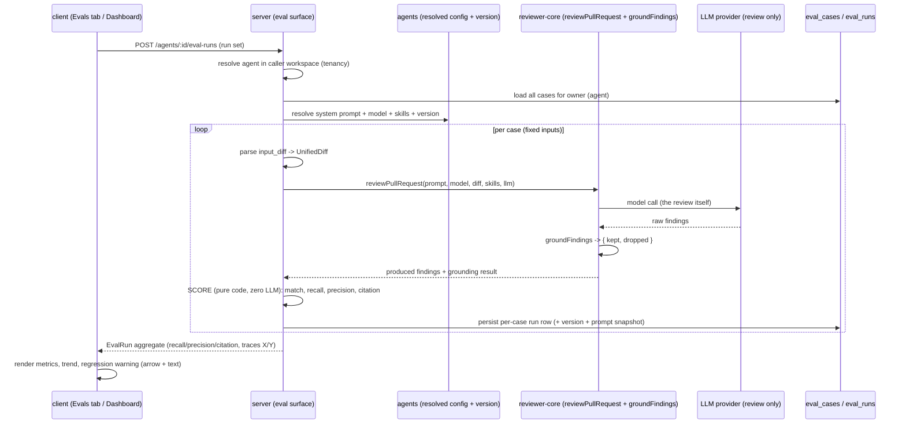

# Spec: Eval Pipeline (L06)   |   Spec ID: SPEC-2026-07-12-eval-pipeline   |   Status: approved
Supersedes: none

## Problem & why

Reviewer **agents** in DevDigest are configured by a system prompt, a set of skills, and
context. Today, when a maintainer edits an agent's prompt ("tighten it so it stops flagging
clean refactors"), there is **no way to know whether the edit helped or hurt** — did recall
drop? did a new false positive slip in? The only signal is re-reading real PRs by hand.

The insight of L06 is that **the reviewer's own triage is already a labelled dataset**. Across
L01–L05 a maintainer has been **accepting** and **dismissing** real findings on real PRs. An
accepted finding is ground truth that the agent *should* surface that issue; a dismissed finding
is ground truth that the agent *should not* have raised it. No synthetic test cases are needed —
the real accept/dismiss decisions **are** the regression suite.

The **Eval Pipeline** turns those decisions into reproducible regression tests for an agent:

- **One-click case creation** from a real finding — an **accepted** finding becomes a
  `must_find` case ("the agent MUST surface finding X at file:line"); a **dismissed** finding
  becomes a `must_not_flag` case ("the agent must NOT comment on Y"). The expectation *type* is
  derived from the finding's accept/dismiss state, not chosen by the user.
- **Deterministic, code-only scoring** — recall / precision / citation_accuracy computed by
  pure TypeScript with **zero LLM calls**. The tests derived from this spec must be provable
  from the math defined here alone.
- **Reproducible, comparable runs** — a run fixes its inputs (the case's stored diff/files/meta
  + the agent's resolved config and version at run time), so "old prompt vs new prompt" is an
  apples-to-apples comparison, surfaced as run history + a side-by-side compare.

This feature touches **client** (FindingCard action, Agent-editor Evals tab, Eval Dashboard,
case editor), **server** (case CRUD + run + scoring + dashboard aggregate), and
**reviewer-core** (consumed as a library to run the agent and to apply the grounding gate). It
spans ≥ 2 modules, so the spec lives in top-level `specs/`.

Note: this is the **in-app** eval feature. The separate top-level `evals/` offline harness is
unrelated and out of scope.

## Goals / Non-goals

- Goal: From a review finding, create an eval case in **one click**, deriving the expectation
  type from the finding's accept/dismiss state (`accepted → must_find`,
  `dismissed → must_not_flag`), capturing the PR's unified diff (reloaded from the PR) as the
  case's **fixed** input so the case is reproducible.
- Goal: List all eval cases of an agent's set in an **Evals tab** in the Agent editor, and on a
  dedicated **Eval Dashboard** (new sidebar item under SKILLS LAB → `/eval`).
- Goal: **Run** an agent across all cases in its set (`POST /agents/:id/eval-runs`), one review
  per case, on the case's fixed inputs + the agent's resolved config, persisting per-case run
  rows and a set-level aggregate.
- Goal: Score every run with **pure, deterministic TypeScript** — recall / precision /
  citation_accuracy — making **zero LLM calls** in the scoring step (the *review* itself calls
  the model; scoring the produced findings does not).
- Goal: Show run **history** and let a user **compare two runs side by side** (metric deltas +
  the agent's system-prompt diff for the two versions).
- Goal: A run **records the agent version and the exact system prompt** it used, so compare is
  trustworthy across agent edits.
- Goal: When grounding inputs are incomplete (unparseable/empty case diff), render a
  **deterministic skeleton + an honest "degraded" badge** — never a blank surface.
- Goal: `pnpm verify:l06` is green — a `scripts/verify-l06.mjs` file-existence / string-contains
  checker (exit 0/1), same shape as `scripts/verify-l03.mjs`.

- Non-goal (L06): **Skill** evals. `owner_kind` supports `'skill'`, but L06 scopes cases, runs,
  and the dashboard to **reviewer agents** (`owner_kind = 'agent'`) only — every mockup shows
  agents. Skill evals are future work. (RESOLVED — see Open questions.)
- Non-goal: **Promoting** a compared run's prompt ("Promote vN" in the compare modal). L06 renders
  compare/deltas/prompt-diff **display-only**; the Promote action is future work. (RESOLVED.)
- Non-goal: **Synthetic / hand-authored** test generation as the primary dataset. Cases are born
  from real triage; the case editor exists for editing and manual new-from-scratch authoring,
  not as the main creation path.
- Non-goal: Any **LLM call inside the scoring step**. Matching + recall/precision/citation are
  pure arithmetic over produced findings and stored expectations.
- Non-goal: **Changing the reviewer-core review pipeline or its grounding contract.**
  reviewer-core is consumed unchanged; `groundFindings()` is applied, never bypassed.
- Non-goal: A **public / unauthenticated** surface. All eval surfaces are workspace-scoped.

## User stories

- US-1: As a maintainer, from an **accepted** finding I want to turn it into an eval case in one
  click, so the agent is regression-tested to keep surfacing it.
- US-2: As a maintainer, from a **dismissed** finding I want to turn it into a `must_not_flag`
  case in one click, so the agent is regression-tested to stop raising it.
- US-3: As a maintainer, I want to see all eval cases of an agent (Evals tab + Dashboard), so I
  know what the agent is being held to.
- US-4: As a maintainer, I want to run the agent across all its cases and see recall / precision
  / citation_accuracy, so I can judge quality in one number set.
- US-5: As a maintainer, I want run history and a side-by-side compare of two runs (metric deltas
  + prompt diff), so I can prove an edit ("old prompt vs new") helped or hurt.
- US-6: As a maintainer, I want a regression warning when a metric dips between runs, so I catch a
  new false positive before shipping the prompt.
- US-7: As a maintainer, when a case's stored inputs are incomplete I want an honest degraded
  surface rather than a blank screen or a crash.

## Acceptance criteria (EARS)

### Case creation from triage

- AC-1: WHEN the user activates **"Turn into eval case"** on a review finding, the system
  **shall** create an eval case in a single action (no second confirmation step) and confirm with
  a toast. _(observable: one click on the finding's action yields a persisted eval case + a
  success toast; the case appears in the agent's set)_
- AC-2: WHEN a case is created from a finding, the system **shall** derive the expectation type
  from the finding's accept/dismiss state — an **accepted** finding (`accepted_at` set) yields
  `kind = 'must_find'`; a **dismissed** finding (`dismissed_at` set) yields `kind = 'must_not_flag'`.
  _(observable: creating from an accepted finding stores `expected_output.kind = 'must_find'`;
  from a dismissed finding, `must_not_flag`)_
- AC-3: WHEN a case is created from a finding, the system **shall** capture the PR's unified diff
  (reloaded via the finding's PR) as the case's fixed `input_diff`, plus the finding's
  `file / start_line / end_line / severity / category / title` inside `expected_output.findings[]`,
  so the case is self-contained and reproducible. _(observable: the stored case carries a
  non-empty `input_diff` and an `expected_output` finding matching the source finding's
  file+line+severity+category+title)_
- AC-4: IF the source finding is neither accepted nor dismissed (untriaged), THEN the system
  **shall** disable the "Turn into eval case" action (a case type cannot be derived).
  _(observable: an untriaged finding shows the action disabled / unavailable; no case is created)_

### Scoring — pure, deterministic, zero LLM

- AC-5: WHEN scoring a run, the system **shall** consider a produced finding to **match** an
  expected finding **if and only if** their `file` paths are equal AND their line ranges overlap
  (i.e. `max(p.start_line, e.start_line) <= min(p.end_line, e.end_line)`). _(observable: a
  same-file finding whose range intersects the expected range matches; a different-file or
  non-overlapping finding does not)_
- AC-6: The system **shall** compute **recall** over the set as
  `(# must_find expectations across the set matched by at least one produced finding) / (total #
  must_find expectations in the set)`. IF the set has **zero** `must_find` expectations, THEN
  recall **shall** be `1.0` (vacuously satisfied). _(observable: a set with 4 must_find
  expectations, 3 matched → recall = 0.75; a set with no must_find expectations → recall = 1.0)_
- AC-7: The system **shall** compute **precision** over the set as
  `(# produced findings that do NOT match any must_not_flag target) / (total # produced findings)`.
  IF the run produces **zero** findings, THEN precision **shall** be `1.0` (no false positives).
  _(observable: 10 produced findings, 1 matching a must_not_flag target → precision = 0.9; zero
  produced findings → precision = 1.0)_
- AC-8: The system **shall** compute **citation_accuracy** as `kept / (kept + dropped)`, where
  `kept`/`dropped` are the result of applying reviewer-core's **`groundFindings(producedFindings,
  caseDiff)`** grounding gate to the produced findings against the case's parsed diff. IF
  `kept + dropped == 0` (zero produced findings), THEN citation_accuracy **shall** be `1.0`.
  _(observable: 8 produced findings, 6 surviving grounding → citation_accuracy = 0.75; zero
  produced findings → 1.0)_
- AC-9: The scoring step (match → recall/precision/citation_accuracy) **shall** make **zero LLM /
  provider calls** — it is pure arithmetic over produced findings and stored expectations.
  _(observable: computing metrics from a fixed produced-findings set + expectations invokes no LLM
  provider; a stubbed/absent provider does not affect the scores)_
- AC-10: The system **shall** mark a case as **passing** when its per-case `recall == 1.0` AND no
  produced finding matches any `must_not_flag` target in that case; otherwise the case **fails**.
  _(observable: a `must_find` case whose expected finding is matched with no false positive →
  pass ✓; a `must_find` case with the expected finding missed → fail ✗; a `must_not_flag` case
  with zero produced findings on the target → pass ✓)_

### Runs, reproducibility & comparison

- AC-11: WHEN the user runs an agent's set (`POST /agents/:id/eval-runs`), the system **shall**
  run the agent once per case on the case's **fixed** stored inputs + the agent's resolved config
  (system prompt, model, skills), persist one run row per case, and return a set-level aggregate
  (recall / precision / citation_accuracy pooled across cases, `traces_passed` = passing cases,
  `traces_total` = total cases). _(observable: running an N-case set writes N per-case rows and
  returns an aggregate with `traces_total == N`)_
- AC-12: WHEN a run executes, the system **shall** record the **agent version** and the **exact
  system prompt** used, so a later compare shows the true old-vs-new prompt. _(observable: each
  persisted run carries the agent `version` and the prompt text/snapshot ref active at run time;
  compare of v6→v7 renders the two distinct prompts)_
- AC-13: The system **shall** provide run **history** for an agent and a **compare** of exactly
  two selected runs, showing per-metric deltas (recall/precision/citation, and cost) and the
  **system-prompt diff** between the two runs' versions. _(observable: selecting two runs opens a
  compare view with signed metric deltas and a visible prompt diff)_
- AC-14: WHEN the latest run's precision, recall, or citation_accuracy is **lower** than the
  immediately previous run's, the system **shall** surface a **regression warning** naming the
  dipped metric and magnitude. _(observable: a run whose precision fell from 0.93 to 0.91 renders
  a "Precision dipped 2pts" warning banner)_
- AC-15: A case set that is run **shall** contain **≥ 8 eval cases**; IF a set has fewer than 8
  cases, THEN the run surface **shall** warn that the set is under the recommended minimum (the
  run is still permitted). _(observable: an agent with 8+ cases runs without warning; a 5-case set
  shows an under-minimum warning)_
- AC-16: WHERE an agent's **system prompt changes** between two runs of the same fixed case set,
  the system **shall** reflect the change as a **visible movement in recall and/or precision**
  between those runs (the sensitivity property). _(observable: two runs of the same set under two
  materially different prompts produce different recall and/or precision, shown as a non-zero
  delta in compare)_

### Degraded fallback

- AC-17: IF a case's `input_diff` is empty or cannot be parsed into a unified diff, THEN the
  system **shall** still render a deterministic run/score skeleton from the facts it has
  (expected findings, produced findings by file+line) and **shall** mark the affected metric
  (citation_accuracy, which needs the diff) as **degraded** with an honest badge, instead of a
  blank surface or a crash. _(observable: a case with an unparseable diff renders recall/precision
  from file+line matching plus a "degraded" citation badge; no blank screen, no error)_
- AC-18: IF a single case's review run fails (provider error) mid-set, THEN the system **shall**
  record that case as failed with the reason and **shall** continue running the remaining cases,
  never aborting the whole set. _(observable: a set where one case errors still returns an
  aggregate over the surviving cases with the errored case marked failed)_

### Surfaces (UI)

- AC-19: The Agent editor **shall** expose an **Evals** tab (alongside Config / Skills / Context /
  Stats / CI) showing an EVAL METRICS row (recall / precision / citation_accuracy with deltas +
  traces-passed X/Y) and an **Eval cases (M/N passing)** list — each row: case name, "expected N
  finding(s), got M", a severity·category badge (or "empty []"), status (✓ pass / ✗ fail / never
  run), and run / edit / delete controls; plus "Run all evals", "New eval case", and a "View full
  dashboard" link. _(observable: the Evals tab renders the metrics row and one row per case with
  the listed elements)_
- AC-20: The sidebar **shall** show an **"Eval Dashboard"** item under SKILLS LAB linking to
  `/eval`, and the dashboard **shall** list per-agent cards (name, model, last run vN, pass count,
  recall/precision/citation + trend) with a "Run all agents" action and a "Recent eval runs · all
  agents" table. _(observable: the nav item is present and routes to a dashboard rendering the
  agent cards + recent-runs table)_
- AC-21: The single-agent dashboard detail **shall** render 3 metric cards with deltas, a
  metric-trend line chart (recall/precision/citation over runs), a "Recent runs" table with
  selection + a **Compare** control, and a "Run eval" action. _(observable: the detail view
  renders the three metric cards, the trend chart, and a selectable runs table with Compare)_
- AC-22: The **eval case editor** modal **shall** provide a Name field, an Input with Diff /
  Files / PR-meta tabs (showing the stored diff), an Expected-output editor validated as **valid
  JSON** against the expectation schema with a "+ Finding skeleton" helper, a "Run on save"
  toggle, and Cancel / Run case / Save actions, showing a last-run badge (expected/got, duration,
  cost) after a run. _(observable: the modal renders these fields; an invalid Expected-output JSON
  blocks Save with a validation message; a valid one persists)_
- AC-23: The dashboard, Evals tab, and compare surfaces **shall** convey metric direction and
  regression by an **icon/arrow + text** (up/down + signed value), not by colour alone.
  _(observable: with colour removed, a delta's direction and the regression warning remain
  distinguishable via arrow glyph + text)_

### Access control & verification

- AC-24: WHEN serving or mutating any eval case/run, the system **shall** resolve the target
  agent and its cases within the **caller's workspace** and **shall** refuse an agent/case/run
  outside the caller's workspace. _(observable: a request for an eval case/run of an agent in
  another workspace is refused (not-found), never served)_
- AC-25: `pnpm verify:l06` **shall** exit 0 when all L06 deliverables are present and exit 1
  otherwise, via `scripts/verify-l06.mjs` (file-existence / string-contains checks, same shape as
  `scripts/verify-l03.mjs`). _(observable: running `pnpm verify:l06` on a complete tree prints ✓
  lines and exits 0; a missing deliverable exits 1)_

## Edge cases

- Finding is untriaged (no `accepted_at`/`dismissed_at`) → "Turn into eval case" disabled; no type
  derivable. → AC-4.
- Set has zero `must_find` expectations (all `must_not_flag`) → recall = 1.0 (vacuous). → AC-6.
- Run produces zero findings → precision = 1.0 and citation_accuracy = 1.0 (no findings, no false
  positives, nothing to ground). → AC-7, AC-8.
- Produced finding on a `must_not_flag` target → counted as a false positive, drives precision
  down, fails that case. → AC-7, AC-10.
- Case `input_diff` empty / unparseable → recall+precision computed from file+line; citation shown
  "degraded"; no blank/crash. → AC-17.
- One case's review errors mid-set → that case marked failed, remaining cases continue. → AC-18.
- Set has fewer than 8 cases → run allowed but an under-minimum warning is shown. → AC-15.
- Same set, two materially different prompts → recall/precision move (sensitivity). → AC-16.
- Latest metric dips vs previous run → regression warning banner. → AC-14.
- Agent/case/run from another workspace → refused (not-found). → AC-24.
- Expected-output edited to invalid JSON in the case editor → Save blocked with validation. → AC-22.
- Only one run exists (no previous) → compare and regression-warning are unavailable/omitted
  (nothing to diff against). → **accepted: no delta/warning until a second run exists**.
- Concurrent runs of the same set → each run is an independent immutable record keyed by its own
  run/version metadata; both persist. → **accepted: runs are append-only, no locking**.
- A produced finding matches BOTH a `must_find` and (a different case's) `must_not_flag` target →
  scored per its own case's expectations; matching is evaluated within the case being scored, not
  across cases. → **accepted: matching is per-case-scoped**.

## Cross-module interactions

Scope: **client** + **server** + **reviewer-core** (3 modules) → top-level `specs/`.

- **client** — adds a "Turn into eval case" action to the review **FindingCard**; an **Evals**
  tab to the Agent editor (`?tab=evals`); a new **Eval Dashboard** route (`/eval`) reached from a
  new SKILLS-LAB nav item; the **compare-runs** modal; and the **eval case editor** modal. It
  talks only to the app API client, never to server internals. Metric direction is conveyed by
  arrow + text (not colour alone).
- **server** — owns a new eval surface: **case CRUD** (create-from-finding + manual),
  **`POST /agents/:id/eval-runs`** (run the set), **run history / compare**, and the **dashboard
  aggregate**. Creating a case from a finding **reloads the PR's unified diff** (the `findings`
  row has no diff) to build `input_diff`. Running a case parses `input_diff` to a `UnifiedDiff`
  and calls reviewer-core `reviewPullRequest` with the agent's resolved config (provider resolved
  via the DI container's `llm(provider)`), **without persisting a real review**. Scoring is pure
  server-side TypeScript. All routes are workspace-scoped.
- **reviewer-core** — consumed as a **library only**: `reviewPullRequest(input)` runs the agent
  (this is where the LLM cost lives — the *review*, not the scoring), and `groundFindings(findings,
  diff)` supplies `kept`/`dropped` for `citation_accuracy`. No reviewer-core contract or pipeline
  change; `groundFindings()` is applied, never bypassed.

Failure contract: a case with an unparseable diff degrades gracefully (AC-17); a single case
error does not abort the set (AC-18); an out-of-workspace target is refused (AC-24). Scoring
never calls the model (AC-9).



## Contracts

Shapes only — field names/optionality, not implementation. Existing contracts are the baseline;
**GAPs** flag where a field/migration is missing today.

### Baseline (already present — reuse)

- **`EvalCase`** / **`EvalCaseInput`** — `{ owner_kind, owner_id, name, input_diff, input_files,
  input_meta, expected_output, notes }`. `expected_output` is currently untyped (`z.unknown()`).
- **`EvalRun`** (aggregate) — `{ recall, precision, citation_accuracy, traces_passed,
  traces_total, duration_ms, cost_usd, per_trace[] }`.
- **`EvalRunRecord`** (persisted per-case row) — `{ id, case_id, case_name?, ran_at,
  actual_output, pass, recall, precision, citation_accuracy, duration_ms, cost_usd }`.
- **`EvalRunResult`**, **`EvalTrendPoint`**, **`EvalDashboard`** (per-owner aggregate with
  `current` / `delta` / `trend[]` / `recent_runs[]` / `alert`) — reused for the dashboard.
- Storage: `eval_cases` (`workspace_id`, `owner_kind`, `owner_id`, `name`, `input_diff`,
  `input_files`, `input_meta`, `expected_output`, `notes`) and `eval_runs` (`case_id`, `ran_at`,
  `actual_output`, `pass`, `recall`, `precision`, `citation_accuracy`, `duration_ms`, `cost_usd`).

### Expected-output shape (RESOLVED — new encoding inside the existing `expected_output` jsonb)

Because `eval_cases` has **no dedicated file/line/type columns**, the expectation is encoded in
the `expected_output` jsonb:

```
EvalExpectation = {
  kind: 'must_find' | 'must_not_flag',
  findings: Array<{ file: string, start_line: number, end_line: number,
                    severity: Severity, category: FindingCategory, title: string }>
}
```

- `kind` is **derived** from the source finding's accept/dismiss state at creation (AC-2).
- `findings[]` carries the file+line+severity+category+title targets used by the matcher (AC-5).
- For `must_not_flag`, `findings[]` lists the target(s) the agent must NOT reproduce.

### GAPs (need a new field / migration — flag for the planner, do not design here)

- **GAP-1 (reproducibility):** `eval_runs` has **no `agent_version` / system-prompt-snapshot
  column**, and `EvalRunRecord` has **no `version`** field. AC-12/AC-13 (trustworthy compare +
  prompt diff) require the run to pin the agent version and the exact prompt used. Add a
  version/prompt-snapshot field to the run row + `EvalRunRecord` (or reference `agent_versions`).
  Decision taken: **store the version + prompt on the run** (see Open questions).
- **GAP-2 (set grouping):** `eval_runs` stores **per-case** rows; the dashboard "Recent runs"
  table renders **one row per set run** (one version, aggregate metrics). A grouping key (a set-run
  / batch id, or a persisted set-level aggregate) is needed to reconstruct set rows. Flag for the
  planner.
- **GAP-3 (grounding detail):** `reviewPullRequest` returns already-grounded (kept) findings; to
  compute `citation_accuracy = kept/(kept+dropped)` the run must obtain **both** kept and dropped
  counts (i.e. the grounding result / pre-grounding findings). Flag for the planner.
- **GAP-4 (expected_output typing):** `expected_output` is `z.unknown()` today; the
  `EvalExpectation` shape above should be validated on write (case editor Save + create-from-finding).

### API surface (shape/direction only)

- Case CRUD (create-from-finding + manual create/update/delete), scoped to an agent owner.
- `POST /agents/:id/eval-runs` — run the whole set; returns an `EvalRun` aggregate.
- Run history + compare (two run ids → deltas + prompt diff); dashboard aggregate per agent and
  across all agents. All client → server → client, workspace-scoped (AC-24), rate-limited
  (Non-functional).

## Non-functional

- Cost / correctness: the **scoring step makes zero LLM calls** (AC-9); metrics are deterministic
  functions of produced findings + expectations, so a given (findings, expectations, diff) triple
  always yields the same recall/precision/citation_accuracy. The *review* per case makes the model
  call(s) that reviewer-core normally makes — that cost is expected and recorded as `cost_usd`.
- Data floor: a runnable set carries **≥ 8 eval cases**; below that the run surface warns (AC-15).
- Performance: the pure scoring of one case's produced findings against its expectations **shall**
  complete within a p95 of **< 50 ms** (excluding the review model call). The set run's wall-clock
  time is bounded by the per-case reviews, which run sequentially or bounded-concurrently.
- Rate: the run endpoint (`POST /agents/:id/eval-runs`) **shall** be rate-limited to at most
  **10 requests / minute** per caller (each request can fan out to a full model-backed set).
- Security / access: all eval surfaces are **workspace-scoped** and refuse cross-workspace targets
  (AC-24); the case editor's Expected-output JSON is **validated against `EvalExpectation`** before
  persist (AC-22, GAP-4) so malformed/oversized payloads are rejected.
- a11y: dashboards, Evals tab, and compare **shall** meet **WCAG 2.1 AA** — metric direction and
  regression conveyed by **arrow/icon + text**, not colour alone (AC-23); trend-chart data has an
  accessible text alternative; run/edit/delete icon buttons carry accessible names.
- i18n: all new user-facing strings go through the client i18n layer (the existing `eval`
  namespace — `client/messages/en/eval.json`); `nav.eval` already exists in `shell.json`. No
  hardcoded English in JSX.

## Untrusted inputs

**Yes — indirectly.** A case's `input_diff` is **real third-party PR code** and its
`expected_output`/`notes` may contain author-controlled finding text. Handling:

- The **scoring step consumes no model**, so the produced-findings-vs-expectations arithmetic has
  no prompt-injection surface at all.
- The **review step** feeds `input_diff` to the model through reviewer-core, which already
  **`wrapUntrusted()`s** the diff/PR body and appends the injection guard before the prompt — this
  behaviour is inherited unchanged; embedded "ignore previous instructions" text in a case diff is
  fenced as data.
- The produced findings are passed through **`groundFindings()`** (AC-8) exactly as in a normal
  review, so a hallucinated/off-diff citation cannot inflate citation_accuracy.
- The case editor's user-entered **Expected-output JSON** is validated against `EvalExpectation`
  (AC-22, GAP-4) and rendered as escaped data by the client, never executed.

## Open questions

All decision-changing forks below were **confirmed by the maintainer** in a live clarification
dialogue (2026-07-12); each was accepted at the recommended default. They are recorded as
**RESOLVED**; residual risk is noted where the alternative is a plausible product call.

- [RESOLVED — Owner scope: **agents only** in L06]. Cases, runs, and the dashboard are scoped to
  `owner_kind = 'agent'`; skill evals are future work. Matches every mockup. (Alternative:
  agents+skills — deferred.)
- [RESOLVED — Reproducibility: **store the agent version + system-prompt snapshot on the run**
  (GAP-1)]. This makes compare/prompt-diff (mock_4) trustworthy even if the agent is edited later.
  (Alternative: derive the prompt from `agent_versions` by `ran_at` — rejected as fragile if
  versions are pruned/edited.)
- [RESOLVED — Empty-set math: **recall = 1.0** when a set has no `must_find` expectations;
  **precision = 1.0** and **citation_accuracy = 1.0** when a run produces zero findings]. Chosen
  over `null`/undefined because finite values keep deltas, averaging, and the trend chart simple.
- [RESOLVED — "Turn into eval case": **one-click silent create + toast** (honours the explicit
  "created in one click" requirement)]. The case editor modal (mock_6) remains the path for
  editing and manual new-from-scratch authoring. Residual risk: a user cannot review the
  auto-derived expectation before it lands; a future enhancement could open the editor prefilled.
- [RESOLVED — "Promote vN" in compare: **display-only in L06**]. Compare shows deltas + prompt
  diff; promoting a version is future work.
- [RESOLVED — Expected-output encoding: the **`EvalExpectation`** shape above], stored inside the
  existing `expected_output` jsonb (no per-case file/line columns exist). Validated on write
  (GAP-4).
