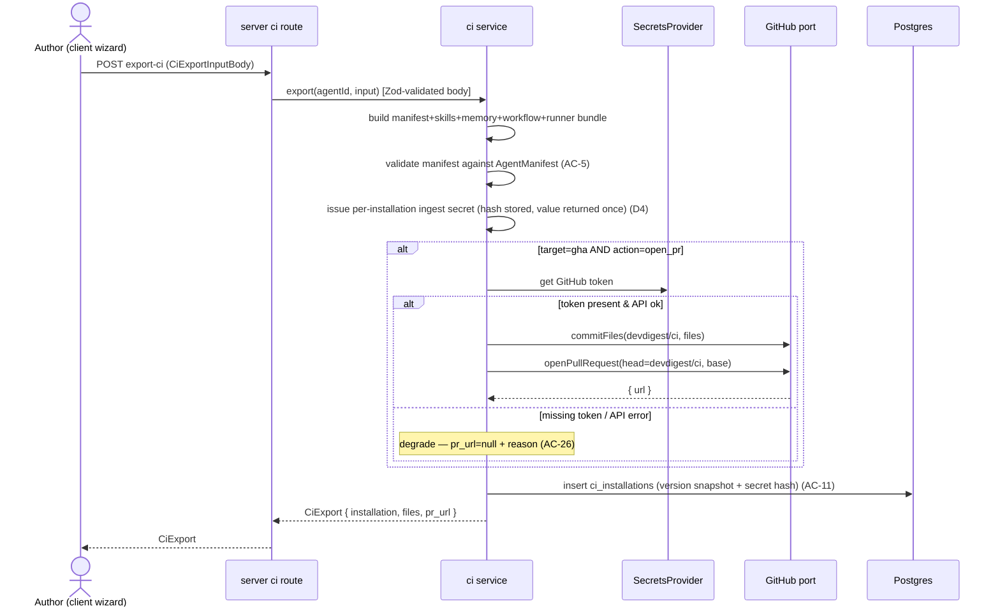
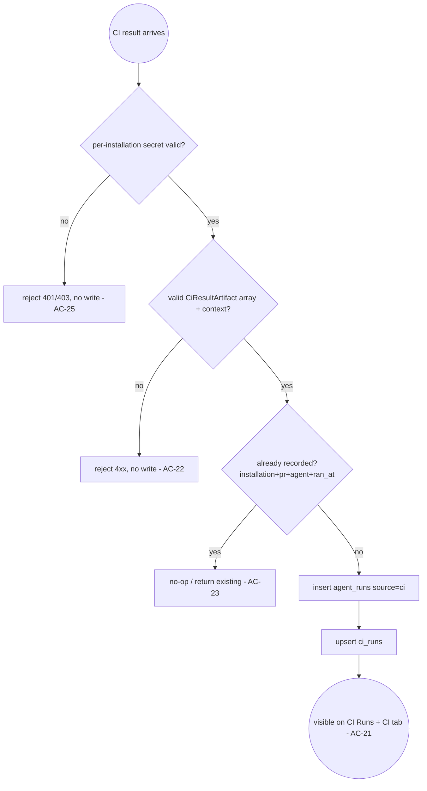

# Spec: Export to CI — deploying finished review agents to GitHub Actions   |   Spec ID: SPEC-2026-07-14-export-to-ci   |   Status: draft
Supersedes: none

> Deliverable path note: the parent request named `specs/export-to-ci.md`; this file follows the
> repository's established date-slug convention (`specs/2026-07-14-export-to-ci.md`, matching the
> four existing top-level specs). It is the single "Export to CI" spec. Scope touches `server`,
> `client`, and reuses `agent-runner` + `reviewer-core` contracts, so it lives in the top-level
> `specs/`.

## Problem & why

While a tuned agent lives on a developer's machine, the team cannot use it. The moment the tool
becomes shared and starts running automatically on every PR is when it is deployed to CI. A "tuned
agent" is technically a configuration (model + system prompt + linked skills + settings) that, on
export, is serialized into a **manifest**: YAML at `.devdigest/agents/<slug>.yaml`. The same Zod
contract (`AgentManifest`) validates the manifest both in the studio and in the agent-runner — one
contract, two consumers, the byte-for-byte same artifact. No "slightly different prompt version in CI".

This feature gives the agent's author an Export Wizard, a CI Runs page, and a CI tab on the agent
page, so they can publish an agent to a repository through a PR and see the results of the automatic
reviews that come back from GitHub Actions.

## Resolved design decisions

Five open questions were delegated to the spec author. The decisions and rationale below become part
of the scope of this specification.

### D1 — Install step opens a REAL GitHub PR (with graceful degradation)

**Decision:** for `target=gha` and `action=open_pr`, the server **actually** commits the generated
files atomically to a `devdigest/ci` branch and opens a PR against `base` through the **already
existing** GitHub port, using a token from the injected `SecretsProvider`. If the token is absent or
the GitHub API fails, the export **degrades** to returning the generated files (`pr_url = null` + a
machine-readable reason) rather than a 500; the "Copy files as a zip" path is always available from
`CiExport.files`.

**Rationale:** the GitHub port already exposes `commitFiles(repo, { branch, files, ... })` and
`openPullRequest(repo, payload)` with test doubles (`MockGitHubPort`) in `adapters/mocks.ts` — so
real PR creation is injected via the container and **tested hermetically** without the network (per
the "mock at the port, not the network" convention). The `CiExport.pr_url` contract is already
nullable and `action` is `open_pr | files`, so degradation is built into the contract. This is both
realistic and testable for this iteration, and respects the worktree B boundary (the `ci/` engine +
its routes).

### D2 — Slug derived as `slugify(name)` at export time; no migration

**Decision:** the slug for `.devdigest/agents/<slug>.yaml` and `.devdigest/skills/<slug>.md` is
derived deterministically as `slugify(name)` in the ci service at export time. **No** `slug` column
and **no** migration to `agents`/`skills`. On a collision within a single bundle, a short
deterministic suffix is appended so filenames are unique (no overwrite).

**Rationale:** adding a `slug` column would touch the shared schema (`agents` + `skills`), require a
migration + backfill, and cascade beyond worktree B. `slugify(name)` keeps the logic local to the
`ci` module, deterministic and byte-stable for a given name. The collision risk is real (two
agents/skills whose names slugify to the same value) and is closed by an in-bundle disambiguator
(the runner globs `.devdigest/agents/*.yaml` anyway, so the essential requirement is filename
uniqueness within the shipped bundle).

### D3 — Ingest endpoint IS in scope (writes to the existing runs model)

**Decision:** this iteration includes a minimal **ingest endpoint** that accepts a validated
`CiResultArtifact[]` together with its context (installation / repo / PR), writes one row per
artifact into the **existing** `agent_runs` model with `source='ci'`, and upserts the corresponding
`ci_runs` row. Wiring the runner to this endpoint (POSTing the result back) is **not** in scope for
this iteration; the runner already writes the `devdigest-result.json` artifact, and the server here
provides the ingest contract.

**Rationale:** without ingest, the CI Runs page and the CI tab would show only seed data — a dead
demo. Ingest closes the loop "the agent runs automatically and the results come back", which is the
essence of the feature, and makes both pages live and end-to-end testable. Writing specifically into
`agent_runs` (`source='ci'`) is a direct requirement of the worktree B boundary; the existing
`source` column already supports `'local' | 'ci'`.

### D4 — Ingest auth: per-installation shared secret

**Decision:** ingest is authenticated with a **per-installation shared secret**. At export the server
generates a secret, stores its hash on `ci_installations`, and returns the value to the user once to
put into a GitHub repository secret (e.g. `DEVDIGEST_INGEST_TOKEN`); the runner sends it in a header
when POSTing the result. The server accepts only a match for the target installation and scopes the
write to that installation.

**Rationale:** the CI runner is autonomous and has no session, so session auth is unrealistic; a
workspace-scoped token would give a wider blast radius if leaked. A per-installation secret limits any
compromise to a single installation, maps naturally onto the "installation = agent in a repo" model,
and needs no GitHub App. The secret value is sensitive: it is returned once at export, never logged,
and never placed in any generated file (this extends AC-24).

### D5 — "Workflow version" = agent `version` snapshot at export

**Decision:** "workflow version" on the CI tab is `agents.version` **snapshotted** onto the
`ci_installations` row at export time (a snapshot), not the live agent version and not the runner
bundle version.

**Rationale:** the manifest is checked into the repo, so the configuration in effect in CI is exactly
the one at export time. The version snapshot shows "which config version is currently in CI" and gives
a reference point for a drift warning (the open question about `ci_fail_on`). It requires only one
snapshot field on `ci_installations` (within worktree B, without touching the shared `agents` schema).

## Goals / Non-goals

- **Goal:** "Add to CI" on the CI tab opens a 4-step Export Wizard (Target → Preview → Configure →
  Install).
- **Goal:** generate a bundle (manifest YAML, skills `*.md`, empty `memory.jsonl`, editable workflow
  yml, bundled runner) where the manifest is valid against the shared `AgentManifest`.
- **Goal:** for GHA open_pr — an atomic commit to `devdigest/ci` + a real PR; the degraded zip path
  is always available.
- **Goal:** a self-contained workflow that runs the bundled `.devdigest/runner/index.js` (NOT a
  marketplace `uses:` action); the `uses:` line in the preview is an editable placeholder.
- **Goal:** a CI Runs page (runs with `source='ci'`) and a CI tab on the agent page (installations,
  run history, "Fail CI on" selector).
- **Goal:** an ingest endpoint that writes `agent_runs (source='ci')` + upserts `ci_runs`.
- **Non-goal:** the multi-run service and the PR feed — **not** touched (worktree B boundary).
- **Non-goal:** wiring the runner to ingest (POST from CI back to the server) — a separate
  iteration / the runner's concern.
- **Non-goal:** real implementation of CircleCI / Jenkins / Generic CLI — these targets render
  read-only / placeholder (see AC-3), with no real open_pr.
- **Non-goal:** memory (`memory.jsonl` is empty in this lab — memory comes later).
- **Non-goal:** changing the reviewer-core pipeline or the runner's invariants (`groundFindings`,
  `wrapUntrusted`, deterministic gate) — they are reused as-is.
- **Non-goal:** adding a `slug` column / migrating the `agents`/`skills` schema (see D2). (Adding the
  two D4/D5 columns to `ci_installations` IS in scope — see Contracts.)

## User stories

- US-1: As an agent author, I want an "Add to CI" button on the CI tab that opens a 4-step Export
  Wizard, so I can deploy a tuned agent into a repository's CI.
- US-2: As an agent author, in the Target step I want to choose GitHub Actions / CircleCI / Jenkins /
  Generic CLI, so I can specify where we deploy.
- US-3: As an agent author, in the Preview step I want to see exactly what ships (manifest, skills,
  `memory.jsonl`, editable workflow yml), so I can trust the artifact.
- US-4: As an agent author, in the Configure step I want to set triggers and "Post results as" with a
  hint about merge blocking, so CI behaves as I intend.
- US-5: As an agent author, in the Install step I want to open a PR with the files OR copy them as a
  zip, so I can land the config via review or through a degraded path.
- US-6: As a reviewer/team, I want the export to land via a PR into a `devdigest/ci` branch (never
  directly into main), so config changes go through review like any code.
- US-7: As a team member, I want a CI Runs page listing runs from GitHub (PR, repo, agent, verdict,
  findings, cost, duration, link to the Actions job), so I can monitor the automatic reviews.
- US-8: As an agent author, I want a CI tab with installations per repository (status + workflow
  version), run history, and a "Fail CI on" selector, so I can manage the agent's presence in CI.
- US-9: As the system, I want to ingest CI run results into `agent_runs (source='ci')`, so the CI
  Runs page and the CI tab show real data.

## Acceptance criteria (EARS)

### Export Wizard — open & Target step (US-1, US-2)
- AC-1: WHEN the user activates "Add to CI" on an agent's CI tab, the system shall open a 4-step
  Export Wizard (Target → Preview → Configure → Install) initialized with `CiExportInput` defaults
  (`target=gha`, `action=open_pr`, `post_as=github_review`, `triggers=[opened, synchronize, reopened]`,
  `base=main`).   _(observable: the wizard renders four ordered steps with those default values pre-set)_
- AC-2: The Export Wizard Target step shall present exactly four targets mapped to `CiTarget` —
  `gha` (marked recommended), `circle`, `jenkins`, `cli`.   _(observable: four options render; `gha`
  carries a "recommended" marker)_
- AC-3: WHERE the selected target is not `gha`, the system shall render the workflow file as a
  read-only placeholder and restrict the Install step to the zip path only (no "Open a PR").
  _(observable: for `circle`/`jenkins`/`cli` the workflow editor is read-only and the open-PR action
  is absent/disabled)_

### Export Wizard — Preview step (US-3)
- AC-4: WHEN the user reaches the Preview step, the system shall display the full export bundle: the
  agent manifest (YAML), one markdown body per linked skill, an empty `.devdigest/memory.jsonl`, and
  an editable `.github/workflows/devdigest-review.yml`.   _(observable: preview lists all four artifact
  kinds; `memory.jsonl` is present and empty)_
- AC-5: The generated manifest shall validate against the shared `AgentManifest` schema — the same
  schema the agent-runner consumes — before it is shown or shipped.   _(observable: parsing the
  previewed YAML with `AgentManifest` succeeds; a manifest that fails validation is never rendered or
  exported)_
- AC-6: The generated workflow shall invoke the bundled runner at `.devdigest/runner/index.js`
  directly and shall NOT depend on an external DevDigest **review** marketplace action (i.e. the
  review itself runs the checked-in bundle, not `uses: devdigest/review-action@v1` or any third-party
  review action); any DevDigest `uses:` line shown in the design is an editable placeholder the user
  may change. Standard scaffolding steps that merely place the committed bundle on the runner —
  notably `actions/checkout` — are permitted and expected.   _(observable: the review step is
  `run: node .devdigest/runner/index.js`; no marketplace action performs the review; the placeholder
  `uses:` field is editable. `actions/checkout` may be present as a required setup step.)_
- AC-7: The exported bundle shall be byte-for-byte identical to what is committed or zipped — the
  previewed artifacts are the shipped artifacts.   _(observable: the contents in `CiExport.files`
  equal the committed/zipped file contents)_

### Export Wizard — Configure step (US-4)
- AC-8: The Configure step shall let the user set triggers as a subset of `opened`, `synchronize`,
  `reopened` (`reopened` optional) and persist them into `CiExportInput.triggers`.   _(observable:
  toggling `reopened` changes the generated workflow's `pull_request:` types list accordingly)_
- AC-9: The Configure step "Post results as" selector shall offer `github_review` (recommended),
  `pr_comment`, `none`, mapped to `CiExportInput.post_as`, and shall display a hint that only
  `github_review` yields a verdict able to block merges.   _(observable: three options render; the
  hint text references merge blocking; the selection flows into the generated workflow's post mode)_

### Export Wizard — Install step & PR (US-5, US-6)
- AC-10: WHEN the user chooses "Open a PR" with `target=gha`, the system shall commit every bundle
  file atomically to a `devdigest/ci` branch and open a pull request against `base`, writing nothing
  to the base branch directly, and return the PR url in `CiExport.pr_url`.   _(observable: after
  export the `MockGitHubPort` records exactly one `commitFiles` to `devdigest/ci` and one
  `openPullRequest`; the base branch is untouched; `pr_url` is populated)_
- AC-11: WHEN an export succeeds, the system shall persist a `ci_installations` row (agent, repo,
  target_type, version snapshot, ingest-secret hash) and return it as `CiExport.installation`.
  _(observable: a `ci_installations` row exists post-export and is echoed in the response; the secret
  hash is never included in the response body)_
- AC-12: The Install step shall always offer "Copy files as a zip" assembled from `CiExport.files` as
  a degraded path requiring no GitHub access.   _(observable: the zip option is present and functional
  even when `pr_url` is null)_
- AC-26: IF opening the PR fails because the GitHub token is missing or the GitHub API errors, THEN
  the system shall degrade to returning the generated files with `pr_url = null` and a
  machine-readable reason instead of failing the export.   _(observable: an export with no token
  returns `files` + `pr_url = null` + a reason; the zip path still works)_

### Slug derivation (D2)
- AC-13: The system shall derive each agent/skill file slug deterministically as `slugify(name)` for
  `.devdigest/agents/<slug>.yaml` and `.devdigest/skills/<slug>.md`.   _(observable: an agent named
  "Security Reviewer" yields `security-reviewer.yaml`)_
- AC-14: IF two agents or skills within one export bundle slugify to the same slug, THEN the system
  shall append a short deterministic disambiguator so every emitted filename is unique.
  _(observable: two skills named "Auth" and "auth!" produce two distinct filenames with no overwrite)_

### CI Runs page (US-7)
- AC-15: The CI Runs page shall list runs sourced from CI (`agent_runs.source='ci'`, surfaced as
  `CiRun`), each showing PR number, repository, agent, verdict/status, findings count, cost, duration,
  and a link to the GitHub Actions job.   _(observable: each row renders those eight fields; the link
  targets `github_url`)_
- AC-16: WHILE there are no CI runs for the workspace, the CI Runs page shall render an explicit empty
  state rather than an error or a blank table.   _(observable: empty-state copy renders when the runs
  query returns `[]`)_
- AC-17: WHEN a CI run produced zero grounded findings, the system shall render its status as
  `no_findings` (a passing/approve outcome), not a failure.   _(observable: a `CiRun` with
  `findings_count = 0` shows the `no_findings` status from `CiRunStatus`)_

### CI tab on the agent page (US-8)
- AC-18: The agent CI tab shall list the agent's installations per repository with status and workflow
  version, where "workflow version" is the agent's `version` snapshotted onto the `ci_installations`
  row at export time (D5).   _(observable: one row per `ci_installations` entry showing repo + status +
  the agent version captured at that export)_
- AC-19: The agent CI tab shall show the agent's CI run history (its CI-sourced runs).   _(observable:
  CI runs for that agent render in the tab)_
- AC-20: The agent CI tab shall expose a "Fail CI on" selector bound to the agent's `ciFailOn`
  (`never | critical | warning | any`).   _(observable: the selector reflects and updates
  `agents.ci_fail_on`)_

### Ingest (US-9, D3, D4)
- AC-21: WHEN the ingest endpoint receives a payload that validates as `CiResultArtifact[]` plus its
  installation/PR context, the system shall write one `agent_runs` row per artifact with `source='ci'`
  and upsert the corresponding `ci_runs` row.   _(observable: after ingest, `agent_runs (source='ci')`
  and `ci_runs` rows exist and appear on both the CI Runs page and the agent CI tab)_
- AC-22: IF an ingest payload fails `CiResultArtifact[]` validation, THEN the system shall reject it
  with a 4xx and write nothing.   _(observable: an invalid payload returns a 4xx and creates no rows)_
- AC-23: WHEN a result already recorded (same installation + `pr_number` + agent + `ran_at`) is
  ingested again, the system shall not create a duplicate run.   _(observable: two identical ingests
  yield exactly one run row)_

### Empty/edge coverage & serialization safety
- AC-27: WHEN the agent has no linked skills, the bundle shall omit `.devdigest/skills/*.md` and the
  manifest `skills` shall be `[]` (per `AgentManifest`'s null→`[]` normalization).   _(observable: a
  skill-less agent exports a bundle with no skill files and a manifest whose `skills` parses to `[]`)_
- AC-28: IF the export request's `repo` is not in `owner/name` form, THEN the system shall reject the
  request with a 4xx before generating any files.   _(observable: `repo="foo"` returns a validation
  error and produces no bundle)_
- AC-29: The manifest and workflow serialization shall safely encode the agent name, system prompt,
  and skill slugs so no field can break out of its YAML value context.   _(observable: a system prompt
  containing YAML metacharacters (`:`, `#`, `-`, newlines) round-trips through `AgentManifest`
  unchanged after re-parse)_

### Security / non-functional (measurable — see Non-functional)
- AC-24: The GitHub token used to open the PR and the per-installation ingest secret shall be obtained
  through / issued by the server only and shall never appear in any generated file, API response, log
  line, or the zip (the ingest secret value is returned exactly once, at export, in the export
  response — never thereafter).   _(observable: no token or secret substring is present in
  `CiExport.files` or emitted logs; only the export response carries the freshly issued ingest secret)_
- AC-25: The ingest endpoint shall authenticate each request with the per-installation shared secret
  issued at export time (D4), reject requests whose secret is missing or does not match the target
  installation, and scope the write to that installation.   _(observable: a request with no/incorrect
  secret returns 401/403 and writes nothing; a valid secret only permits writes for its own
  installation)_

## Edge cases

- Missing GitHub secret / auth failure on `open_pr` → AC-26 (degrade to files + `pr_url=null` + reason).
- Ingest called without a valid per-installation secret → AC-25 (reject, no write).
- Malformed ingest payload → AC-22 (4xx, no write).
- Duplicate/replayed ingest of the same run → AC-23 (idempotent upsert).
- CI run with zero grounded findings → AC-17 (`no_findings`, not failure).
- No CI runs yet (fresh workspace) → AC-16 (empty state).
- Two agents/skills sharing a slug → AC-14 (disambiguator, no overwrite).
- Non-GitHub target (`circle`/`jenkins`/`cli`) → AC-3 (read-only placeholder, zip only).
- Agent with zero linked skills → AC-27 (no skill files, `skills=[]`).
- Malformed `repo` (not `owner/name`) → AC-28 (4xx before generation).
- YAML-metacharacter injection via agent name / system prompt / skill name → AC-29 (safe encode).
- Runtime concerns at CI execution time (empty diff, oversized diff, LLM/model failure, stripping
  `.devdigest/**` from the reviewed diff, mandatory `groundFindings`/`wrapUntrusted`, deterministic
  gate) → **accepted: no handling here** — owned by `agent-runner`/`reviewer-core` and preserved
  as-is (see Cross-module interactions); this spec must not re-decide them.
- Agent deleted/disabled after an installation exists → **accepted: no handling** this iteration
  (installation retained; out of scope). Recorded as an Open question.

## Non-functional

- **Contract parity (correctness):** the previewed/shipped manifest validates against the same shared
  `AgentManifest` Zod schema used by the agent-runner; the shipped artifacts are byte-identical to the
  preview (AC-5, AC-7). Verified by a test that parses the emitted YAML with `AgentManifest`.
- **Security — secrets:** the GitHub token flows only through the injected `SecretsProvider`; the
  ingest secret is server-issued. Neither is ever logged, or placed in a generated file/zip, and the
  ingest secret is returned exactly once in the export response (AC-24). Never read `process.env` in
  the server `ci` module (that exception is scoped to `agent-runner`, not here).
- **Security — ingest authenticity:** the ingest endpoint is authenticated by a per-installation
  shared secret; requests with a missing/wrong secret are rejected (AC-25). Payload is Zod-validated at
  the boundary before any write (AC-22). Treat the ingested artifact as untrusted data (see Untrusted
  inputs).
- **Performance:** export bundle generation is deterministic and local (no LLM call); target p95
  < 2 s for generation excluding the GitHub round-trip. Ingest write path target p95 < 500 ms per
  request.
- **Accessibility:** the 4-step wizard meets WCAG 2.1 AA — keyboard-navigable step controls, focus
  moved to each step on transition, and non-color status indication on the CI Runs / CI tab tables.

## Cross-module interactions

Modules and what crosses each boundary:

- **client → server (`ci` module):** the wizard calls the export route with `CiExportInputBody`;
  receives `CiExport`. CI Runs page and CI tab read `CiRun[]` / `CiInstallation[]`. New client hooks
  + api layer (none exist for CI yet) call the server; contracts imported from the client-mirrored
  `eval-ci.ts`.
- **server `ci` module → GitHub port (via container/DI):** `commitFiles(repo, { branch: 'devdigest/ci',
  files })` then `openPullRequest(repo, { title, head: 'devdigest/ci', base, body })`, using a token
  from the injected `SecretsProvider`. Failure contract: missing token / API error → degrade to
  `files` with `pr_url=null` (AC-26), never a 500.
- **server `ci` module → DB:** persist `ci_installations` on export with the version snapshot + ingest
  secret hash (AC-11, D4, D5); ingest writes `agent_runs (source='ci')` + upserts `ci_runs` (AC-21).
  Registration crosses two existing seams: one import + one entry in the modules barrel, and a
  `ciRepo` getter on the container (composition root) — onion layering (routes → service →
  repository) per `server/CLAUDE.md`.
- **studio writer → agent-runner (contract reuse, no code coupling):** the bundle the `ci` module
  emits (`.devdigest/agents/<slug>.yaml`, `.devdigest/skills/<slug>.md`, empty `.devdigest/memory.jsonl`,
  `.github/workflows/devdigest-review.yml`, bundled `.devdigest/runner/index.js`) is exactly what
  `agent-runner` reads at CI time. Both ends share the `AgentManifest` schema (single source of
  truth). The runner's invariants (mandatory `groundFindings()`, `wrapUntrusted()` on diff + PR body,
  deterministic gate against `ci_fail_on`, hard-fail-with-nothing-posted on any error) are preserved
  and NOT re-specified here.

### Export (open_pr) — sequence

### Ingest — flow

## Contracts

Most shapes already exist in `server/src/vendor/shared/contracts/eval-ci.ts` (mirrored client-side).
**Do not redefine them** — reference:

- `CiTarget` = `gha | circle | jenkins | cli`.
- `CiExportInput` / `CiExportInputBody` — export request body (`repo`, `target`, `action`,
  `post_as`, `triggers`, `base`).
- `CiFile` — one generated file (`path`, `contents`, `editable`).
- `AgentManifest` / `AgentManifestInput` — the shared studio↔runner manifest shape.
- `CiInstallation` — persisted install row.
- `CiExport` — export response (`installation`, `files`, `pr_url` nullable). Note: the freshly issued
  ingest secret value is returned once here (D4/AC-24); confirm whether the existing `CiExport` shape
  carries it or a field must be added.
- `CiRun` / `CiRunStatus` (`succeeded | failed | no_findings | running`).
- `CiResultArtifact` — the `devdigest-result.json` artifact ingested to populate `ci_runs`.

Route surfaces (shapes, not implementation):

- **Export:** `POST /agents/:id/export-ci` — body `CiExportInputBody`, response `CiExport`
  (route named in the `eval-ci.ts` doc comment; `CiService.agentYaml` is the intended writer).
- **CI Runs list:** read surface returning `CiRun[]` for the workspace (feeds the CI Runs page).
- **Agent CI tab data:** read surfaces returning that agent's `CiInstallation[]` and its
  CI-sourced `CiRun[]`; the "Fail CI on" selector reads/writes `agents.ci_fail_on` (existing agent
  update surface).
- **Ingest:** a new write surface whose body wraps `CiResultArtifact[]` **plus** its resolving
  context (installation / `repo` / `pr_number`), authenticated by the per-installation secret (header);
  it is built FROM `CiResultArtifact` — do not redefine the artifact shape. Response echoes the
  created/matched run(s). Exact path is for the implementation plan; the behavioral contract is
  AC-21/22/23/25.

DB (mostly existing, reused): `ci_runs` and `agent_runs` (which already has
`source text enum('local','ci') default 'local'`) are reused as-is; `agents.ci_fail_on` and
`agents.version` already exist. **Migration in scope (worktree B):** `ci_installations` gains two
columns — a version snapshot (D5) and an ingest-secret hash (D4). No changes to the shared
`agents`/`skills` tables (D2).

## Untrusted inputs

- **At export time (server `ci` module):** the manifest/skills/workflow are assembled from
  **first-party** studio data (the agent's own model/prompt/skills). The one caller-supplied value is
  `repo` ("owner/name"), which must be validated (AC-28) and safely interpolated into generated files;
  agent name / system prompt / skill names must be safely YAML-encoded so they cannot break out of
  their value context (AC-29). The GitHub token and the issued ingest secret are sensitive, never
  emitted into files/logs (AC-24).
- **At ingest time (server `ci` module):** the `CiResultArtifact[]` payload arrives from an external
  CI system — treat it as **untrusted data**: authenticate the request with the per-installation
  secret (AC-25), Zod-validate at the boundary before any write (AC-22), and never execute or reflect
  it unescaped.
- **At CI run time (agent-runner, out of this spec's scope but noted for completeness):** the PR diff
  and PR body are untrusted and are wrapped via `wrapUntrusted()` / `assemblePrompt` before reaching
  the prompt, with the mandatory `groundFindings()` gate — preserved unchanged, not re-specified here.

## Open questions

- RESOLVED (D4): ingest auth = per-installation shared secret issued at export time.
- RESOLVED (D5): "workflow version" = agent `version` snapshotted onto `ci_installations` at export.
- [NEEDS CLARIFICATION: lifecycle when an agent is deleted/disabled after an installation exists — keep
  the `ci_installations` row (current assumption), soft-hide it, or surface a "stale" status?]
- [NEEDS CLARIFICATION: "Fail CI on" edit on the CI tab (AC-20) — does changing `ci_fail_on` in the
  studio require re-exporting to take effect in CI (since the manifest is checked-in), and should the
  tab warn about that drift (comparing the live agent `version` against the `ci_installations` version
  snapshot from D5)?]
