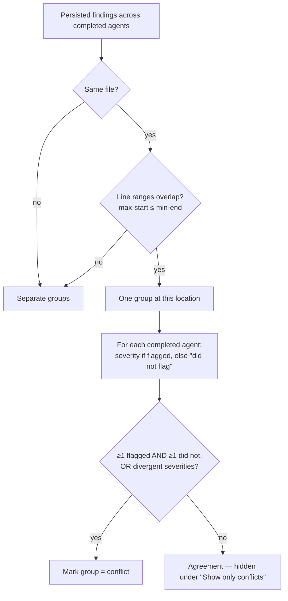

# Spec: Multi-Agent Review   |   Spec ID: SPEC-2026-07-14-multi-agent-review   |   Status: draft
Supersedes: none

> Scope note: this is **Worktree A / Agent A**. The spec covers the agent **picker**, the
> **Multi-Agent Review page** (Configure run + both result modes), the **multi-agent-runs
> service/routes**, **pre-run estimates**, and **cross-agent grouping**. It treats the review
> **execution engine** as a reused contract: it does **not** specify changes inside `ci/` or
> `agent-runner/`, nor the internals of the reviewer-core pipeline or the per-agent run-executor.
> Those are consumed as-is (WHAT/WHY only, never their HOW).

## Problem & why

A real pull request is heterogeneous — it mixes security, performance and domain-logic concerns.
Today a maintainer runs review agents **one at a time or "all"** from a small dropdown
(`RunReviewDropdown`), each agent producing an independent run with no shared parent and no
side-by-side comparison. Three consequences:

1. **No single cross-cutting pass.** A maintainer cannot deliberately pick *this* subset of
   specialised agents (e.g. Security + Performance) and see them close the PR from every angle in
   one coordinated pass, with a shared results surface.
2. **No de-duplication / disagreement view.** When several agents flag the *same* place in the
   code, the maintainer reads three near-identical findings and starts distrusting the tool. There
   is no view that groups findings by code location and shows *where agents disagree* (including an
   agent that reviewed and **did not flag** a spot others did).
3. **No cost/time foresight and weak live feedback.** There is no estimate of time/cost **before**
   launching a fan-out (a brand-new mechanic — the product has none today), and no consolidated
   view of *who finished, who is thinking, who crashed* across the agents in one run.

Attribution ("which agent found this") is also the **raw material** for a future Per-Agent Stats
feature, so the multi-agent run must preserve, per finding, which agent produced it.

**Grounding reality (verified in repo).** Several pieces this feature needs are already present and
are genuinely reused; several claimed-as-reused pieces are **not** what the design assumes and are
in fact greenfield. This spec pins those down (see *Cross-module interactions*, *Contracts*, and
*Open questions*). The most important corrections:

- The review fan-out today runs agents **sequentially** (`for…of` with `await`), not in parallel;
  the "parallel fan-out" wording is **label copy only** — engine concurrency is outside Worktree A.
- `POST /pulls/:id/review` accepts `{ agentId? , all? }` — a **single agent or all**, not an
  arbitrary chosen **set**. Running a chosen subset needs one new launch route.
- `multi_agent_runs` is a bare 4-column stub with **no link** from `agent_runs`; nobody writes or
  reads it. Grouping the fan-out under one multi-run needs **exactly one** minimal linkage — see
  the single schema change in *Contracts*.
- The cross-agent "same file + line-range overlap + **gist similarity**" match rule does **not**
  exist and is **not built here**. Grouping is by file + line-range overlap only (the same predicate
  the eval scorer already uses), computed as **plain code in the read path** — no matcher service,
  no semantics.
- A finding row carries **no agent id**, but attribution is fully **derivable from existing
  relations** (`finding → review → agent_run → agent`), so **no field is added** to findings.

Simplicity is the governing constraint (maintainer directive): reuse existing tables, contracts and
endpoints as-is; add the **smallest** surface that still delivers the feature. The whole feature
lands with **one** unavoidable schema change (a single nullable link column) and otherwise reuses
what exists.

This feature spans **client** + **server** (≥ 2 modules), so the spec lives in top-level `specs/`.

## Goals / Non-goals

- Goal: On the PR page, replace `RunReviewDropdown` with a **"Pick agents to run"** picker that
  lets the maintainer **multi-select** a subset of workspace agents and launch them as one
  multi-agent run.
- Goal: A **Multi-Agent Review → Configure run** page: choose a PR, check agents, see a **per-agent
  time/cost estimate** and a **summary estimate** *before* launching (a new mechanic).
- Goal: A **Multi-Agent Review results page** with two view modes over the same run — **Columns**
  (one live column per agent with status + cost + findings + "View trace") and **Tabs + detail**
  (per-agent tabs; a finding detail with confidence + suggested fix + actions).
- Goal: A **"Where agents disagree"** block that groups findings by code location and shows each
  agent's verdict per group — including **"did not flag"** — with a **"Show only conflicts"** toggle.
- Goal: A **multi-agent-runs service + routes** that write the `multi_agent_runs` record, group the
  per-agent `agent_runs` under it, and expose the run (columns + conflicts) via API — reload-safe
  and addressable by a stable URL.
- Goal: Preserve **per-finding agent attribution** in the returned data (raw material for future
  Per-Agent Stats).
- Goal: **Live status** in each column header (running / done / failed) and a **trace link** per
  column, reusing the existing SSE stream + `RunTraceDrawer` + `LiveLogStream`.

- Non-goal: **Changing the review execution engine.** Worktree A does not enter `ci/` or
  `agent-runner/`, does not change the run-executor's concurrency, and does not alter the
  reviewer-core pipeline. Whatever runs the agents is consumed as-is; this feature orchestrates the
  selection, grouping, estimate and presentation around it.
- Non-goal: **Changing reviewer-core, grounding, or `wrapUntrusted`.** `groundFindings()` remains a
  mandatory gate applied inside the engine before findings are persisted; untrusted diff/PR body
  wrapping is inherited unchanged.
- Non-goal: **Building the Per-Agent Stats page.** Attribution is preserved as *data*; the stats
  surface (`AgentStats` / `GET /agents/:id/stats`) is a sibling feature, out of scope here.
- Non-goal: **The Compose Review drawer.** That is a separate flow (curate a subset of persisted
  findings, hand-edit a body, choose a verdict, post one GitHub review under the user's PAT). It is
  **not built in the client today** (only an i18n namespace + a Zod contract are pre-staged) and is
  strictly downstream of this feature. Multi-Agent Review triggers and observes runs; it does not
  publish reviews to GitHub.
- Non-goal: **Building or owning the Learn / Turn-into-eval-case / Reply-to-author flows.** These
  three actions are **out-of-scope hooks** — the finding detail may surface the buttons, but they
  link to their owning features (Memory homework, the L06 Eval pipeline, and the GitHub/Compose
  reply flow) or remain **stubs**; this spec does not build them. Only **Accept / Dismiss** are
  in scope, because their owning flow already exists and is simply reused (`POST
  /findings/:id/accept|dismiss` + the client `useFindingAction` hook).
- Non-goal: **Semantic / gist similarity for cross-agent grouping** — no implementation exists and
  none is built here. Grouping is file + line-range overlap only.
- Non-goal: **New tables, per-mode endpoints, a matcher service, or an estimate engine.** Reuse the
  existing `multi_agent_runs` stub table, one launch route, one read route, one estimate read; the
  two result modes share one payload; grouping and estimates are plain functions, not services.
- Non-goal: **Any schema change beyond the single link column** named in *Contracts*. In particular
  **no `agent_id` on findings** (attribution is derived) and **no extra columns on
  `multi_agent_runs`** (totals are derived at read time).
- Non-goal: A **public / unauthenticated** surface. Every route is workspace-scoped.

## User stories

- US-1: As a maintainer, on the PR page I want to pick a **subset** of agents and run them together
  in one pass, so the PR is reviewed from every angle at once.
- US-2: As a maintainer, on the Configure run page I want a **per-agent and summary time/cost
  estimate before I launch**, so I can decide whether the fan-out is worth it.
- US-3: As a maintainer, I want a **live column per agent** showing who finished / who is thinking /
  who crashed, with cost and a link to each agent's trace, so I can watch the run in real time.
- US-4: As a maintainer, I want a **"Where agents disagree"** view that groups findings by code
  location and shows each agent's verdict (including "did not flag"), with a **conflicts-only**
  toggle, so I stop reading duplicate findings and focus on genuine disagreement.
- US-5: As a maintainer, in **Tabs + detail** mode I want a finding's **confidence and suggested
  fix** plus actions (**Accept / Dismiss / Learn / Turn into eval case / Reply to author**), so I
  can act on findings without leaving the page.
- US-6: As a maintainer, I want each finding to keep **which agent produced it**, so a future
  Per-Agent Stats view has trustworthy raw data.
- US-7: As a maintainer, when **one agent fails** I want the others to finish and the failure shown
  honestly (status + reason), so a single crash never sinks the whole run.
- US-8: As a maintainer, I want the results to **persist and be shareable by URL** and survive a
  reload, so I can return to or link a completed multi-agent run.

## Acceptance criteria (EARS)

### Picker (PR page)

- AC-1: The PR-page picker **shall** replace `RunReviewDropdown` and let the user select **zero or
  more** workspace agents via checkboxes, showing a run button labelled with the current count
  ("Run multi-agent review (N)"). _(observable: the PR header renders the new picker instead of the
  old dropdown; checking/unchecking agents updates N on the button)_
- AC-2: WHILE **no** agent is selected (N = 0), the system **shall** keep the run action disabled.
  _(observable: with no checkbox ticked the "Run multi-agent review (0)" button is non-actionable)_
- AC-3: WHEN the user activates "Run multi-agent review (N)" with N ≥ 1 selected agents, the system
  **shall** create **one multi-agent run** over exactly those agents and take the user to the
  Multi-Agent Review results surface for that run. _(observable: launching with 2 agents creates a
  single multi-agent run whose columns are those 2 agents, and the results surface for that run is
  shown)_
- AC-4: The picker **shall** provide a **"Configure agents…"** affordance that routes to the agent
  management surface, and a **"Clear"** affordance that deselects all agents. _(observable: the
  picker exposes both controls; "Clear" resets N to 0; "Configure agents…" navigates to agent
  management)_

### Configure run page (PR + agents + estimates)

- AC-5: The Multi-Agent Review **Configure run** page **shall** provide a pull-request selector and,
  until a PR is chosen, **shall** render an empty agents state ("Pick a pull request first") with the
  run action disabled. _(observable: with no PR selected, the agents panel shows the empty state and
  the run button is disabled)_
- AC-6: WHEN a PR is selected, the system **shall** list the workspace's selectable agents as
  checkboxes, each showing that agent's **estimated time and cost** for this run (e.g. "8.2s ·
  $0.06"). _(observable: after choosing PR #482 each agent row renders a per-agent time·cost
  estimate)_
- AC-7: The system **shall** derive a per-agent estimate from that agent's **own recent completed
  runs in the caller's workspace** (mean of recent `agent_runs` `duration_ms` / `cost_usd`). IF an
  agent has **no** prior completed run, THEN the system **shall** show a "no estimate yet" placeholder
  for that agent and **exclude** it from the summary estimate. _(observable: an agent with history
  shows a numeric estimate; a never-run agent shows the placeholder and does not contribute to the
  summary total)_
- AC-8: WHEN one or more agents are selected on the Configure run page, the system **shall** show a
  **summary estimate** aggregating the selected agents that have an estimate, plus a fan-out hint
  ("≈ 8.2s · $0.20 · parallel fan-out"), where the summary **duration** reflects the run's expected
  wall-clock (fan-out), not the sum of per-agent durations. _(observable: selecting 4 agents renders
  a single summary line combining their cost and a fan-out duration)_
- AC-9: A pre-run estimate **shall** be presented as **approximate** (an "≈"/"est." affordance), and
  the system **shall not** block the run on the estimate being available. _(observable: estimates are
  visibly marked approximate; a run can be launched even when some agents show "no estimate yet")_

### Multi-agent run: persistence, identity, retrieval

- AC-10: WHEN a multi-agent run is created, the system **shall** persist a `multi_agent_runs` record
  scoped to the caller's workspace and PR, and **shall** associate every per-agent `agent_runs` row
  of that fan-out with it, so the group can be reconstructed later. _(observable: after a run, one
  multi_agent_runs row exists and its N agent runs are retrievable as a group)_
- AC-11: The results surface **shall** be addressable by a **stable URL** tied to the persisted
  multi-agent run and **shall** survive a page reload, re-rendering the same columns and conflicts
  from persisted data. _(observable: reloading the results URL shows the same run; the URL can be
  shared and reopened)_
- AC-12: WHEN serving or creating any multi-agent run (or its estimate), the system **shall** resolve
  the PR and agents within the **caller's workspace** and **shall refuse** a PR/agent/run outside it.
  _(observable: a request targeting a PR or agent in another workspace is refused (not-found), never
  served)_

### Results — Columns mode (live status + cost + trace)

- AC-13: In Columns mode the system **shall** render **one column per agent** in the run, each
  header showing the agent name, a **live status** (running / done / failed), and the agent's
  **cost** once known. _(observable: a 4-agent run shows 4 columns; a running agent's header reads
  "running", a finished one "done" with its cost, a crashed one "failed")_
- AC-14: WHILE an agent's run is in progress, the system **shall** reflect its live progress by
  subscribing to that agent's run event stream (reusing the existing per-run SSE), updating the
  column header without a manual refresh. _(observable: a column transitions running → done/failed
  live as its stream terminates, with no page reload)_
- AC-15: Each column **shall** provide a **"View trace"** control that opens the existing run-trace
  surface for **that agent's run** (live log while running; the persisted prompt-block / stats trace
  once complete). _(observable: "View trace" on the Security column opens the trace for the Security
  agent's run id)_
- AC-16: IF an agent's run **fails**, THEN its column **shall** show a **failed** status with the
  failure reason and the other agents' columns **shall** continue unaffected. _(observable: one
  failing agent shows "failed" + reason while sibling columns complete normally)_
- AC-17: Each column's findings list **shall** attribute every finding to that agent (attribution
  preserved in the data), and a column **shall** show its **findings count**. _(observable: the
  returned column data ties each finding to its producing agent; the header/footer shows the count,
  e.g. "3 findings")_

### Results — "Where agents disagree" (cross-agent grouping)

- AC-18: The system **shall** group findings across agents by **same file + overlapping line range**
  (file paths equal AND `max(a.start_line, b.start_line) <= min(a.end_line, b.end_line)`), producing
  one group per contended code location; grouping **shall not** rely on semantic/gist similarity in
  this iteration. _(observable: two agents' findings on the same file with intersecting ranges land
  in one group; different files or non-overlapping ranges do not)_
- AC-19: For each group the system **shall** show **every reviewing agent's verdict** — the severity
  it assigned if it flagged the location, or **"did not flag"** if that agent **completed** its run
  but produced no finding there. _(observable: a group over agents A,B,C where only A flagged shows
  A's severity and "did not flag" for B and C)_
- AC-20: The system **shall** treat a group as a **conflict** when, among the agents that **completed
  and reviewed**, at least one flagged the location AND at least one did **not**, OR the flagging
  agents assigned **divergent severities**. _(observable: a location flagged by one agent and
  "did not flag" by another is a conflict; a location all reviewing agents flagged at the same
  severity is agreement, not a conflict)_
- AC-21: WHEN the **"Show only conflicts"** toggle is on, the system **shall** display only groups
  that satisfy AC-20 and hide agreement groups. _(observable: toggling on hides all-agree groups and
  leaves disagreement groups visible)_
- AC-22: Agents that **failed or are still running** **shall** be excluded from a group's verdict
  set (they are not counted as "did not flag"). _(observable: a failed agent contributes no take to
  any conflict group; conflicts are computed only over completed agents)_

### Results — Tabs + detail mode (finding detail + actions)

- AC-23: The results surface **shall** offer a **view-mode toggle** between **Columns** and **Tabs +
  detail** over the **same run** without re-running it. _(observable: switching Columns↔Tabs shows
  the same run's data in the other layout; no new run is triggered)_
- AC-24: In Tabs + detail mode the system **shall** render **one tab per agent** (with the agent's
  score/finding count) and, per finding, a **detail** showing the finding's **confidence** and
  **suggested fix**. _(observable: selecting the Security tab lists its findings; opening one shows
  its confidence value and its suggestion text)_
- AC-25: The finding detail **shall** let the user **Accept** or **Dismiss** a finding, updating its
  triage state via the **existing** finding-action surface (`POST /findings/:id/accept|dismiss` /
  the `useFindingAction` hook) — no new backend. _(observable: Accept marks the finding accepted and
  Dismiss marks it dismissed through the existing finding-action endpoints)_
- AC-26: WHERE the out-of-scope actions **Learn / Turn into eval case / Reply to author** are shown,
  the system **shall** treat them as **hooks** that either route to their owning feature's existing
  flow or are inert stubs — this feature builds no backend for them. _(observable: these three
  controls, if present, do not require any new endpoint from this feature; they navigate to /
  invoke an owning flow or are disabled stubs)_
- AC-27: The "Where agents disagree" block **shall** be available in **both** view modes with the
  same grouping and the same "Show only conflicts" toggle. _(observable: the disagreement block and
  toggle behave identically under Columns and Tabs)_

### Non-functional gates (see Non-functional)

- AC-28: The cross-agent grouping/conflict computation **shall** be **pure and deterministic** over
  the persisted findings (no LLM/provider call), yielding the same groups for the same findings.
  _(observable: computing groups twice over a fixed finding set yields identical output; a
  stubbed/absent LLM provider does not change it)_
- AC-29: All status, severity, verdict and estimate-direction cues **shall** be conveyed by
  **icon/label + text**, not colour alone (WCAG 2.1 AA), and live status changes **shall** be exposed
  to assistive tech. _(observable: with colour removed, running/done/failed, severities and
  "did not flag" remain distinguishable; a status change is announced to a screen reader)_

## Edge cases

- No PR selected on Configure run → empty agents state, run disabled. → AC-5.
- Zero agents selected (PR page or Configure run) → run disabled. → AC-2.
- Agent has no prior runs → "no estimate yet"; excluded from summary; run still allowed. → AC-7, AC-9.
- Single agent selected (N = 1) → valid run with one column; no conflict group possible (needs ≥ 2
  completed reviewing agents). → AC-3, AC-20.
- One agent fails mid-run → its column shows failed + reason; siblings continue; it contributes no
  take to conflicts. → AC-16, AC-22.
- All agents fail → results render every column failed with reasons; no conflict groups; honest
  empty disagreement block (no crash, no blank). → AC-16, AC-22, and → **accepted: empty conflicts
  when < 2 completed agents**.
- Agent still running when the disagreement block renders → it is excluded from takes; the block
  recomputes as agents complete. → AC-22, AC-14.
- Two agents flag the same location at the **same** severity → agreement, hidden under "Show only
  conflicts". → AC-20, AC-21.
- Findings on the same file but **non-overlapping** ranges, or same range across **different** files
  → not grouped together. → AC-18.
- A completed agent produced **no** finding at a contended location → shown as "did not flag" (it had
  the opportunity: all agents review the full PR diff). → AC-19, and → **accepted: "reviewed" ≡
  "completed"; per-file review scoping is not modelled**.
- Same agent emits two findings at the same location → both remain that agent's findings; cross-agent
  grouping is unaffected. → **accepted: no intra-agent de-duplication**.
- Server restart while agents run → the in-memory live stream is lost (known limitation); column
  status is recovered from persisted run status on reload/poll, not from the dropped stream. →
  **accepted: live SSE not resumable across restart; status reconciled from DB**.
- Estimate is stale because the agent's config/model changed since its last runs → estimate stays a
  best-effort "≈"; not blocking. → AC-9, and → **accepted: estimates are historical approximations**.
- Reload of the results URL after completion → same columns + conflicts from persisted data. → AC-11.
- Cross-workspace PR/agent/run id → refused (not-found). → AC-12.

## Non-functional

- **Determinism / cost:** cross-agent grouping and conflict detection are **pure code over persisted
  findings, zero LLM calls** (AC-28). No new model-backed surface is introduced by Worktree A.
- **Performance (grouping):** for a typical PR the conflict computation **shall** complete within a
  p95 of **< 100 ms** server-side (bounded by the run's persisted finding count).
- **Performance (estimate):** a pre-run estimate response **shall** complete within a p95 of
  **< 200 ms**, computed from a **bounded** history window (e.g. the agent's most recent runs), not a
  full-table scan.
- **Rate limiting:** the endpoint that launches a fan-out **shall** be rate-limited per caller
  (each call spawns N model-backed runs). Reuse the review-launch limit budget (the existing
  per-route review limit) — target **≤ 10 launches / minute** per caller. (Note: the code's current
  per-route limit is 10/min; the API-contracts doc's "120/min" is stale — reconcile with the planner.)
- **Security / access:** every route is **workspace-scoped** and refuses cross-workspace targets
  (AC-12). No secrets or provider keys cross to the client; cost/estimate values are derived
  server-side.
- **a11y:** results, columns, tabs, and the disagreement block **shall** meet **WCAG 2.1 AA** —
  status/severity/verdict/"did not flag" conveyed by icon + text (AC-29); the view-mode toggle and
  per-agent tabs are keyboard-operable with visible focus; live status changes use an appropriate
  live region; "View trace" controls carry accessible names.
- **i18n:** all new user-facing strings go through the client `next-intl` layer in a `messages/en/*`
  namespace. The staged `nav.multi-agent` label and the `activeKeyFor('/multi-agent')` branch are
  reused; no hardcoded English in JSX.

## Cross-module interactions

Scope: **client** + **server** (2 modules) → top-level `specs/`. The **reviewer-core** engine and
the **run-executor** are consumed as-is (reused contract), not modified by Worktree A.

- **client** — replaces `RunReviewDropdown` on the PR page with the **"Pick agents to run"** picker;
  adds the **Multi-Agent Review** nav item (reusing the pre-staged `nav.multi-agent` label +
  `activeKeyFor` branch) and its **Configure run** and **results** surfaces; renders **Columns** and
  **Tabs + detail** modes and the **"Where agents disagree"** block; subscribes to the per-agent SSE
  streams via the existing `useRunEvents(runIds[])` hook (already supports N runs in parallel) for
  live column status; reuses `RunTraceDrawer` + `LiveLogStream` for "View trace". It talks only to
  the app API client (TanStack Query hooks), never to server internals.
- **server** — owns the new **multi-agent-runs** surface: **launch** a run over a chosen set of
  agents (writing `multi_agent_runs` and grouping the per-agent `agent_runs`), **retrieve** the run
  as `MultiAgentRun` (columns + computed conflicts), and compute the **pre-run estimate** from each
  agent's recent `agent_runs`. Conflict grouping is pure server-side TypeScript over persisted
  findings (it may crib the file+range-overlap predicate from the eval scorer, but the finding-vs-
  finding cross-agent use is new code). Per-agent execution and trace/SSE plumbing are reused as-is.
- **engine (reused, NOT in scope)** — the run-executor + reviewer-core actually run each agent, apply
  `wrapUntrusted()` to the diff/PR body and the **mandatory** `groundFindings()` gate before findings
  are persisted, and stream per-run events + persist per-run traces. Worktree A consumes their
  outputs (run ids, statuses, persisted grounded findings, traces) and does not alter them.

Failure contract: one agent failing is isolated — the executor already catches and persists a
per-agent failure and continues the others (AC-16); conflicts are computed only over completed agents
(AC-22); a cross-workspace target is refused (AC-12); grouping never calls a model (AC-28).

```mermaid
sequenceDiagram
    participant UI as client (picker / results)
    participant MAS as server (multi-agent-runs service)
    participant EX as engine (run-executor + reviewer-core) — reused
    participant DB as DB (multi_agent_runs / agent_runs / reviews·findings / run_traces)
    participant SSE as SSE (/runs/:runId/events) — reused

    UI->>MAS: launch run (pr id + chosen agent ids)
    MAS->>MAS: resolve PR + agents in caller workspace (tenancy)
    MAS->>DB: create multi_agent_runs row (workspace, pr)
    MAS->>EX: fan out the chosen agents (one run per agent)
    MAS->>DB: link each agent_runs row to the multi-agent run
    MAS-->>UI: MultiAgentRun scaffold (run id + per-agent run ids)
    par per agent (isolated; failure of one does not abort others)
        EX->>SSE: publish live events for its runId
        UI->>SSE: subscribe(runId) for live column status
        EX->>DB: persist agent_run status/cost + review + grounded findings + trace
    end
    UI->>MAS: get multi-agent run (by id)
    MAS->>DB: load linked agent_runs + reviews/findings
    MAS->>MAS: compute conflicts (pure: file + line-range overlap; completed agents only)
    MAS-->>UI: MultiAgentRun { columns[], conflicts[] }
    UI->>UI: render Columns / Tabs+detail + "Where agents disagree"
```



## Contracts

Shapes only — field names/direction/optionality, not implementation. Existing contracts are the
baseline and are reused **as-is**. The feature adds **one** schema column (SCHEMA-1) and **three**
thin routes; everything else already exists (for the planner — do not design the HOW here).

### Baseline (already present — reuse)

- **`MultiAgentRun`** — `{ id, pr_id, pr_number?, ran_at, agent_count, total_duration_ms,
  total_cost_usd, columns: AgentColumn[], conflicts: Conflict[] }`. (Contract exists;
  no server code constructs it yet.)
- **`AgentColumn`** — `{ run_id, agent_id, agent_name, provider, model, status: 'done'|'failed'|
  'running', verdict, score, summary, duration_ms, cost_usd, findings: AgentColumnFinding[] }`.
- **`AgentColumnFinding`** — a **light** finding subset: `{ id, severity, category, title, file,
  start_line, kind? }` (no `confidence` / `suggestion`). This is enough for **Columns**; **Tabs +
  detail** does **not** need an enriched column — it reuses the **existing** `GET /pulls/:id/reviews`
  (which already returns `FindingRecord` with `confidence` + `suggestion`). No new finding shape.
- **`Conflict` / `ConflictTake`** — `Conflict { file, line, title, takes: ConflictTake[] }`;
  `ConflictTake { agent_id, persona, verdict: Severity | 'ignored', note }`. ("Computed from
  persisted findings; not stored.") Reused **as-is**: grouping is by file + line-range overlap in
  code, and the group's representative `line` (e.g. the smallest `start_line` in the group) fills the
  contract's single `line` field for display. No new field.
- **`Finding` / `FindingRecord`** — the atomic unit carries `{ id, severity, category, title, file,
  start_line, end_line, rationale, suggestion?, confidence, kind?, … }`; `FindingRecord` adds
  `{ review_id, accepted_at, dismissed_at }`. **No `agent_id` on the finding** — attribution is via
  the parent `ReviewRecord` (`agent_id` / `agent_name` / `run_id`).
- **`RunSummary`** — per-`agent_runs` row: `{ run_id, agent_id, agent_name, provider, model, status,
  error, duration_ms, tokens_in/out, cost_usd, findings_count, grounding, ran_at, score, blockers, …
  }` — the source for per-agent cost/duration (estimates and column stats).
- **`RunEvent`** (SSE) — `{ runId, seq, kind: 'info'|'tool'|'result'|'error', msg, t, data? }`, per
  **run** (per agent). Replayed from an in-memory buffer to late subscribers. There is **no**
  per-agent-lifecycle event kind and **no** live `cost` event; status is derived from stream
  terminal + persisted run `status`.
- **`RunTrace`** — the single-document per-run trace (`config`, `stats`, `prompt_assembly`,
  `tool_calls`, `raw_output`, `log`, …) fetched via the existing per-run trace endpoint — reused by
  "View trace".
- Storage baseline: `multi_agent_runs` (id, workspace_id, pr_id, ran_at — **stub**); `agent_runs`
  (per-agent run with cost/duration/status/error/score/blockers, `pr_id`, **no** multi-run FK);
  `reviews` (agent_id, run_id) → `findings` (**no** agent_id).

### The single unavoidable schema change

- **SCHEMA-1 (the only migration):** add **one nullable column** `multi_agent_run_id` (uuid, FK →
  `multi_agent_runs.id`, `on delete set null`) to **`agent_runs`**. Without a link there is no
  deterministic way to reconstruct which agent runs belong to a persisted multi-run for a reload-safe
  URL (AC-10, AC-11), and multiple multi-runs on the same PR over time could not be told apart. This
  is the **only** schema change the feature requires. Explicitly **not** done: no `agent_id` on
  findings (attribution is derived via `finding → review → run → agent`), and **no new columns on
  `multi_agent_runs`** — `agent_count` / `total_duration_ms` / `total_cost_usd` in `MultiAgentRun`
  are **computed at read time** from the linked `agent_runs`.

### New surface (routes + plain functions — no new tables, no services beyond the module)

- **ROUTE-1 (launch):** one new route to launch a chosen agent set for a PR — body carries
  `agent_ids: string[]` (the pre-staged contract comment already anticipates `POST
  /pulls/:id/multi-agent-run`). It inserts the `multi_agent_runs` row, stamps `multi_agent_run_id`
  on each fanned-out `agent_runs`, and returns the run id + per-agent run ids. Workspace-scoped,
  rate-limited. The actual per-agent execution is the **reused** engine — unchanged.
- **ROUTE-2 (read):** one new route to fetch a persisted multi-run by id (and "latest for PR") →
  `MultiAgentRun` with `columns[]` and `conflicts[]` **computed in the read path** (a pure function
  over the linked runs' persisted findings; file + line-range overlap; completed agents only).
  Reload-safe (AC-11).
- **ROUTE-3 (estimate):** one new read that, for a chosen agent set on a PR, returns per-agent
  `{ est_duration_ms | null, est_cost_usd | null }` + a summary — a **plain AVG over each agent's
  recent `agent_runs`**, cold-start aware (null → "no estimate yet", excluded from the summary). No
  estimate engine, no new model call.
- **Reused, unchanged:** per-agent live status = subscribe to each `RunEvent` stream (existing
  `useRunEvents(runIds[])`) plus the existing active-runs poll; **Accept / Dismiss** = existing
  `POST /findings/:id/accept|dismiss` + `useFindingAction`; **View trace** = existing per-run trace
  endpoint + `RunTraceDrawer` / `LiveLogStream`; **detail findings** = existing `GET
  /pulls/:id/reviews`. Learn / Turn into eval case / Reply to author are out-of-scope hooks (AC-26).

## Untrusted inputs

**Yes — indirectly, but no new prompt surface is introduced by Worktree A.**

- Findings shown in columns/tabs/detail are **model-generated text derived from untrusted PR code**
  (`rationale` / `suggestion` markdown, `title`). Worktree A renders them as **data** — escaped /
  sanitised markdown, never executed — and must not let embedded "instructions" in finding text or
  PR content drive any control flow.
- The diff and PR body are wrapped by reviewer-core's **`wrapUntrusted()`** and guarded by the
  injection guard **inside the engine** before any model call, and **`groundFindings()`** filters
  hallucinated citations before findings are persisted. Worktree A consumes only **persisted,
  grounded** findings; it does **not** re-send any untrusted content to a model.
- Cross-agent grouping/conflict detection is **pure code with zero model calls** (AC-28), so it has
  **no prompt-injection surface** at all.
- Estimates and column stats are derived from server-side numeric run history; no untrusted content
  is interpreted as a command.

## Open questions

The four decision-changing forks were **confirmed by the maintainer** (2026-07-14), each at the
simplest viable option; the overriding directive was **"keep the implementation as simple as
possible."** They are recorded as **RESOLVED** and are already written into the ACs/Contracts above.
No open `[NEEDS CLARIFICATION]` remains.

- [RESOLVED — OQ-1 estimate cold-start & source (AC-7)]: per-agent estimate = **AVG of that agent's
  recent `agent_runs`** (`duration_ms` / `cost_usd`) in the workspace; an agent with **no history**
  shows "no estimate yet" and is **excluded** from the summary. **No token/price-book heuristic, no
  estimate engine** — a plain aggregation.
- [RESOLVED — OQ-2 grouping/conflict rule (AC-18/AC-20)]: group by **file + line-range overlap**
  (the predicate the eval scorer already uses), as **plain code in the read path**; a conflict =
  among completed reviewing agents, ≥ 1 flagged and ≥ 1 did not, or divergent severities.
  **Gist/semantic similarity is not built** (deferred). No matcher service.
- [RESOLVED — OQ-3 picker → navigation & single-agent path (AC-1/AC-3)]: the picker **fully
  replaces** `RunReviewDropdown`; **any** launch (N ≥ 1, including N = 1) creates a multi-agent run
  and navigates to the Multi-Agent Review page. There is **no** separate quick single-agent path —
  single-agent is just N = 1.
- [RESOLVED — OQ-4 persistence, URL & view modes (AC-10/AC-11/AC-23)]: persist a `multi_agent_runs`
  record (linked via SCHEMA-1); the results page has a **stable, reload-safe URL** for the run;
  **Columns/Tabs share one URL**, the mode carried in a **query parameter** over one data payload.

Confirmed simplicity decisions (no further input needed):

- [RESOLVED — launch route]: one new `POST /pulls/:id/multi-agent-run` taking `agent_ids: string[]`
  (matches the pre-staged contract comment). Simplest single entry point (ROUTE-1).
- [RESOLVED — "parallel fan-out" wording]: the label reads "parallel fan-out" as **product copy**
  and the summary estimate frames duration as a fan-out (parallel) wall-clock; Worktree A does **not**
  change the engine's actual concurrency (it stays as-is, currently sequential). Purely copy/estimate
  framing (AC-8).
- [RESOLVED — Accept/Dismiss vs the three hooks]: **Accept / Dismiss** reuse the existing
  `POST /findings/:id/accept|dismiss` flow (in scope). **Learn / Turn into eval case / Reply to
  author** are **out-of-scope hooks** — surfaced buttons that route to their owning feature or are
  inert stubs; this feature builds no backend for them (AC-26).
